# Diagramas de sequência — Cadastro de comissão

> Padrão da disciplina · Módulo COM · Revisado em 27/11/2026

## Resumo

Há um diagrama para cada requisito de [Requisitos funcionais](2%20-%20requisitos-funcionais-cadastro-comissao.md), com o mesmo número. As linhas de vida são classes e módulos que existem no código e estão no [Diagrama de classes](3%20-%20diagrama-classes-cadastro-comissao.md): as telas do aplicativo, o componente `SeletorPessoaComissao`, os módulos `validacao` e `api`, o `Router` do `expo-router`, o `ComissoesController`, o `ComissoesService` e os models do Mongoose (`ComissaoModel`, `OrganizacaoModel` e `UsuarioModel`). Toda mensagem é a chamada de um método existente, com seus parâmetros, e as mensagens são numeradas na ordem em que acontecem. Regras que não são métodos, como a montagem de um filtro, aparecem em notas; os métodos encadeados na consulta (`select`, `populate` e `sort` da `Query`) também. Os retornos são identificadores; uma nota diz o que cada um traz quando isso não é evidente.

Em todos os diagramas, a chamada do módulo `api` ao controller é uma requisição HTTP que passa antes por `ApiKeyGuard`, `JwtAuthGuard` e `UsuarioComumGuard`; a rota está indicada na nota. As funções `autorizarLeitura`, `autorizarOrganizacao` e `autorizarComissao` conferem a conta do usuário (`UsuarioModel.findById`) e a organização (`OrganizacaoModel.findById`); essas buscas aparecem por extenso nos diagramas SD-COM-01 a SD-COM-04 e, nos seguintes, ficam dentro da chamada de `autorizarComissao`. O `resultado` devolvido pelo módulo `api` é o tipo `Resultado`: `ok` verdadeiro com `dados`, ou `ok` falso com `erro`.

Para caber na largura da página, cada diagrama está dividido em partes, uma por camada: a parte no aplicativo (ator, telas, componentes e módulo `api`), a parte na API (`api`, controller e serviço) e a parte no serviço e nos dados (serviço, models e módulos que ele chama). A linha de vida da fronteira aparece nas duas partes vizinhas, a numeração das mensagens continua de uma parte para outra e uma nota indica em que parte estão as mensagens puladas. No SD-COM-03, a parte do aplicativo se divide em duas: o preenchimento do formulário e o envio, com a navegação para a nova comissão.

## SD-COM-01 — Listar e filtrar comissões

### SD-COM-01 — parte 1 de 3: no aplicativo

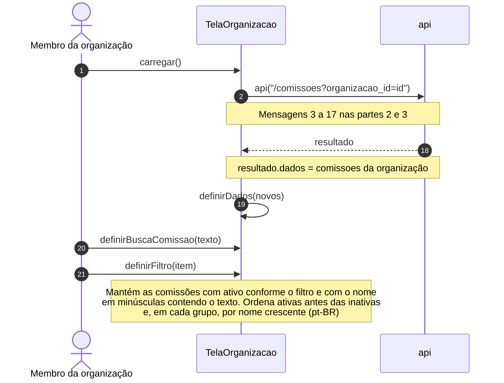
```mermaid
sequenceDiagram
    autonumber 1
    actor U as Membro da organização
    participant T as TelaOrganizacao
    participant A as api
    U->>T: carregar()
    T->>A: api("/comissoes?organizacao_id=id")
    Note over T,A: Mensagens 3 a 17 nas partes 2 e 3
    autonumber 18
    A-->>T: resultado
    Note over T,A: resultado.dados = comissoes da organização
    T->>T: definirDados(novos)
    U->>T: definirBuscaComissao(texto)
    U->>T: definirFiltro(item)
    Note over T: Mantém as comissões com ativo conforme o filtro e com o nome<br/>em minúsculas contendo o texto. Ordena ativas antes das inativas<br/>e, em cada grupo, por nome crescente (pt-BR)
```

Figura 10 — Diagrama de sequência SD-COM-01 (Listar e filtrar comissões), parte 1 de 3: no aplicativo. Fonte: equipe Conecta+.

### SD-COM-01 — parte 2 de 3: na API

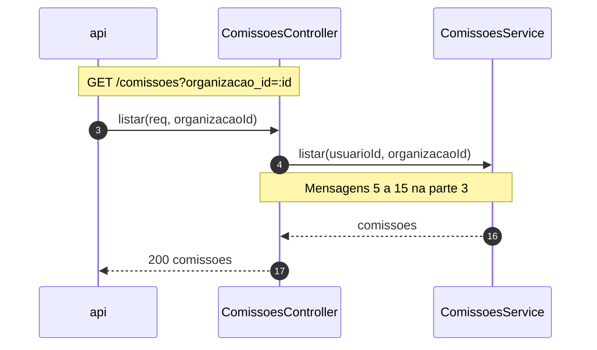
```mermaid
sequenceDiagram
    autonumber 3
    participant A as api
    participant C as ComissoesController
    participant S as ComissoesService
    Note over A,C: GET /comissoes?organizacao_id=:id
    A->>C: listar(req, organizacaoId)
    C->>S: listar(usuarioId, organizacaoId)
    Note over C,S: Mensagens 5 a 15 na parte 3
    autonumber 16
    S-->>C: comissoes
    C-->>A: 200 comissoes
```

Figura 11 — Diagrama de sequência SD-COM-01 (Listar e filtrar comissões), parte 2 de 3: na API. Fonte: equipe Conecta+.

### SD-COM-01 — parte 3 de 3: no serviço e nos dados

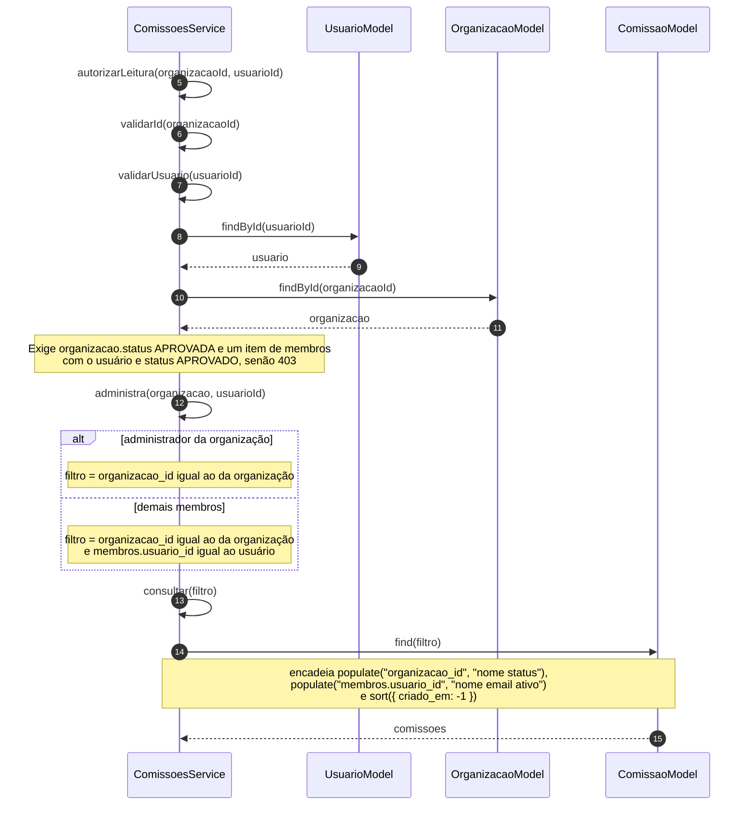
```mermaid
sequenceDiagram
    autonumber 5
    participant S as ComissoesService
    participant UM as UsuarioModel
    participant OM as OrganizacaoModel
    participant M as ComissaoModel
    S->>S: autorizarLeitura(organizacaoId, usuarioId)
    S->>S: validarId(organizacaoId)
    S->>S: validarUsuario(usuarioId)
    S->>UM: findById(usuarioId)
    UM-->>S: usuario
    S->>OM: findById(organizacaoId)
    OM-->>S: organizacao
    Note over S: Exige organizacao.status APROVADA e um item de membros<br/>com o usuário e status APROVADO, senão 403
    S->>S: administra(organizacao, usuarioId)
    alt administrador da organização
        Note over S: filtro = organizacao_id igual ao da organização
    else demais membros
        Note over S: filtro = organizacao_id igual ao da organização<br/>e membros.usuario_id igual ao usuário
    end
    S->>S: consultar(filtro)
    S->>M: find(filtro)
    Note over S,M: encadeia populate("organizacao_id", "nome status"),<br/>populate("membros.usuario_id", "nome email ativo")<br/>e sort({ criado_em: -1 })
    M-->>S: comissoes
```

Figura 12 — Diagrama de sequência SD-COM-01 (Listar e filtrar comissões), parte 3 de 3: no serviço e nos dados. Fonte: equipe Conecta+.

## SD-COM-02 — Consultar comissão

### SD-COM-02 — parte 1 de 3: no aplicativo

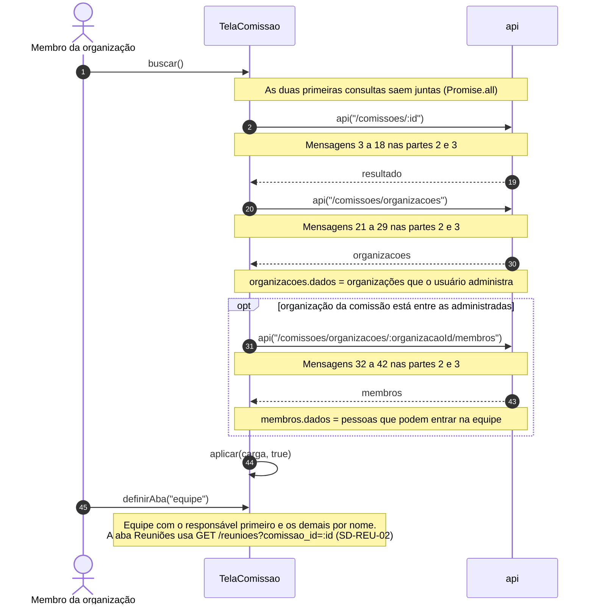
```mermaid
sequenceDiagram
    autonumber 1
    actor U as Membro da organização
    participant T as TelaComissao
    participant A as api
    U->>T: buscar()
    Note over T,A: As duas primeiras consultas saem juntas (Promise.all)
    T->>A: api("/comissoes/:id")
    Note over T,A: Mensagens 3 a 18 nas partes 2 e 3
    autonumber 19
    A-->>T: resultado
    T->>A: api("/comissoes/organizacoes")
    Note over T,A: Mensagens 21 a 29 nas partes 2 e 3
    autonumber 30
    A-->>T: organizacoes
    Note over T,A: organizacoes.dados = organizações que o usuário administra
    opt organização da comissão está entre as administradas
        T->>A: api("/comissoes/organizacoes/:organizacaoId/membros")
        Note over T,A: Mensagens 32 a 42 nas partes 2 e 3
        autonumber 43
        A-->>T: membros
        Note over T,A: membros.dados = pessoas que podem entrar na equipe
    end
    T->>T: aplicar(carga, true)
    U->>T: definirAba("equipe")
    Note over T: Equipe com o responsável primeiro e os demais por nome.<br/>A aba Reuniões usa GET /reunioes?comissao_id=:id (SD-REU-02)
```

Figura 13 — Diagrama de sequência SD-COM-02 (Consultar comissão), parte 1 de 3: no aplicativo. Fonte: equipe Conecta+.

### SD-COM-02 — parte 2 de 3: na API

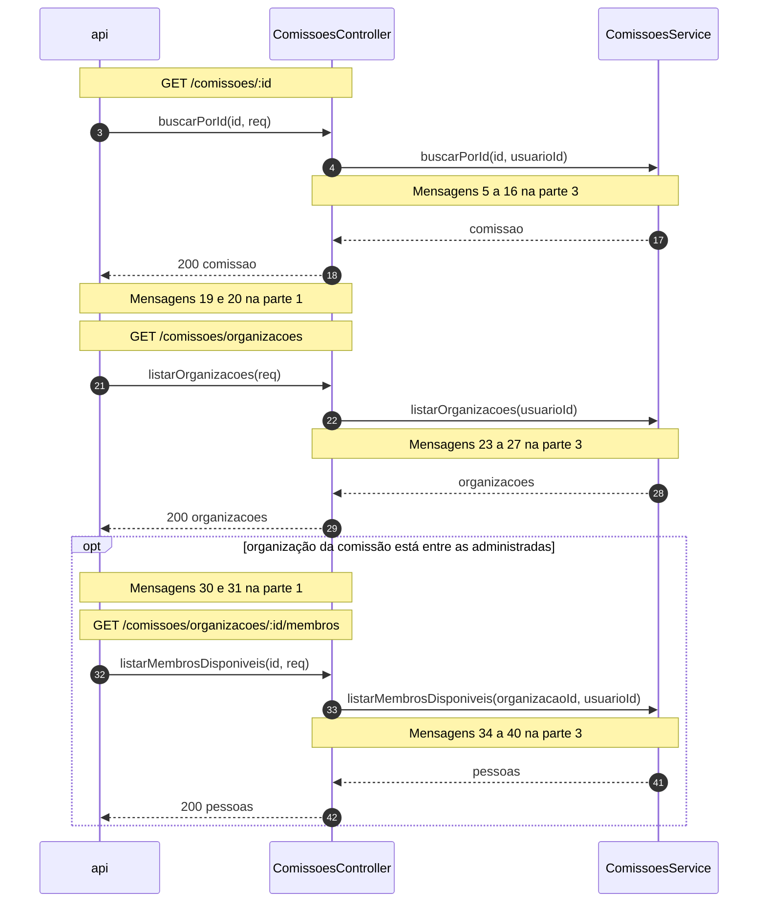
```mermaid
sequenceDiagram
    autonumber 3
    participant A as api
    participant C as ComissoesController
    participant S as ComissoesService
    Note over A,C: GET /comissoes/:id
    A->>C: buscarPorId(id, req)
    C->>S: buscarPorId(id, usuarioId)
    Note over C,S: Mensagens 5 a 16 na parte 3
    autonumber 17
    S-->>C: comissao
    C-->>A: 200 comissao
    Note over A,C: Mensagens 19 e 20 na parte 1
    autonumber 21
    Note over A,C: GET /comissoes/organizacoes
    A->>C: listarOrganizacoes(req)
    C->>S: listarOrganizacoes(usuarioId)
    Note over C,S: Mensagens 23 a 27 na parte 3
    autonumber 28
    S-->>C: organizacoes
    C-->>A: 200 organizacoes
    opt organização da comissão está entre as administradas
        Note over A,C: Mensagens 30 e 31 na parte 1
        autonumber 32
        Note over A,C: GET /comissoes/organizacoes/:id/membros
        A->>C: listarMembrosDisponiveis(id, req)
        C->>S: listarMembrosDisponiveis(organizacaoId, usuarioId)
        Note over C,S: Mensagens 34 a 40 na parte 3
        autonumber 41
        S-->>C: pessoas
        C-->>A: 200 pessoas
    end
```

Figura 14 — Diagrama de sequência SD-COM-02 (Consultar comissão), parte 2 de 3: na API. Fonte: equipe Conecta+.

### SD-COM-02 — parte 3 de 3: no serviço e nos dados

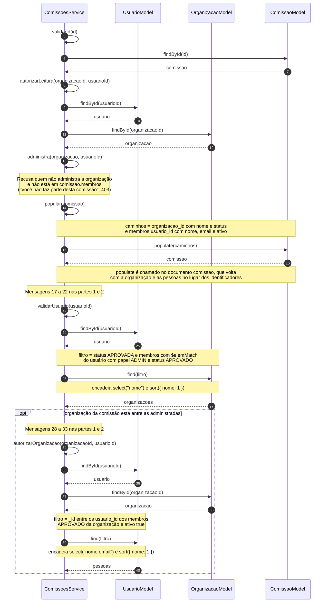
```mermaid
sequenceDiagram
    autonumber 5
    participant S as ComissoesService
    participant UM as UsuarioModel
    participant OM as OrganizacaoModel
    participant M as ComissaoModel
    S->>S: validarId(id)
    S->>M: findById(id)
    M-->>S: comissao
    S->>S: autorizarLeitura(organizacaoId, usuarioId)
    S->>UM: findById(usuarioId)
    UM-->>S: usuario
    S->>OM: findById(organizacaoId)
    OM-->>S: organizacao
    S->>S: administra(organizacao, usuarioId)
    Note over S: Recusa quem não administra a organização<br/>e não está em comissao.membros<br/>("Você não faz parte desta comissão", 403)
    S->>S: popular(comissao)
    Note over S,M: caminhos = organizacao_id com nome e status<br/>e membros.usuario_id com nome, email e ativo
    S->>M: populate(caminhos)
    M-->>S: comissao
    Note over S,M: populate é chamado no documento comissao, que volta<br/>com a organização e as pessoas no lugar dos identificadores
    Note over S: Mensagens 17 a 22 nas partes 1 e 2
    autonumber 23
    S->>S: validarUsuario(usuarioId)
    S->>UM: findById(usuarioId)
    UM-->>S: usuario
    Note over S,OM: filtro = status APROVADA e membros com $elemMatch<br/>do usuário com papel ADMIN e status APROVADO
    S->>OM: find(filtro)
    Note over S,OM: encadeia select("nome") e sort({ nome: 1 })
    OM-->>S: organizacoes
    opt organização da comissão está entre as administradas
        Note over S: Mensagens 28 a 33 nas partes 1 e 2
        autonumber 34
        S->>S: autorizarOrganizacao(organizacaoId, usuarioId)
        S->>UM: findById(usuarioId)
        UM-->>S: usuario
        S->>OM: findById(organizacaoId)
        OM-->>S: organizacao
        Note over S,UM: filtro = _id entre os usuario_id dos membros<br/>APROVADO da organização e ativo true
        S->>UM: find(filtro)
        Note over S,UM: encadeia select("nome email") e sort({ nome: 1 })
        UM-->>S: pessoas
    end
```

Figura 15 — Diagrama de sequência SD-COM-02 (Consultar comissão), parte 3 de 3: no serviço e nos dados. Fonte: equipe Conecta+.

## SD-COM-03 — Cadastrar comissão

### SD-COM-03 — parte 1 de 4: no aplicativo, preenchimento do formulário

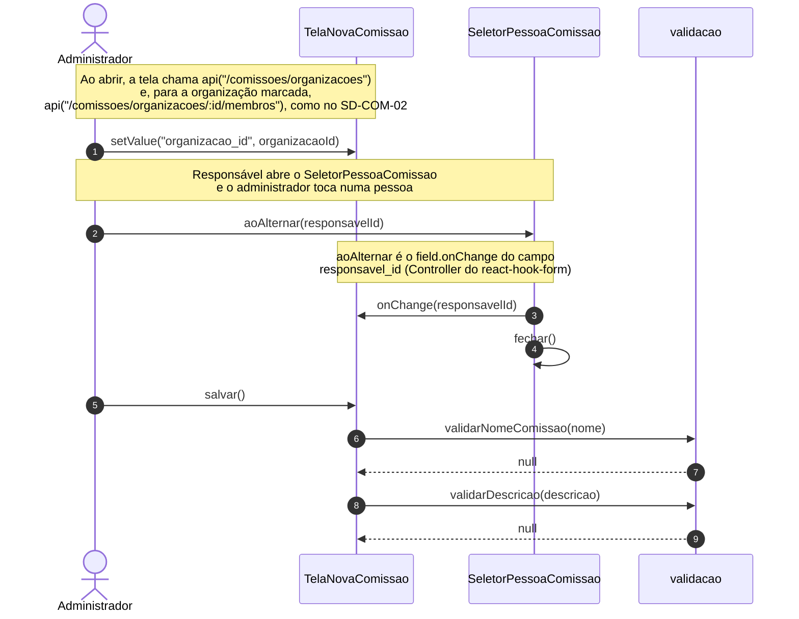
```mermaid
sequenceDiagram
    autonumber 1
    actor U as Administrador
    participant T as TelaNovaComissao
    participant P as SeletorPessoaComissao
    participant V as validacao
    Note over U,T: Ao abrir, a tela chama api("/comissoes/organizacoes")<br/>e, para a organização marcada,<br/>api("/comissoes/organizacoes/:id/membros"), como no SD-COM-02
    U->>T: setValue("organizacao_id", organizacaoId)
    Note over U,P: Responsável abre o SeletorPessoaComissao<br/>e o administrador toca numa pessoa
    U->>P: aoAlternar(responsavelId)
    Note over P,T: aoAlternar é o field.onChange do campo<br/>responsavel_id (Controller do react-hook-form)
    P->>T: onChange(responsavelId)
    P->>P: fechar()
    U->>T: salvar()
    T->>V: validarNomeComissao(nome)
    V-->>T: null
    T->>V: validarDescricao(descricao)
    V-->>T: null
```

Figura 16 — Diagrama de sequência SD-COM-03 (Cadastrar comissão), parte 1 de 4: no aplicativo, preenchimento do formulário. Fonte: equipe Conecta+.

### SD-COM-03 — parte 2 de 4: no aplicativo, envio e navegação

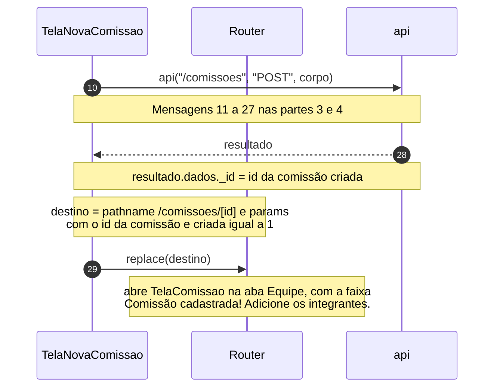
```mermaid
sequenceDiagram
    autonumber 10
    participant T as TelaNovaComissao
    participant R as Router
    participant A as api
    T->>A: api("/comissoes", "POST", corpo)
    Note over T,A: Mensagens 11 a 27 nas partes 3 e 4
    autonumber 28
    A-->>T: resultado
    Note over T,A: resultado.dados._id = id da comissão criada
    Note over T,R: destino = pathname /comissoes/[id] e params<br/>com o id da comissão e criada igual a 1
    T->>R: replace(destino)
    Note over R: abre TelaComissao na aba Equipe, com a faixa<br/>Comissão cadastrada! Adicione os integrantes.
```

Figura 17 — Diagrama de sequência SD-COM-03 (Cadastrar comissão), parte 2 de 4: no aplicativo, envio e navegação. Fonte: equipe Conecta+.

### SD-COM-03 — parte 3 de 4: na API

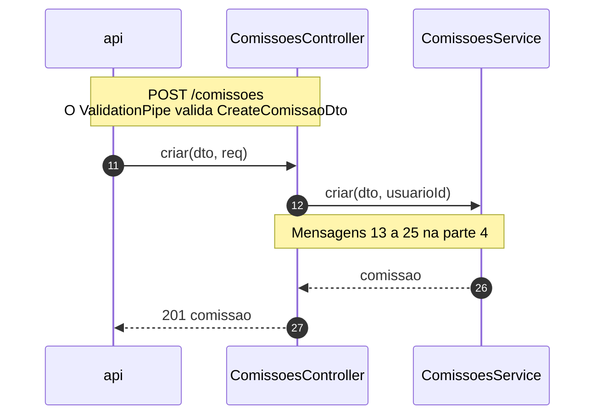
```mermaid
sequenceDiagram
    autonumber 11
    participant A as api
    participant C as ComissoesController
    participant S as ComissoesService
    Note over A,C: POST /comissoes<br/>O ValidationPipe valida CreateComissaoDto
    A->>C: criar(dto, req)
    C->>S: criar(dto, usuarioId)
    Note over C,S: Mensagens 13 a 25 na parte 4
    autonumber 26
    S-->>C: comissao
    C-->>A: 201 comissao
```

Figura 18 — Diagrama de sequência SD-COM-03 (Cadastrar comissão), parte 3 de 4: na API. Fonte: equipe Conecta+.

### SD-COM-03 — parte 4 de 4: no serviço e nos dados

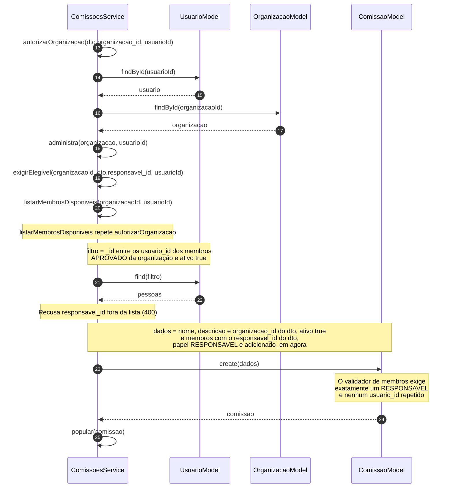
```mermaid
sequenceDiagram
    autonumber 13
    participant S as ComissoesService
    participant UM as UsuarioModel
    participant OM as OrganizacaoModel
    participant M as ComissaoModel
    S->>S: autorizarOrganizacao(dto.organizacao_id, usuarioId)
    S->>UM: findById(usuarioId)
    UM-->>S: usuario
    S->>OM: findById(organizacaoId)
    OM-->>S: organizacao
    S->>S: administra(organizacao, usuarioId)
    S->>S: exigirElegivel(organizacaoId, dto.responsavel_id, usuarioId)
    S->>S: listarMembrosDisponiveis(organizacaoId, usuarioId)
    Note over S: listarMembrosDisponiveis repete autorizarOrganizacao
    Note over S,UM: filtro = _id entre os usuario_id dos membros<br/>APROVADO da organização e ativo true
    S->>UM: find(filtro)
    UM-->>S: pessoas
    Note over S: Recusa responsavel_id fora da lista (400)
    Note over S,M: dados = nome, descricao e organizacao_id do dto, ativo true<br/>e membros com o responsavel_id do dto,<br/>papel RESPONSAVEL e adicionado_em agora
    S->>M: create(dados)
    Note over M: O validador de membros exige<br/>exatamente um RESPONSAVEL<br/>e nenhum usuario_id repetido
    M-->>S: comissao
    S->>S: popular(comissao)
```

Figura 19 — Diagrama de sequência SD-COM-03 (Cadastrar comissão), parte 4 de 4: no serviço e nos dados. Fonte: equipe Conecta+.

## SD-COM-04 — Editar comissão

### SD-COM-04 — parte 1 de 3: no aplicativo

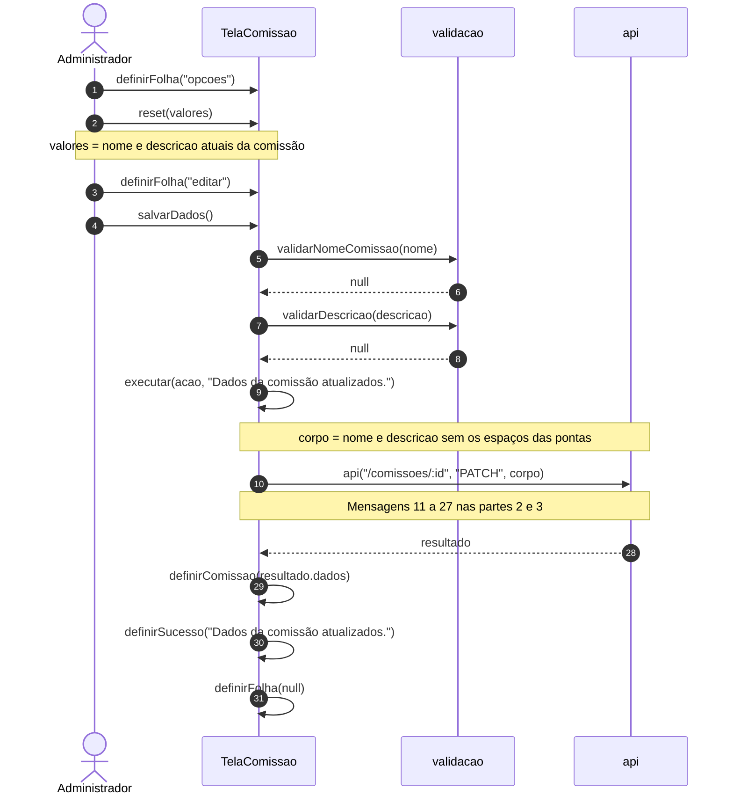
```mermaid
sequenceDiagram
    autonumber 1
    actor U as Administrador
    participant T as TelaComissao
    participant V as validacao
    participant A as api
    U->>T: definirFolha("opcoes")
    U->>T: reset(valores)
    Note over U,T: valores = nome e descricao atuais da comissão
    U->>T: definirFolha("editar")
    U->>T: salvarDados()
    T->>V: validarNomeComissao(nome)
    V-->>T: null
    T->>V: validarDescricao(descricao)
    V-->>T: null
    T->>T: executar(acao, "Dados da comissão atualizados.")
    Note over T,A: corpo = nome e descricao sem os espaços das pontas
    T->>A: api("/comissoes/:id", "PATCH", corpo)
    Note over T,A: Mensagens 11 a 27 nas partes 2 e 3
    autonumber 28
    A-->>T: resultado
    T->>T: definirComissao(resultado.dados)
    T->>T: definirSucesso("Dados da comissão atualizados.")
    T->>T: definirFolha(null)
```

Figura 20 — Diagrama de sequência SD-COM-04 (Editar comissão), parte 1 de 3: no aplicativo. Fonte: equipe Conecta+.

### SD-COM-04 — parte 2 de 3: na API

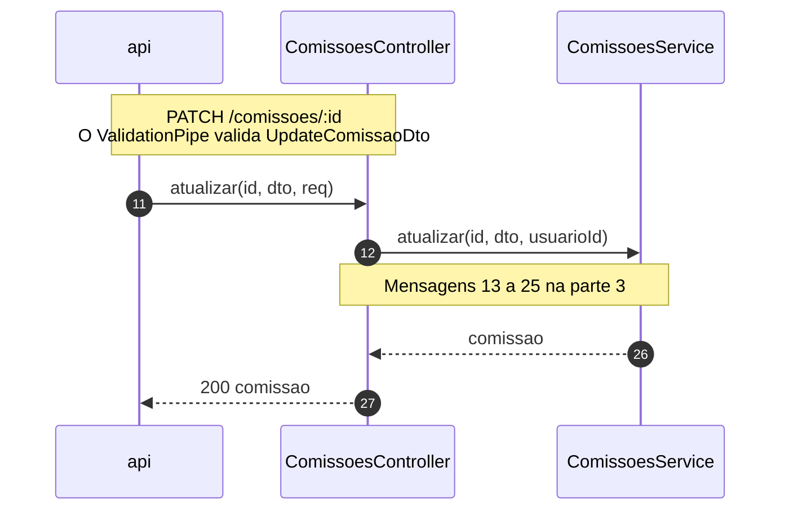
```mermaid
sequenceDiagram
    autonumber 11
    participant A as api
    participant C as ComissoesController
    participant S as ComissoesService
    Note over A,C: PATCH /comissoes/:id<br/>O ValidationPipe valida UpdateComissaoDto
    A->>C: atualizar(id, dto, req)
    C->>S: atualizar(id, dto, usuarioId)
    Note over C,S: Mensagens 13 a 25 na parte 3
    autonumber 26
    S-->>C: comissao
    C-->>A: 200 comissao
```

Figura 21 — Diagrama de sequência SD-COM-04 (Editar comissão), parte 2 de 3: na API. Fonte: equipe Conecta+.

### SD-COM-04 — parte 3 de 3: no serviço e nos dados

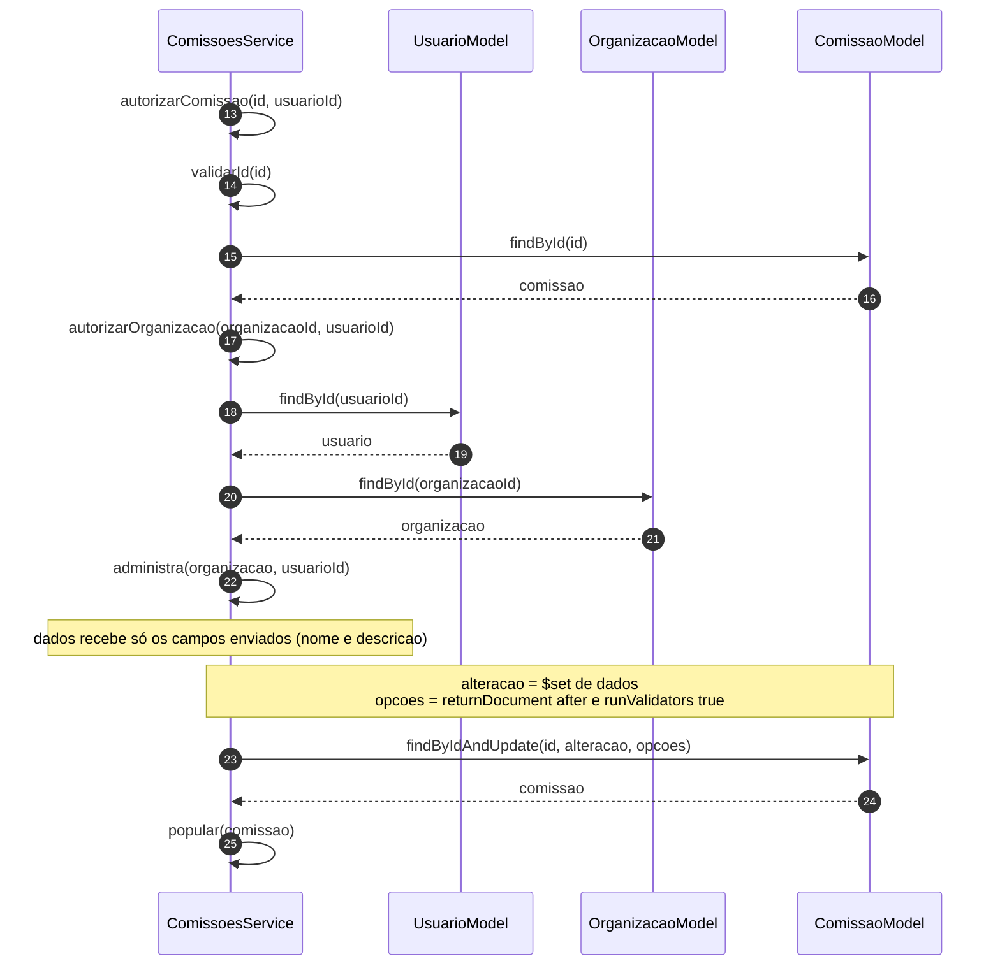
```mermaid
sequenceDiagram
    autonumber 13
    participant S as ComissoesService
    participant UM as UsuarioModel
    participant OM as OrganizacaoModel
    participant M as ComissaoModel
    S->>S: autorizarComissao(id, usuarioId)
    S->>S: validarId(id)
    S->>M: findById(id)
    M-->>S: comissao
    S->>S: autorizarOrganizacao(organizacaoId, usuarioId)
    S->>UM: findById(usuarioId)
    UM-->>S: usuario
    S->>OM: findById(organizacaoId)
    OM-->>S: organizacao
    S->>S: administra(organizacao, usuarioId)
    Note over S: dados recebe só os campos enviados (nome e descricao)
    Note over S,M: alteracao = $set de dados<br/>opcoes = returnDocument after e runValidators true
    S->>M: findByIdAndUpdate(id, alteracao, opcoes)
    M-->>S: comissao
    S->>S: popular(comissao)
```

Figura 22 — Diagrama de sequência SD-COM-04 (Editar comissão), parte 3 de 3: no serviço e nos dados. Fonte: equipe Conecta+.

## SD-COM-05 — Desativar comissão

### SD-COM-05 — parte 1 de 3: no aplicativo

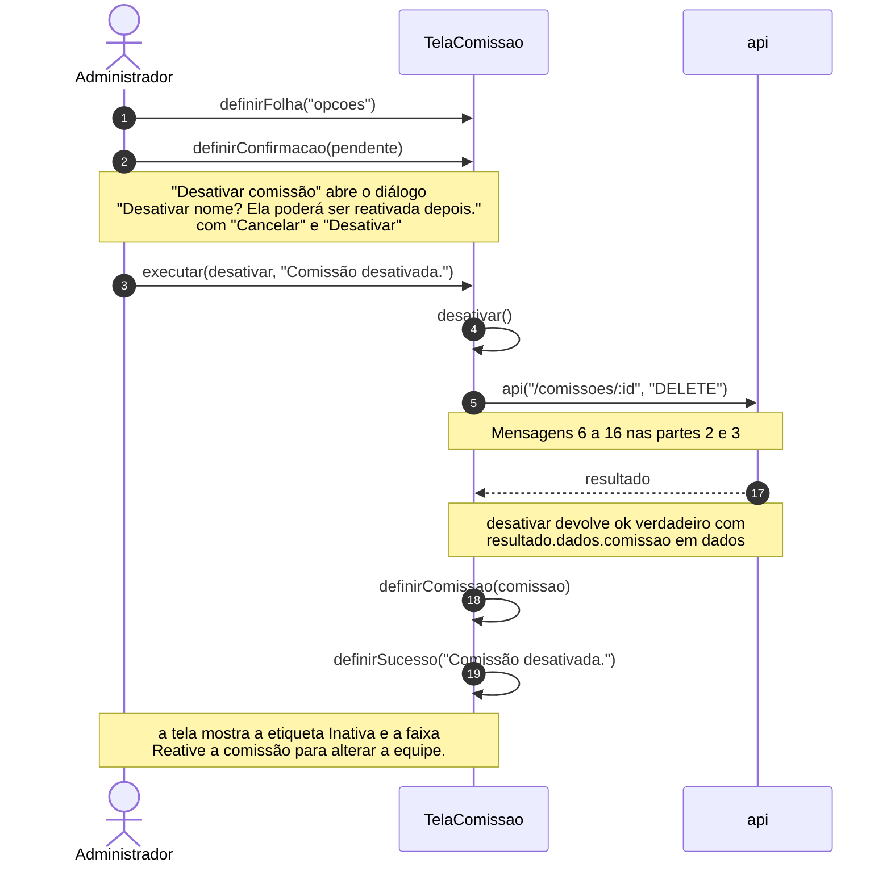
```mermaid
sequenceDiagram
    autonumber 1
    actor U as Administrador
    participant T as TelaComissao
    participant A as api
    U->>T: definirFolha("opcoes")
    U->>T: definirConfirmacao(pendente)
    Note over U,T: "Desativar comissão" abre o diálogo<br/>"Desativar nome? Ela poderá ser reativada depois."<br/>com "Cancelar" e "Desativar"
    U->>T: executar(desativar, "Comissão desativada.")
    T->>T: desativar()
    T->>A: api("/comissoes/:id", "DELETE")
    Note over T,A: Mensagens 6 a 16 nas partes 2 e 3
    autonumber 17
    A-->>T: resultado
    Note over T,A: desativar devolve ok verdadeiro com<br/>resultado.dados.comissao em dados
    T->>T: definirComissao(comissao)
    T->>T: definirSucesso("Comissão desativada.")
    Note over U,T: a tela mostra a etiqueta Inativa e a faixa<br/>Reative a comissão para alterar a equipe.
```

Figura 23 — Diagrama de sequência SD-COM-05 (Desativar comissão), parte 1 de 3: no aplicativo. Fonte: equipe Conecta+.

### SD-COM-05 — parte 2 de 3: na API

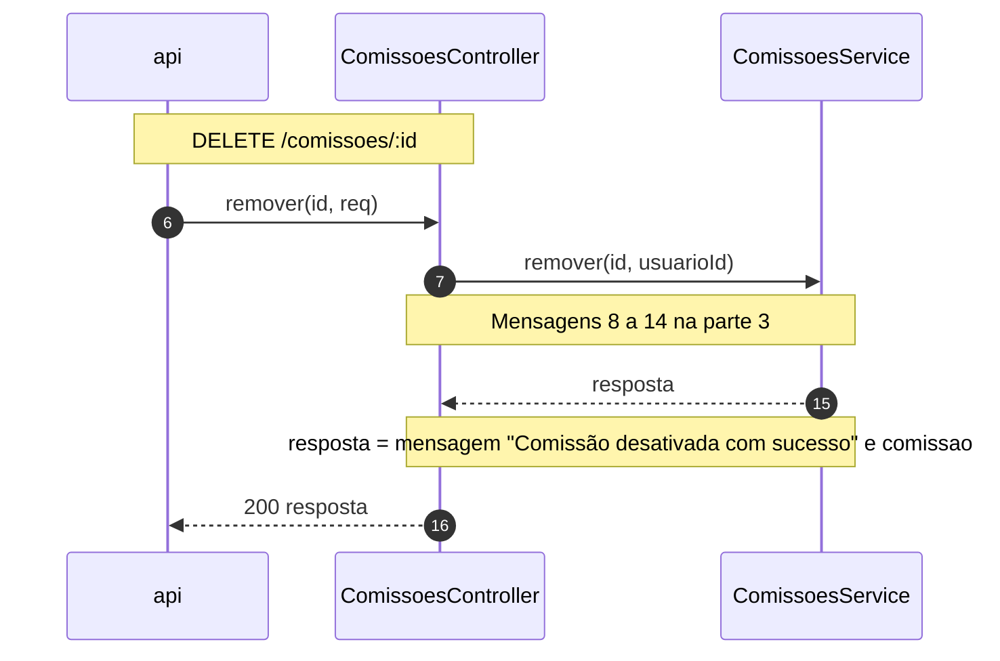
```mermaid
sequenceDiagram
    autonumber 6
    participant A as api
    participant C as ComissoesController
    participant S as ComissoesService
    Note over A,C: DELETE /comissoes/:id
    A->>C: remover(id, req)
    C->>S: remover(id, usuarioId)
    Note over C,S: Mensagens 8 a 14 na parte 3
    autonumber 15
    S-->>C: resposta
    Note over C,S: resposta = mensagem "Comissão desativada com sucesso" e comissao
    C-->>A: 200 resposta
```

Figura 24 — Diagrama de sequência SD-COM-05 (Desativar comissão), parte 2 de 3: na API. Fonte: equipe Conecta+.

### SD-COM-05 — parte 3 de 3: no serviço e nos dados

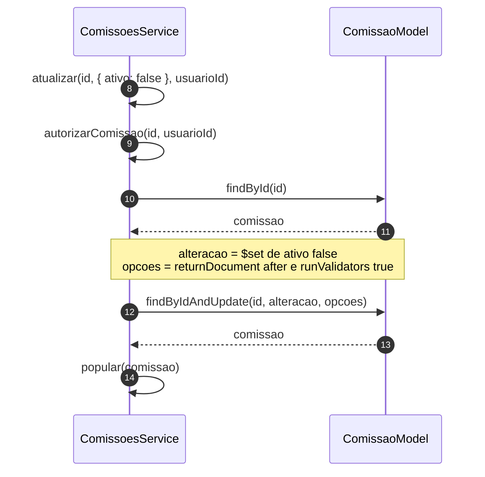
```mermaid
sequenceDiagram
    autonumber 8
    participant S as ComissoesService
    participant M as ComissaoModel
    S->>S: atualizar(id, { ativo: false }, usuarioId)
    S->>S: autorizarComissao(id, usuarioId)
    S->>M: findById(id)
    M-->>S: comissao
    Note over S,M: alteracao = $set de ativo false<br/>opcoes = returnDocument after e runValidators true
    S->>M: findByIdAndUpdate(id, alteracao, opcoes)
    M-->>S: comissao
    S->>S: popular(comissao)
```

Figura 25 — Diagrama de sequência SD-COM-05 (Desativar comissão), parte 3 de 3: no serviço e nos dados. Fonte: equipe Conecta+.

## SD-COM-06 — Reativar comissão

### SD-COM-06 — parte 1 de 3: no aplicativo

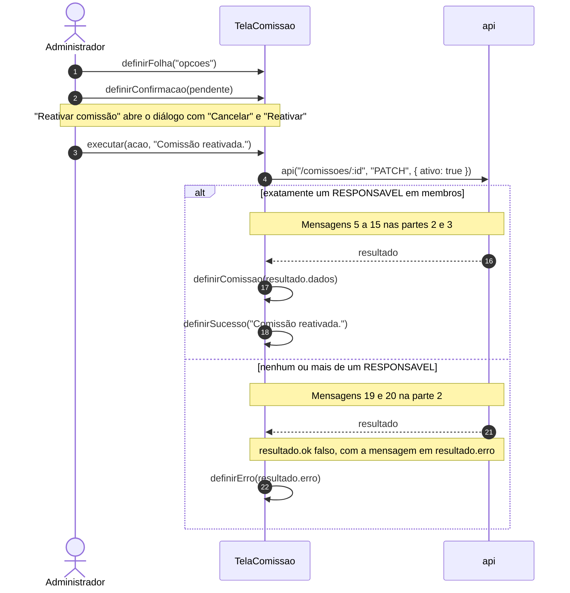
```mermaid
sequenceDiagram
    autonumber 1
    actor U as Administrador
    participant T as TelaComissao
    participant A as api
    U->>T: definirFolha("opcoes")
    U->>T: definirConfirmacao(pendente)
    Note over U,T: "Reativar comissão" abre o diálogo com "Cancelar" e "Reativar"
    U->>T: executar(acao, "Comissão reativada.")
    T->>A: api("/comissoes/:id", "PATCH", { ativo: true })
    alt exatamente um RESPONSAVEL em membros
        Note over T,A: Mensagens 5 a 15 nas partes 2 e 3
        autonumber 16
        A-->>T: resultado
        T->>T: definirComissao(resultado.dados)
        T->>T: definirSucesso("Comissão reativada.")
    else nenhum ou mais de um RESPONSAVEL
        Note over T,A: Mensagens 19 e 20 na parte 2
        autonumber 21
        A-->>T: resultado
        Note over T,A: resultado.ok falso, com a mensagem em resultado.erro
        T->>T: definirErro(resultado.erro)
    end
```

Figura 26 — Diagrama de sequência SD-COM-06 (Reativar comissão), parte 1 de 3: no aplicativo. Fonte: equipe Conecta+.

### SD-COM-06 — parte 2 de 3: na API

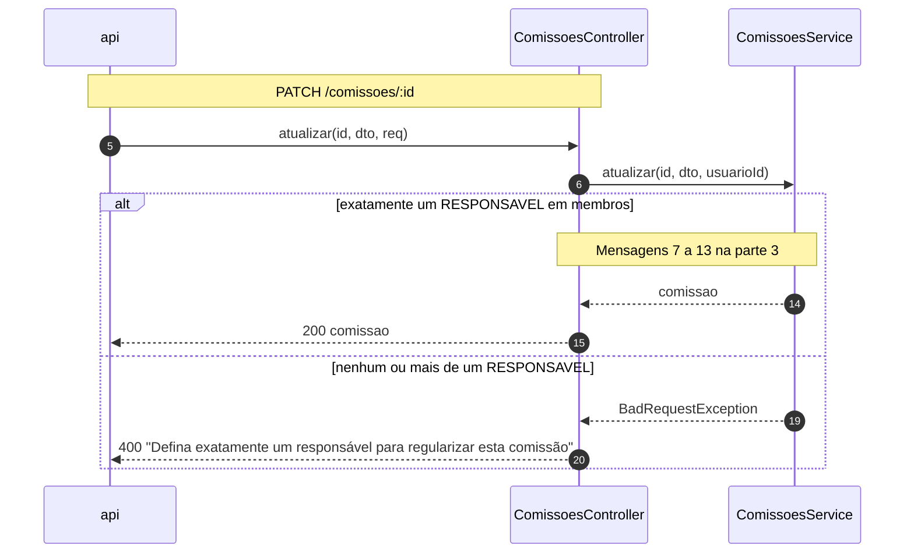
```mermaid
sequenceDiagram
    autonumber 5
    participant A as api
    participant C as ComissoesController
    participant S as ComissoesService
    Note over A,C: PATCH /comissoes/:id
    A->>C: atualizar(id, dto, req)
    C->>S: atualizar(id, dto, usuarioId)
    alt exatamente um RESPONSAVEL em membros
        Note over C,S: Mensagens 7 a 13 na parte 3
        autonumber 14
        S-->>C: comissao
        C-->>A: 200 comissao
    else nenhum ou mais de um RESPONSAVEL
        autonumber 19
        S-->>C: BadRequestException
        C-->>A: 400 "Defina exatamente um responsável para regularizar esta comissão"
    end
```

Figura 27 — Diagrama de sequência SD-COM-06 (Reativar comissão), parte 2 de 3: na API. Fonte: equipe Conecta+.

### SD-COM-06 — parte 3 de 3: no serviço e nos dados

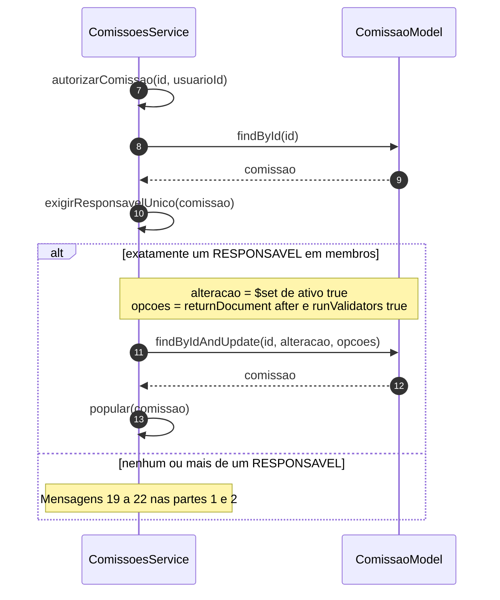
```mermaid
sequenceDiagram
    autonumber 7
    participant S as ComissoesService
    participant M as ComissaoModel
    S->>S: autorizarComissao(id, usuarioId)
    S->>M: findById(id)
    M-->>S: comissao
    S->>S: exigirResponsavelUnico(comissao)
    alt exatamente um RESPONSAVEL em membros
        Note over S,M: alteracao = $set de ativo true<br/>opcoes = returnDocument after e runValidators true
        S->>M: findByIdAndUpdate(id, alteracao, opcoes)
        M-->>S: comissao
        S->>S: popular(comissao)
    else nenhum ou mais de um RESPONSAVEL
        Note over S: Mensagens 19 a 22 nas partes 1 e 2
    end
```

Figura 28 — Diagrama de sequência SD-COM-06 (Reativar comissão), parte 3 de 3: no serviço e nos dados. Fonte: equipe Conecta+.

## SD-COM-07 — Adicionar integrante

### SD-COM-07 — parte 1 de 3: no aplicativo

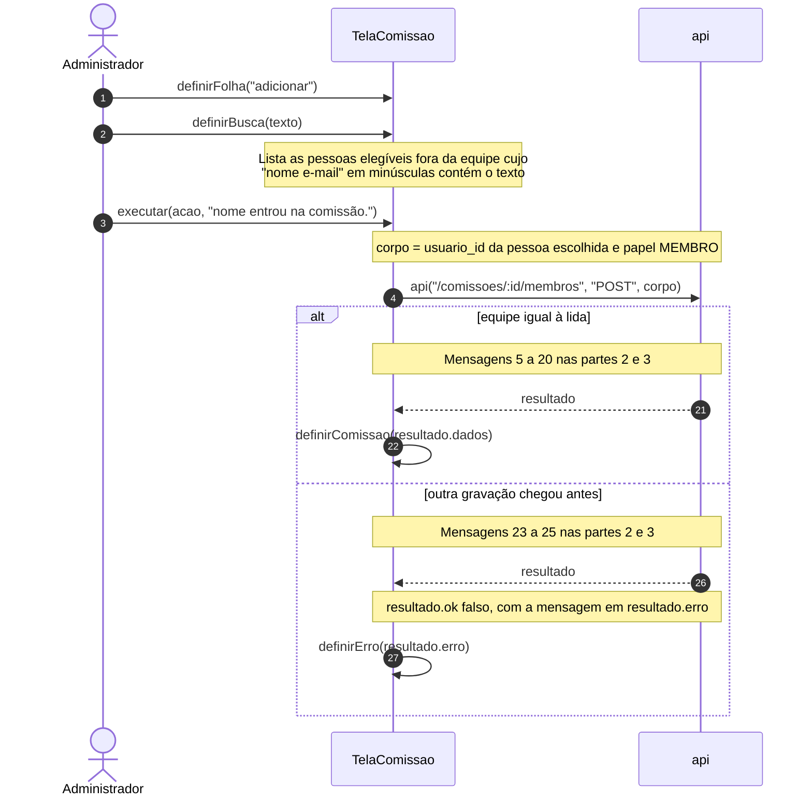
```mermaid
sequenceDiagram
    autonumber 1
    actor U as Administrador
    participant T as TelaComissao
    participant A as api
    U->>T: definirFolha("adicionar")
    U->>T: definirBusca(texto)
    Note over T: Lista as pessoas elegíveis fora da equipe cujo<br/>"nome e-mail" em minúsculas contém o texto
    U->>T: executar(acao, "nome entrou na comissão.")
    Note over T,A: corpo = usuario_id da pessoa escolhida e papel MEMBRO
    T->>A: api("/comissoes/:id/membros", "POST", corpo)
    alt equipe igual à lida
        Note over T,A: Mensagens 5 a 20 nas partes 2 e 3
        autonumber 21
        A-->>T: resultado
        T->>T: definirComissao(resultado.dados)
    else outra gravação chegou antes
        Note over T,A: Mensagens 23 a 25 nas partes 2 e 3
        autonumber 26
        A-->>T: resultado
        Note over T,A: resultado.ok falso, com a mensagem em resultado.erro
        T->>T: definirErro(resultado.erro)
    end
```

Figura 29 — Diagrama de sequência SD-COM-07 (Adicionar integrante), parte 1 de 3: no aplicativo. Fonte: equipe Conecta+.

### SD-COM-07 — parte 2 de 3: na API

```mermaid
sequenceDiagram
    autonumber 5
    participant A as api
    participant C as ComissoesController
    participant S as ComissoesService
    Note over A,C: POST /comissoes/:id/membros<br/>O ValidationPipe valida AddMembroComissaoDto
    A->>C: adicionarMembro(id, dto, req)
    C->>S: adicionarMembro(id, dto, usuarioId)
    alt equipe igual à lida
        Note over C,S: Mensagens 7 a 18 na parte 3
        autonumber 19
        S-->>C: comissao
        C-->>A: 201 comissao
    else outra gravação chegou antes
        Note over C,S: Mensagem 23 na parte 3
        autonumber 24
        S-->>C: ConflictException
        C-->>A: 409 "A comissão mudou. Atualize e tente novamente."
    end
```

Figura 30 — Diagrama de sequência SD-COM-07 (Adicionar integrante), parte 2 de 3: na API. Fonte: equipe Conecta+.

### SD-COM-07 — parte 3 de 3: no serviço e nos dados

```mermaid
sequenceDiagram
    autonumber 7
    participant S as ComissoesService
    participant UM as UsuarioModel
    participant M as ComissaoModel
    S->>S: autorizarComissao(id, usuarioId)
    S->>M: findById(id)
    M-->>S: comissao
    Note over S: Recusa comissão inativa (400)
    S->>S: exigirResponsavelUnico(comissao)
    Note over S: Recusa dto.papel RESPONSAVEL (400)
    S->>S: exigirElegivel(organizacaoId, dto.usuario_id, usuarioId)
    S->>S: listarMembrosDisponiveis(organizacaoId, usuarioId)
    Note over S,UM: filtro = _id entre os usuario_id dos membros<br/>APROVADO da organização e ativo true
    S->>UM: find(filtro)
    UM-->>S: pessoas
    Note over S: Recusa usuario_id já presente em membros (409)
    Note over S: membros = itens atuais mais o usuario_id do<br/>dto com papel MEMBRO e adicionado_em agora
    S->>S: gravarEquipe(comissao, membros)
    Note over S,M: filtro = _id, ativo e membros iguais aos da comissão lida<br/>alteracao = $set de membros<br/>opcoes = returnDocument after e runValidators true
    S->>M: findOneAndUpdate(filtro, alteracao, opcoes)
    alt equipe igual à lida
        M-->>S: comissao
        S->>S: popular(comissao)
    else outra gravação chegou antes
        autonumber 23
        M-->>S: null
    end
```

Figura 31 — Diagrama de sequência SD-COM-07 (Adicionar integrante), parte 3 de 3: no serviço e nos dados. Fonte: equipe Conecta+.

## SD-COM-08 — Substituir responsável

### SD-COM-08 — parte 1 de 3: no aplicativo

```mermaid
sequenceDiagram
    autonumber 1
    actor U as Administrador
    participant P as SeletorPessoaComissao
    participant T as TelaComissao
    participant A as api
    alt pela folha Responsável
        U->>T: definirFolha("responsavel")
        Note over U,P: O administrador toca em outra pessoa da lista
        U->>P: aoAlternar(pessoaId)
        Note over P,T: aoAlternar é a função passada por<br/>TelaComissao: acha o alvo em pessoas<br/>e, se ele não é o responsável atual, chama trocarResponsavel
        P->>T: trocarResponsavel(alvo)
        T->>T: definirConfirmacao(pendente)
        P->>P: fechar()
    else pela opção "Tornar responsável" de um membro
        U->>T: definirEscolhido(integrante)
        U->>T: trocarResponsavel(alvo)
        T->>T: definirConfirmacao(pendente)
    end
    Note over U,T: "nome será o responsável.<br/>nome atual passa a membro."<br/>com "Cancelar" e "Confirmar"
    U->>T: executar(acao, "Responsável atualizado.")
    Note over T,A: corpo = usuario_id do alvo
    T->>A: api("/comissoes/:id/responsavel", "PATCH", corpo)
    Note over T,A: Mensagens 11 a 25 nas partes 2 e 3
    autonumber 26
    A-->>T: resultado
    T->>T: definirComissao(resultado.dados)
    T->>T: definirSucesso("Responsável atualizado.")
```

Figura 32 — Diagrama de sequência SD-COM-08 (Substituir responsável), parte 1 de 3: no aplicativo. Fonte: equipe Conecta+.

### SD-COM-08 — parte 2 de 3: na API

```mermaid
sequenceDiagram
    autonumber 11
    participant A as api
    participant C as ComissoesController
    participant S as ComissoesService
    Note over A,C: PATCH /comissoes/:id/responsavel<br/>O ValidationPipe valida DefinirResponsavelDto
    A->>C: definirResponsavel(id, dto, req)
    C->>S: definirResponsavel(id, dto.usuario_id, usuarioId)
    Note over C,S: Mensagens 13 a 23 na parte 3
    autonumber 24
    S-->>C: comissao
    C-->>A: 200 comissao
```

Figura 33 — Diagrama de sequência SD-COM-08 (Substituir responsável), parte 2 de 3: na API. Fonte: equipe Conecta+.

### SD-COM-08 — parte 3 de 3: no serviço e nos dados

```mermaid
sequenceDiagram
    autonumber 13
    participant S as ComissoesService
    participant UM as UsuarioModel
    participant M as ComissaoModel
    S->>S: autorizarComissao(id, usuarioId)
    S->>M: findById(id)
    M-->>S: comissao
    S->>S: exigirElegivel(organizacaoId, membroId, usuarioId)
    S->>S: listarMembrosDisponiveis(organizacaoId, usuarioId)
    Note over S,UM: filtro = _id entre os usuario_id dos membros<br/>APROVADO da organização e ativo true
    S->>UM: find(filtro)
    UM-->>S: pessoas
    Note over S: Nova lista: o escolhido vira RESPONSAVEL e os demais MEMBRO,<br/>com adicionado_em mantido. Fora da equipe,<br/>o escolhido entra como RESPONSAVEL
    S->>S: gravarEquipe(comissao, membros)
    Note over S,M: filtro = _id, ativo e membros iguais aos da comissão lida<br/>alteracao = $set de membros<br/>opcoes = returnDocument after e runValidators true
    S->>M: findOneAndUpdate(filtro, alteracao, opcoes)
    M-->>S: comissao
    S->>S: popular(comissao)
```

Figura 34 — Diagrama de sequência SD-COM-08 (Substituir responsável), parte 3 de 3: no serviço e nos dados. Fonte: equipe Conecta+.

## SD-COM-09 — Remover integrante

### SD-COM-09 — parte 1 de 3: no aplicativo

```mermaid
sequenceDiagram
    autonumber 1
    actor U as Administrador
    participant T as TelaComissao
    participant A as api
    U->>T: definirEscolhido(integrante)
    U->>T: definirConfirmacao(pendente)
    Note over U,T: "Remover da comissão" abre o diálogo com "Cancelar" e "Remover"
    U->>T: executar(acao, "Integrante removido da comissão.")
    T->>A: api("/comissoes/:id/membros/:usuarioId", "DELETE")
    Note over T,A: Mensagens 5 a 18 nas partes 2 e 3
    autonumber 19
    A-->>T: resultado
    T->>T: definirComissao(resultado.dados)
    T->>T: definirSucesso("Integrante removido da comissão.")
```

Figura 35 — Diagrama de sequência SD-COM-09 (Remover integrante), parte 1 de 3: no aplicativo. Fonte: equipe Conecta+.

### SD-COM-09 — parte 2 de 3: na API

```mermaid
sequenceDiagram
    autonumber 5
    participant A as api
    participant C as ComissoesController
    participant S as ComissoesService
    Note over A,C: DELETE /comissoes/:id/membros/:usuarioId
    A->>C: removerMembro(id, usuarioId, req)
    C->>S: removerMembro(id, membroId, usuarioId)
    Note over C,S: Mensagens 7 a 16 na parte 3
    autonumber 17
    S-->>C: comissao
    C-->>A: 200 comissao
```

Figura 36 — Diagrama de sequência SD-COM-09 (Remover integrante), parte 2 de 3: na API. Fonte: equipe Conecta+.

### SD-COM-09 — parte 3 de 3: no serviço e nos dados

```mermaid
sequenceDiagram
    autonumber 7
    participant S as ComissoesService
    participant M as ComissaoModel
    S->>S: validarEquipe(id, membroId, usuarioId)
    S->>S: validarId(membroId)
    S->>S: autorizarComissao(id, usuarioId)
    S->>M: findById(id)
    M-->>S: comissao
    Note over S: Recusa comissão inativa (400) e pessoa fora de membros (404)
    S->>S: exigirResponsavelUnico(comissao)
    Note over S: Recusa remover o RESPONSAVEL<br/>("Substitua o responsável antes de removê-lo", 400)
    Note over S: membros = itens atuais sem o de usuario_id igual a membroId
    S->>S: gravarEquipe(comissao, membros)
    Note over S,M: filtro = _id, ativo e membros iguais aos da comissão lida<br/>alteracao = $set de membros<br/>opcoes = returnDocument after e runValidators true
    S->>M: findOneAndUpdate(filtro, alteracao, opcoes)
    M-->>S: comissao
    S->>S: popular(comissao)
```

Figura 37 — Diagrama de sequência SD-COM-09 (Remover integrante), parte 3 de 3: no serviço e nos dados. Fonte: equipe Conecta+.

## Rastreabilidade

SD-COM-01 a SD-COM-09 correspondem, na mesma ordem, a UC-COM-01 a UC-COM-09 e a RF-COM-01 a RF-COM-09.
