# Diagramas de sequência — Cadastro de usuário

> Padrão da disciplina · Módulo USR · Revisado em 27/11/2026

## Resumo

Há um diagrama para cada requisito de [Requisitos funcionais](2%20-%20requisitos-funcionais-cadastro-usuario.md), com o mesmo número. As linhas de vida são classes e módulos que existem no código e estão no [Diagrama de classes](3%20-%20diagrama-classes-cadastro-usuario.md): as telas do aplicativo, o componente `Navegacao` e a tela `DesbloqueioSessao`, os contextos `SessaoProvider`, `TemaProvider` e `ToastProvider`, os módulos `api`, `google` e `autenticacaoLocal`, os controllers, os services, o `JwtAuthGuard`, o model do Mongoose `UsuarioModel` e as bibliotecas chamadas diretamente (`Router`, `Location`, `GoogleSignin`, `bcrypt`, `JwtService`, `Transporter` e `fetch`). O Google, no login pela web, é um sistema externo e aparece como ator. Toda mensagem é a chamada de um método existente, com seus parâmetros, e as mensagens são numeradas na ordem em que acontecem. Regras que não são métodos, como comparações de situação, aparecem em notas, assim como as rotas HTTP. Os retornos são identificadores; uma nota diz o que cada um traz quando isso não é evidente.

Em todos os diagramas, a chamada do módulo `api` ao controller é uma requisição HTTP que passa antes pelo `ApiKeyGuard`; o SD-USR-02 mostra em detalhe o `JwtAuthGuard`, que protege `GET /usuarios/me`. O `resultado` devolvido pelo módulo `api` é o tipo `Resultado`: `ok` verdadeiro com `dados`, ou `ok` falso com `erro`. Os diagramas dos vínculos do usuário com organizações estão no módulo [Cadastro de organização](../cadastro-organizacao/README.md).

Para caber na largura da página, cada diagrama está dividido em partes de até cinco linhas de vida, separadas por camada (aplicativo, API e dados) ou por etapa do fluxo; a linha de vida da fronteira, em geral o módulo `api`, aparece nas duas partes vizinhas. A numeração das mensagens continua de uma parte para a outra, e uma nota indica as mensagens que estão em outra parte. Os blocos `alt` e `opt` que atravessam partes se repetem em cada uma delas, com a condição do ramo que ela mostra.

## SD-USR-01 — Cadastrar e confirmar conta local

### SD-USR-01 — parte 1 de 5: cadastro no aplicativo

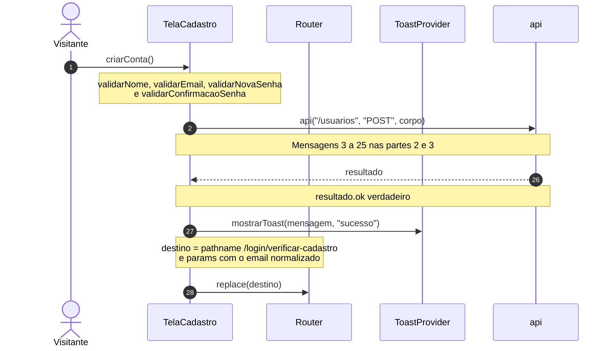
```mermaid
sequenceDiagram
    autonumber 1
    actor V as Visitante
    participant TC as TelaCadastro
    participant R as Router
    participant TO as ToastProvider
    participant A as api
    V->>TC: criarConta()
    Note over TC: validarNome, validarEmail, validarNovaSenha<br/>e validarConfirmacaoSenha
    TC->>A: api("/usuarios", "POST", corpo)
    Note over TC,A: Mensagens 3 a 25 nas partes 2 e 3
    autonumber 26
    A-->>TC: resultado
    Note over TC,A: resultado.ok verdadeiro
    TC->>TO: mostrarToast(mensagem, "sucesso")
    Note over TC,R: destino = pathname /login/verificar-cadastro<br/>e params com o email normalizado
    TC->>R: replace(destino)
```

Figura 14 — Diagrama de sequência SD-USR-01 (Cadastrar e confirmar conta local), parte 1 de 5: cadastro no aplicativo. Fonte: equipe Conecta+.

### SD-USR-01 — parte 2 de 5: criação da conta na API

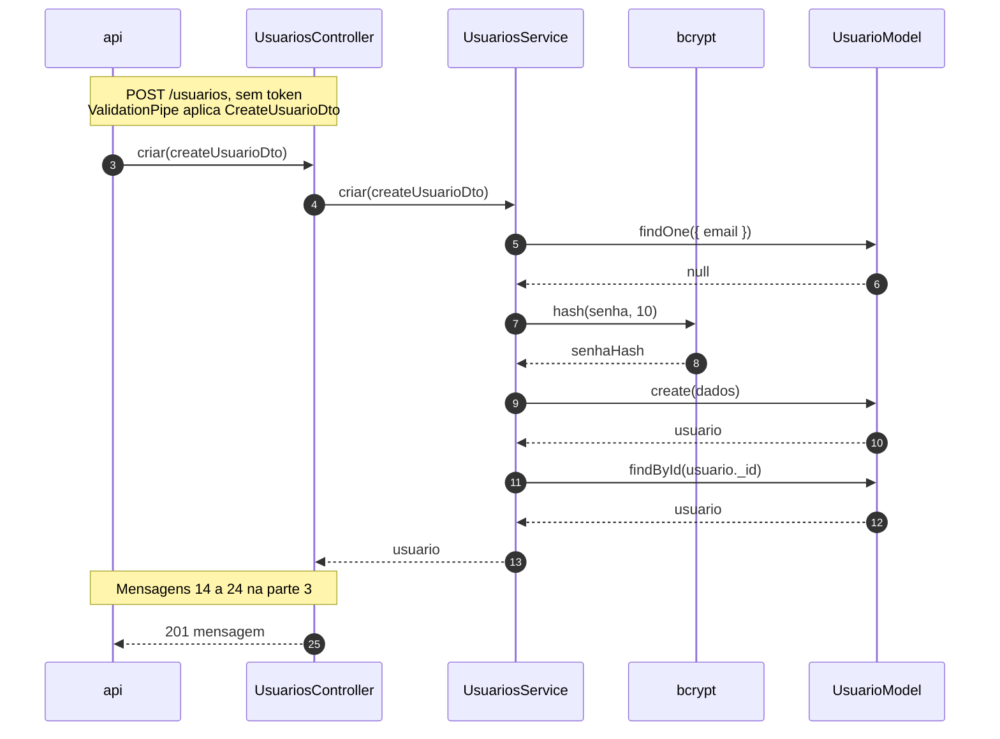
```mermaid
sequenceDiagram
    autonumber 3
    participant A as api
    participant UC as UsuariosController
    participant US as UsuariosService
    participant B as bcrypt
    participant M as UsuarioModel
    Note over A,UC: POST /usuarios, sem token<br/>ValidationPipe aplica CreateUsuarioDto
    A->>UC: criar(createUsuarioDto)
    UC->>US: criar(createUsuarioDto)
    US->>M: findOne({ email })
    M-->>US: null
    US->>B: hash(senha, 10)
    B-->>US: senhaHash
    US->>M: create(dados)
    M-->>US: usuario
    US->>M: findById(usuario._id)
    M-->>US: usuario
    US-->>UC: usuario
    Note over A,UC: Mensagens 14 a 24 na parte 3
    autonumber 25
    UC-->>A: 201 mensagem
```

Figura 15 — Diagrama de sequência SD-USR-01 (Cadastrar e confirmar conta local), parte 2 de 5: criação da conta na API. Fonte: equipe Conecta+.

### SD-USR-01 — parte 3 de 5: envio do código na API

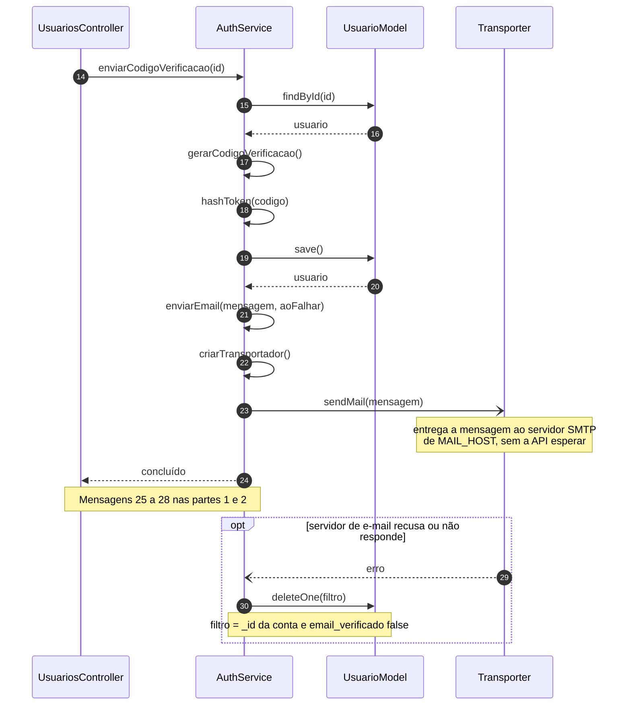
```mermaid
sequenceDiagram
    autonumber 14
    participant UC as UsuariosController
    participant AS as AuthService
    participant M as UsuarioModel
    participant TR as Transporter
    UC->>AS: enviarCodigoVerificacao(id)
    AS->>M: findById(id)
    M-->>AS: usuario
    AS->>AS: gerarCodigoVerificacao()
    AS->>AS: hashToken(codigo)
    AS->>M: save()
    M-->>AS: usuario
    AS->>AS: enviarEmail(mensagem, aoFalhar)
    AS->>AS: criarTransportador()
    AS-)TR: sendMail(mensagem)
    Note over TR: entrega a mensagem ao servidor SMTP<br/>de MAIL_HOST, sem a API esperar
    AS-->>UC: concluído
    Note over UC,AS: Mensagens 25 a 28 nas partes 1 e 2
    autonumber 29
    opt servidor de e-mail recusa ou não responde
        TR--)AS: erro
        AS->>M: deleteOne(filtro)
        Note over AS,M: filtro = _id da conta e email_verificado false
    end
```

Figura 16 — Diagrama de sequência SD-USR-01 (Cadastrar e confirmar conta local), parte 3 de 5: envio do código na API. Fonte: equipe Conecta+.

### SD-USR-01 — parte 4 de 5: confirmação no aplicativo

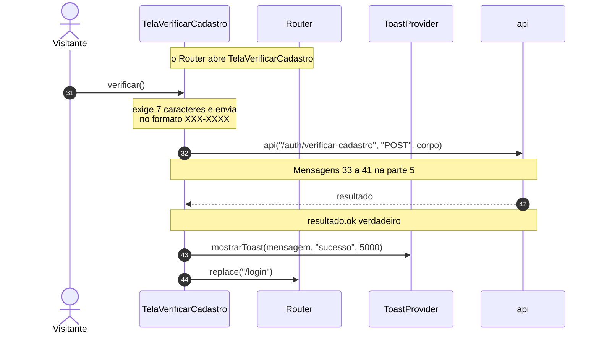
```mermaid
sequenceDiagram
    autonumber 31
    actor V as Visitante
    participant TV as TelaVerificarCadastro
    participant R as Router
    participant TO as ToastProvider
    participant A as api
    Note over R,TV: o Router abre TelaVerificarCadastro
    V->>TV: verificar()
    Note over TV: exige 7 caracteres e envia<br/>no formato XXX-XXXX
    TV->>A: api("/auth/verificar-cadastro", "POST", corpo)
    Note over TV,A: Mensagens 33 a 41 na parte 5
    autonumber 42
    A-->>TV: resultado
    Note over TV,A: resultado.ok verdadeiro
    TV->>TO: mostrarToast(mensagem, "sucesso", 5000)
    TV->>R: replace("/login")
```

Figura 17 — Diagrama de sequência SD-USR-01 (Cadastrar e confirmar conta local), parte 4 de 5: confirmação no aplicativo. Fonte: equipe Conecta+.

### SD-USR-01 — parte 5 de 5: confirmação na API

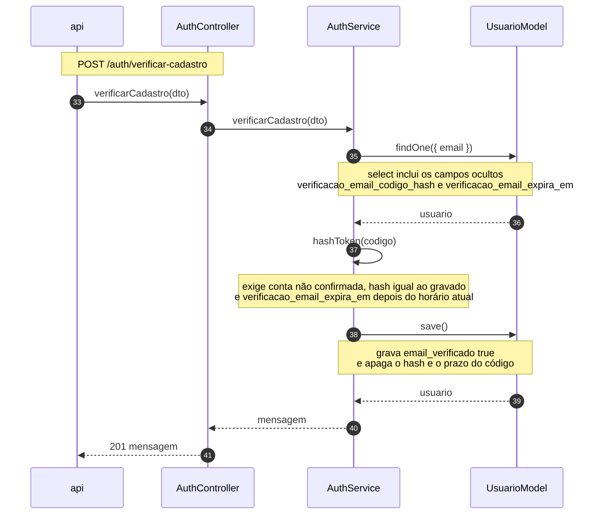
```mermaid
sequenceDiagram
    autonumber 33
    participant A as api
    participant AC as AuthController
    participant AS as AuthService
    participant M as UsuarioModel
    Note over A,AC: POST /auth/verificar-cadastro
    A->>AC: verificarCadastro(dto)
    AC->>AS: verificarCadastro(dto)
    AS->>M: findOne({ email })
    Note over AS,M: select inclui os campos ocultos<br/>verificacao_email_codigo_hash e verificacao_email_expira_em
    M-->>AS: usuario
    AS->>AS: hashToken(codigo)
    Note over AS: exige conta não confirmada, hash igual ao gravado<br/>e verificacao_email_expira_em depois do horário atual
    AS->>M: save()
    Note over AS,M: grava email_verificado true<br/>e apaga o hash e o prazo do código
    M-->>AS: usuario
    AS-->>AC: mensagem
    AC-->>A: 201 mensagem
```

Figura 18 — Diagrama de sequência SD-USR-01 (Cadastrar e confirmar conta local), parte 5 de 5: confirmação na API. Fonte: equipe Conecta+.

## SD-USR-02 — Autenticar com senha

### SD-USR-02 — parte 1 de 4: login no aplicativo

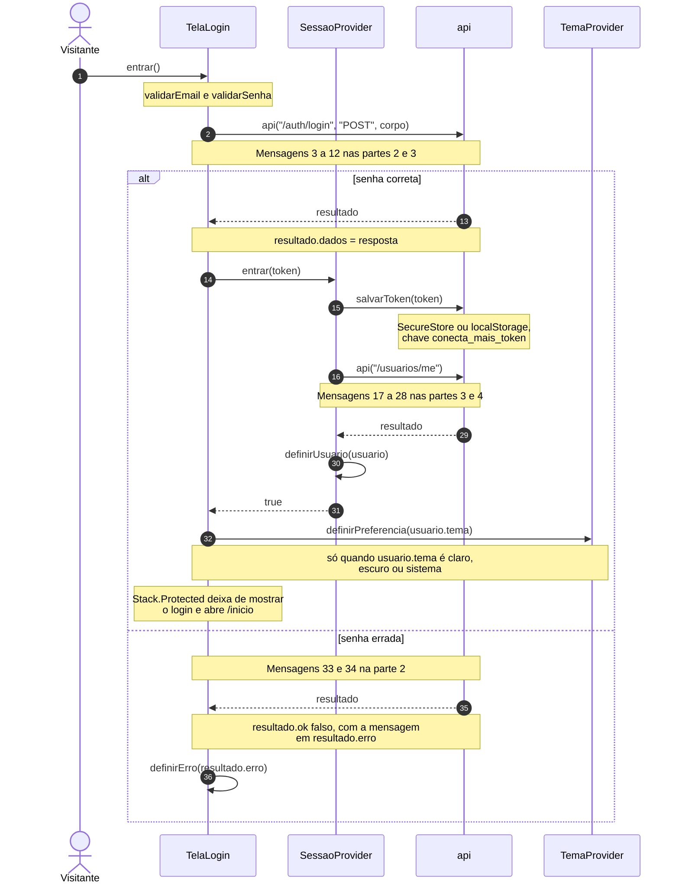
```mermaid
sequenceDiagram
    autonumber 1
    actor V as Visitante
    participant T as TelaLogin
    participant S as SessaoProvider
    participant A as api
    participant TP as TemaProvider
    V->>T: entrar()
    Note over T: validarEmail e validarSenha
    T->>A: api("/auth/login", "POST", corpo)
    Note over T,A: Mensagens 3 a 12 nas partes 2 e 3
    alt senha correta
        autonumber 13
        A-->>T: resultado
        Note over T,A: resultado.dados = resposta
        T->>S: entrar(token)
        S->>A: salvarToken(token)
        Note over A: SecureStore ou localStorage,<br/>chave conecta_mais_token
        S->>A: api("/usuarios/me")
        Note over S,A: Mensagens 17 a 28 nas partes 3 e 4
        autonumber 29
        A-->>S: resultado
        S->>S: definirUsuario(usuario)
        S-->>T: true
        T->>TP: definirPreferencia(usuario.tema)
        Note over T,TP: só quando usuario.tema é claro,<br/>escuro ou sistema
        Note over T: Stack.Protected deixa de mostrar<br/>o login e abre /inicio
    else senha errada
        Note over T,A: Mensagens 33 e 34 na parte 2
        autonumber 35
        A-->>T: resultado
        Note over T,A: resultado.ok falso, com a mensagem<br/>em resultado.erro
        T->>T: definirErro(resultado.erro)
    end
```

Figura 19 — Diagrama de sequência SD-USR-02 (Autenticar com senha), parte 1 de 4: login no aplicativo. Fonte: equipe Conecta+.

### SD-USR-02 — parte 2 de 4: conferência da senha na API

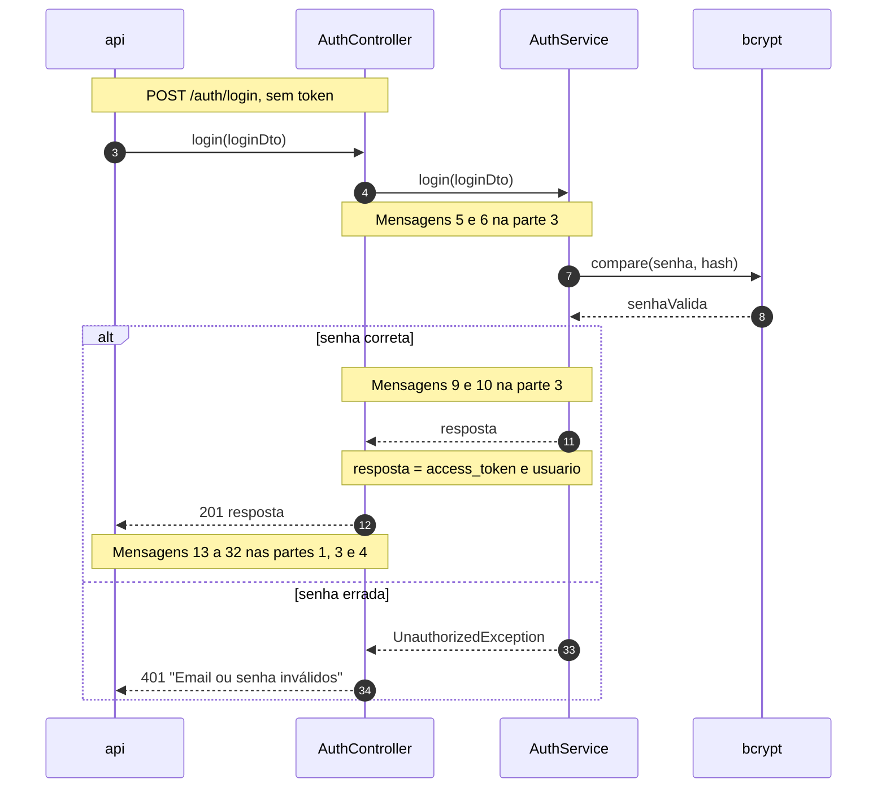
```mermaid
sequenceDiagram
    autonumber 3
    participant A as api
    participant AC as AuthController
    participant AS as AuthService
    participant B as bcrypt
    Note over A,AC: POST /auth/login, sem token
    A->>AC: login(loginDto)
    AC->>AS: login(loginDto)
    Note over AC,AS: Mensagens 5 e 6 na parte 3
    autonumber 7
    AS->>B: compare(senha, hash)
    B-->>AS: senhaValida
    alt senha correta
        Note over AC,AS: Mensagens 9 e 10 na parte 3
        autonumber 11
        AS-->>AC: resposta
        Note over AC,AS: resposta = access_token e usuario
        AC-->>A: 201 resposta
        Note over A,AC: Mensagens 13 a 32 nas partes 1, 3 e 4
    else senha errada
        autonumber 33
        AS-->>AC: UnauthorizedException
        AC-->>A: 401 "Email ou senha inválidos"
    end
```

Figura 20 — Diagrama de sequência SD-USR-02 (Autenticar com senha), parte 2 de 4: conferência da senha na API. Fonte: equipe Conecta+.

### SD-USR-02 — parte 3 de 4: busca da conta e token

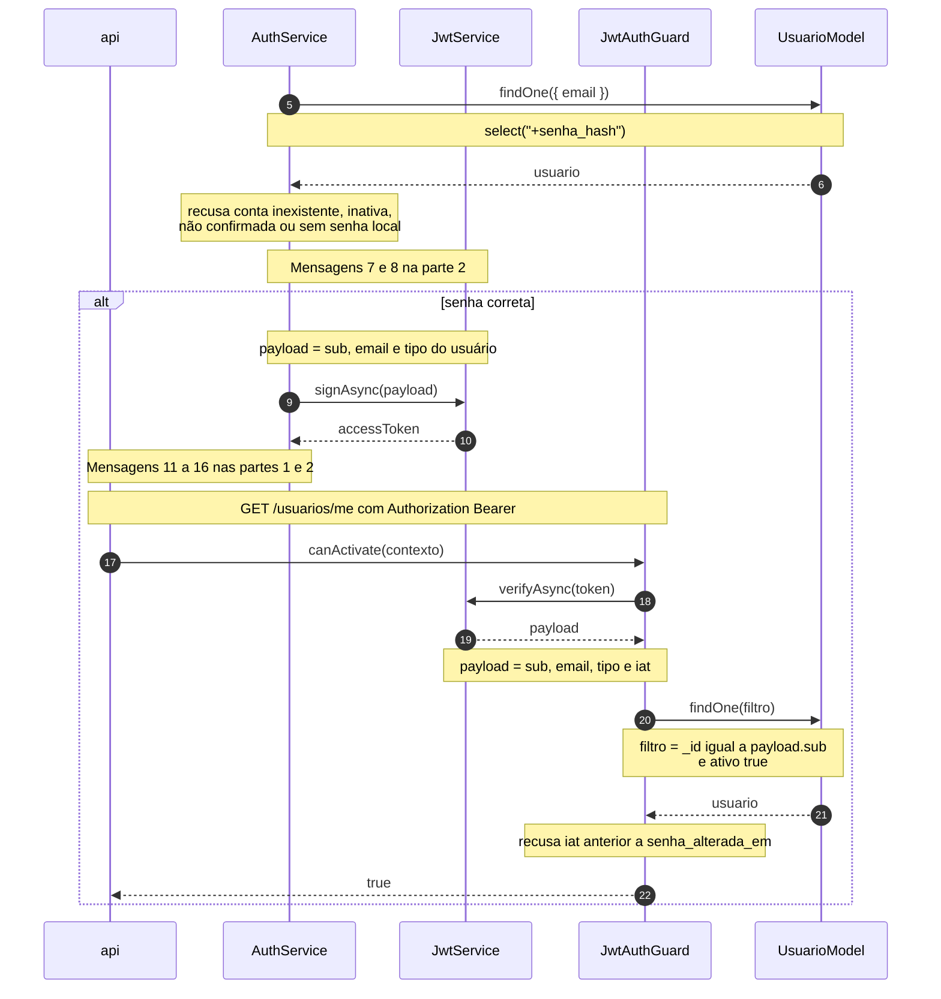
```mermaid
sequenceDiagram
    autonumber 5
    participant A as api
    participant AS as AuthService
    participant J as JwtService
    participant G as JwtAuthGuard
    participant M as UsuarioModel
    AS->>M: findOne({ email })
    Note over AS,M: select("+senha_hash")
    M-->>AS: usuario
    Note over AS: recusa conta inexistente, inativa,<br/>não confirmada ou sem senha local
    Note over AS,J: Mensagens 7 e 8 na parte 2
    autonumber 9
    alt senha correta
        Note over AS,J: payload = sub, email e tipo do usuário
        AS->>J: signAsync(payload)
        J-->>AS: accessToken
        Note over A,AS: Mensagens 11 a 16 nas partes 1 e 2
        autonumber 17
        Note over A,G: GET /usuarios/me com Authorization Bearer
        A->>G: canActivate(contexto)
        G->>J: verifyAsync(token)
        J-->>G: payload
        Note over G,J: payload = sub, email, tipo e iat
        G->>M: findOne(filtro)
        Note over G,M: filtro = _id igual a payload.sub<br/>e ativo true
        M-->>G: usuario
        Note over G: recusa iat anterior a senha_alterada_em
        G-->>A: true
    end
```

Figura 21 — Diagrama de sequência SD-USR-02 (Autenticar com senha), parte 3 de 4: busca da conta e token. Fonte: equipe Conecta+.

### SD-USR-02 — parte 4 de 4: consulta do perfil na API

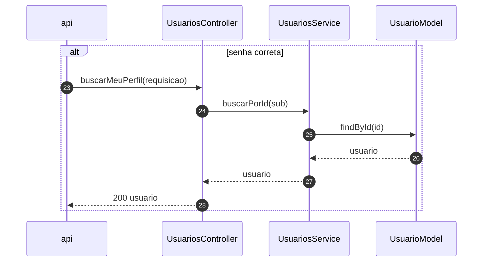
```mermaid
sequenceDiagram
    autonumber 23
    participant A as api
    participant UC as UsuariosController
    participant US as UsuariosService
    participant M as UsuarioModel
    alt senha correta
        A->>UC: buscarMeuPerfil(requisicao)
        UC->>US: buscarPorId(sub)
        US->>M: findById(id)
        M-->>US: usuario
        US-->>UC: usuario
        UC-->>A: 200 usuario
    end
```

Figura 22 — Diagrama de sequência SD-USR-02 (Autenticar com senha), parte 4 de 4: consulta do perfil na API. Fonte: equipe Conecta+.

## SD-USR-03 — Autenticar com Google

No aplicativo instalado (Android e iOS):

### SD-USR-03 no aplicativo instalado — parte 1 de 4: tela de login e módulo `google`

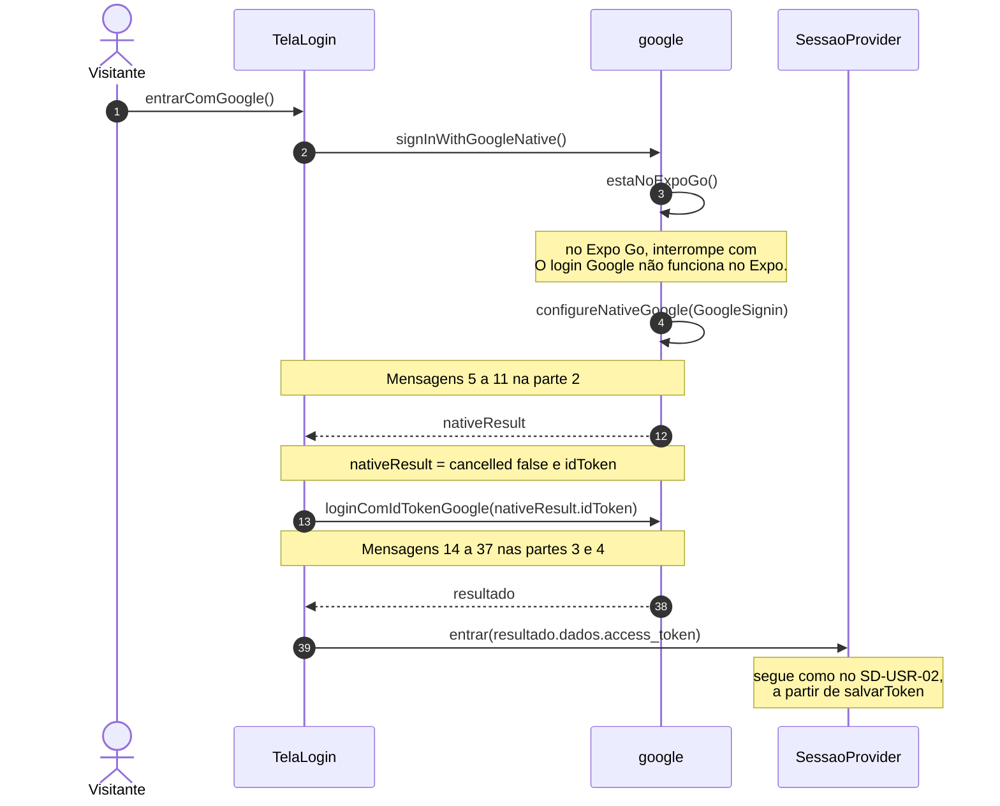
```mermaid
sequenceDiagram
    autonumber 1
    actor V as Visitante
    participant T as TelaLogin
    participant GM as google
    participant S as SessaoProvider
    V->>T: entrarComGoogle()
    T->>GM: signInWithGoogleNative()
    GM->>GM: estaNoExpoGo()
    Note over GM: no Expo Go, interrompe com<br/>O login Google não funciona no Expo.
    GM->>GM: configureNativeGoogle(GoogleSignin)
    Note over T,GM: Mensagens 5 a 11 na parte 2
    autonumber 12
    GM-->>T: nativeResult
    Note over T,GM: nativeResult = cancelled false e idToken
    T->>GM: loginComIdTokenGoogle(nativeResult.idToken)
    Note over T,GM: Mensagens 14 a 37 nas partes 3 e 4
    autonumber 38
    GM-->>T: resultado
    T->>S: entrar(resultado.dados.access_token)
    Note over S: segue como no SD-USR-02,<br/>a partir de salvarToken
```

Figura 23 — Diagrama de sequência SD-USR-03 (Autenticar com Google) no aplicativo instalado, parte 1 de 4: tela de login e módulo `google`. Fonte: equipe Conecta+.

### SD-USR-03 no aplicativo instalado — parte 2 de 4: biblioteca `GoogleSignin`

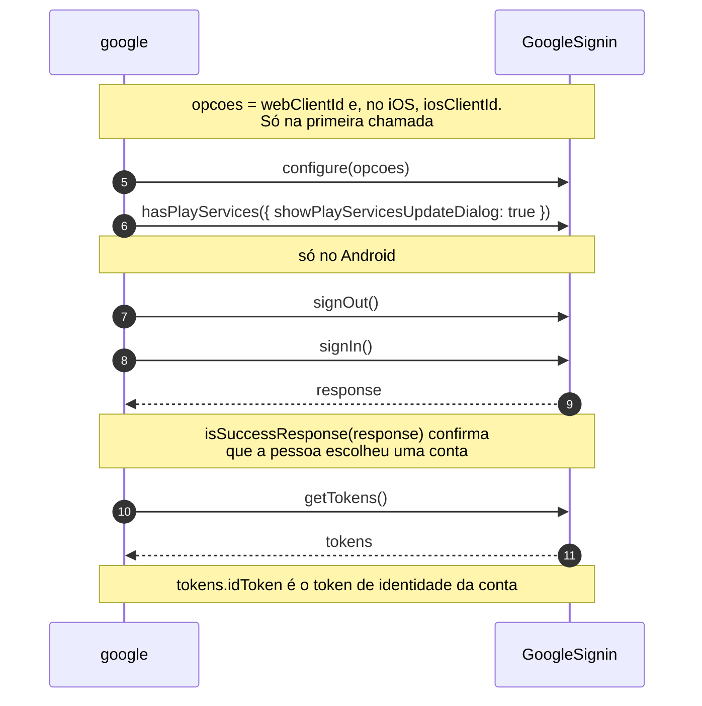
```mermaid
sequenceDiagram
    autonumber 5
    participant GM as google
    participant SDK as GoogleSignin
    Note over GM,SDK: opcoes = webClientId e, no iOS, iosClientId.<br/>Só na primeira chamada
    GM->>SDK: configure(opcoes)
    GM->>SDK: hasPlayServices({ showPlayServicesUpdateDialog: true })
    Note over GM,SDK: só no Android
    GM->>SDK: signOut()
    GM->>SDK: signIn()
    SDK-->>GM: response
    Note over GM,SDK: isSuccessResponse(response) confirma<br/>que a pessoa escolheu uma conta
    GM->>SDK: getTokens()
    SDK-->>GM: tokens
    Note over GM,SDK: tokens.idToken é o token de identidade da conta
```

Figura 24 — Diagrama de sequência SD-USR-03 (Autenticar com Google) no aplicativo instalado, parte 2 de 4: biblioteca `GoogleSignin`. Fonte: equipe Conecta+.

### SD-USR-03 no aplicativo instalado — parte 3 de 4: login na API

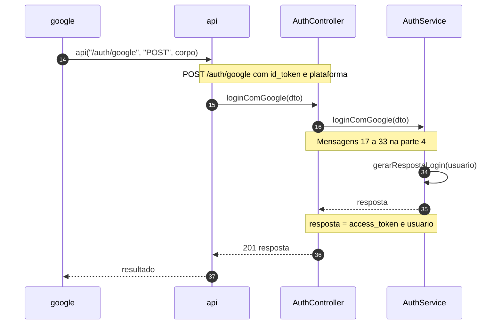
```mermaid
sequenceDiagram
    autonumber 14
    participant GM as google
    participant A as api
    participant AC as AuthController
    participant AS as AuthService
    GM->>A: api("/auth/google", "POST", corpo)
    Note over A,AC: POST /auth/google com id_token e plataforma
    A->>AC: loginComGoogle(dto)
    AC->>AS: loginComGoogle(dto)
    Note over AC,AS: Mensagens 17 a 33 na parte 4
    autonumber 34
    AS->>AS: gerarRespostaLogin(usuario)
    AS-->>AC: resposta
    Note over AC,AS: resposta = access_token e usuario
    AC-->>A: 201 resposta
    A-->>GM: resultado
```

Figura 25 — Diagrama de sequência SD-USR-03 (Autenticar com Google) no aplicativo instalado, parte 3 de 4: login na API. Fonte: equipe Conecta+.

### SD-USR-03 no aplicativo instalado — parte 4 de 4: conferência do token e da conta

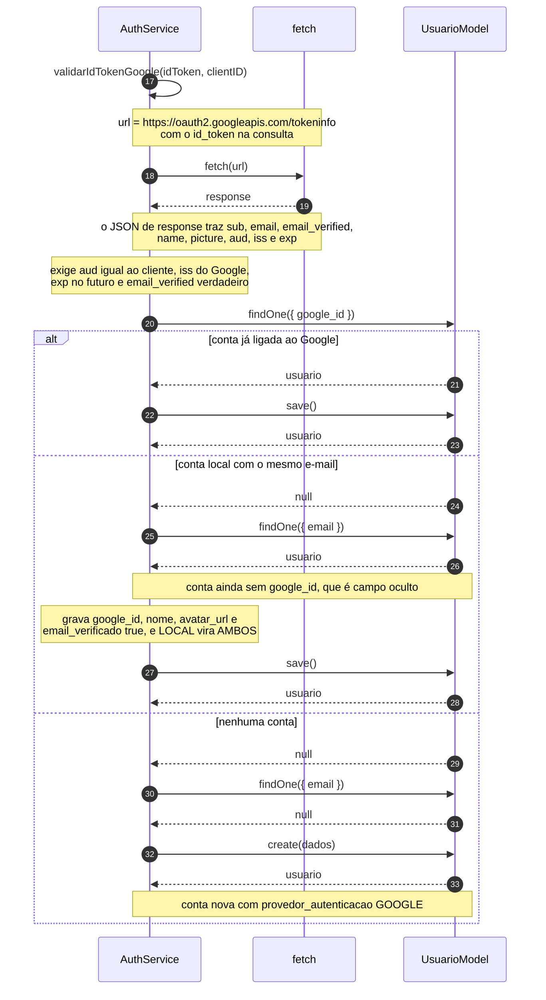
```mermaid
sequenceDiagram
    autonumber 17
    participant AS as AuthService
    participant F as fetch
    participant M as UsuarioModel
    AS->>AS: validarIdTokenGoogle(idToken, clientID)
    Note over AS,F: url = https://oauth2.googleapis.com/tokeninfo<br/>com o id_token na consulta
    AS->>F: fetch(url)
    F-->>AS: response
    Note over AS,F: o JSON de response traz sub, email, email_verified,<br/>name, picture, aud, iss e exp
    Note over AS: exige aud igual ao cliente, iss do Google,<br/>exp no futuro e email_verified verdadeiro
    AS->>M: findOne({ google_id })
    alt conta já ligada ao Google
        M-->>AS: usuario
        AS->>M: save()
        M-->>AS: usuario
    else conta local com o mesmo e-mail
        M-->>AS: null
        AS->>M: findOne({ email })
        M-->>AS: usuario
        Note over AS,M: conta ainda sem google_id, que é campo oculto
        Note over AS: grava google_id, nome, avatar_url e<br/>email_verificado true, e LOCAL vira AMBOS
        AS->>M: save()
        M-->>AS: usuario
    else nenhuma conta
        M-->>AS: null
        AS->>M: findOne({ email })
        M-->>AS: null
        AS->>M: create(dados)
        M-->>AS: usuario
        Note over AS,M: conta nova com provedor_autenticacao GOOGLE
    end
```

Figura 26 — Diagrama de sequência SD-USR-03 (Autenticar com Google) no aplicativo instalado, parte 4 de 4: conferência do token e da conta. Fonte: equipe Conecta+.

No navegador:

### SD-USR-03 no navegador — parte 1 de 5: escolha da conta no Google

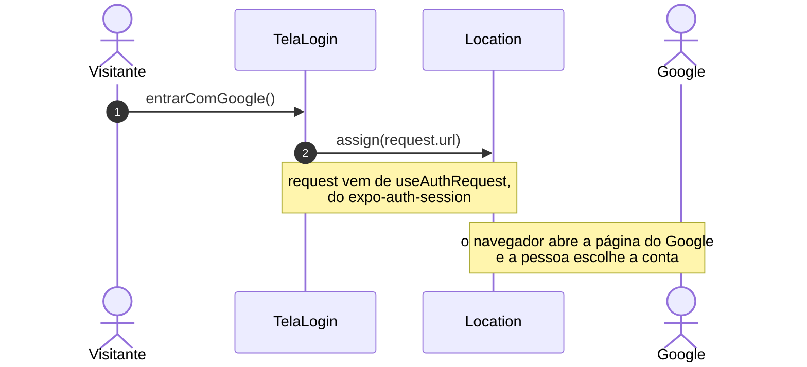
```mermaid
sequenceDiagram
    autonumber 1
    actor V as Visitante
    participant T as TelaLogin
    participant L as Location
    actor GO as Google
    V->>T: entrarComGoogle()
    T->>L: assign(request.url)
    Note over T,L: request vem de useAuthRequest,<br/>do expo-auth-session
    Note over L,GO: o navegador abre a página do Google<br/>e a pessoa escolhe a conta
```

Figura 27 — Diagrama de sequência SD-USR-03 (Autenticar com Google) no navegador, parte 1 de 5: escolha da conta no Google. Fonte: equipe Conecta+.

### SD-USR-03 no navegador — parte 2 de 5: retorno do Google

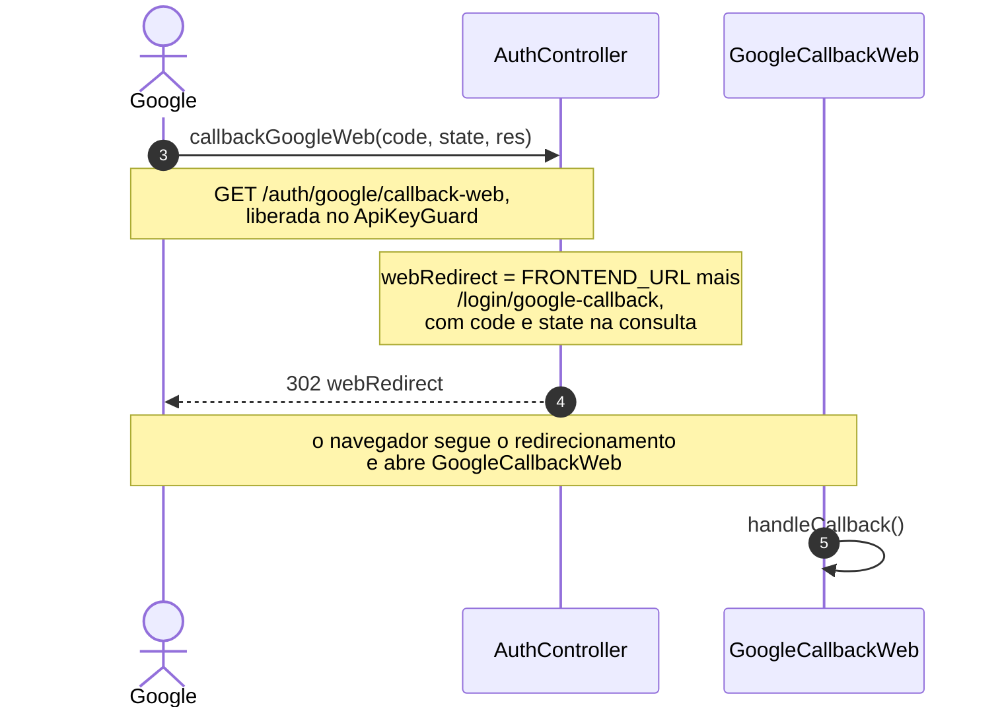
```mermaid
sequenceDiagram
    autonumber 3
    actor GO as Google
    participant AC as AuthController
    participant W as GoogleCallbackWeb
    GO->>AC: callbackGoogleWeb(code, state, res)
    Note over GO,AC: GET /auth/google/callback-web,<br/>liberada no ApiKeyGuard
    Note over AC: webRedirect = FRONTEND_URL mais<br/>/login/google-callback,<br/>com code e state na consulta
    AC-->>GO: 302 webRedirect
    Note over GO,W: o navegador segue o redirecionamento<br/>e abre GoogleCallbackWeb
    W->>W: handleCallback()
```

Figura 28 — Diagrama de sequência SD-USR-03 (Autenticar com Google) no navegador, parte 2 de 5: retorno do Google. Fonte: equipe Conecta+.

### SD-USR-03 no navegador — parte 3 de 5: troca do código no aplicativo

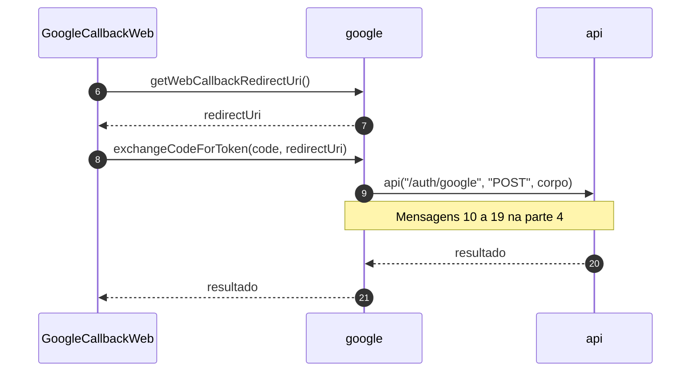
```mermaid
sequenceDiagram
    autonumber 6
    participant W as GoogleCallbackWeb
    participant GM as google
    participant A as api
    W->>GM: getWebCallbackRedirectUri()
    GM-->>W: redirectUri
    W->>GM: exchangeCodeForToken(code, redirectUri)
    GM->>A: api("/auth/google", "POST", corpo)
    Note over GM,A: Mensagens 10 a 19 na parte 4
    autonumber 20
    A-->>GM: resultado
    GM-->>W: resultado
```

Figura 29 — Diagrama de sequência SD-USR-03 (Autenticar com Google) no navegador, parte 3 de 5: troca do código no aplicativo. Fonte: equipe Conecta+.

### SD-USR-03 no navegador — parte 4 de 5: login na API

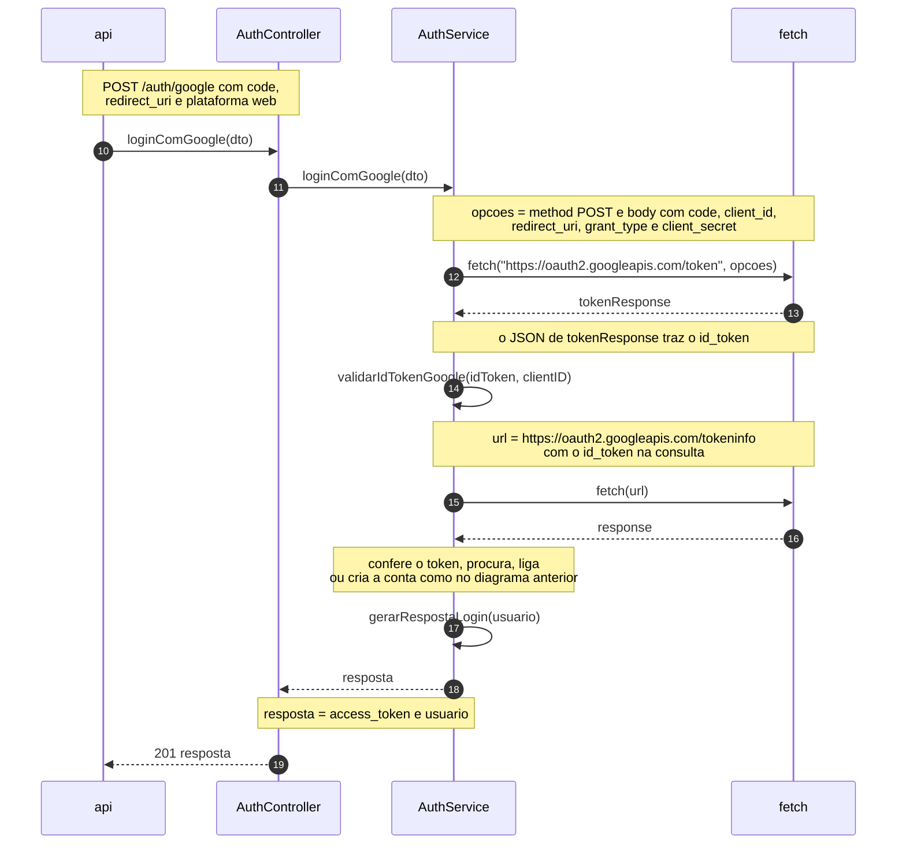
```mermaid
sequenceDiagram
    autonumber 10
    participant A as api
    participant AC as AuthController
    participant AS as AuthService
    participant F as fetch
    Note over A,AC: POST /auth/google com code,<br/>redirect_uri e plataforma web
    A->>AC: loginComGoogle(dto)
    AC->>AS: loginComGoogle(dto)
    Note over AS,F: opcoes = method POST e body com code, client_id,<br/>redirect_uri, grant_type e client_secret
    AS->>F: fetch("https://oauth2.googleapis.com/token", opcoes)
    F-->>AS: tokenResponse
    Note over AS,F: o JSON de tokenResponse traz o id_token
    AS->>AS: validarIdTokenGoogle(idToken, clientID)
    Note over AS,F: url = https://oauth2.googleapis.com/tokeninfo<br/>com o id_token na consulta
    AS->>F: fetch(url)
    F-->>AS: response
    Note over AS: confere o token, procura, liga<br/>ou cria a conta como no diagrama anterior
    AS->>AS: gerarRespostaLogin(usuario)
    AS-->>AC: resposta
    Note over AC,AS: resposta = access_token e usuario
    AC-->>A: 201 resposta
```

Figura 30 — Diagrama de sequência SD-USR-03 (Autenticar com Google) no navegador, parte 4 de 5: login na API. Fonte: equipe Conecta+.

### SD-USR-03 no navegador — parte 5 de 5: abertura da sessão

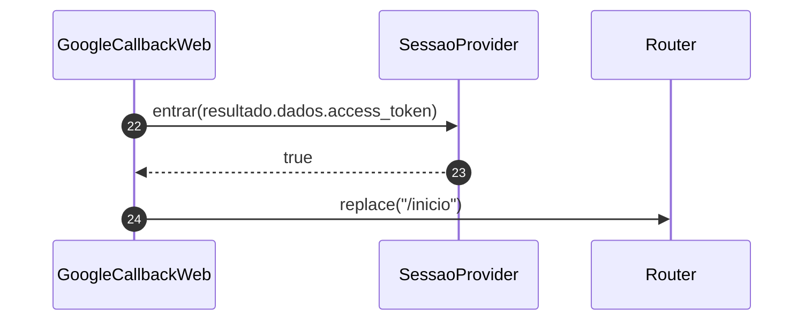
```mermaid
sequenceDiagram
    autonumber 22
    participant W as GoogleCallbackWeb
    participant S as SessaoProvider
    participant R as Router
    W->>S: entrar(resultado.dados.access_token)
    S-->>W: true
    W->>R: replace("/inicio")
```

Figura 31 — Diagrama de sequência SD-USR-03 (Autenticar com Google) no navegador, parte 5 de 5: abertura da sessão. Fonte: equipe Conecta+.

## SD-USR-04 — Desbloquear sessão salva

A consulta `GET /usuarios/me` passa pelo `JwtAuthGuard` e chega a `UsuariosController.buscarMeuPerfil`, como no SD-USR-02; aqui ela aparece só como a chamada ao módulo `api`. O pedido de identidade é feito pelo próprio aparelho, dentro de `autenticarComDispositivo`.

### SD-USR-04 — parte 1 de 3: abertura do aplicativo

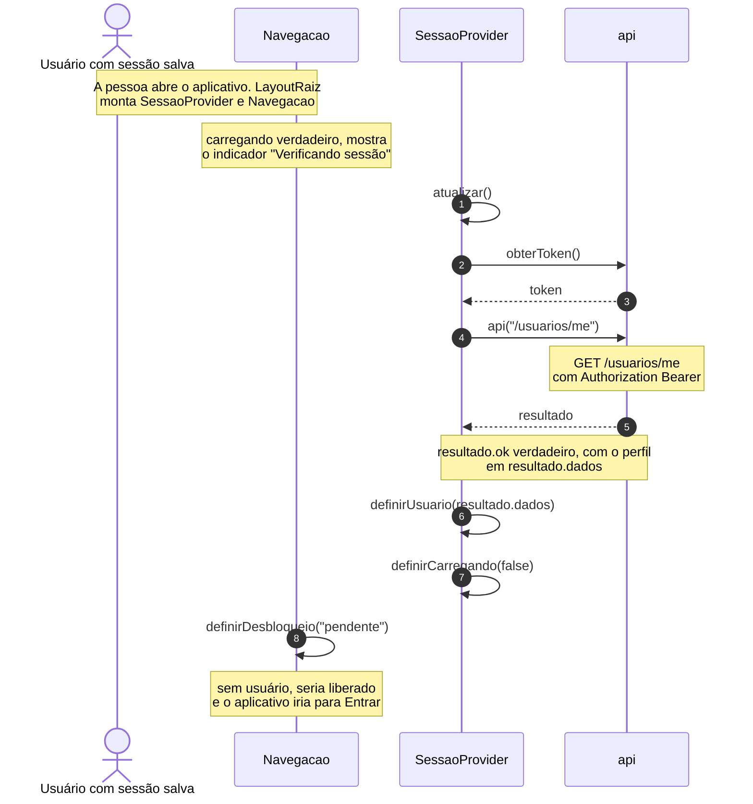
```mermaid
sequenceDiagram
    autonumber 1
    actor U as Usuário com sessão salva
    participant N as Navegacao
    participant S as SessaoProvider
    participant A as api
    Note over U,N: A pessoa abre o aplicativo. LayoutRaiz<br/>monta SessaoProvider e Navegacao
    Note over N: carregando verdadeiro, mostra<br/>o indicador "Verificando sessão"
    S->>S: atualizar()
    S->>A: obterToken()
    A-->>S: token
    S->>A: api("/usuarios/me")
    Note over A: GET /usuarios/me<br/>com Authorization Bearer
    A-->>S: resultado
    Note over S,A: resultado.ok verdadeiro, com o perfil<br/>em resultado.dados
    S->>S: definirUsuario(resultado.dados)
    S->>S: definirCarregando(false)
    N->>N: definirDesbloqueio("pendente")
    Note over N: sem usuário, seria liberado<br/>e o aplicativo iria para Entrar
```

Figura 32 — Diagrama de sequência SD-USR-04 (Desbloquear sessão salva), parte 1 de 3: abertura do aplicativo. Fonte: equipe Conecta+.

### SD-USR-04 — parte 2 de 3: pedido de identidade

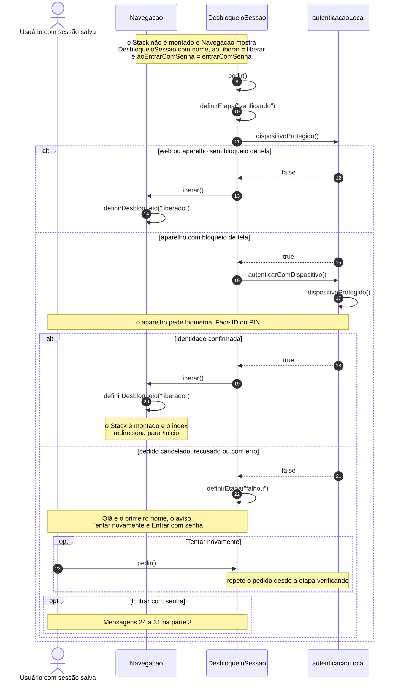
```mermaid
sequenceDiagram
    autonumber 9
    actor U as Usuário com sessão salva
    participant N as Navegacao
    participant D as DesbloqueioSessao
    participant L as autenticacaoLocal
    Note over N,D: o Stack não é montado e Navegacao mostra<br/>DesbloqueioSessao com nome, aoLiberar = liberar<br/>e aoEntrarComSenha = entrarComSenha
    D->>D: pedir()
    D->>D: definirEtapa("verificando")
    D->>L: dispositivoProtegido()
    alt web ou aparelho sem bloqueio de tela
        L-->>D: false
        D->>N: liberar()
        N->>N: definirDesbloqueio("liberado")
    else aparelho com bloqueio de tela
        L-->>D: true
        D->>L: autenticarComDispositivo()
        L->>L: dispositivoProtegido()
        Note over U,L: o aparelho pede biometria, Face ID ou PIN
        alt identidade confirmada
            L-->>D: true
            D->>N: liberar()
            N->>N: definirDesbloqueio("liberado")
            Note over N: o Stack é montado e o index<br/>redireciona para /inicio
        else pedido cancelado, recusado ou com erro
            L-->>D: false
            D->>D: definirEtapa("falhou")
            Note over U,D: Olá e o primeiro nome, o aviso,<br/>Tentar novamente e Entrar com senha
            opt Tentar novamente
                U->>D: pedir()
                Note over D,L: repete o pedido desde a etapa verificando
            end
            opt Entrar com senha
                Note over U,D: Mensagens 24 a 31 na parte 3
            end
        end
    end
```

Figura 33 — Diagrama de sequência SD-USR-04 (Desbloquear sessão salva), parte 2 de 3: pedido de identidade. Fonte: equipe Conecta+.

### SD-USR-04 — parte 3 de 3: entrada com senha

```mermaid
sequenceDiagram
    autonumber 24
    actor U as Usuário com sessão salva
    participant N as Navegacao
    participant D as DesbloqueioSessao
    participant S as SessaoProvider
    participant A as api
    alt aparelho com bloqueio de tela
        alt pedido cancelado, recusado ou com erro
            opt Entrar com senha
                U->>D: entrarComSenha()
                D->>D: definirSaindo(true)
                D->>N: entrarComSenha()
                N->>S: sair()
                S->>A: removerToken()
                Note over A: SecureStore ou<br/>localStorage, chave<br/>conecta_mais_token
                S->>S: definirUsuario(null)
                S-->>N: concluído
                N->>N: definirDesbloqueio("liberado")
                Note over N: sem usuário, o index redireciona para /login<br/>e a tela Entrar abre sem aviso
            end
        end
    end
```

Figura 34 — Diagrama de sequência SD-USR-04 (Desbloquear sessão salva), parte 3 de 3: entrada com senha. Fonte: equipe Conecta+.

## Rastreabilidade

SD-USR-01 a SD-USR-04 correspondem, na mesma ordem, a UC-USR-01 a UC-USR-04 e a RF-USR-01 a RF-USR-04.
