# Diagramas de sequência — Configurações de usuário

> Padrão da disciplina · Módulo CFG · Revisado em 27/11/2026

## Resumo

Há um diagrama para cada requisito de [Requisitos funcionais](2%20-%20requisitos-funcionais-configuracoes-usuario.md), com o mesmo número. As linhas de vida são classes e módulos que existem no código e estão no [Diagrama de classes](3%20-%20diagrama-classes-configuracoes-usuario.md): as telas do aplicativo, os contextos (`SessaoContext`, `TemaContext` e `ToastContext`), os módulos `api` e `autenticacaoLocal`, os controllers, os services, o guard, o model `UsuarioModel` e as bibliotecas chamadas diretamente (`Router`, `SecureStore`, `bcrypt`, `crypto` e `Transporter`). A linha de vida "UsuarioModel (documento usuario)" é o documento devolvido pelo model, no qual o service chama `save()`. Toda mensagem é a chamada de um método existente, com seus parâmetros, e as mensagens são numeradas na ordem em que acontecem. Regras que não são métodos, como comparar um código com o hash guardado, aparecem em notas. Os retornos são identificadores; uma nota diz o que cada um traz quando isso não é evidente.

Em todos os diagramas, a chamada do módulo `api` ao controller é uma requisição HTTP que passa antes pelo `ApiKeyGuard`; nas rotas `/usuarios/me…`, passa também pelo `JwtAuthGuard`, desenhado só no SD-CFG-03, onde ele decide o resultado. A rota está indicada na nota. O `resultado` devolvido pelo módulo `api` é o tipo `Resultado`: `ok` verdadeiro com `dados`, ou `ok` falso com `erro`.

Para caber na largura da página, cada diagrama está dividido em partes de até cinco linhas de vida, separadas por camada (aplicativo, API e dados) ou por etapa do fluxo; a linha de vida da fronteira, em geral o módulo `api`, aparece nas duas partes vizinhas. A numeração das mensagens continua de uma parte para a outra, e uma nota indica as mensagens que estão em outra parte. Os blocos `alt` que atravessam partes se repetem em cada uma delas, com a condição do ramo que ela mostra.

## SD-CFG-01 — Alterar nome do perfil

### SD-CFG-01 — parte 1 de 4: tela "Perfil"

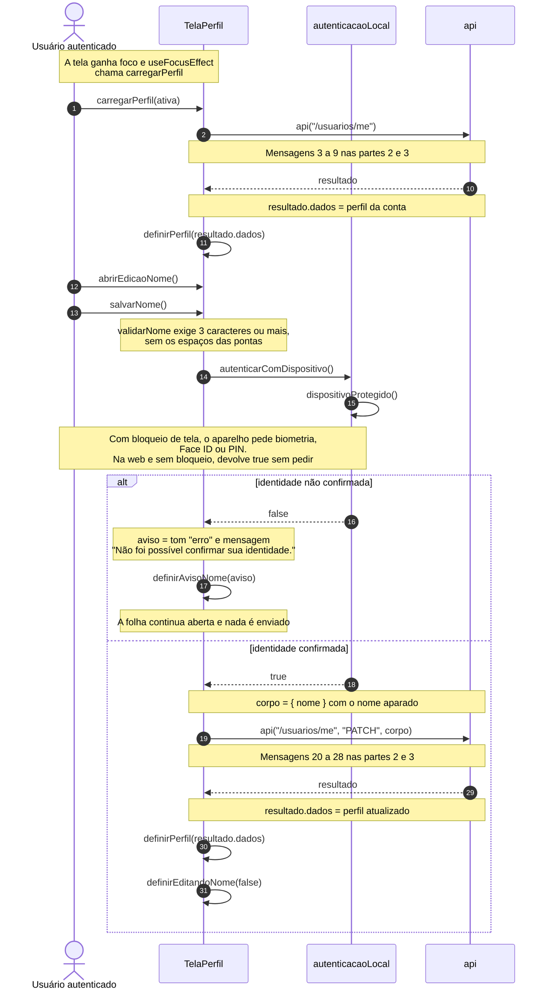
```mermaid
sequenceDiagram
    autonumber 1
    actor U as Usuário autenticado
    participant T as TelaPerfil
    participant L as autenticacaoLocal
    participant A as api
    Note over U,T: A tela ganha foco e useFocusEffect<br/>chama carregarPerfil
    U->>T: carregarPerfil(ativa)
    T->>A: api("/usuarios/me")
    Note over T,A: Mensagens 3 a 9 nas partes 2 e 3
    autonumber 10
    A-->>T: resultado
    Note over T,A: resultado.dados = perfil da conta
    T->>T: definirPerfil(resultado.dados)
    U->>T: abrirEdicaoNome()
    U->>T: salvarNome()
    Note over T: validarNome exige 3 caracteres ou mais,<br/>sem os espaços das pontas
    T->>L: autenticarComDispositivo()
    L->>L: dispositivoProtegido()
    Note over U,L: Com bloqueio de tela, o aparelho pede biometria,<br/>Face ID ou PIN.<br/>Na web e sem bloqueio, devolve true sem pedir
    alt identidade não confirmada
        L-->>T: false
        Note over T: aviso = tom "erro" e mensagem<br/>"Não foi possível confirmar sua identidade."
        T->>T: definirAvisoNome(aviso)
        Note over T: A folha continua aberta e nada é enviado
    else identidade confirmada
        L-->>T: true
        Note over T,A: corpo = { nome } com o nome aparado
        T->>A: api("/usuarios/me", "PATCH", corpo)
        Note over T,A: Mensagens 20 a 28 nas partes 2 e 3
        autonumber 29
        A-->>T: resultado
        Note over T,A: resultado.dados = perfil atualizado
        T->>T: definirPerfil(resultado.dados)
        T->>T: definirEditandoNome(false)
    end
```

Figura 4 — Diagrama de sequência SD-CFG-01 (Alterar nome do perfil), parte 1 de 4: tela "Perfil". Fonte: equipe Conecta+.

### SD-CFG-01 — parte 2 de 4: controller e serviço

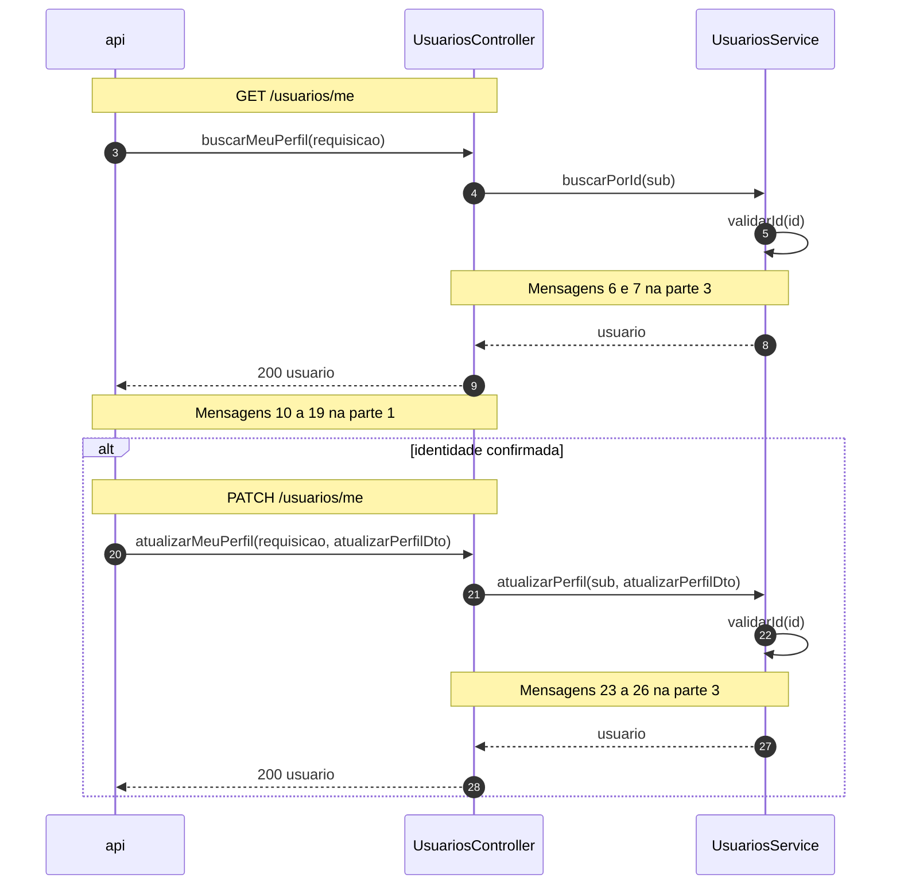
```mermaid
sequenceDiagram
    autonumber 3
    participant A as api
    participant C as UsuariosController
    participant S as UsuariosService
    Note over A,C: GET /usuarios/me
    A->>C: buscarMeuPerfil(requisicao)
    C->>S: buscarPorId(sub)
    S->>S: validarId(id)
    Note over C,S: Mensagens 6 e 7 na parte 3
    autonumber 8
    S-->>C: usuario
    C-->>A: 200 usuario
    Note over A,C: Mensagens 10 a 19 na parte 1
    alt identidade confirmada
        autonumber 20
        Note over A,C: PATCH /usuarios/me
        A->>C: atualizarMeuPerfil(requisicao, atualizarPerfilDto)
        C->>S: atualizarPerfil(sub, atualizarPerfilDto)
        S->>S: validarId(id)
        Note over C,S: Mensagens 23 a 26 na parte 3
        autonumber 27
        S-->>C: usuario
        C-->>A: 200 usuario
    end
```

Figura 4 — Diagrama de sequência SD-CFG-01 (Alterar nome do perfil), parte 2 de 4: controller e serviço. Fonte: equipe Conecta+.

### SD-CFG-01 — parte 3 de 4: model e documento

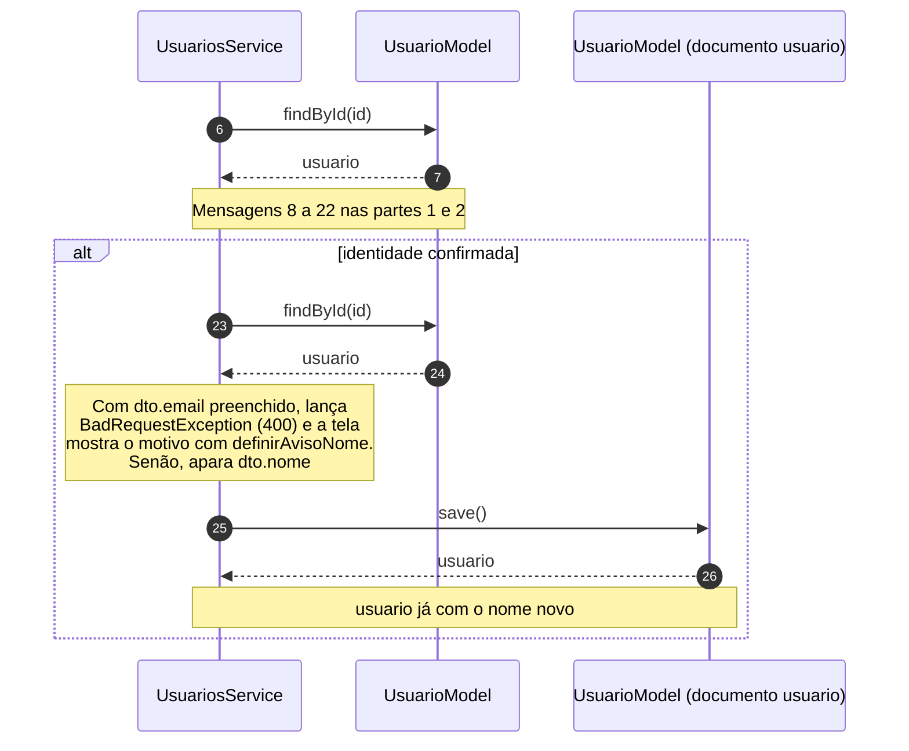
```mermaid
sequenceDiagram
    autonumber 6
    participant S as UsuariosService
    participant M as UsuarioModel
    participant D as UsuarioModel (documento usuario)
    S->>M: findById(id)
    M-->>S: usuario
    Note over S,M: Mensagens 8 a 22 nas partes 1 e 2
    alt identidade confirmada
        autonumber 23
        S->>M: findById(id)
        M-->>S: usuario
        Note over S: Com dto.email preenchido, lança<br/>BadRequestException (400) e a tela<br/>mostra o motivo com definirAvisoNome.<br/>Senão, apara dto.nome
        S->>D: save()
        D-->>S: usuario
        Note over S,D: usuario já com o nome novo
    end
```

Figura 4 — Diagrama de sequência SD-CFG-01 (Alterar nome do perfil), parte 3 de 4: model e documento. Fonte: equipe Conecta+.

### SD-CFG-01 — parte 4 de 4: aviso e sessão

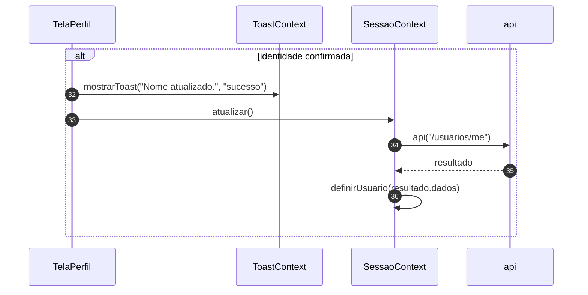
```mermaid
sequenceDiagram
    autonumber 32
    participant T as TelaPerfil
    participant TO as ToastContext
    participant SC as SessaoContext
    participant A as api
    alt identidade confirmada
        T->>TO: mostrarToast("Nome atualizado.", "sucesso")
        T->>SC: atualizar()
        SC->>A: api("/usuarios/me")
        A-->>SC: resultado
        SC->>SC: definirUsuario(resultado.dados)
    end
```

Figura 4 — Diagrama de sequência SD-CFG-01 (Alterar nome do perfil), parte 4 de 4: aviso e sessão. Fonte: equipe Conecta+.

## SD-CFG-02 — Trocar e-mail

### SD-CFG-02 — parte 1 de 4: abertura da tela

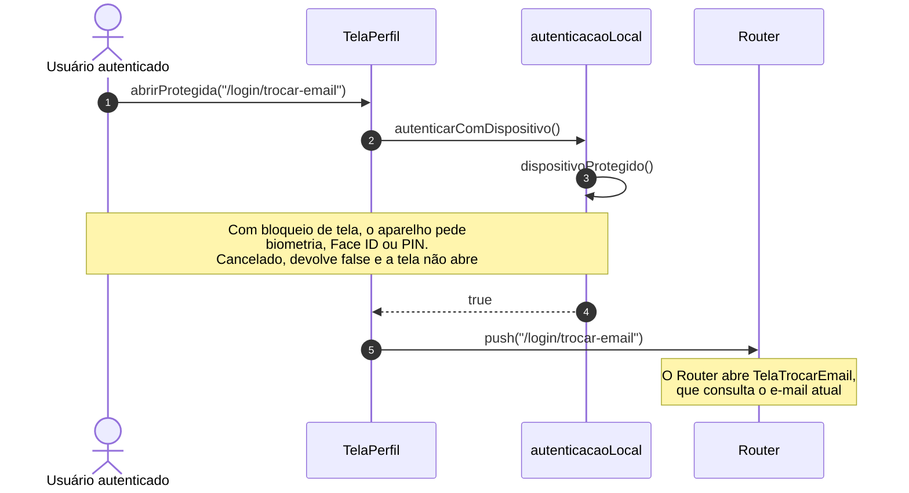
```mermaid
sequenceDiagram
    autonumber 1
    actor U as Usuário autenticado
    participant P as TelaPerfil
    participant L as autenticacaoLocal
    participant R as Router
    U->>P: abrirProtegida("/login/trocar-email")
    P->>L: autenticarComDispositivo()
    L->>L: dispositivoProtegido()
    Note over U,L: Com bloqueio de tela, o aparelho pede<br/>biometria, Face ID ou PIN.<br/>Cancelado, devolve false e a tela não abre
    L-->>P: true
    P->>R: push("/login/trocar-email")
    Note over R: O Router abre TelaTrocarEmail,<br/>que consulta o e-mail atual
```

Figura 5 — Diagrama de sequência SD-CFG-02 (Trocar e-mail), parte 1 de 4: abertura da tela. Fonte: equipe Conecta+.

### SD-CFG-02 — parte 2 de 4: tela "Trocar e-mail"

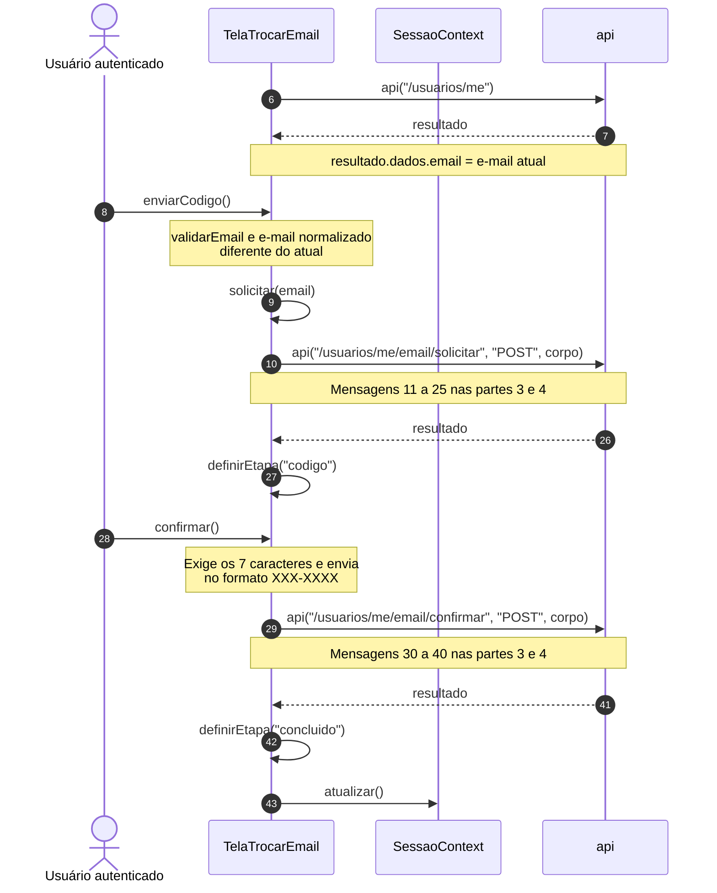
```mermaid
sequenceDiagram
    autonumber 6
    actor U as Usuário autenticado
    participant T as TelaTrocarEmail
    participant SC as SessaoContext
    participant A as api
    T->>A: api("/usuarios/me")
    A-->>T: resultado
    Note over T,A: resultado.dados.email = e-mail atual
    U->>T: enviarCodigo()
    Note over T: validarEmail e e-mail normalizado<br/>diferente do atual
    T->>T: solicitar(email)
    T->>A: api("/usuarios/me/email/solicitar", "POST", corpo)
    Note over T,A: Mensagens 11 a 25 nas partes 3 e 4
    autonumber 26
    A-->>T: resultado
    T->>T: definirEtapa("codigo")
    U->>T: confirmar()
    Note over T: Exige os 7 caracteres e envia<br/>no formato XXX-XXXX
    T->>A: api("/usuarios/me/email/confirmar", "POST", corpo)
    Note over T,A: Mensagens 30 a 40 nas partes 3 e 4
    autonumber 41
    A-->>T: resultado
    T->>T: definirEtapa("concluido")
    T->>SC: atualizar()
```

Figura 5 — Diagrama de sequência SD-CFG-02 (Trocar e-mail), parte 2 de 4: tela "Trocar e-mail". Fonte: equipe Conecta+.

### SD-CFG-02 — parte 3 de 4: controller e serviço

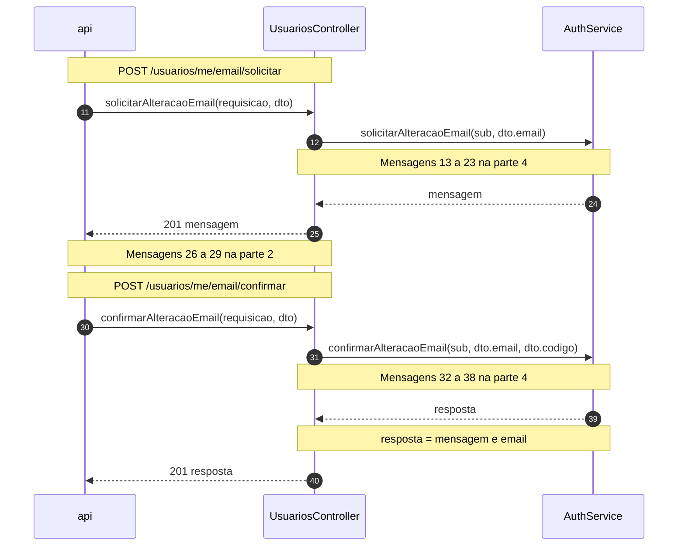
```mermaid
sequenceDiagram
    autonumber 11
    participant A as api
    participant C as UsuariosController
    participant S as AuthService
    Note over A,C: POST /usuarios/me/email/solicitar
    A->>C: solicitarAlteracaoEmail(requisicao, dto)
    C->>S: solicitarAlteracaoEmail(sub, dto.email)
    Note over C,S: Mensagens 13 a 23 na parte 4
    autonumber 24
    S-->>C: mensagem
    C-->>A: 201 mensagem
    Note over A,C: Mensagens 26 a 29 na parte 2
    autonumber 30
    Note over A,C: POST /usuarios/me/email/confirmar
    A->>C: confirmarAlteracaoEmail(requisicao, dto)
    C->>S: confirmarAlteracaoEmail(sub, dto.email, dto.codigo)
    Note over C,S: Mensagens 32 a 38 na parte 4
    autonumber 39
    S-->>C: resposta
    Note over C,S: resposta = mensagem e email
    C-->>A: 201 resposta
```

Figura 5 — Diagrama de sequência SD-CFG-02 (Trocar e-mail), parte 3 de 4: controller e serviço. Fonte: equipe Conecta+.

### SD-CFG-02 — parte 4 de 4: model, documento e envio do e-mail

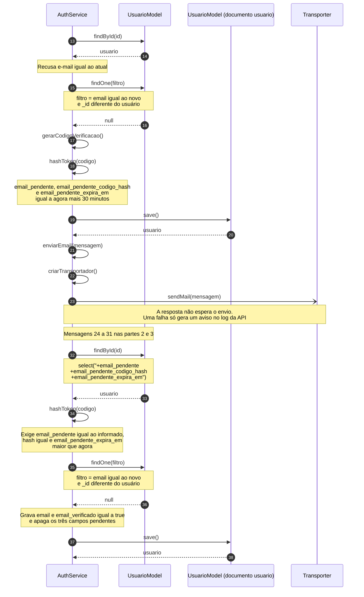
```mermaid
sequenceDiagram
    autonumber 13
    participant S as AuthService
    participant M as UsuarioModel
    participant D as UsuarioModel (documento usuario)
    participant E as Transporter
    S->>M: findById(id)
    M-->>S: usuario
    Note over S: Recusa e-mail igual ao atual
    S->>M: findOne(filtro)
    Note over S,M: filtro = email igual ao novo<br/>e _id diferente do usuário
    M-->>S: null
    S->>S: gerarCodigoVerificacao()
    S->>S: hashToken(codigo)
    Note over S: email_pendente, email_pendente_codigo_hash<br/>e email_pendente_expira_em<br/>igual a agora mais 30 minutos
    S->>D: save()
    D-->>S: usuario
    S->>S: enviarEmail(mensagem)
    S->>S: criarTransportador()
    S-)E: sendMail(mensagem)
    Note over S,E: A resposta não espera o envio.<br/>Uma falha só gera um aviso no log da API
    Note over S,M: Mensagens 24 a 31 nas partes 2 e 3
    autonumber 32
    S->>M: findById(id)
    Note over S,M: select("+email_pendente<br/>+email_pendente_codigo_hash<br/>+email_pendente_expira_em")
    M-->>S: usuario
    S->>S: hashToken(codigo)
    Note over S: Exige email_pendente igual ao informado,<br/>hash igual e email_pendente_expira_em<br/>maior que agora
    S->>M: findOne(filtro)
    Note over S,M: filtro = email igual ao novo<br/>e _id diferente do usuário
    M-->>S: null
    Note over S: Grava email e email_verificado igual a true<br/>e apaga os três campos pendentes
    S->>D: save()
    D-->>S: usuario
```

Figura 5 — Diagrama de sequência SD-CFG-02 (Trocar e-mail), parte 4 de 4: model, documento e envio do e-mail. Fonte: equipe Conecta+.

## SD-CFG-03 — Alterar senha

### SD-CFG-03 — parte 1 de 4: abertura da tela

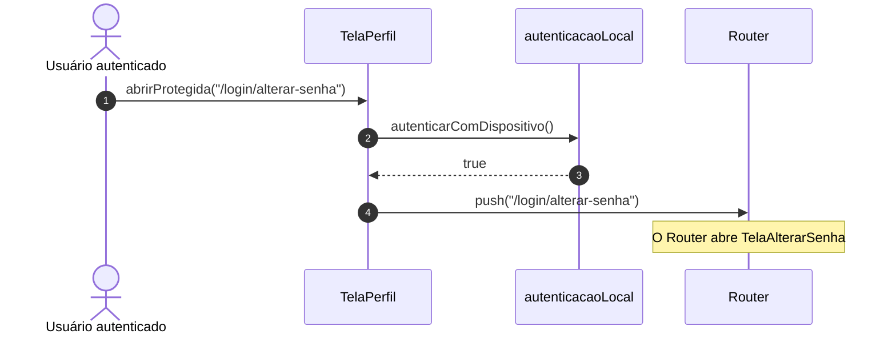
```mermaid
sequenceDiagram
    autonumber 1
    actor U as Usuário autenticado
    participant P as TelaPerfil
    participant L as autenticacaoLocal
    participant R as Router
    U->>P: abrirProtegida("/login/alterar-senha")
    P->>L: autenticarComDispositivo()
    L-->>P: true
    P->>R: push("/login/alterar-senha")
    Note over R: O Router abre TelaAlterarSenha
```

Figura 6 — Diagrama de sequência SD-CFG-03 (Alterar senha), parte 1 de 4: abertura da tela. Fonte: equipe Conecta+.

### SD-CFG-03 — parte 2 de 4: tela "Alterar senha" e saída da conta

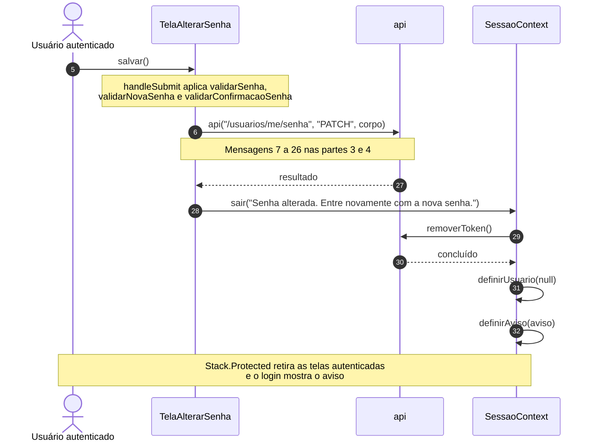
```mermaid
sequenceDiagram
    autonumber 5
    actor U as Usuário autenticado
    participant T as TelaAlterarSenha
    participant A as api
    participant SC as SessaoContext
    U->>T: salvar()
    Note over T: handleSubmit aplica validarSenha,<br/>validarNovaSenha e validarConfirmacaoSenha
    T->>A: api("/usuarios/me/senha", "PATCH", corpo)
    Note over T,A: Mensagens 7 a 26 nas partes 3 e 4
    autonumber 27
    A-->>T: resultado
    T->>SC: sair("Senha alterada. Entre novamente com a nova senha.")
    SC->>A: removerToken()
    A-->>SC: concluído
    SC->>SC: definirUsuario(null)
    SC->>SC: definirAviso(aviso)
    Note over U,SC: Stack.Protected retira as telas autenticadas<br/>e o login mostra o aviso
```

Figura 6 — Diagrama de sequência SD-CFG-03 (Alterar senha), parte 2 de 4: tela "Alterar senha" e saída da conta. Fonte: equipe Conecta+.

### SD-CFG-03 — parte 3 de 4: guard, controller e serviço

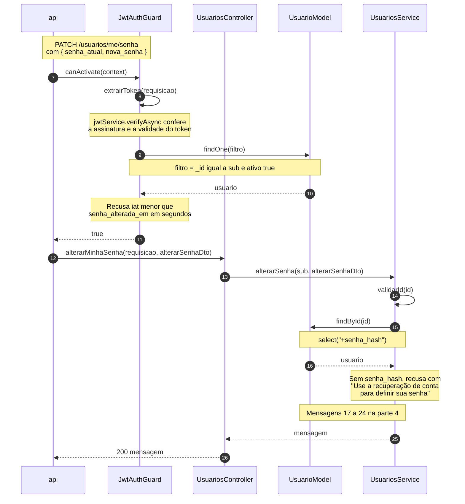
```mermaid
sequenceDiagram
    autonumber 7
    participant A as api
    participant G as JwtAuthGuard
    participant C as UsuariosController
    participant M as UsuarioModel
    participant S as UsuariosService
    Note over A,G: PATCH /usuarios/me/senha<br/>com { senha_atual, nova_senha }
    A->>G: canActivate(context)
    G->>G: extrairToken(requisicao)
    Note over G: jwtService.verifyAsync confere<br/>a assinatura e a validade do token
    G->>M: findOne(filtro)
    Note over G,M: filtro = _id igual a sub e ativo true
    M-->>G: usuario
    Note over G: Recusa iat menor que<br/>senha_alterada_em em segundos
    G-->>A: true
    A->>C: alterarMinhaSenha(requisicao, alterarSenhaDto)
    C->>S: alterarSenha(sub, alterarSenhaDto)
    S->>S: validarId(id)
    S->>M: findById(id)
    Note over S,M: select("+senha_hash")
    M-->>S: usuario
    Note over S: Sem senha_hash, recusa com<br/>"Use a recuperação de conta<br/>para definir sua senha"
    Note over M,S: Mensagens 17 a 24 na parte 4
    autonumber 25
    S-->>C: mensagem
    C-->>A: 200 mensagem
```

Figura 6 — Diagrama de sequência SD-CFG-03 (Alterar senha), parte 3 de 4: guard, controller e serviço. Fonte: equipe Conecta+.

### SD-CFG-03 — parte 4 de 4: conferência e gravação da senha

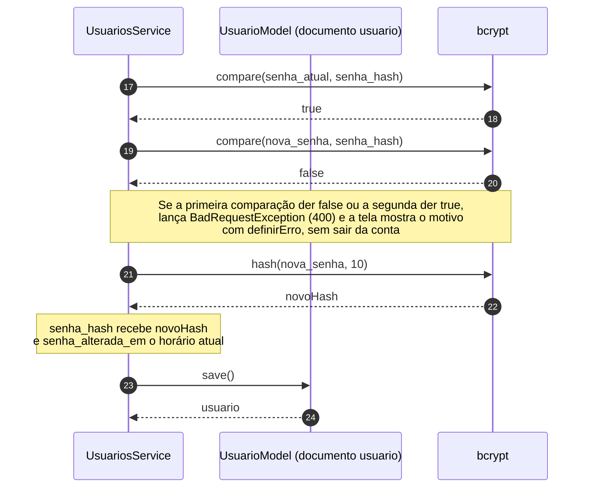
```mermaid
sequenceDiagram
    autonumber 17
    participant S as UsuariosService
    participant D as UsuarioModel (documento usuario)
    participant B as bcrypt
    S->>B: compare(senha_atual, senha_hash)
    B-->>S: true
    S->>B: compare(nova_senha, senha_hash)
    B-->>S: false
    Note over S,B: Se a primeira comparação der false ou a segunda der true,<br/>lança BadRequestException (400) e a tela mostra o motivo<br/>com definirErro, sem sair da conta
    S->>B: hash(nova_senha, 10)
    B-->>S: novoHash
    Note over S: senha_hash recebe novoHash<br/>e senha_alterada_em o horário atual
    S->>D: save()
    D-->>S: usuario
```

Figura 6 — Diagrama de sequência SD-CFG-03 (Alterar senha), parte 4 de 4: conferência e gravação da senha. Fonte: equipe Conecta+.

Sessão aberta antes da troca, em outro aparelho:

### SD-CFG-03 em outro aparelho — parte 1 de 2: sessão no aplicativo

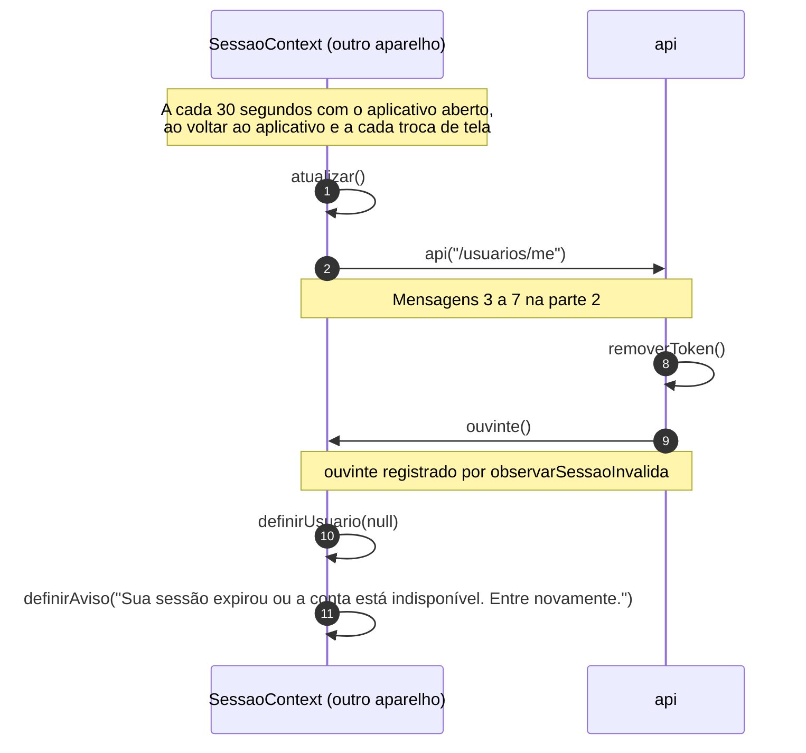
```mermaid
sequenceDiagram
    autonumber 1
    participant SC as SessaoContext (outro aparelho)
    participant A as api
    Note over SC: A cada 30 segundos com o aplicativo aberto,<br/>ao voltar ao aplicativo e a cada troca de tela
    SC->>SC: atualizar()
    SC->>A: api("/usuarios/me")
    Note over SC,A: Mensagens 3 a 7 na parte 2
    autonumber 8
    A->>A: removerToken()
    A->>SC: ouvinte()
    Note over A,SC: ouvinte registrado por observarSessaoInvalida
    SC->>SC: definirUsuario(null)
    SC->>SC: definirAviso("Sua sessão expirou ou a conta está indisponível. Entre novamente.")
```

Figura 7 — Diagrama de sequência SD-CFG-03 (Alterar senha) em outro aparelho, parte 1 de 2: sessão no aplicativo. Fonte: equipe Conecta+.

### SD-CFG-03 em outro aparelho — parte 2 de 2: guard na API

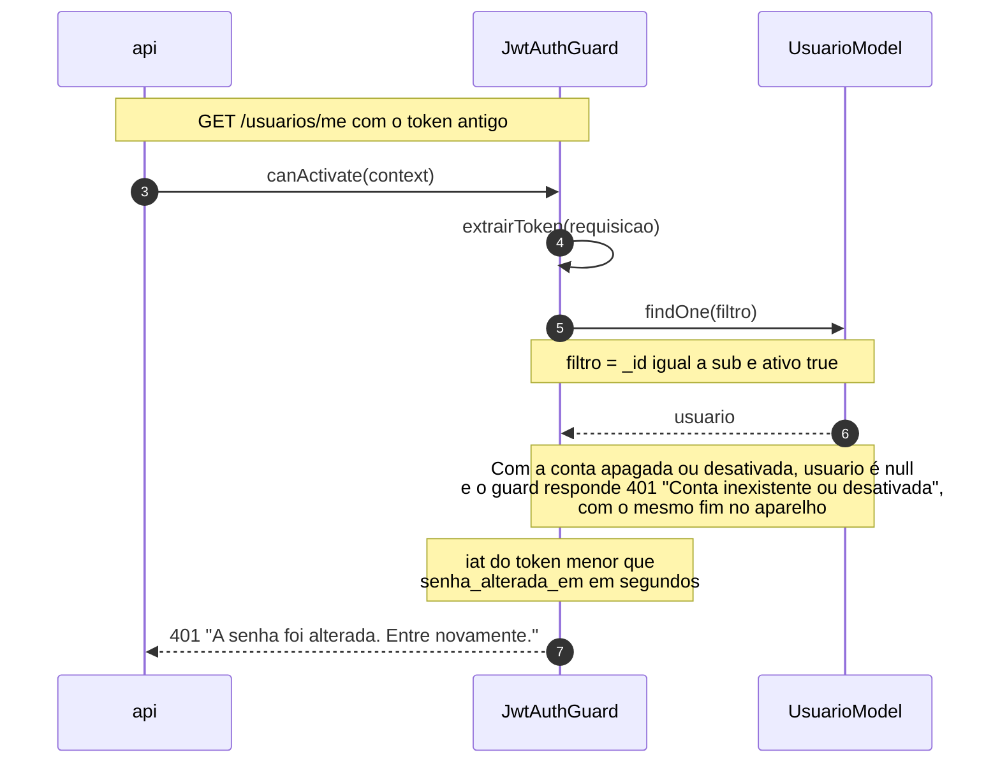
```mermaid
sequenceDiagram
    autonumber 3
    participant A as api
    participant G as JwtAuthGuard
    participant M as UsuarioModel
    Note over A,G: GET /usuarios/me com o token antigo
    A->>G: canActivate(context)
    G->>G: extrairToken(requisicao)
    G->>M: findOne(filtro)
    Note over G,M: filtro = _id igual a sub e ativo true
    M-->>G: usuario
    Note over G,M: Com a conta apagada ou desativada, usuario é null<br/>e o guard responde 401 "Conta inexistente ou desativada",<br/>com o mesmo fim no aparelho
    Note over G: iat do token menor que<br/>senha_alterada_em em segundos
    G-->>A: 401 "A senha foi alterada. Entre novamente."
```

Figura 7 — Diagrama de sequência SD-CFG-03 (Alterar senha) em outro aparelho, parte 2 de 2: guard na API. Fonte: equipe Conecta+.

## SD-CFG-04 — Recuperar conta

### SD-CFG-04 — parte 1 de 5: tela "Recuperar conta"

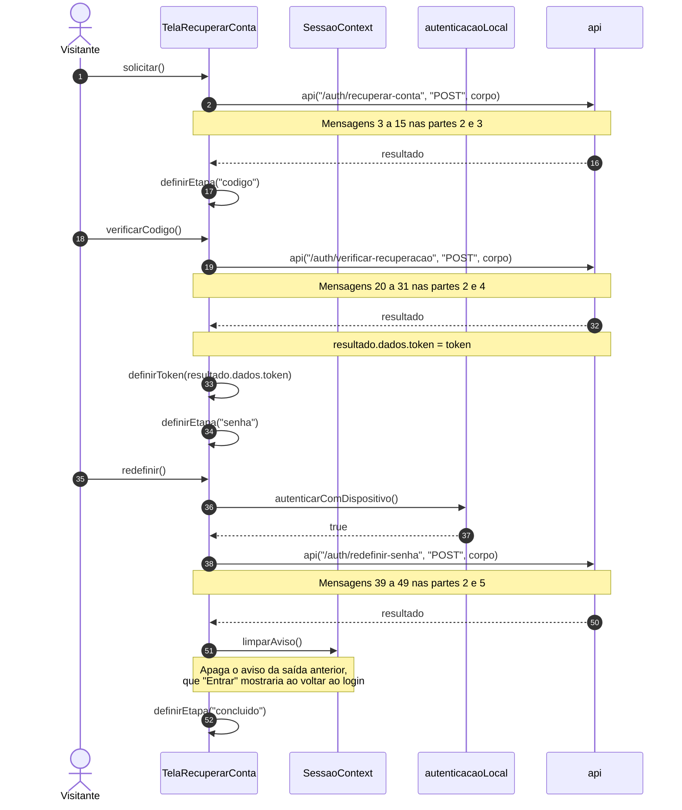
```mermaid
sequenceDiagram
    autonumber 1
    actor V as Visitante
    participant T as TelaRecuperarConta
    participant SC as SessaoContext
    participant L as autenticacaoLocal
    participant A as api
    V->>T: solicitar()
    T->>A: api("/auth/recuperar-conta", "POST", corpo)
    Note over T,A: Mensagens 3 a 15 nas partes 2 e 3
    autonumber 16
    A-->>T: resultado
    T->>T: definirEtapa("codigo")
    V->>T: verificarCodigo()
    T->>A: api("/auth/verificar-recuperacao", "POST", corpo)
    Note over T,A: Mensagens 20 a 31 nas partes 2 e 4
    autonumber 32
    A-->>T: resultado
    Note over T,A: resultado.dados.token = token
    T->>T: definirToken(resultado.dados.token)
    T->>T: definirEtapa("senha")
    V->>T: redefinir()
    T->>L: autenticarComDispositivo()
    L-->>T: true
    T->>A: api("/auth/redefinir-senha", "POST", corpo)
    Note over T,A: Mensagens 39 a 49 nas partes 2 e 5
    autonumber 50
    A-->>T: resultado
    T->>SC: limparAviso()
    Note over T,SC: Apaga o aviso da saída anterior,<br/>que "Entrar" mostraria ao voltar ao login
    T->>T: definirEtapa("concluido")
```

Figura 8 — Diagrama de sequência SD-CFG-04 (Recuperar conta), parte 1 de 5: tela "Recuperar conta". Fonte: equipe Conecta+.

### SD-CFG-04 — parte 2 de 5: controller e serviço

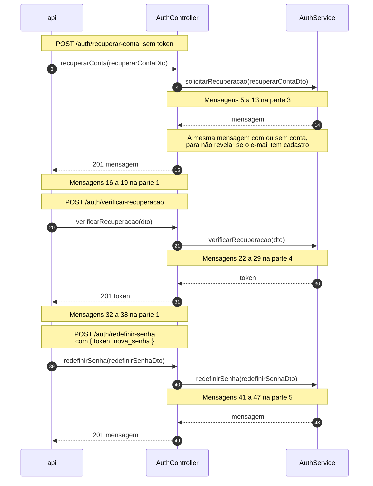
```mermaid
sequenceDiagram
    autonumber 3
    participant A as api
    participant C as AuthController
    participant S as AuthService
    Note over A,C: POST /auth/recuperar-conta, sem token
    A->>C: recuperarConta(recuperarContaDto)
    C->>S: solicitarRecuperacao(recuperarContaDto)
    Note over C,S: Mensagens 5 a 13 na parte 3
    autonumber 14
    S-->>C: mensagem
    Note over C,S: A mesma mensagem com ou sem conta,<br/>para não revelar se o e-mail tem cadastro
    C-->>A: 201 mensagem
    Note over A,C: Mensagens 16 a 19 na parte 1
    autonumber 20
    Note over A,C: POST /auth/verificar-recuperacao
    A->>C: verificarRecuperacao(dto)
    C->>S: verificarRecuperacao(dto)
    Note over C,S: Mensagens 22 a 29 na parte 4
    autonumber 30
    S-->>C: token
    C-->>A: 201 token
    Note over A,C: Mensagens 32 a 38 na parte 1
    autonumber 39
    Note over A,C: POST /auth/redefinir-senha<br/>com { token, nova_senha }
    A->>C: redefinirSenha(redefinirSenhaDto)
    C->>S: redefinirSenha(redefinirSenhaDto)
    Note over C,S: Mensagens 41 a 47 na parte 5
    autonumber 48
    S-->>C: mensagem
    C-->>A: 201 mensagem
```

Figura 8 — Diagrama de sequência SD-CFG-04 (Recuperar conta), parte 2 de 5: controller e serviço. Fonte: equipe Conecta+.

### SD-CFG-04 — parte 3 de 5: pedido do código

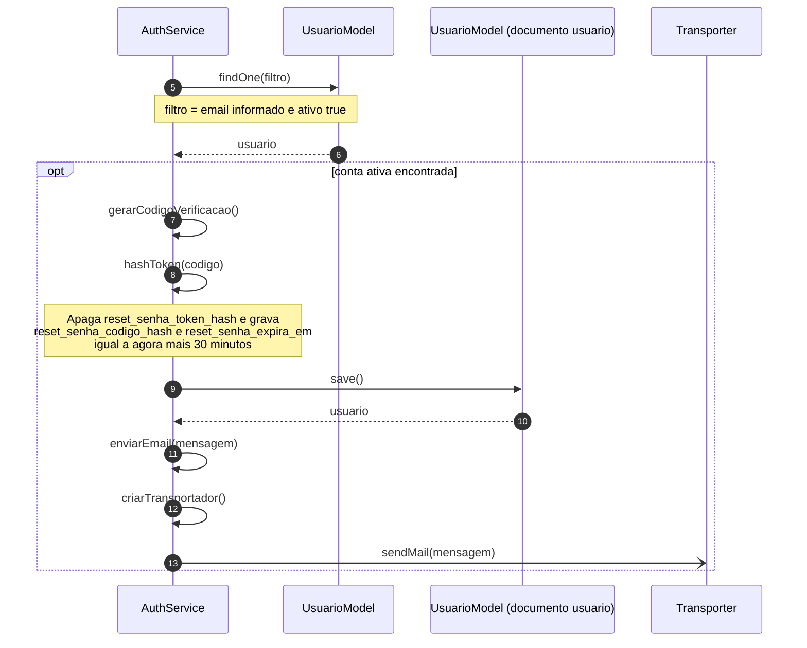
```mermaid
sequenceDiagram
    autonumber 5
    participant S as AuthService
    participant M as UsuarioModel
    participant D as UsuarioModel (documento usuario)
    participant E as Transporter
    S->>M: findOne(filtro)
    Note over S,M: filtro = email informado e ativo true
    M-->>S: usuario
    opt conta ativa encontrada
        S->>S: gerarCodigoVerificacao()
        S->>S: hashToken(codigo)
        Note over S: Apaga reset_senha_token_hash e grava<br/>reset_senha_codigo_hash e reset_senha_expira_em<br/>igual a agora mais 30 minutos
        S->>D: save()
        D-->>S: usuario
        S->>S: enviarEmail(mensagem)
        S->>S: criarTransportador()
        S-)E: sendMail(mensagem)
    end
```

Figura 8 — Diagrama de sequência SD-CFG-04 (Recuperar conta), parte 3 de 5: pedido do código. Fonte: equipe Conecta+.

### SD-CFG-04 — parte 4 de 5: conferência do código

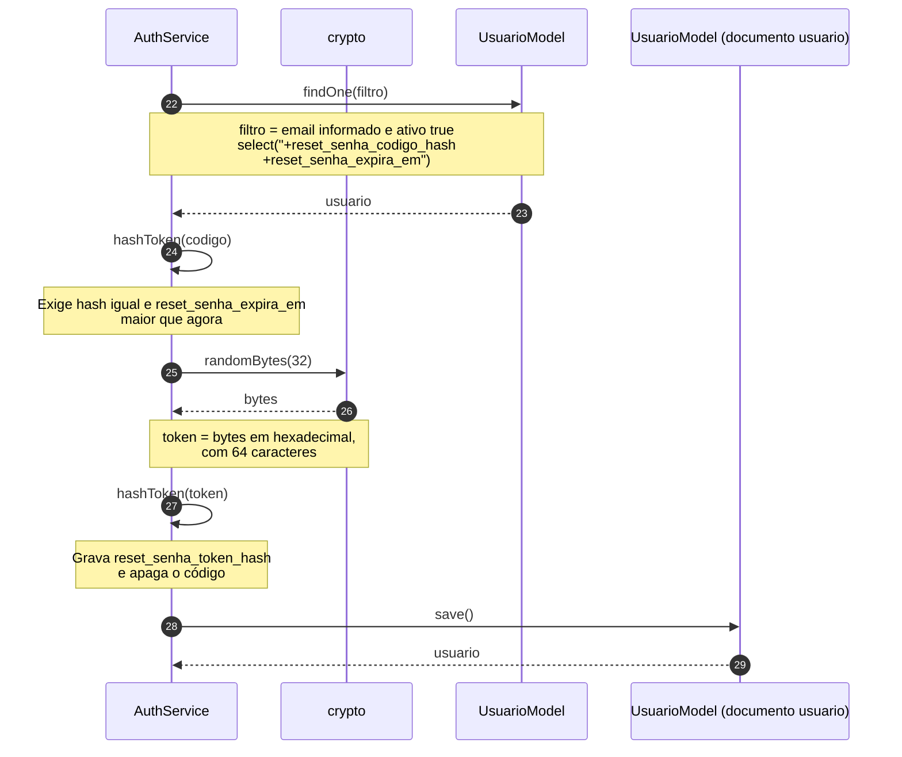
```mermaid
sequenceDiagram
    autonumber 22
    participant S as AuthService
    participant CR as crypto
    participant M as UsuarioModel
    participant D as UsuarioModel (documento usuario)
    S->>M: findOne(filtro)
    Note over S,M: filtro = email informado e ativo true<br/>select("+reset_senha_codigo_hash<br/>+reset_senha_expira_em")
    M-->>S: usuario
    S->>S: hashToken(codigo)
    Note over S: Exige hash igual e reset_senha_expira_em<br/>maior que agora
    S->>CR: randomBytes(32)
    CR-->>S: bytes
    Note over S,CR: token = bytes em hexadecimal,<br/>com 64 caracteres
    S->>S: hashToken(token)
    Note over S: Grava reset_senha_token_hash<br/>e apaga o código
    S->>D: save()
    D-->>S: usuario
```

Figura 8 — Diagrama de sequência SD-CFG-04 (Recuperar conta), parte 4 de 5: conferência do código. Fonte: equipe Conecta+.

### SD-CFG-04 — parte 5 de 5: nova senha

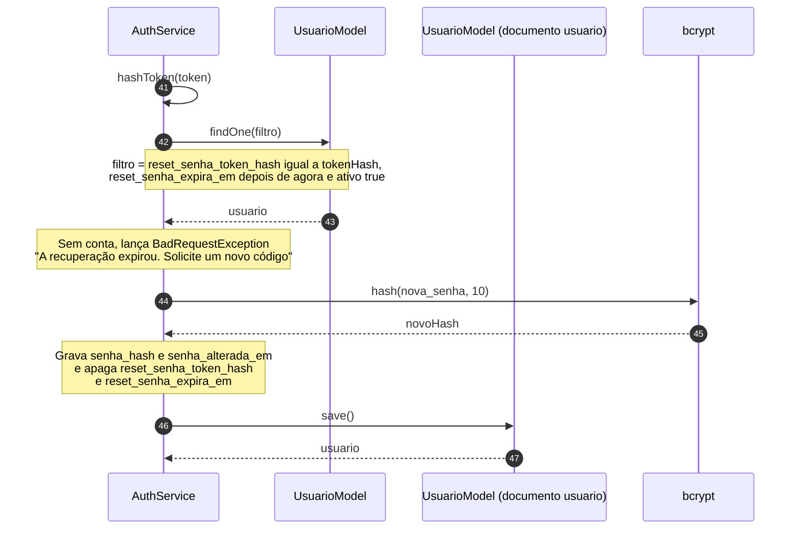
```mermaid
sequenceDiagram
    autonumber 41
    participant S as AuthService
    participant M as UsuarioModel
    participant D as UsuarioModel (documento usuario)
    participant B as bcrypt
    S->>S: hashToken(token)
    S->>M: findOne(filtro)
    Note over S,M: filtro = reset_senha_token_hash igual a tokenHash,<br/>reset_senha_expira_em depois de agora e ativo true
    M-->>S: usuario
    Note over S: Sem conta, lança BadRequestException<br/>"A recuperação expirou. Solicite um novo código"
    S->>B: hash(nova_senha, 10)
    B-->>S: novoHash
    Note over S: Grava senha_hash e senha_alterada_em<br/>e apaga reset_senha_token_hash<br/>e reset_senha_expira_em
    S->>D: save()
    D-->>S: usuario
```

Figura 8 — Diagrama de sequência SD-CFG-04 (Recuperar conta), parte 5 de 5: nova senha. Fonte: equipe Conecta+.

## SD-CFG-05 — Escolher tema

### SD-CFG-05 — parte 1 de 4: tela "Perfil"

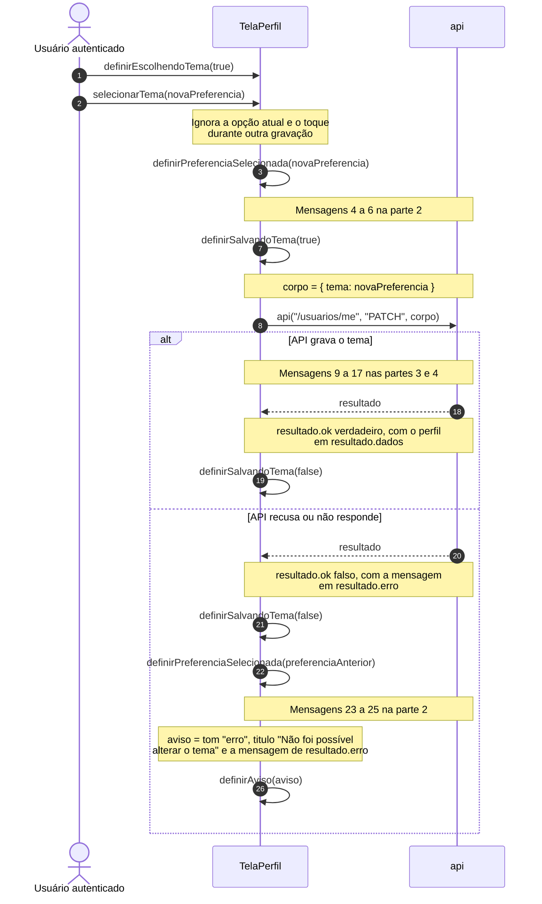
```mermaid
sequenceDiagram
    autonumber 1
    actor U as Usuário autenticado
    participant T as TelaPerfil
    participant A as api
    U->>T: definirEscolhendoTema(true)
    U->>T: selecionarTema(novaPreferencia)
    Note over T: Ignora a opção atual e o toque<br/>durante outra gravação
    T->>T: definirPreferenciaSelecionada(novaPreferencia)
    Note over T,A: Mensagens 4 a 6 na parte 2
    autonumber 7
    T->>T: definirSalvandoTema(true)
    Note over T,A: corpo = { tema: novaPreferencia }
    T->>A: api("/usuarios/me", "PATCH", corpo)
    alt API grava o tema
        Note over T,A: Mensagens 9 a 17 nas partes 3 e 4
        autonumber 18
        A-->>T: resultado
        Note over T,A: resultado.ok verdadeiro, com o perfil<br/>em resultado.dados
        T->>T: definirSalvandoTema(false)
    else API recusa ou não responde
        A-->>T: resultado
        Note over T,A: resultado.ok falso, com a mensagem<br/>em resultado.erro
        T->>T: definirSalvandoTema(false)
        T->>T: definirPreferenciaSelecionada(preferenciaAnterior)
        Note over T,A: Mensagens 23 a 25 na parte 2
        autonumber 26
        Note over T: aviso = tom "erro", titulo "Não foi possível<br/>alterar o tema" e a mensagem de resultado.erro
        T->>T: definirAviso(aviso)
    end
```

Figura 9 — Diagrama de sequência SD-CFG-05 (Escolher tema), parte 1 de 4: tela "Perfil". Fonte: equipe Conecta+.

### SD-CFG-05 — parte 2 de 4: contexto do tema

```mermaid
sequenceDiagram
    autonumber 4
    participant T as TelaPerfil
    participant TC as TemaContext
    participant SS as SecureStore
    T->>TC: definirPreferencia(novaPreferencia)
    TC->>TC: gravarPreferencia(novaPreferencia)
    TC->>SS: setItemAsync("conecta_mais_tema", novaPreferencia)
    Note over TC,SS: Na web, window.localStorage.setItem<br/>com a mesma chave
    Note over T,TC: Mensagens 7 a 22 nas partes 1, 3 e 4
    alt API recusa ou não responde
        autonumber 23
        T->>TC: definirPreferencia(preferenciaAnterior)
        TC->>TC: gravarPreferencia(preferenciaAnterior)
        TC->>SS: setItemAsync("conecta_mais_tema", preferenciaAnterior)
    end
```

Figura 9 — Diagrama de sequência SD-CFG-05 (Escolher tema), parte 2 de 4: contexto do tema. Fonte: equipe Conecta+.

### SD-CFG-05 — parte 3 de 4: controller e serviço

```mermaid
sequenceDiagram
    autonumber 9
    participant A as api
    participant C as UsuariosController
    participant S as UsuariosService
    alt API grava o tema
        Note over A,C: PATCH /usuarios/me
        A->>C: atualizarMeuPerfil(requisicao, atualizarPerfilDto)
        C->>S: atualizarPerfil(sub, atualizarPerfilDto)
        S->>S: validarId(id)
        Note over C,S: Mensagens 12 a 15 na parte 4
        autonumber 16
        S-->>C: usuario
        C-->>A: 200 usuario
    end
```

Figura 9 — Diagrama de sequência SD-CFG-05 (Escolher tema), parte 3 de 4: controller e serviço. Fonte: equipe Conecta+.

### SD-CFG-05 — parte 4 de 4: model e documento

```mermaid
sequenceDiagram
    autonumber 12
    participant S as UsuariosService
    participant M as UsuarioModel
    participant D as UsuarioModel (documento usuario)
    alt API grava o tema
        S->>M: findById(id)
        M-->>S: usuario
        S->>D: save()
        D-->>S: usuario
    end
```

Figura 9 — Diagrama de sequência SD-CFG-05 (Escolher tema), parte 4 de 4: model e documento. Fonte: equipe Conecta+.

## SD-CFG-06 — Encerrar sessão

### SD-CFG-06 — parte 1 de 2: tela "Perfil" e sessão

```mermaid
sequenceDiagram
    autonumber 1
    actor U as Usuário autenticado
    participant T as TelaPerfil
    participant SC as SessaoContext
    U->>T: definirConfirmandoSaida(true)
    Note over U,T: Diálogo "Deseja realmente sair da sua conta?"
    U->>T: sair()
    T->>SC: sair()
    Note over SC: Soma 1 a geracao, para descartar<br/>respostas de consultas antigas
    Note over T,SC: Mensagens 4 a 7 na parte 2
    autonumber 8
    SC->>SC: definirUsuario(null)
    SC->>SC: definirAviso(aviso)
    SC-->>T: concluído
    T->>T: definirConfirmandoSaida(false)
    Note over U,SC: Stack.Protected retira as telas autenticadas<br/>e o aplicativo mostra "Entrar".<br/>A API não é chamada e o token continua<br/>válido no servidor até expirar
    Note over SC: o Entrar com senha do desbloqueio<br/>da sessão salva chama o mesmo sair,<br/>sem diálogo e sem aviso, como no SD-USR-04
```

Figura 10 — Diagrama de sequência SD-CFG-06 (Encerrar sessão), parte 1 de 2: tela "Perfil" e sessão. Fonte: equipe Conecta+.

### SD-CFG-06 — parte 2 de 2: remoção do token

```mermaid
sequenceDiagram
    autonumber 4
    participant SC as SessaoContext
    participant A as api
    participant SS as SecureStore
    SC->>A: removerToken()
    A->>SS: deleteItemAsync("conecta_mais_token")
    Note over A,SS: Na web, localStorage.removeItem<br/>com a mesma chave
    SS-->>A: concluído
    A-->>SC: concluído
```

Figura 10 — Diagrama de sequência SD-CFG-06 (Encerrar sessão), parte 2 de 2: remoção do token. Fonte: equipe Conecta+.

## Rastreabilidade

SD-CFG-01 a SD-CFG-06 correspondem, na mesma ordem, a UC-CFG-01 a UC-CFG-06 e a RF-CFG-01 a RF-CFG-06.
