# Diagramas de sequência — Informações do sistema

> Padrão da disciplina · Módulo SIS · Revisado em 27/11/2026

## Resumo

Há um diagrama para cada requisito de [Requisitos funcionais](2%20-%20requisitos-funcionais-informacao-sistemas.md), com o mesmo número. As linhas de vida são classes e módulos que existem no código e estão no [Diagrama de classes](3%20-%20diagrama-classes-informacao-sistemas.md): o item `ItemMenu` da tela inicial, a `TelaSistema`, os módulos `api`, `ToastContext` e `versao`, os guards, o `SistemaController`, o `SistemaService`, os models do Mongoose (`UsuarioModel`, `OrganizacaoModel`, `ComissaoModel` e `ReuniaoModel`) e as bibliotecas chamadas diretamente: o `Router` do `expo-router`, o módulo `os` do Node.js, o `bcrypt` e, do driver do MongoDB, o `Db` da conexão (`conexao.db`) e a `Collection` que ele devolve. Toda mensagem é a chamada de um método existente, com seus parâmetros, e as mensagens são numeradas na ordem em que acontecem. Regras que não são métodos, como a comparação do tipo da conta, e as rotas HTTP aparecem em notas. Os retornos são identificadores, com os nomes usados no código; uma nota diz o que cada um traz quando isso não é evidente.

O SD-SIS-01 mostra as três verificações que o NestJS executa antes do controller (`ApiKeyGuard`, `JwtAuthGuard` e `AdminSistemaGuard`), cada uma pelo seu método `canActivate`. Nos outros diagramas, essas verificações acontecem da mesma forma e estão resumidas numa nota. A função `carregar` da `TelaSistema` pede ao mesmo tempo as rotas de SD-SIS-05, SD-SIS-01 e SD-SIS-02 e só atualiza os cartões quando as três dão certo; cada diagrama mostra uma dessas rotas. Os blocos `par` marcam chamadas feitas ao mesmo tempo com `Promise.all`.

Para caber na largura da página, cada diagrama está dividido em partes de até cinco linhas de vida, separadas por camada (aplicativo, API e dados); a linha de vida da fronteira, em geral o módulo `api` ou o `SistemaService`, aparece nas duas partes vizinhas. A numeração das mensagens continua de uma parte para a outra, e uma nota indica as mensagens que estão em outra parte. Os blocos `alt` e `par` que atravessam partes se repetem em cada uma delas, com a condição do ramo que ela mostra.

## SD-SIS-01 — Consultar status do servidor

### SD-SIS-01 — parte 1 de 4: no aplicativo

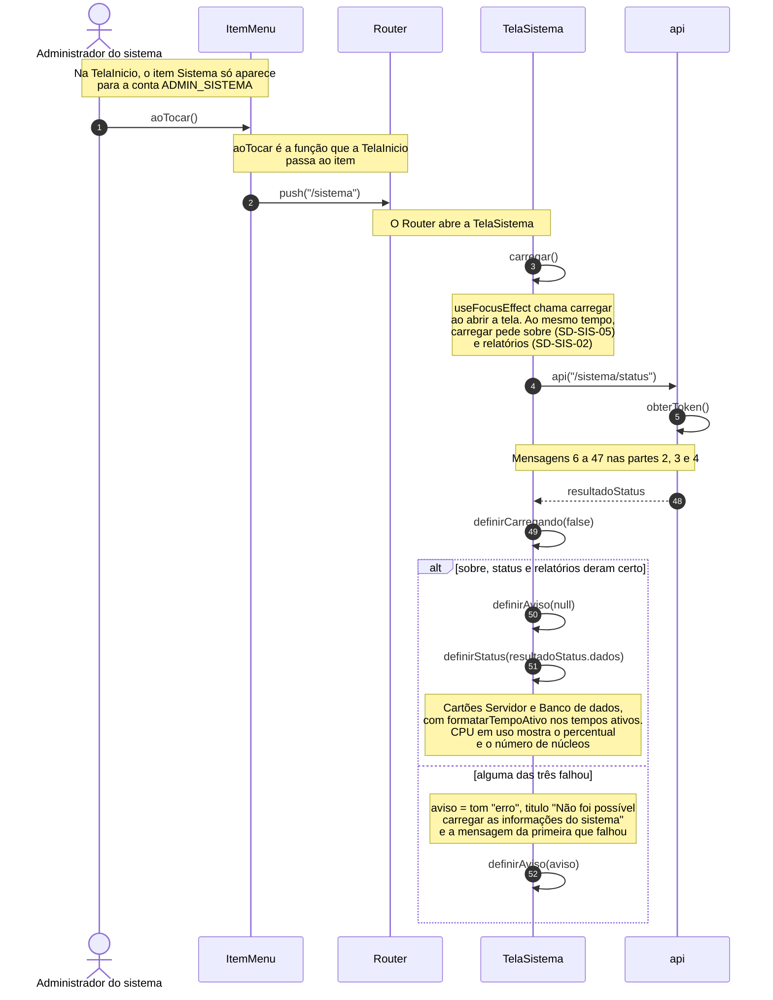
```mermaid
sequenceDiagram
    autonumber 1
    actor U as Administrador do sistema
    participant IM as ItemMenu
    participant R as Router
    participant T as TelaSistema
    participant A as api
    Note over U,IM: Na TelaInicio, o item Sistema só aparece<br/>para a conta ADMIN_SISTEMA
    U->>IM: aoTocar()
    Note over IM,R: aoTocar é a função que a TelaInicio<br/>passa ao item
    IM->>R: push("/sistema")
    Note over R,T: O Router abre a TelaSistema
    T->>T: carregar()
    Note over T: useFocusEffect chama carregar<br/>ao abrir a tela. Ao mesmo tempo,<br/>carregar pede sobre (SD-SIS-05)<br/>e relatórios (SD-SIS-02)
    T->>A: api("/sistema/status")
    A->>A: obterToken()
    Note over T,A: Mensagens 6 a 47 nas partes 2, 3 e 4
    autonumber 48
    A-->>T: resultadoStatus
    T->>T: definirCarregando(false)
    alt sobre, status e relatórios deram certo
        T->>T: definirAviso(null)
        T->>T: definirStatus(resultadoStatus.dados)
        Note over T: Cartões Servidor e Banco de dados,<br/>com formatarTempoAtivo nos tempos ativos.<br/>CPU em uso mostra o percentual<br/>e o número de núcleos
    else alguma das três falhou
        Note over T: aviso = tom "erro", titulo "Não foi possível<br/>carregar as informações do sistema"<br/>e a mensagem da primeira que falhou
        T->>T: definirAviso(aviso)
    end
```

Figura 4 — Diagrama de sequência SD-SIS-01 (Consultar status do servidor), parte 1 de 4: no aplicativo. Fonte: equipe Conecta+.

### SD-SIS-01 — parte 2 de 4: verificações antes do controller

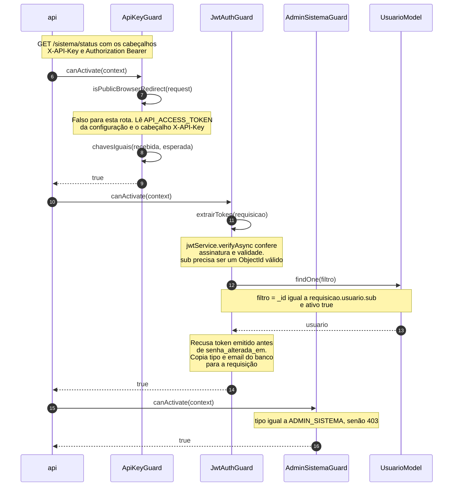
```mermaid
sequenceDiagram
    autonumber 6
    participant A as api
    participant K as ApiKeyGuard
    participant J as JwtAuthGuard
    participant G as AdminSistemaGuard
    participant MU as UsuarioModel
    Note over A,K: GET /sistema/status com os cabeçalhos<br/>X-API-Key e Authorization Bearer
    A->>K: canActivate(context)
    K->>K: isPublicBrowserRedirect(request)
    Note over K: Falso para esta rota. Lê API_ACCESS_TOKEN<br/>da configuração e o cabeçalho X-API-Key
    K->>K: chavesIguais(recebida, esperada)
    K-->>A: true
    A->>J: canActivate(context)
    J->>J: extrairToken(requisicao)
    Note over J: jwtService.verifyAsync confere<br/>assinatura e validade.<br/>sub precisa ser um ObjectId válido
    J->>MU: findOne(filtro)
    Note over J,MU: filtro = _id igual a requisicao.usuario.sub<br/>e ativo true
    MU-->>J: usuario
    Note over J: Recusa token emitido antes<br/>de senha_alterada_em.<br/>Copia tipo e email do banco<br/>para a requisição
    J-->>A: true
    A->>G: canActivate(context)
    Note over G: tipo igual a ADMIN_SISTEMA, senão 403
    G-->>A: true
```

Figura 4 — Diagrama de sequência SD-SIS-01 (Consultar status do servidor), parte 2 de 4: verificações antes do controller. Fonte: equipe Conecta+.

### SD-SIS-01 — parte 3 de 4: controller, serviço, módulo `os` e banco

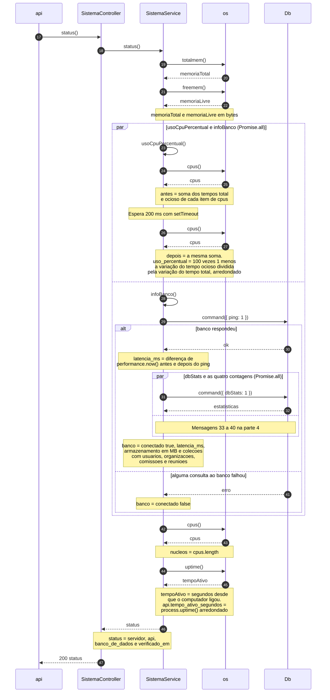
```mermaid
sequenceDiagram
    autonumber 17
    participant A as api
    participant C as SistemaController
    participant S as SistemaService
    participant O as os
    participant D as Db
    A->>C: status()
    C->>S: status()
    S->>O: totalmem()
    O-->>S: memoriaTotal
    S->>O: freemem()
    O-->>S: memoriaLivre
    Note over S,O: memoriaTotal e memoriaLivre em bytes
    par usoCpuPercentual e infoBanco (Promise.all)
        S->>S: usoCpuPercentual()
        S->>O: cpus()
        O-->>S: cpus
        Note over S,O: antes = soma dos tempos total<br/>e ocioso de cada item de cpus
        Note over S: Espera 200 ms com setTimeout
        S->>O: cpus()
        O-->>S: cpus
        Note over S,O: depois = a mesma soma.<br/>uso_percentual = 100 vezes 1 menos<br/>a variação do tempo ocioso dividida<br/>pela variação do tempo total, arredondado
    and
        S->>S: infoBanco()
        S->>D: command({ ping: 1 })
        alt banco respondeu
            D-->>S: ok
            Note over S: latencia_ms = diferença de<br/>performance.now() antes e depois do ping
            par dbStats e as quatro contagens (Promise.all)
                S->>D: command({ dbStats: 1 })
                D-->>S: estatisticas
            and
                Note over S,D: Mensagens 33 a 40 na parte 4
            end
            Note over S: banco = conectado true, latencia_ms,<br/>armazenamento em MB e colecoes<br/>com usuarios, organizacoes,<br/>comissoes e reunioes
        else alguma consulta ao banco falhou
            autonumber 41
            D-->>S: erro
            Note over S: banco = conectado false
        end
    end
    S->>O: cpus()
    O-->>S: cpus
    Note over S,O: nucleos = cpus.length
    S->>O: uptime()
    O-->>S: tempoAtivo
    Note over S,O: tempoAtivo = segundos desde<br/>que o computador ligou.<br/>api.tempo_ativo_segundos =<br/>process.uptime() arredondado
    S-->>C: status
    Note over C,S: status = servidor, api,<br/>banco_de_dados e verificado_em
    C-->>A: 200 status
```

Figura 4 — Diagrama de sequência SD-SIS-01 (Consultar status do servidor), parte 3 de 4: controller, serviço, módulo `os` e banco. Fonte: equipe Conecta+.

### SD-SIS-01 — parte 4 de 4: contagens nos models

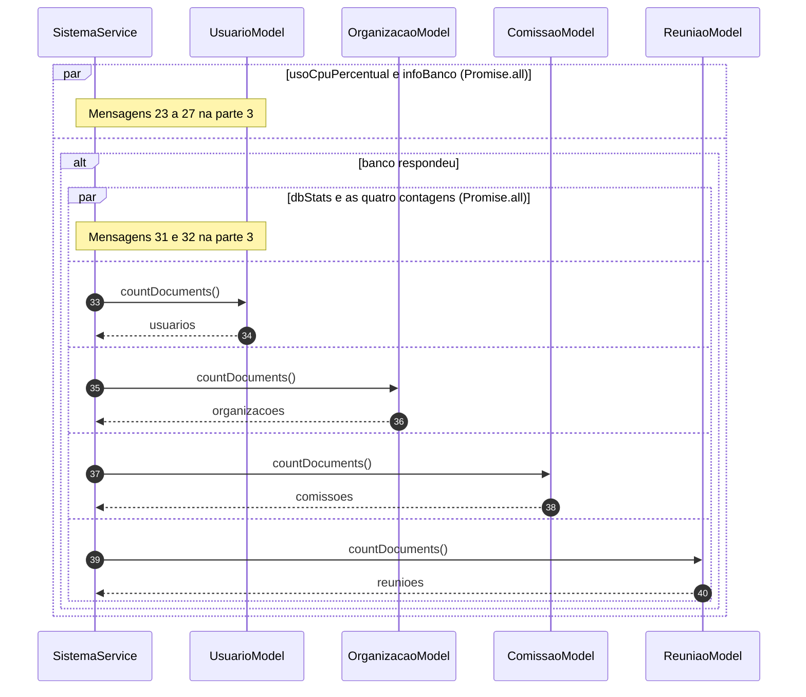
```mermaid
sequenceDiagram
    autonumber 33
    participant S as SistemaService
    participant MU as UsuarioModel
    participant MO as OrganizacaoModel
    participant MC as ComissaoModel
    participant MR as ReuniaoModel
    par usoCpuPercentual e infoBanco (Promise.all)
        Note over S,MU: Mensagens 23 a 27 na parte 3
    and
        alt banco respondeu
            par dbStats e as quatro contagens (Promise.all)
                Note over S,MU: Mensagens 31 e 32 na parte 3
            and
                S->>MU: countDocuments()
                MU-->>S: usuarios
            and
                S->>MO: countDocuments()
                MO-->>S: organizacoes
            and
                S->>MC: countDocuments()
                MC-->>S: comissoes
            and
                S->>MR: countDocuments()
                MR-->>S: reunioes
            end
        end
    end
```

Figura 4 — Diagrama de sequência SD-SIS-01 (Consultar status do servidor), parte 4 de 4: contagens nos models. Fonte: equipe Conecta+.

Se uma das verificações recusa a requisição, o controller não é chamado e o guard devolve 401, 403 ou 503; com o MongoDB fora do ar, a busca do `JwtAuthGuard` falha e a API responde 500. Nos dois casos `carregar` mostra a faixa vermelha (ver RF-SIS-01).

## SD-SIS-02 — Consultar relatórios

### SD-SIS-02 — parte 1 de 3: no aplicativo e na API

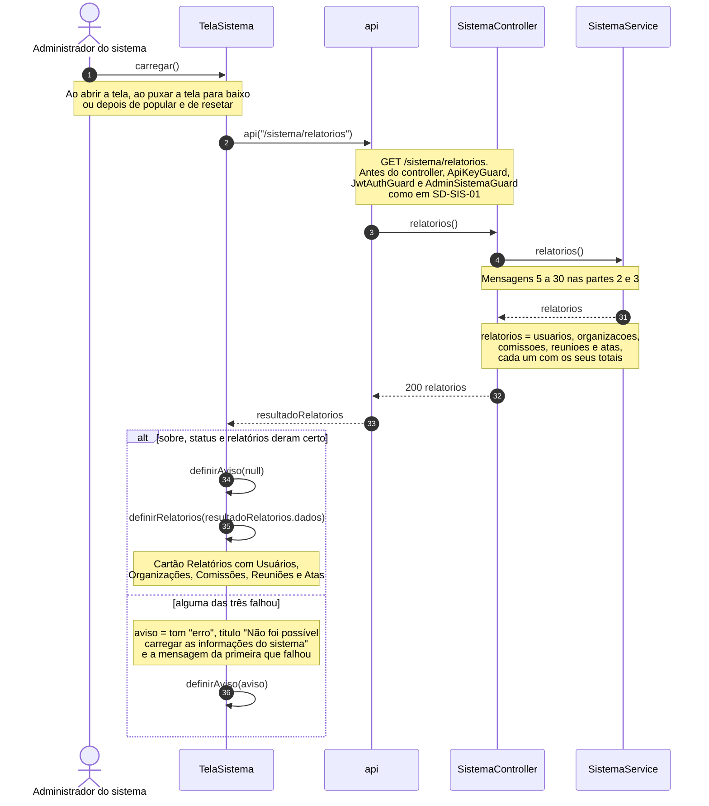
```mermaid
sequenceDiagram
    autonumber 1
    actor U as Administrador do sistema
    participant T as TelaSistema
    participant A as api
    participant C as SistemaController
    participant S as SistemaService
    U->>T: carregar()
    Note over U,T: Ao abrir a tela, ao puxar a tela para baixo<br/>ou depois de popular e de resetar
    T->>A: api("/sistema/relatorios")
    Note over A,C: GET /sistema/relatorios.<br/>Antes do controller, ApiKeyGuard,<br/>JwtAuthGuard e AdminSistemaGuard<br/>como em SD-SIS-01
    A->>C: relatorios()
    C->>S: relatorios()
    Note over C,S: Mensagens 5 a 30 nas partes 2 e 3
    autonumber 31
    S-->>C: relatorios
    Note over C,S: relatorios = usuarios, organizacoes,<br/>comissoes, reunioes e atas,<br/>cada um com os seus totais
    C-->>A: 200 relatorios
    A-->>T: resultadoRelatorios
    alt sobre, status e relatórios deram certo
        T->>T: definirAviso(null)
        T->>T: definirRelatorios(resultadoRelatorios.dados)
        Note over T: Cartão Relatórios com Usuários,<br/>Organizações, Comissões, Reuniões e Atas
    else alguma das três falhou
        Note over T: aviso = tom "erro", titulo "Não foi possível<br/>carregar as informações do sistema"<br/>e a mensagem da primeira que falhou
        T->>T: definirAviso(aviso)
    end
```

Figura 5 — Diagrama de sequência SD-SIS-02 (Consultar relatórios), parte 1 de 3: no aplicativo e na API. Fonte: equipe Conecta+.

### SD-SIS-02 — parte 2 de 3: contagens de usuários, organizações e comissões

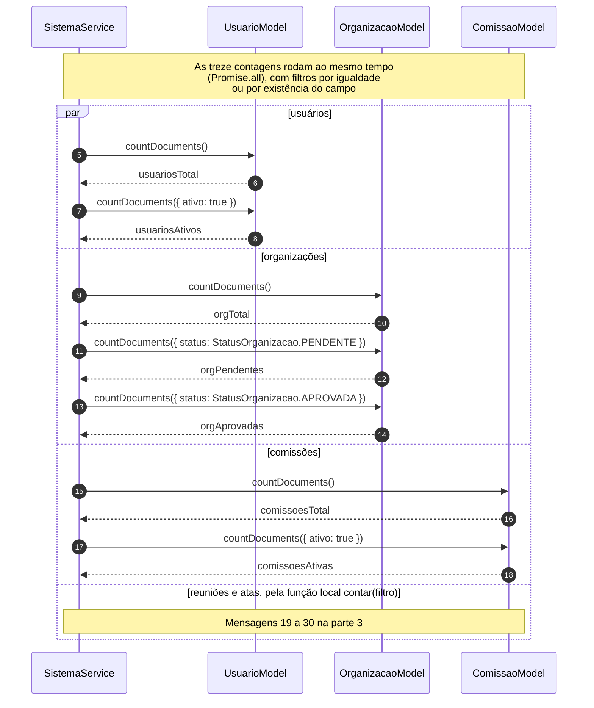
```mermaid
sequenceDiagram
    autonumber 5
    participant S as SistemaService
    participant MU as UsuarioModel
    participant MO as OrganizacaoModel
    participant MC as ComissaoModel
    Note over S,MC: As treze contagens rodam ao mesmo tempo<br/>(Promise.all), com filtros por igualdade<br/>ou por existência do campo
    par usuários
        S->>MU: countDocuments()
        MU-->>S: usuariosTotal
        S->>MU: countDocuments({ ativo: true })
        MU-->>S: usuariosAtivos
    and organizações
        S->>MO: countDocuments()
        MO-->>S: orgTotal
        S->>MO: countDocuments({ status: StatusOrganizacao.PENDENTE })
        MO-->>S: orgPendentes
        S->>MO: countDocuments({ status: StatusOrganizacao.APROVADA })
        MO-->>S: orgAprovadas
    and comissões
        S->>MC: countDocuments()
        MC-->>S: comissoesTotal
        S->>MC: countDocuments({ ativo: true })
        MC-->>S: comissoesAtivas
    and reuniões e atas, pela função local contar(filtro)
        Note over S,MC: Mensagens 19 a 30 na parte 3
    end
```

Figura 5 — Diagrama de sequência SD-SIS-02 (Consultar relatórios), parte 2 de 3: contagens de usuários, organizações e comissões. Fonte: equipe Conecta+.

### SD-SIS-02 — parte 3 de 3: contagens de reuniões e atas

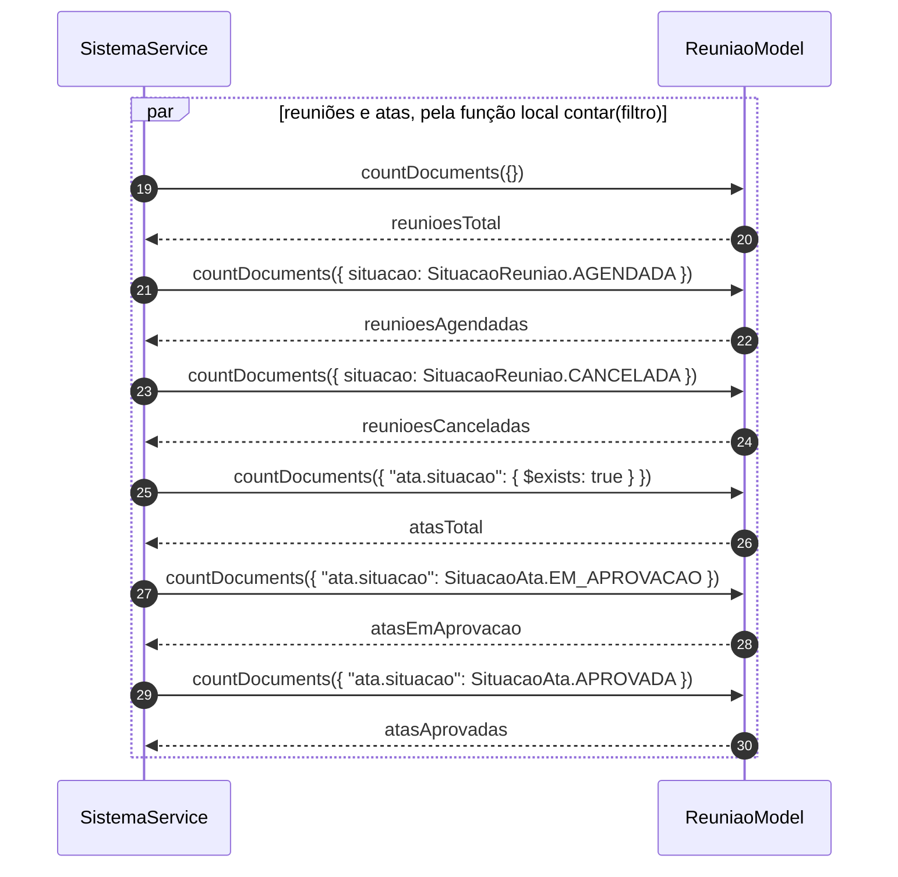
```mermaid
sequenceDiagram
    autonumber 19
    participant S as SistemaService
    participant MR as ReuniaoModel
    par reuniões e atas, pela função local contar(filtro)
        S->>MR: countDocuments({})
        MR-->>S: reunioesTotal
        S->>MR: countDocuments({ situacao: SituacaoReuniao.AGENDADA })
        MR-->>S: reunioesAgendadas
        S->>MR: countDocuments({ situacao: SituacaoReuniao.CANCELADA })
        MR-->>S: reunioesCanceladas
        S->>MR: countDocuments({ "ata.situacao": { $exists: true } })
        MR-->>S: atasTotal
        S->>MR: countDocuments({ "ata.situacao": SituacaoAta.EM_APROVACAO })
        MR-->>S: atasEmAprovacao
        S->>MR: countDocuments({ "ata.situacao": SituacaoAta.APROVADA })
        MR-->>S: atasAprovadas
    end
```

Figura 5 — Diagrama de sequência SD-SIS-02 (Consultar relatórios), parte 3 de 3: contagens de reuniões e atas. Fonte: equipe Conecta+.

## SD-SIS-03 — Popular dados de teste

### SD-SIS-03 — parte 1 de 3: no aplicativo

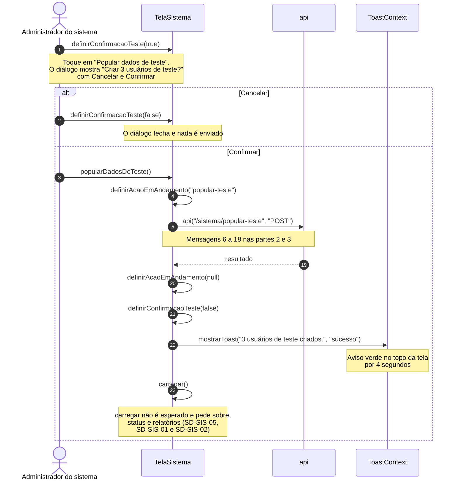
```mermaid
sequenceDiagram
    autonumber 1
    actor U as Administrador do sistema
    participant T as TelaSistema
    participant A as api
    participant M as ToastContext
    U->>T: definirConfirmacaoTeste(true)
    Note over U,T: Toque em "Popular dados de teste".<br/>O diálogo mostra "Criar 3 usuários de teste?"<br/>com Cancelar e Confirmar
    alt Cancelar
        U->>T: definirConfirmacaoTeste(false)
        Note over T: O diálogo fecha e nada é enviado
    else Confirmar
        U->>T: popularDadosDeTeste()
        T->>T: definirAcaoEmAndamento("popular-teste")
        T->>A: api("/sistema/popular-teste", "POST")
        Note over T,A: Mensagens 6 a 18 nas partes 2 e 3
        autonumber 19
        A-->>T: resultado
        T->>T: definirAcaoEmAndamento(null)
        T->>T: definirConfirmacaoTeste(false)
        T->>M: mostrarToast("3 usuários de teste criados.", "sucesso")
        Note over M: Aviso verde no topo da tela<br/>por 4 segundos
        T->>T: carregar()
        Note over T: carregar não é esperado e pede sobre,<br/>status e relatórios (SD-SIS-05,<br/>SD-SIS-01 e SD-SIS-02)
    end
```

Figura 6 — Diagrama de sequência SD-SIS-03 (Popular dados de teste), parte 1 de 3: no aplicativo. Fonte: equipe Conecta+.

### SD-SIS-03 — parte 2 de 3: controller e serviço

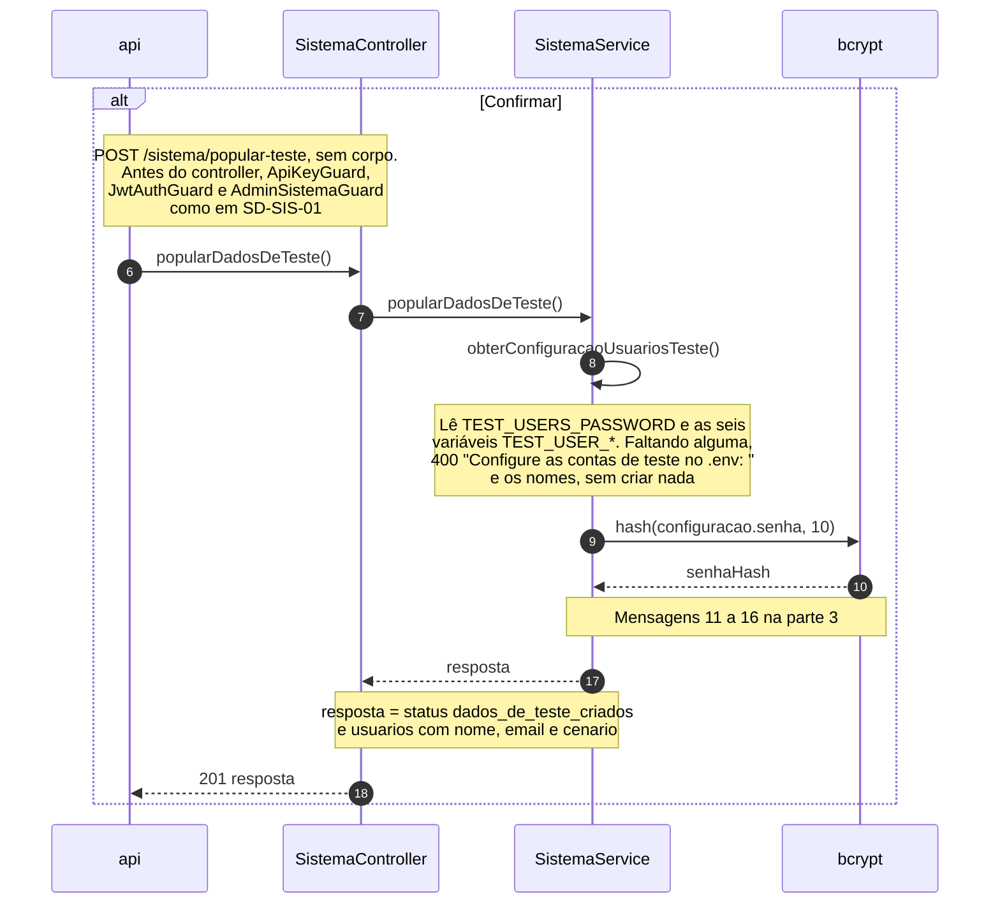
```mermaid
sequenceDiagram
    autonumber 6
    participant A as api
    participant C as SistemaController
    participant S as SistemaService
    participant B as bcrypt
    alt Confirmar
        Note over A,C: POST /sistema/popular-teste, sem corpo.<br/>Antes do controller, ApiKeyGuard,<br/>JwtAuthGuard e AdminSistemaGuard<br/>como em SD-SIS-01
        A->>C: popularDadosDeTeste()
        C->>S: popularDadosDeTeste()
        S->>S: obterConfiguracaoUsuariosTeste()
        Note over S: Lê TEST_USERS_PASSWORD e as seis<br/>variáveis TEST_USER_*. Faltando alguma,<br/>400 "Configure as contas de teste no .env: "<br/>e os nomes, sem criar nada
        S->>B: hash(configuracao.senha, 10)
        B-->>S: senhaHash
        Note over S,B: Mensagens 11 a 16 na parte 3
        autonumber 17
        S-->>C: resposta
        Note over C,S: resposta = status dados_de_teste_criados<br/>e usuarios com nome, email e cenario
        C-->>A: 201 resposta
    end
```

Figura 6 — Diagrama de sequência SD-SIS-03 (Popular dados de teste), parte 2 de 3: controller e serviço. Fonte: equipe Conecta+.

### SD-SIS-03 — parte 3 de 3: criação nos models

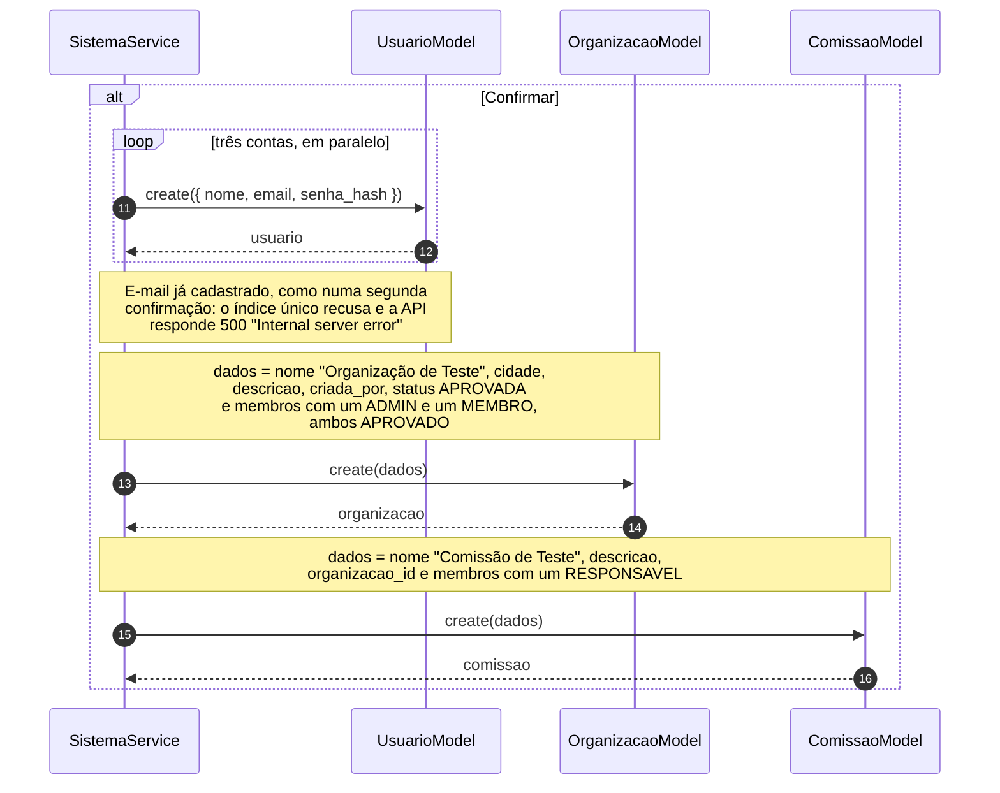
```mermaid
sequenceDiagram
    autonumber 11
    participant S as SistemaService
    participant MU as UsuarioModel
    participant MO as OrganizacaoModel
    participant MC as ComissaoModel
    alt Confirmar
        loop três contas, em paralelo
            S->>MU: create({ nome, email, senha_hash })
            MU-->>S: usuario
        end
        Note over S,MU: E-mail já cadastrado, como numa segunda<br/>confirmação: o índice único recusa e a API<br/>responde 500 "Internal server error"
        Note over S,MO: dados = nome "Organização de Teste", cidade,<br/>descricao, criada_por, status APROVADA<br/>e membros com um ADMIN e um MEMBRO,<br/>ambos APROVADO
        S->>MO: create(dados)
        MO-->>S: organizacao
        Note over S,MC: dados = nome "Comissão de Teste", descricao,<br/>organizacao_id e membros com um RESPONSAVEL
        S->>MC: create(dados)
        MC-->>S: comissao
    end
```

Figura 6 — Diagrama de sequência SD-SIS-03 (Popular dados de teste), parte 3 de 3: criação nos models. Fonte: equipe Conecta+.

Se a API recusar o pedido, `popularDadosDeTeste` chama `mostrarToast` com a mensagem de erro e o tipo `erro`, e não chama `carregar` (ver RF-SIS-03).

## SD-SIS-04 — Resetar sistema

### SD-SIS-04 — parte 1 de 4: no aplicativo

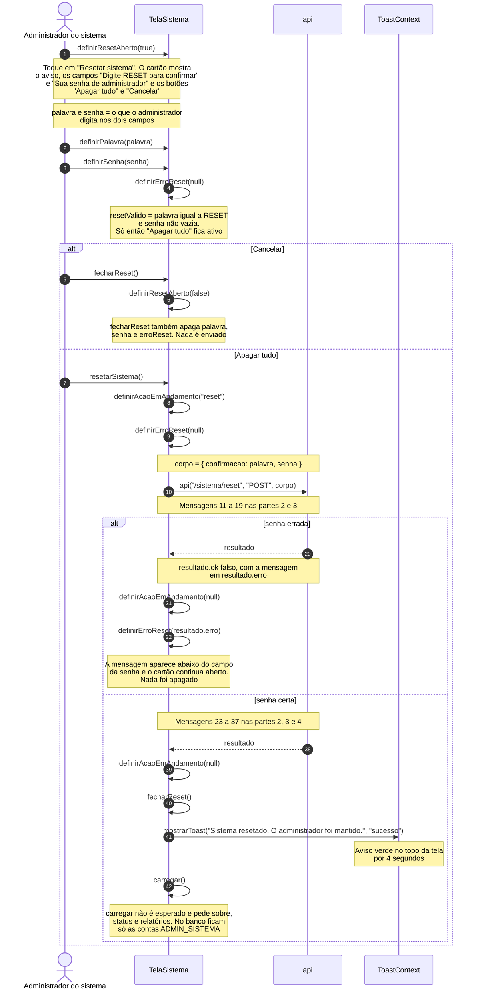
```mermaid
sequenceDiagram
    autonumber 1
    actor U as Administrador do sistema
    participant T as TelaSistema
    participant A as api
    participant M as ToastContext
    U->>T: definirResetAberto(true)
    Note over U,T: Toque em "Resetar sistema". O cartão mostra<br/>o aviso, os campos "Digite RESET para confirmar"<br/>e "Sua senha de administrador" e os botões<br/>"Apagar tudo" e "Cancelar"
    Note over U,T: palavra e senha = o que o administrador<br/>digita nos dois campos
    U->>T: definirPalavra(palavra)
    U->>T: definirSenha(senha)
    T->>T: definirErroReset(null)
    Note over T: resetValido = palavra igual a RESET<br/>e senha não vazia.<br/>Só então "Apagar tudo" fica ativo
    alt Cancelar
        U->>T: fecharReset()
        T->>T: definirResetAberto(false)
        Note over T: fecharReset também apaga palavra,<br/>senha e erroReset. Nada é enviado
    else Apagar tudo
        U->>T: resetarSistema()
        T->>T: definirAcaoEmAndamento("reset")
        T->>T: definirErroReset(null)
        Note over T,A: corpo = { confirmacao: palavra, senha }
        T->>A: api("/sistema/reset", "POST", corpo)
        Note over T,A: Mensagens 11 a 19 nas partes 2 e 3
        alt senha errada
            autonumber 20
            A-->>T: resultado
            Note over T,A: resultado.ok falso, com a mensagem<br/>em resultado.erro
            T->>T: definirAcaoEmAndamento(null)
            T->>T: definirErroReset(resultado.erro)
            Note over T: A mensagem aparece abaixo do campo<br/>da senha e o cartão continua aberto.<br/>Nada foi apagado
        else senha certa
            Note over T,A: Mensagens 23 a 37 nas partes 2, 3 e 4
            autonumber 38
            A-->>T: resultado
            T->>T: definirAcaoEmAndamento(null)
            T->>T: fecharReset()
            T->>M: mostrarToast("Sistema resetado. O administrador foi mantido.", "sucesso")
            Note over M: Aviso verde no topo da tela<br/>por 4 segundos
            T->>T: carregar()
            Note over T: carregar não é esperado e pede sobre,<br/>status e relatórios. No banco ficam<br/>só as contas ADMIN_SISTEMA
        end
    end
```

Figura 7 — Diagrama de sequência SD-SIS-04 (Resetar sistema), parte 1 de 4: no aplicativo. Fonte: equipe Conecta+.

### SD-SIS-04 — parte 2 de 4: controller, serviço e conferência da senha

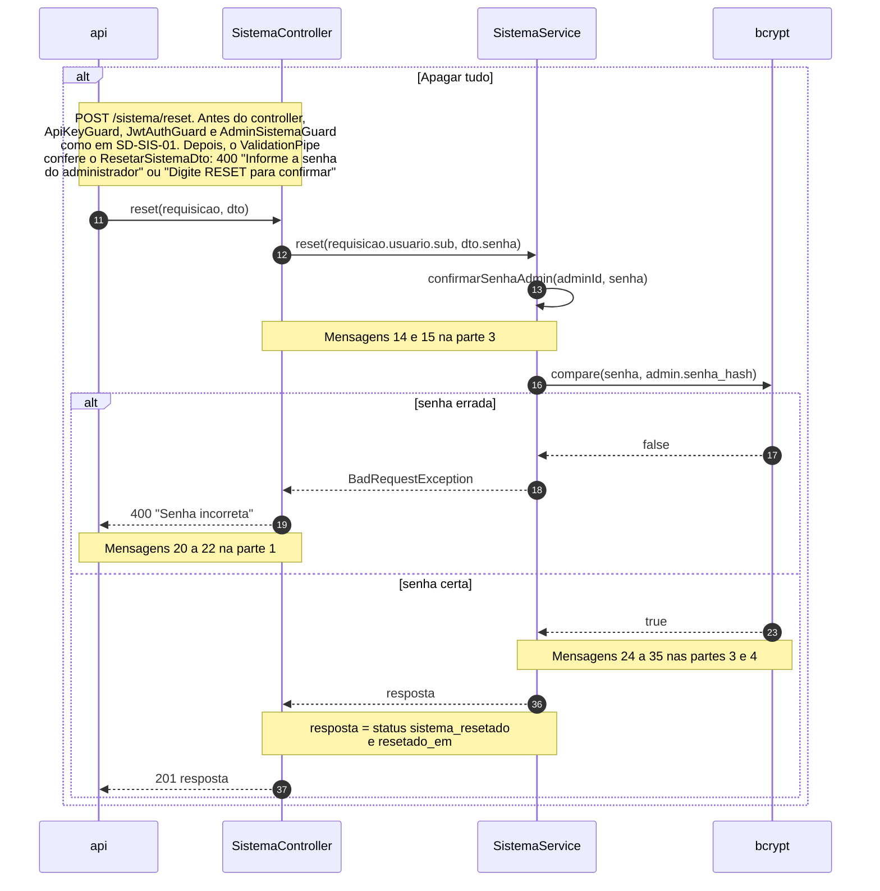
```mermaid
sequenceDiagram
    autonumber 11
    participant A as api
    participant C as SistemaController
    participant S as SistemaService
    participant B as bcrypt
    alt Apagar tudo
        Note over A,C: POST /sistema/reset. Antes do controller,<br/>ApiKeyGuard, JwtAuthGuard e AdminSistemaGuard<br/>como em SD-SIS-01. Depois, o ValidationPipe<br/>confere o ResetarSistemaDto: 400 "Informe a senha<br/>do administrador" ou "Digite RESET para confirmar"
        A->>C: reset(requisicao, dto)
        C->>S: reset(requisicao.usuario.sub, dto.senha)
        S->>S: confirmarSenhaAdmin(adminId, senha)
        Note over C,S: Mensagens 14 e 15 na parte 3
        autonumber 16
        S->>B: compare(senha, admin.senha_hash)
        alt senha errada
            B-->>S: false
            S-->>C: BadRequestException
            C-->>A: 400 "Senha incorreta"
            Note over A,C: Mensagens 20 a 22 na parte 1
        else senha certa
            autonumber 23
            B-->>S: true
            Note over S,B: Mensagens 24 a 35 nas partes 3 e 4
            autonumber 36
            S-->>C: resposta
            Note over C,S: resposta = status sistema_resetado<br/>e resetado_em
            C-->>A: 201 resposta
        end
    end
```

Figura 7 — Diagrama de sequência SD-SIS-04 (Resetar sistema), parte 2 de 4: controller, serviço e conferência da senha. Fonte: equipe Conecta+.

### SD-SIS-04 — parte 3 de 4: busca do administrador e exclusões nos models

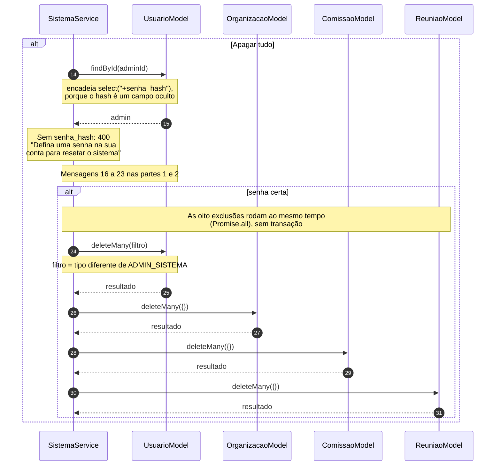
```mermaid
sequenceDiagram
    autonumber 14
    participant S as SistemaService
    participant MU as UsuarioModel
    participant MO as OrganizacaoModel
    participant MC as ComissaoModel
    participant MR as ReuniaoModel
    alt Apagar tudo
        S->>MU: findById(adminId)
        Note over S,MU: encadeia select("+senha_hash"),<br/>porque o hash é um campo oculto
        MU-->>S: admin
        Note over S: Sem senha_hash: 400<br/>"Defina uma senha na sua<br/>conta para resetar o sistema"
        Note over S,MU: Mensagens 16 a 23 nas partes 1 e 2
        alt senha certa
            autonumber 24
            Note over S,MR: As oito exclusões rodam ao mesmo tempo<br/>(Promise.all), sem transação
            S->>MU: deleteMany(filtro)
            Note over S,MU: filtro = tipo diferente de ADMIN_SISTEMA
            MU-->>S: resultado
            S->>MO: deleteMany({})
            MO-->>S: resultado
            S->>MC: deleteMany({})
            MC-->>S: resultado
            S->>MR: deleteMany({})
            MR-->>S: resultado
        end
    end
```

Figura 7 — Diagrama de sequência SD-SIS-04 (Resetar sistema), parte 3 de 4: busca do administrador e exclusões nos models. Fonte: equipe Conecta+.

### SD-SIS-04 — parte 4 de 4: exclusões nas coleções do driver

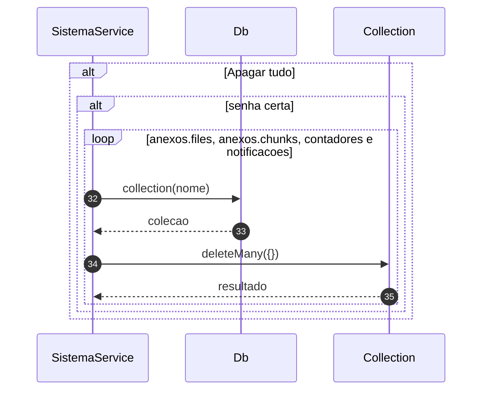
```mermaid
sequenceDiagram
    autonumber 32
    participant S as SistemaService
    participant D as Db
    participant CO as Collection
    alt Apagar tudo
        alt senha certa
            loop anexos.files, anexos.chunks, contadores e notificacoes
                S->>D: collection(nome)
                D-->>S: colecao
                S->>CO: deleteMany({})
                CO-->>S: resultado
            end
        end
    end
```

Figura 7 — Diagrama de sequência SD-SIS-04 (Resetar sistema), parte 4 de 4: exclusões nas coleções do driver. Fonte: equipe Conecta+.

Se o `ValidationPipe` recusar o corpo, o controller não é chamado e a mensagem aparece abaixo do campo da senha; pela tela isso não acontece, porque "Apagar tudo" só fica ativo com a palavra exata e uma senha preenchida. Se uma das exclusões falhar, a API responde 500 "Internal server error", a tela mostra a mensagem no mesmo lugar e as exclusões que já terminaram não são desfeitas (ver RF-SIS-04 e RNF-SIS-04).

## SD-SIS-05 — Consultar informações sobre o sistema

### SD-SIS-05 — parte 1 de 2: no aplicativo

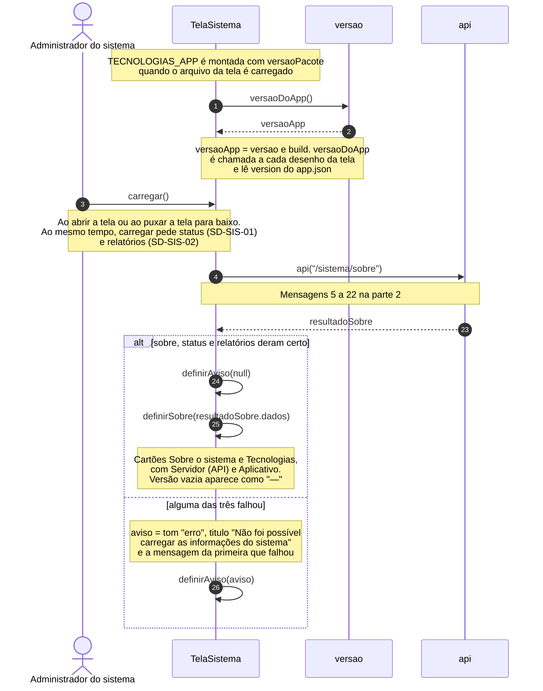
```mermaid
sequenceDiagram
    autonumber 1
    actor U as Administrador do sistema
    participant T as TelaSistema
    participant V as versao
    participant A as api
    Note over T: TECNOLOGIAS_APP é montada com versaoPacote<br/>quando o arquivo da tela é carregado
    T->>V: versaoDoApp()
    V-->>T: versaoApp
    Note over T,V: versaoApp = versao e build. versaoDoApp<br/>é chamada a cada desenho da tela<br/>e lê version do app.json
    U->>T: carregar()
    Note over U,T: Ao abrir a tela ou ao puxar a tela para baixo.<br/>Ao mesmo tempo, carregar pede status (SD-SIS-01)<br/>e relatórios (SD-SIS-02)
    T->>A: api("/sistema/sobre")
    Note over T,A: Mensagens 5 a 22 na parte 2
    autonumber 23
    A-->>T: resultadoSobre
    alt sobre, status e relatórios deram certo
        T->>T: definirAviso(null)
        T->>T: definirSobre(resultadoSobre.dados)
        Note over T: Cartões Sobre o sistema e Tecnologias,<br/>com Servidor (API) e Aplicativo.<br/>Versão vazia aparece como "—"
    else alguma das três falhou
        Note over T: aviso = tom "erro", titulo "Não foi possível<br/>carregar as informações do sistema"<br/>e a mensagem da primeira que falhou
        T->>T: definirAviso(aviso)
    end
```

Figura 8 — Diagrama de sequência SD-SIS-05 (Consultar informações sobre o sistema), parte 1 de 2: no aplicativo. Fonte: equipe Conecta+.

### SD-SIS-05 — parte 2 de 2: controller, serviço, módulo `os` e banco

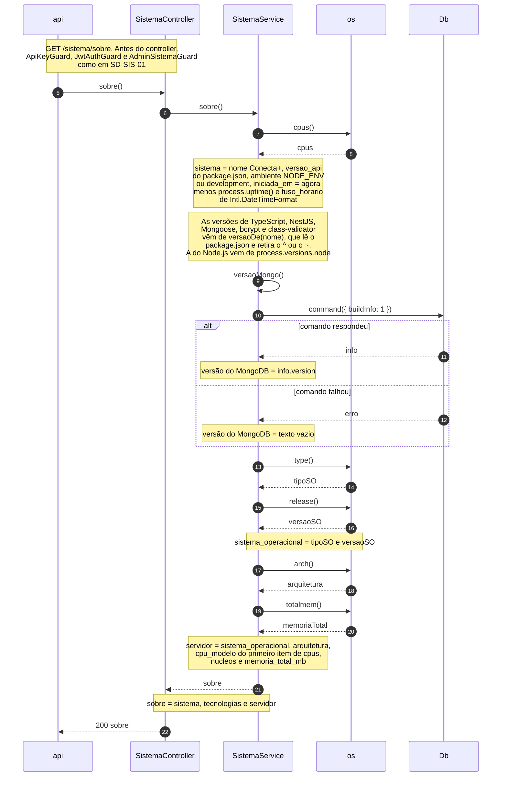
```mermaid
sequenceDiagram
    autonumber 5
    participant A as api
    participant C as SistemaController
    participant S as SistemaService
    participant O as os
    participant D as Db
    Note over A,C: GET /sistema/sobre. Antes do controller,<br/>ApiKeyGuard, JwtAuthGuard e AdminSistemaGuard<br/>como em SD-SIS-01
    A->>C: sobre()
    C->>S: sobre()
    S->>O: cpus()
    O-->>S: cpus
    Note over S: sistema = nome Conecta+, versao_api<br/>do package.json, ambiente NODE_ENV<br/>ou development, iniciada_em = agora<br/>menos process.uptime() e fuso_horario<br/>de Intl.DateTimeFormat
    Note over S: As versões de TypeScript, NestJS,<br/>Mongoose, bcrypt e class-validator<br/>vêm de versaoDe(nome), que lê o<br/>package.json e retira o ^ ou o ~.<br/>A do Node.js vem de process.versions.node
    S->>S: versaoMongo()
    S->>D: command({ buildInfo: 1 })
    alt comando respondeu
        D-->>S: info
        Note over S: versão do MongoDB = info.version
    else comando falhou
        D-->>S: erro
        Note over S: versão do MongoDB = texto vazio
    end
    S->>O: type()
    O-->>S: tipoSO
    S->>O: release()
    O-->>S: versaoSO
    Note over S,O: sistema_operacional = tipoSO e versaoSO
    S->>O: arch()
    O-->>S: arquitetura
    S->>O: totalmem()
    O-->>S: memoriaTotal
    Note over S: servidor = sistema_operacional, arquitetura,<br/>cpu_modelo do primeiro item de cpus,<br/>nucleos e memoria_total_mb
    S-->>C: sobre
    Note over C,S: sobre = sistema, tecnologias e servidor
    C-->>A: 200 sobre
```

Figura 8 — Diagrama de sequência SD-SIS-05 (Consultar informações sobre o sistema), parte 2 de 2: controller, serviço, módulo `os` e banco. Fonte: equipe Conecta+.

## Rastreabilidade

SD-SIS-01 a SD-SIS-05 correspondem, na mesma ordem, a UC-SIS-01 a UC-SIS-05 e a RF-SIS-01 a RF-SIS-05.
