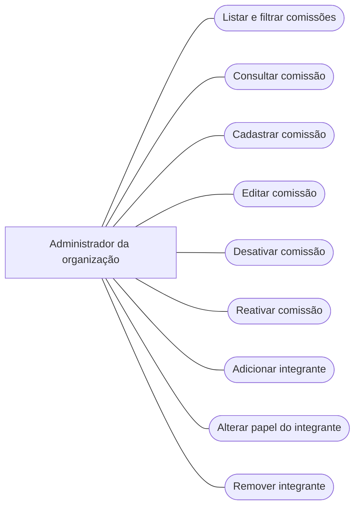

# 2. Diagrama de casos de uso

## Resumo dos casos de uso

| Código | Caso de uso | O que faz |
|---|---|---|
| UC-COM-01 | Listar e filtrar comissões | Mostra as comissões que o usuário pode administrar. |
| UC-COM-02 | Consultar comissão | Mostra os dados e a equipe de uma comissão. |
| UC-COM-03 | Cadastrar comissão | Cria uma nova comissão. |
| UC-COM-04 | Editar comissão | Altera nome e descrição. |
| UC-COM-05 | Desativar comissão | Deixa a comissão inativa sem apagar seus dados. |
| UC-COM-06 | Reativar comissão | Torna uma comissão inativa ativa novamente. |
| UC-COM-07 | Adicionar integrante | Adiciona um usuário à equipe. |
| UC-COM-08 | Alterar papel do integrante | Troca o papel entre `MEMBRO` e `RESPONSAVEL`. |
| UC-COM-09 | Remover integrante | Retira o usuário somente da comissão. |

---
