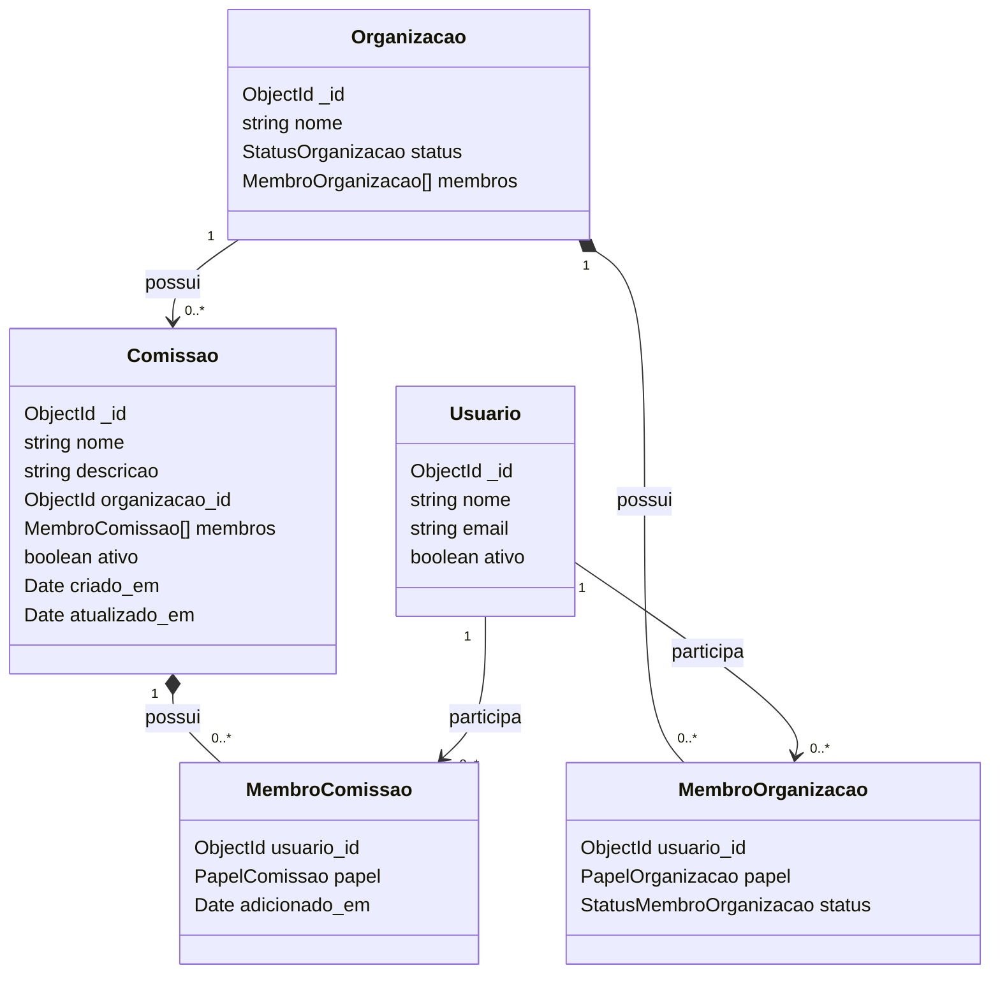

# Diagrama de classes

## Explicação

- Uma **Organização** pode possuir várias comissões.
- Cada **Comissão** pertence a uma única organização.
- Uma comissão pode ter nenhum, um ou vários integrantes.
- Um usuário pode participar de várias comissões.
- O integrante da comissão pode ser `MEMBRO` ou `RESPONSAVEL`.

---
# Dicionário de dados das classes

## Classe `Comissao`

| Campo | Tipo | Obrigatório | Descrição |
|---|---|---:|---|
| `_id` | ObjectId | Sim | Identificador criado pelo MongoDB. |
| `nome` | string | Sim | Nome da comissão. |
| `descricao` | string | Não | Descrição da comissão. |
| `organizacao_id` | ObjectId | Sim | ID da organização à qual a comissão pertence. |
| `membros` | array | Sim | Lista dos integrantes. Começa vazia. |
| `ativo` | boolean | Sim | `true` para ativa e `false` para inativa. |
| `criado_em` | Date | Automático | Data de criação. |
| `atualizado_em` | Date | Automático | Data da última atualização. |

## Classe `MembroComissao`

| Campo | Tipo | Obrigatório | Descrição |
|---|---|---:|---|
| `usuario_id` | ObjectId | Sim | ID do usuário integrante. |
| `papel` | enum | Sim | `MEMBRO` ou `RESPONSAVEL`. |
| `adicionado_em` | Date | Automático | Data em que entrou na comissão. |

## Classe `Organizacao` — campos usados pelo módulo

| Campo | Tipo | Descrição |
|---|---|---|
| `_id` | ObjectId | Identificador da organização. |
| `nome` | string | Nome da organização. |
| `status` | enum | `PENDENTE`, `APROVADA` ou `REVOGADA`. |
| `membros` | array | Usuários ligados à organização. |

## Classe `MembroOrganizacao` — campos usados pelo módulo

| Campo | Tipo | Descrição |
|---|---|---|
| `usuario_id` | ObjectId | ID do usuário. |
| `papel` | enum | `ADMIN` ou `MEMBRO`. |
| `status` | enum | `PENDENTE`, `APROVADO` ou `REJEITADO`. |

## Classe `Usuario` — campos usados pelo módulo

| Campo | Tipo | Descrição |
|---|---|---|
| `_id` | ObjectId | Identificador do usuário. |
| `nome` | string | Nome do usuário. |
| `email` | string | E-mail do usuário. |
| `ativo` | boolean | Indica se a conta está ativa. |

---
