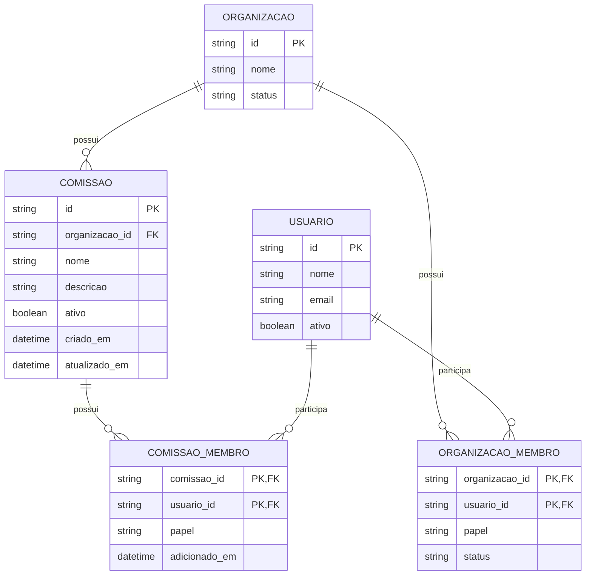

# 6. Diagrama relacional

> O sistema real usa **MongoDB**, que é um banco de documentos. O diagrama abaixo é uma representação relacional equivalente para atender à documentação solicitada.

---

# 7. Dicionário de dados do modelo relacional

## Tabela `COMISSAO`

| Campo | Tipo sugerido | Chave | Descrição |
|---|---|---|---|
| `id` | CHAR(24) | PK | Identificador da comissão. |
| `organizacao_id` | CHAR(24) | FK | Organização da comissão. |
| `nome` | VARCHAR(100) |  | Nome da comissão. |
| `descricao` | VARCHAR(1000) |  | Descrição opcional. |
| `ativo` | BOOLEAN |  | Situação da comissão. |
| `criado_em` | TIMESTAMP |  | Data de criação. |
| `atualizado_em` | TIMESTAMP |  | Data da última alteração. |

## Tabela `COMISSAO_MEMBRO`

| Campo | Tipo sugerido | Chave | Descrição |
|---|---|---|---|
| `comissao_id` | CHAR(24) | PK/FK | Comissão. |
| `usuario_id` | CHAR(24) | PK/FK | Usuário integrante. |
| `papel` | VARCHAR(11) |  | `MEMBRO` ou `RESPONSAVEL`. |
| `adicionado_em` | TIMESTAMP |  | Data da inclusão. |

A chave primária é composta por `comissao_id + usuario_id`, evitando repetir o mesmo usuário na mesma comissão.

## Tabela `ORGANIZACAO`

| Campo | Tipo sugerido | Chave | Descrição |
|---|---|---|---|
| `id` | CHAR(24) | PK | Identificador da organização. |
| `nome` | TEXT |  | Nome. |
| `status` | VARCHAR(8) |  | `PENDENTE`, `APROVADA` ou `REVOGADA`. |

## Tabela `USUARIO`

| Campo | Tipo sugerido | Chave | Descrição |
|---|---|---|---|
| `id` | CHAR(24) | PK | Identificador do usuário. |
| `nome` | TEXT |  | Nome. |
| `email` | TEXT |  | E-mail. |
| `ativo` | BOOLEAN |  | Indica se a conta está ativa. |

## Tabela `ORGANIZACAO_MEMBRO`

| Campo | Tipo sugerido | Chave | Descrição |
|---|---|---|---|
| `organizacao_id` | CHAR(24) | PK/FK | Organização. |
| `usuario_id` | CHAR(24) | PK/FK | Usuário. |
| `papel` | VARCHAR(6) |  | `ADMIN` ou `MEMBRO`. |
| `status` | VARCHAR(9) |  | `PENDENTE`, `APROVADO` ou `REJEITADO`. |

## Relação com o MongoDB real

| Modelo relacional | Implementação real no MongoDB |
|---|---|
| `COMISSAO` | Coleção `comissoes`. |
| `COMISSAO_MEMBRO` | Array `membros` dentro do documento da comissão. |
| `ORGANIZACAO` | Coleção `organizacoes`. |
| `ORGANIZACAO_MEMBRO` | Array `membros` dentro da organização. |
| `USUARIO` | Coleção `usuarios`. |

---
