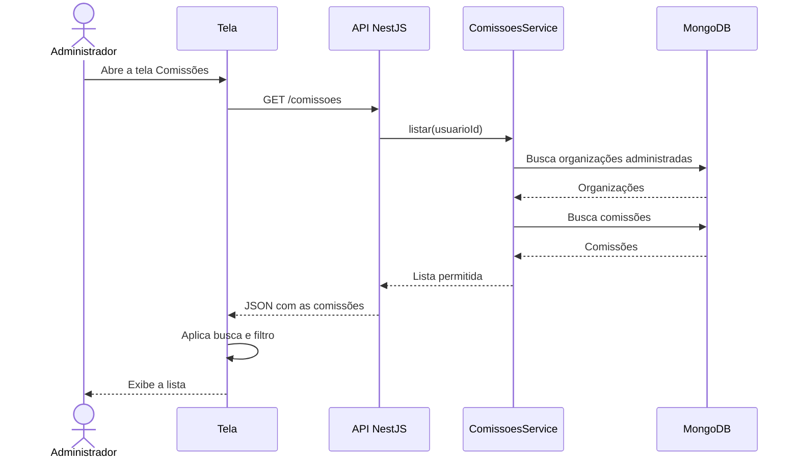
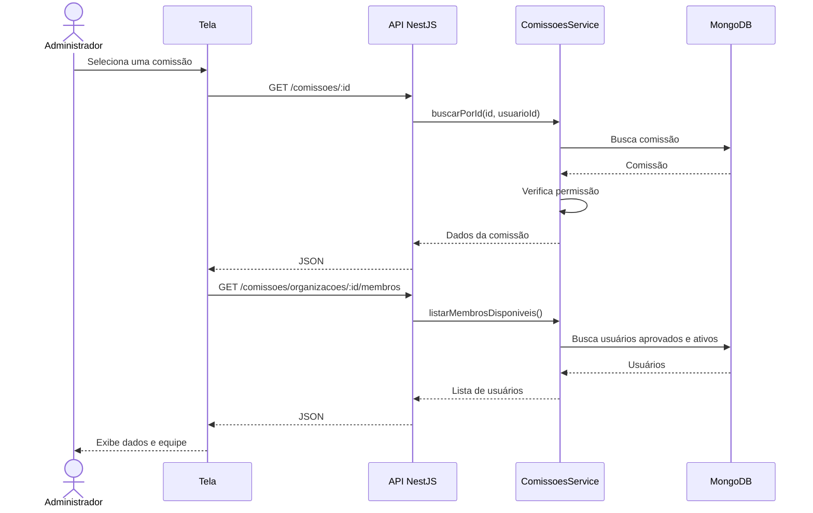
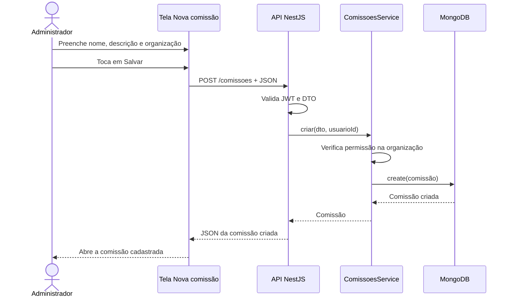
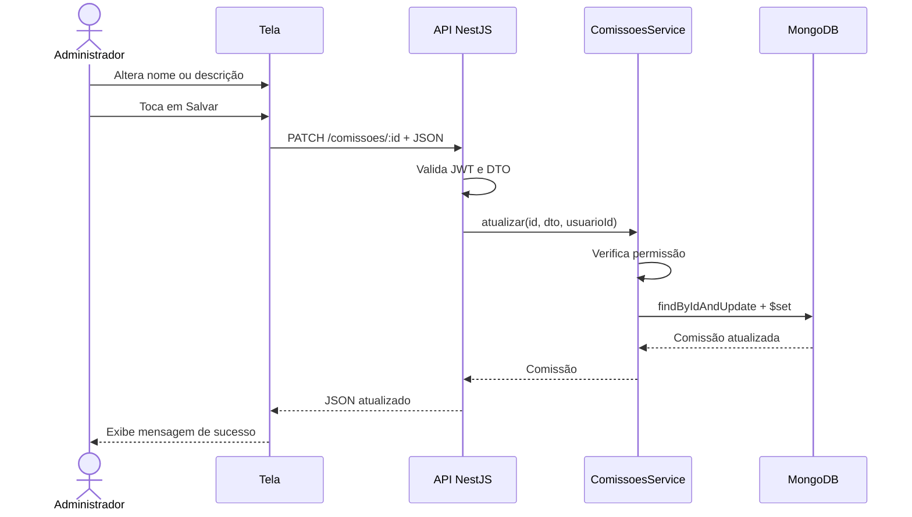
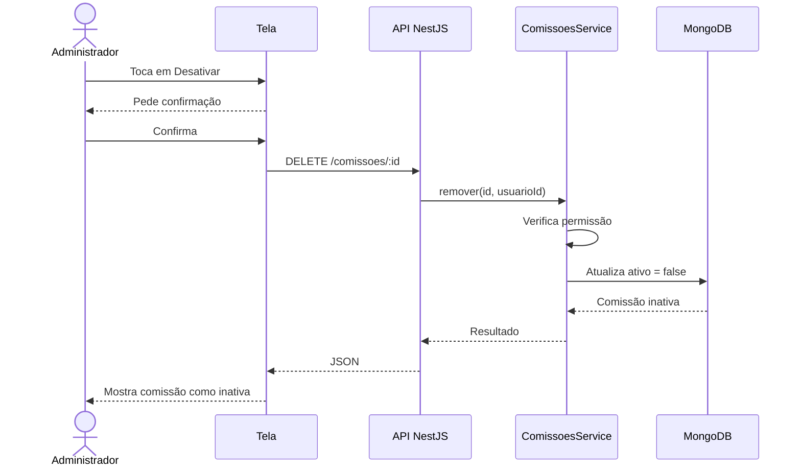
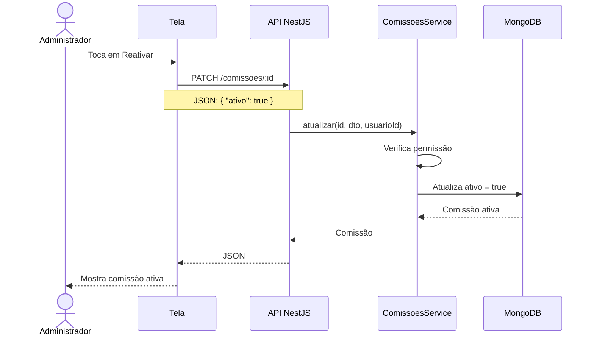
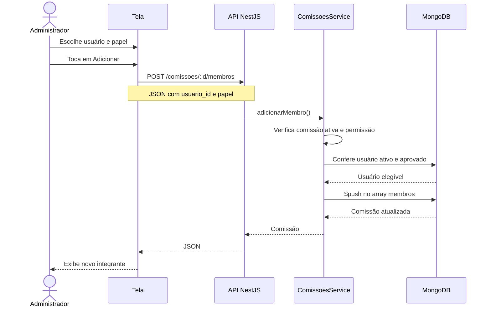
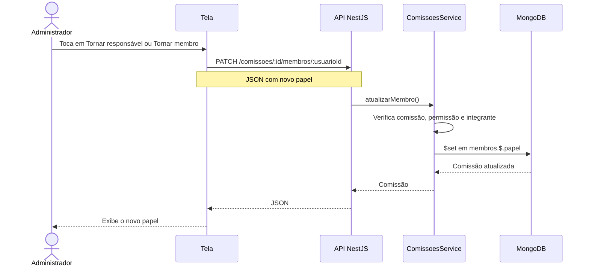
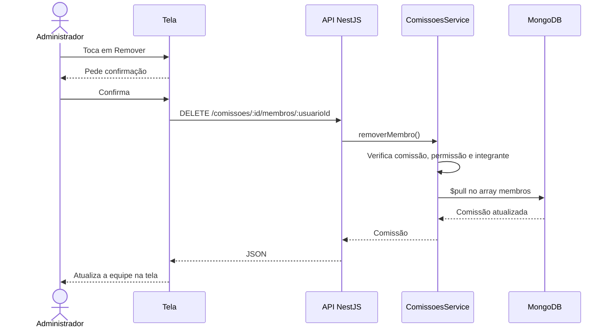

# Diagramas de sequência

## SD-COM-01 — Listar e filtrar comissões

## SD-COM-02 — Consultar comissão

## SD-COM-03 — Cadastrar comissão

## SD-COM-04 — Editar comissão

## SD-COM-05 — Desativar comissão

## SD-COM-06 — Reativar comissão

## SD-COM-07 — Adicionar integrante

## SD-COM-08 — Alterar papel do integrante

## SD-COM-09 — Remover integrante

---

# Resumo das rotas usadas

| Método | Rota | Função |
|---|---|---|
| GET | `/comissoes` | Lista comissões. |
| GET | `/comissoes/:id` | Busca uma comissão. |
| GET | `/comissoes/organizacoes` | Lista organizações que o usuário administra. |
| GET | `/comissoes/organizacoes/:id/membros` | Lista usuários que podem entrar na comissão. |
| POST | `/comissoes` | Cadastra comissão. |
| PATCH | `/comissoes/:id` | Edita ou reativa comissão. |
| DELETE | `/comissoes/:id` | Desativa comissão. |
| POST | `/comissoes/:id/membros` | Adiciona integrante. |
| PATCH | `/comissoes/:id/membros/:usuarioId` | Altera papel. |
| DELETE | `/comissoes/:id/membros/:usuarioId` | Remove integrante. |

---

