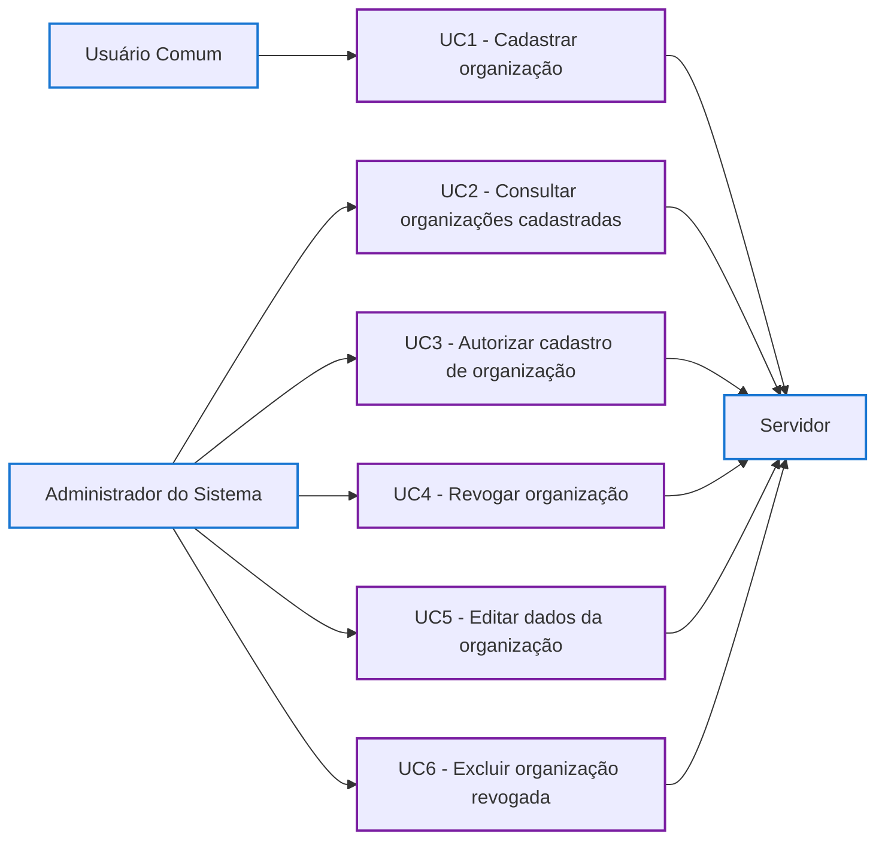

# Diagrama de Casos de Uso - Cadastro de Organização

## Casos de uso

- **UC1 - Cadastrar organização:** o usuário cria uma organização, que fica aguardando autorização.
- **UC2 - Consultar organizações cadastradas:** o administrador vê as organizações cadastradas e a situação de cada uma.
- **UC3 - Autorizar cadastro de organização:** o administrador aprova uma organização e a libera para uso na plataforma.
- **UC4 - Revogar organização:** o administrador recusa uma organização pendente ou suspende uma já aprovada.
- **UC5 - Editar dados da organização:** o administrador corrige o nome e a descrição de uma organização.
- **UC6 - Excluir organização revogada:** o administrador apaga em definitivo uma organização revogada e as comissões dela.
