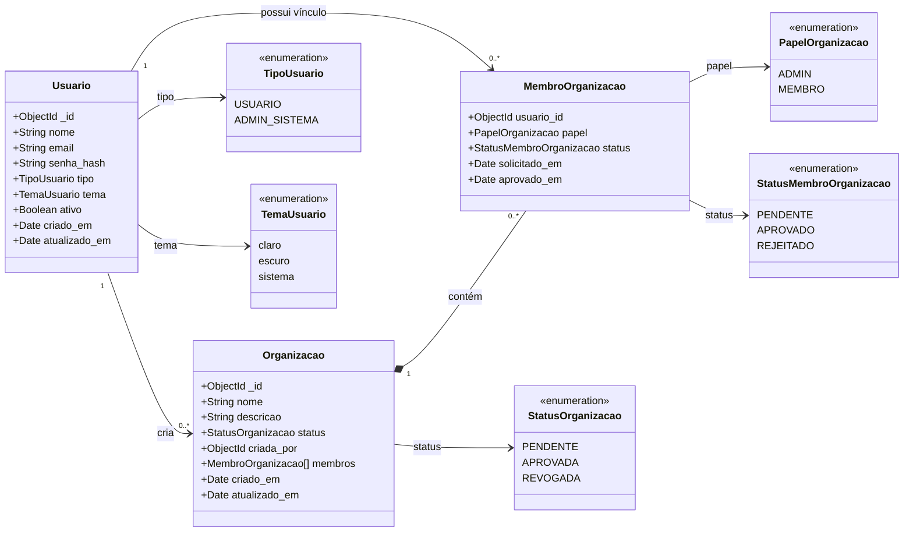

# Diagrama de classes

## Explicação

- Um **usuário** pode cadastrar várias organizações; a organização guarda em `criada_por` quem a cadastrou.
- Toda **organização** nasce com `status = PENDENTE` e só é usada na plataforma depois de aprovada.
- O `status` da organização pode ser `PENDENTE`, `APROVADA` ou `REVOGADA`.
- Os vínculos ficam em `membros`, dentro da própria organização; o primeiro é o criador, como `ADMIN` aprovado.
- Uma organização pode possuir várias **comissões**, e elas são apagadas quando a organização revogada é excluída.
- A gestão dos vínculos pertence ao requisito de cadastro de usuário; a das comissões, ao de cadastro de comissão.

---

# Dicionário de dados das classes

## Classe `Organizacao`

| Campo | Tipo | Obrigatório | Descrição |
|---|---|---:|---|
| `_id` | ObjectId | Sim | Identificador criado pelo MongoDB. |
| `nome` | string | Sim | Nome da organização, de 2 a 100 caracteres. Não pode se repetir, mesmo com diferença de maiúsculas. |
| `descricao` | string | Não | Descrição da organização, de até 200 caracteres. |
| `status` | enum | Sim | `PENDENTE`, `APROVADA` ou `REVOGADA`. Começa como `PENDENTE`. |
| `criada_por` | ObjectId | Sim | ID do usuário que cadastrou a organização. |
| `membros` | array | Sim | Lista dos vínculos. Começa com o criador, como `ADMIN` aprovado. |
| `criado_em` | Date | Automático | Data de criação. |
| `atualizado_em` | Date | Automático | Data da última atualização. |

## Classe `MembroOrganizacao` — campos usados pelo módulo

| Campo | Tipo | Descrição |
|---|---|---|
| `usuario_id` | ObjectId | ID do usuário vinculado. |
| `papel` | enum | `ADMIN` ou `MEMBRO`. |
| `status` | enum | `PENDENTE`, `APROVADO` ou `REJEITADO`. |

## Classe `Usuario` — campos usados pelo módulo

| Campo | Tipo | Descrição |
|---|---|---|
| `_id` | ObjectId | Identificador do usuário. |
| `nome` | string | Nome do usuário. |
| `email` | string | E-mail do usuário. |
| `ativo` | boolean | Indica se a conta está ativa. |

## Classe `Comissao` — campos usados pelo módulo

| Campo | Tipo | Descrição |
|---|---|---|
| `_id` | ObjectId | Identificador da comissão. |
| `nome` | string | Nome da comissão. |
| `organizacao_id` | ObjectId | ID da organização à qual a comissão pertence. |
| `ativo` | boolean | `true` para ativa e `false` para inativa. |

## Regras do cadastro e da gestão

- O nome da organização é único na plataforma, sem distinguir maiúsculas de minúsculas.
- Quem cadastra entra em `membros` como `ADMIN` aprovado.
- Só o administrador do sistema altera `status`, `nome` e `descricao` depois do cadastro.
- A exclusão definitiva exige `status = REVOGADA` e apaga também as comissões da organização.
