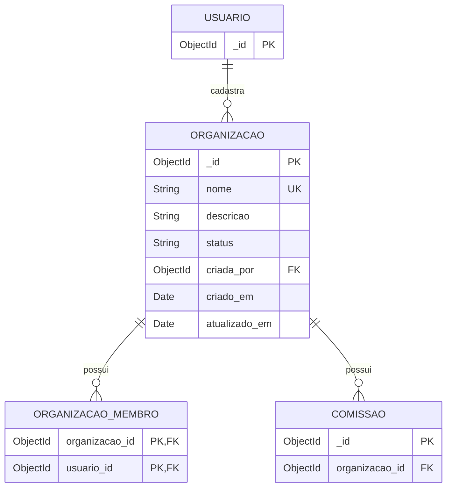

# Diagrama Relacional - Cadastro de Organização

## Relacionamentos

- `ORGANIZACAO.criada_por → USUARIO._id`: um usuário pode cadastrar várias organizações.
- `ORGANIZACAO_MEMBRO.organizacao_id → ORGANIZACAO._id`: uma organização tem vários vínculos de membro.
- `COMISSAO.organizacao_id → ORGANIZACAO._id`: uma organização tem várias comissões, e a exclusão da organização revogada (RF-06) apaga as comissões ligadas a ela.