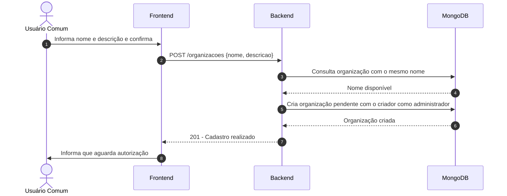
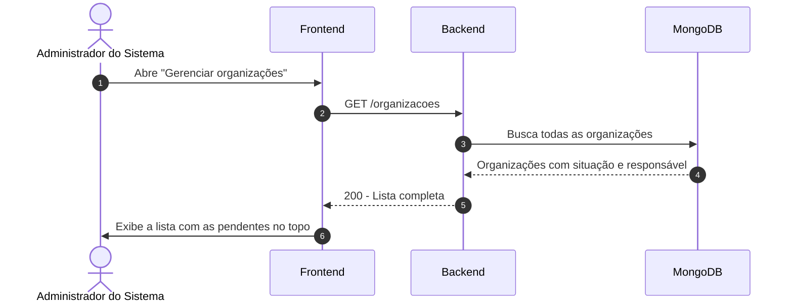
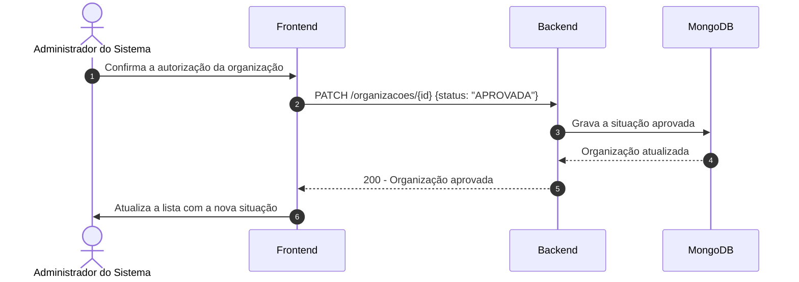
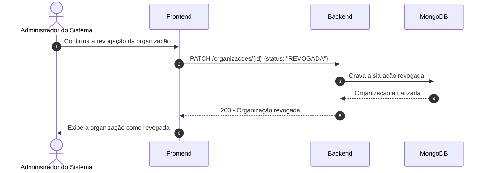
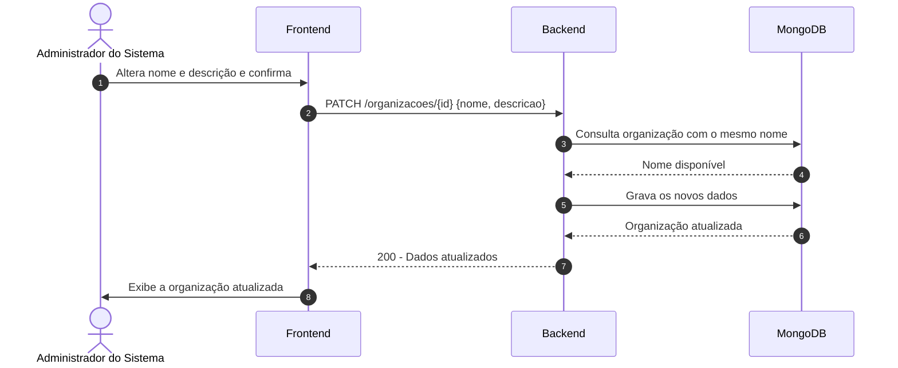
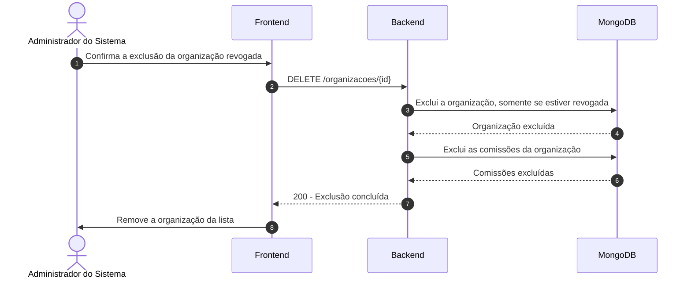

# Diagramas de Sequência - Cadastro de Organização

## 1. Cadastrar organização (RF-01)

## 2. Consultar organizações cadastradas (RF-02)

## 3. Autorizar cadastro de organização (RF-03)

## 4. Revogar organização (RF-04)

## 5. Editar dados da organização (RF-05)

## 6. Excluir organização revogada (RF-06)

