# Diagramas de sequência — Cadastro de organização

> Padrão da disciplina · Módulo ORG · Revisado em 26/11/2026

## Resumo

Há um diagrama para cada requisito de [Requisitos funcionais](2%20-%20requisitos-funcionais-cadastro-organizacao.md), com o mesmo número. As linhas de vida são classes e módulos que existem no código: as telas do aplicativo, o módulo `api`, o `OrganizacoesController`, o `OrganizacoesService` e os models do Mongoose (`OrganizacaoModel`, `UsuarioModel` e `ComissaoModel`). Toda mensagem é a chamada de um método existente, com seus parâmetros, e as mensagens são numeradas na ordem em que acontecem. Regras que não são métodos, como comparar situações, aparecem em notas.

Em todos os diagramas, a chamada do módulo `api` ao controller é uma requisição HTTP que passa antes por `ApiKeyGuard`, `JwtAuthGuard` e `UsuarioAtivoGuard` e, conforme a rota, por `UsuarioComumGuard` ou `AdminSistemaGuard`; a rota está indicada na nota. Quando um guarda recusa a requisição, o controller não é chamado.

## SD-ORG-01 — Cadastrar organização

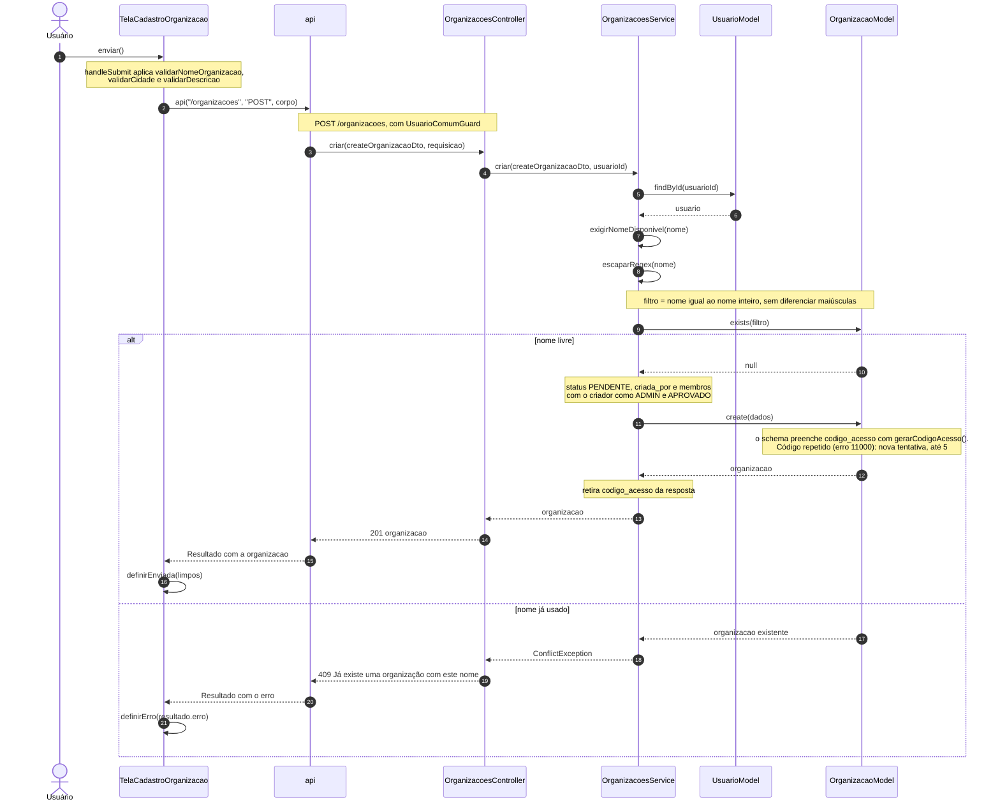
```mermaid
sequenceDiagram
    autonumber
    actor U as Usuário
    participant T as TelaCadastroOrganizacao
    participant A as api
    participant C as OrganizacoesController
    participant S as OrganizacoesService
    participant UM as UsuarioModel
    participant M as OrganizacaoModel
    U->>T: enviar()
    Note over T: handleSubmit aplica validarNomeOrganizacao,<br/>validarCidade e validarDescricao
    T->>A: api("/organizacoes", "POST", corpo)
    Note over A,C: POST /organizacoes, com UsuarioComumGuard
    A->>C: criar(createOrganizacaoDto, requisicao)
    C->>S: criar(createOrganizacaoDto, usuarioId)
    S->>UM: findById(usuarioId)
    UM-->>S: usuario
    S->>S: exigirNomeDisponivel(nome)
    S->>S: escaparRegex(nome)
    Note over S,M: filtro = nome igual ao nome inteiro, sem diferenciar maiúsculas
    S->>M: exists(filtro)
    alt nome livre
        M-->>S: null
        Note over S: status PENDENTE, criada_por e membros<br/>com o criador como ADMIN e APROVADO
        S->>M: create(dados)
        Note over M: o schema preenche codigo_acesso com gerarCodigoAcesso().<br/>Código repetido (erro 11000): nova tentativa, até 5
        M-->>S: organizacao
        Note over S: retira codigo_acesso da resposta
        S-->>C: organizacao
        C-->>A: 201 organizacao
        A-->>T: Resultado com a organizacao
        T->>T: definirEnviada(limpos)
    else nome já usado
        M-->>S: organizacao existente
        S-->>C: ConflictException
        C-->>A: 409 Já existe uma organização com este nome
        A-->>T: Resultado com o erro
        T->>T: definirErro(resultado.erro)
    end
```

## SD-ORG-02 — Consultar organizações

Usuário, na aba "Organizações":

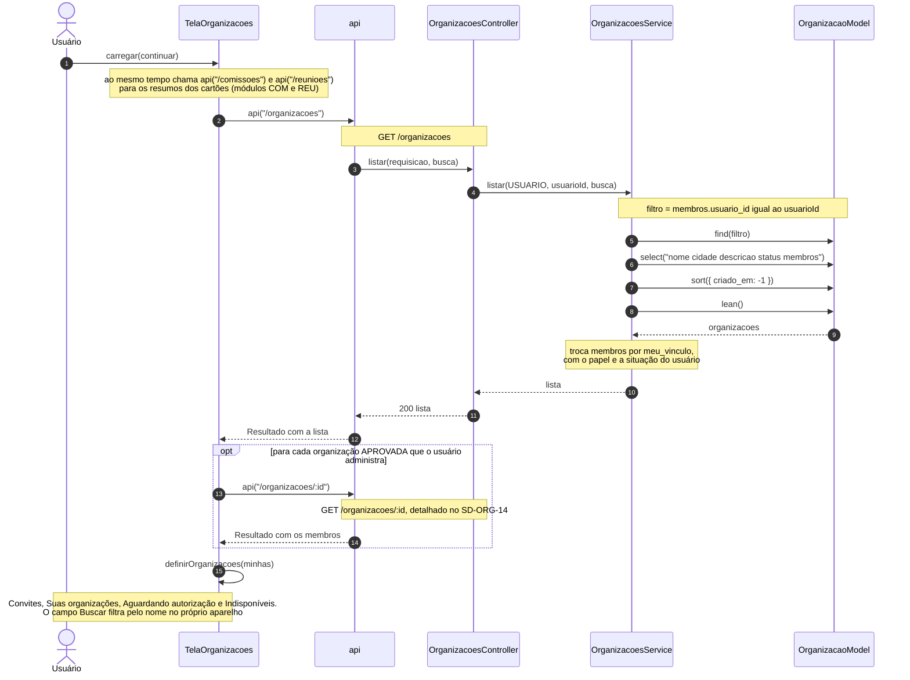
```mermaid
sequenceDiagram
    autonumber
    actor U as Usuário
    participant T as TelaOrganizacoes
    participant A as api
    participant C as OrganizacoesController
    participant S as OrganizacoesService
    participant M as OrganizacaoModel
    U->>T: carregar(continuar)
    Note over T: ao mesmo tempo chama api("/comissoes") e api("/reunioes")<br/>para os resumos dos cartões (módulos COM e REU)
    T->>A: api("/organizacoes")
    Note over A,C: GET /organizacoes
    A->>C: listar(requisicao, busca)
    C->>S: listar(USUARIO, usuarioId, busca)
    Note over S,M: filtro = membros.usuario_id igual ao usuarioId
    S->>M: find(filtro)
    S->>M: select("nome cidade descricao status membros")
    S->>M: sort({ criado_em: -1 })
    S->>M: lean()
    M-->>S: organizacoes
    Note over S: troca membros por meu_vinculo,<br/>com o papel e a situação do usuário
    S-->>C: lista
    C-->>A: 200 lista
    A-->>T: Resultado com a lista
    opt para cada organização APROVADA que o usuário administra
        T->>A: api("/organizacoes/:id")
        Note over A,C: GET /organizacoes/:id, detalhado no SD-ORG-14
        A-->>T: Resultado com os membros
    end
    T->>T: definirOrganizacoes(minhas)
    Note over U,T: Convites, Suas organizações, Aguardando autorização e Indisponíveis.<br/>O campo Buscar filtra pelo nome no próprio aparelho
```

Administrador do sistema, na tela "Gerenciar organizações":

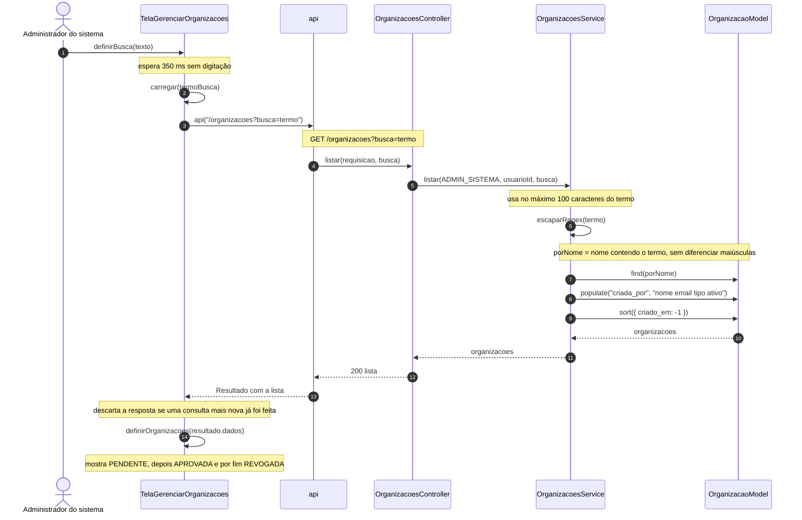
```mermaid
sequenceDiagram
    autonumber
    actor U as Administrador do sistema
    participant T as TelaGerenciarOrganizacoes
    participant A as api
    participant C as OrganizacoesController
    participant S as OrganizacoesService
    participant M as OrganizacaoModel
    U->>T: definirBusca(texto)
    Note over T: espera 350 ms sem digitação
    T->>T: carregar(termoBusca)
    T->>A: api("/organizacoes?busca=termo")
    Note over A,C: GET /organizacoes?busca=termo
    A->>C: listar(requisicao, busca)
    C->>S: listar(ADMIN_SISTEMA, usuarioId, busca)
    Note over S: usa no máximo 100 caracteres do termo
    S->>S: escaparRegex(termo)
    Note over S,M: porNome = nome contendo o termo, sem diferenciar maiúsculas
    S->>M: find(porNome)
    S->>M: populate("criada_por", "nome email tipo ativo")
    S->>M: sort({ criado_em: -1 })
    M-->>S: organizacoes
    S-->>C: organizacoes
    C-->>A: 200 lista
    A-->>T: Resultado com a lista
    Note over T: descarta a resposta se uma consulta mais nova já foi feita
    T->>T: definirOrganizacoes(resultado.dados)
    Note over T: mostra PENDENTE, depois APROVADA e por fim REVOGADA
```

## SD-ORG-03 — Aprovar organização

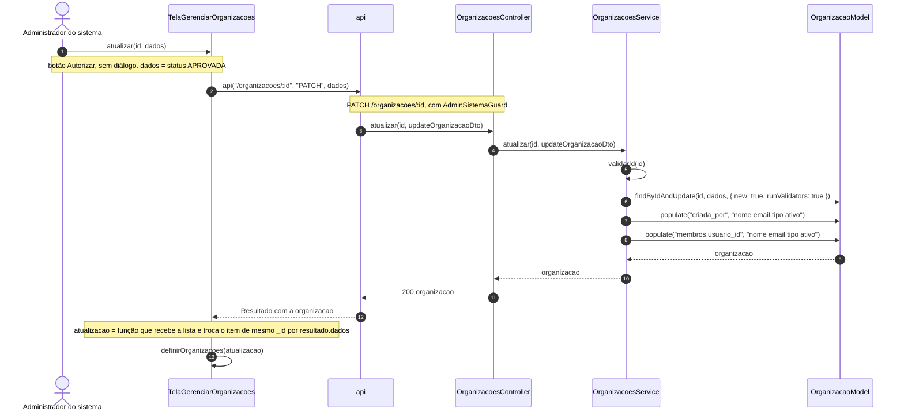
```mermaid
sequenceDiagram
    autonumber
    actor U as Administrador do sistema
    participant T as TelaGerenciarOrganizacoes
    participant A as api
    participant C as OrganizacoesController
    participant S as OrganizacoesService
    participant M as OrganizacaoModel
    U->>T: atualizar(id, dados)
    Note over U,T: botão Autorizar, sem diálogo. dados = status APROVADA
    T->>A: api("/organizacoes/:id", "PATCH", dados)
    Note over A,C: PATCH /organizacoes/:id, com AdminSistemaGuard
    A->>C: atualizar(id, updateOrganizacaoDto)
    C->>S: atualizar(id, updateOrganizacaoDto)
    S->>S: validarId(id)
    S->>M: findByIdAndUpdate(id, dados, { new: true, runValidators: true })
    S->>M: populate("criada_por", "nome email tipo ativo")
    S->>M: populate("membros.usuario_id", "nome email tipo ativo")
    M-->>S: organizacao
    S-->>C: organizacao
    C-->>A: 200 organizacao
    A-->>T: Resultado com a organizacao
    Note over T: atualizacao = função que recebe a lista e troca o item de mesmo _id por resultado.dados
    T->>T: definirOrganizacoes(atualizacao)
```

## SD-ORG-04 — Revogar organização

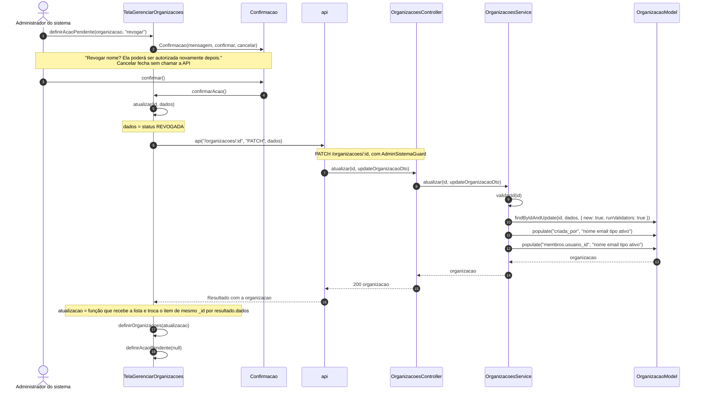
```mermaid
sequenceDiagram
    autonumber
    actor U as Administrador do sistema
    participant T as TelaGerenciarOrganizacoes
    participant D as Confirmacao
    participant A as api
    participant C as OrganizacoesController
    participant S as OrganizacoesService
    participant M as OrganizacaoModel
    U->>T: definirAcaoPendente(organizacao, "revogar")
    T->>D: Confirmacao(mensagem, confirmar, cancelar)
    Note over U,D: "Revogar nome? Ela poderá ser autorizada novamente depois."<br/>Cancelar fecha sem chamar a API
    U->>D: confirmar()
    D->>T: confirmarAcao()
    T->>T: atualizar(id, dados)
    Note over T: dados = status REVOGADA
    T->>A: api("/organizacoes/:id", "PATCH", dados)
    Note over A,C: PATCH /organizacoes/:id, com AdminSistemaGuard
    A->>C: atualizar(id, updateOrganizacaoDto)
    C->>S: atualizar(id, updateOrganizacaoDto)
    S->>S: validarId(id)
    S->>M: findByIdAndUpdate(id, dados, { new: true, runValidators: true })
    S->>M: populate("criada_por", "nome email tipo ativo")
    S->>M: populate("membros.usuario_id", "nome email tipo ativo")
    M-->>S: organizacao
    S-->>C: organizacao
    C-->>A: 200 organizacao
    A-->>T: Resultado com a organizacao
    Note over T: atualizacao = função que recebe a lista e troca o item de mesmo _id por resultado.dados
    T->>T: definirOrganizacoes(atualizacao)
    T->>T: definirAcaoPendente(null)
```

## SD-ORG-05 — Editar organização

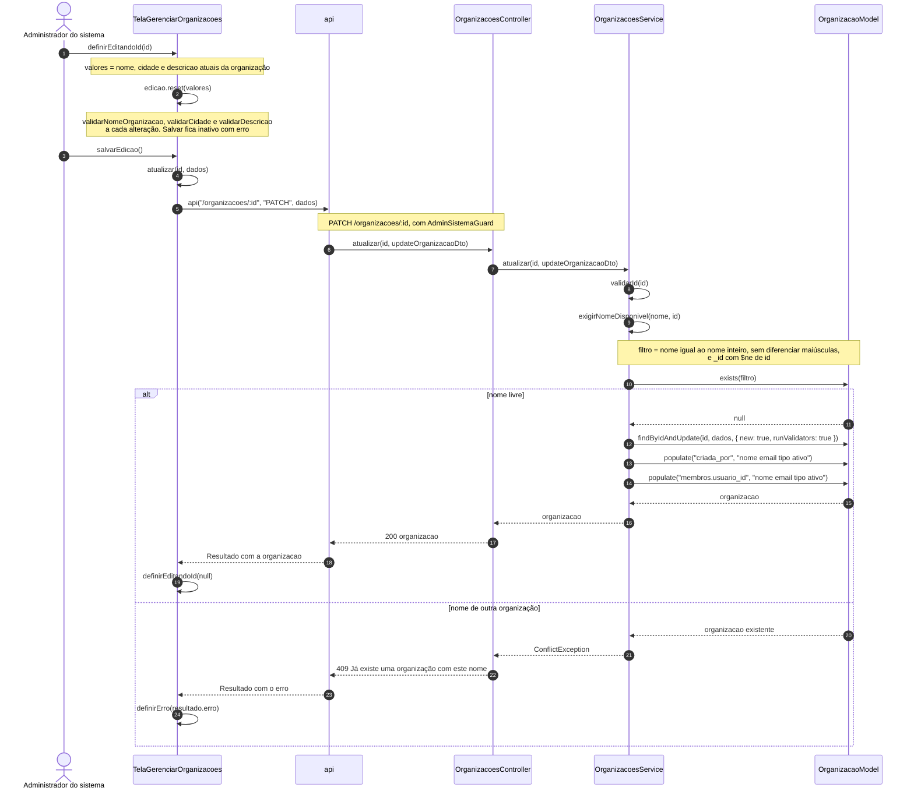
```mermaid
sequenceDiagram
    autonumber
    actor U as Administrador do sistema
    participant T as TelaGerenciarOrganizacoes
    participant A as api
    participant C as OrganizacoesController
    participant S as OrganizacoesService
    participant M as OrganizacaoModel
    U->>T: definirEditandoId(id)
    Note over T: valores = nome, cidade e descricao atuais da organização
    T->>T: edicao.reset(valores)
    Note over T: validarNomeOrganizacao, validarCidade e validarDescricao<br/>a cada alteração. Salvar fica inativo com erro
    U->>T: salvarEdicao()
    T->>T: atualizar(id, dados)
    T->>A: api("/organizacoes/:id", "PATCH", dados)
    Note over A,C: PATCH /organizacoes/:id, com AdminSistemaGuard
    A->>C: atualizar(id, updateOrganizacaoDto)
    C->>S: atualizar(id, updateOrganizacaoDto)
    S->>S: validarId(id)
    S->>S: exigirNomeDisponivel(nome, id)
    Note over S,M: filtro = nome igual ao nome inteiro, sem diferenciar maiúsculas,<br/>e _id com $ne de id
    S->>M: exists(filtro)
    alt nome livre
        M-->>S: null
        S->>M: findByIdAndUpdate(id, dados, { new: true, runValidators: true })
        S->>M: populate("criada_por", "nome email tipo ativo")
        S->>M: populate("membros.usuario_id", "nome email tipo ativo")
        M-->>S: organizacao
        S-->>C: organizacao
        C-->>A: 200 organizacao
        A-->>T: Resultado com a organizacao
        T->>T: definirEditandoId(null)
    else nome de outra organização
        M-->>S: organizacao existente
        S-->>C: ConflictException
        C-->>A: 409 Já existe uma organização com este nome
        A-->>T: Resultado com o erro
        T->>T: definirErro(resultado.erro)
    end
```

## SD-ORG-06 — Excluir organização

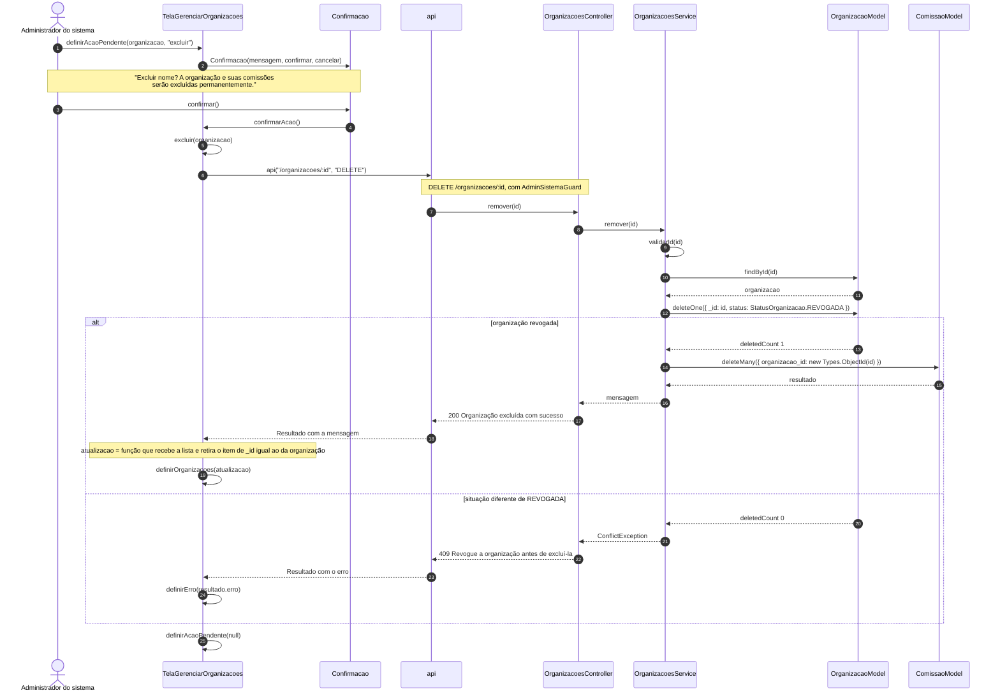
```mermaid
sequenceDiagram
    autonumber
    actor U as Administrador do sistema
    participant T as TelaGerenciarOrganizacoes
    participant D as Confirmacao
    participant A as api
    participant C as OrganizacoesController
    participant S as OrganizacoesService
    participant M as OrganizacaoModel
    participant CM as ComissaoModel
    U->>T: definirAcaoPendente(organizacao, "excluir")
    T->>D: Confirmacao(mensagem, confirmar, cancelar)
    Note over U,D: "Excluir nome? A organização e suas comissões<br/>serão excluídas permanentemente."
    U->>D: confirmar()
    D->>T: confirmarAcao()
    T->>T: excluir(organizacao)
    T->>A: api("/organizacoes/:id", "DELETE")
    Note over A,C: DELETE /organizacoes/:id, com AdminSistemaGuard
    A->>C: remover(id)
    C->>S: remover(id)
    S->>S: validarId(id)
    S->>M: findById(id)
    M-->>S: organizacao
    S->>M: deleteOne({ _id: id, status: StatusOrganizacao.REVOGADA })
    alt organização revogada
        M-->>S: deletedCount 1
        S->>CM: deleteMany({ organizacao_id: new Types.ObjectId(id) })
        CM-->>S: resultado
        S-->>C: mensagem
        C-->>A: 200 Organização excluída com sucesso
        A-->>T: Resultado com a mensagem
        Note over T: atualizacao = função que recebe a lista e retira o item de _id igual ao da organização
        T->>T: definirOrganizacoes(atualizacao)
    else situação diferente de REVOGADA
        M-->>S: deletedCount 0
        S-->>C: ConflictException
        C-->>A: 409 Revogue a organização antes de excluí-la
        A-->>T: Resultado com o erro
        T->>T: definirErro(resultado.erro)
    end
    T->>T: definirAcaoPendente(null)
```

## SD-ORG-07 — Entrar por código

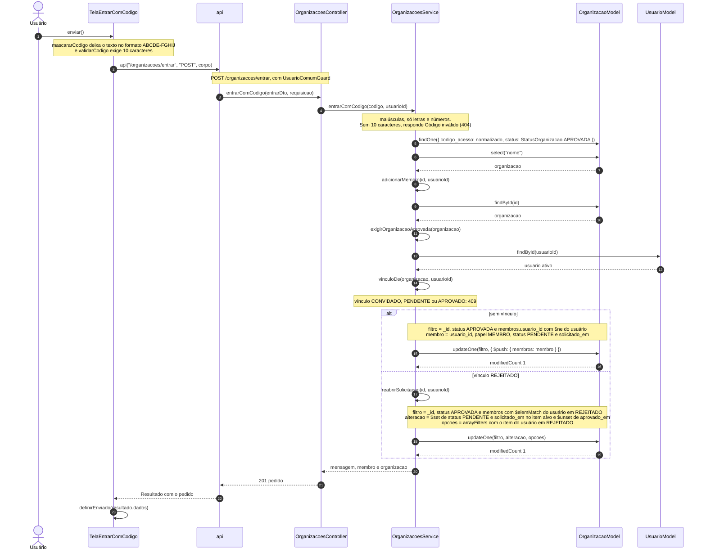
```mermaid
sequenceDiagram
    autonumber
    actor U as Usuário
    participant T as TelaEntrarComCodigo
    participant A as api
    participant C as OrganizacoesController
    participant S as OrganizacoesService
    participant M as OrganizacaoModel
    participant UM as UsuarioModel
    U->>T: enviar()
    Note over T: mascararCodigo deixa o texto no formato ABCDE-FGHIJ<br/>e validarCodigo exige 10 caracteres
    T->>A: api("/organizacoes/entrar", "POST", corpo)
    Note over A,C: POST /organizacoes/entrar, com UsuarioComumGuard
    A->>C: entrarComCodigo(entrarDto, requisicao)
    C->>S: entrarComCodigo(codigo, usuarioId)
    Note over S: maiúsculas, só letras e números.<br/>Sem 10 caracteres, responde Código inválido (404)
    S->>M: findOne({ codigo_acesso: normalizado, status: StatusOrganizacao.APROVADA })
    S->>M: select("nome")
    M-->>S: organizacao
    S->>S: adicionarMembro(id, usuarioId)
    S->>M: findById(id)
    M-->>S: organizacao
    S->>S: exigirOrganizacaoAprovada(organizacao)
    S->>UM: findById(usuarioId)
    UM-->>S: usuario ativo
    S->>S: vinculoDe(organizacao, usuarioId)
    Note over S: vínculo CONVIDADO, PENDENTE ou APROVADO: 409
    alt sem vínculo
        Note over S,M: filtro = _id, status APROVADA e membros.usuario_id com $ne do usuário<br/>membro = usuario_id, papel MEMBRO, status PENDENTE e solicitado_em
        S->>M: updateOne(filtro, { $push: { membros: membro } })
        M-->>S: modifiedCount 1
    else vínculo REJEITADO
        S->>S: reabrirSolicitacao(id, usuarioId)
        Note over S,M: filtro = _id, status APROVADA e membros com $elemMatch do usuário em REJEITADO<br/>alteracao = $set de status PENDENTE e solicitado_em no item alvo e $unset de aprovado_em<br/>opcoes = arrayFilters com o item do usuário em REJEITADO
        S->>M: updateOne(filtro, alteracao, opcoes)
        M-->>S: modifiedCount 1
    end
    S-->>C: mensagem, membro e organizacao
    C-->>A: 201 pedido
    A-->>T: Resultado com o pedido
    T->>T: definirEnviado(resultado.dados)
```

## SD-ORG-08 — Convidar usuário

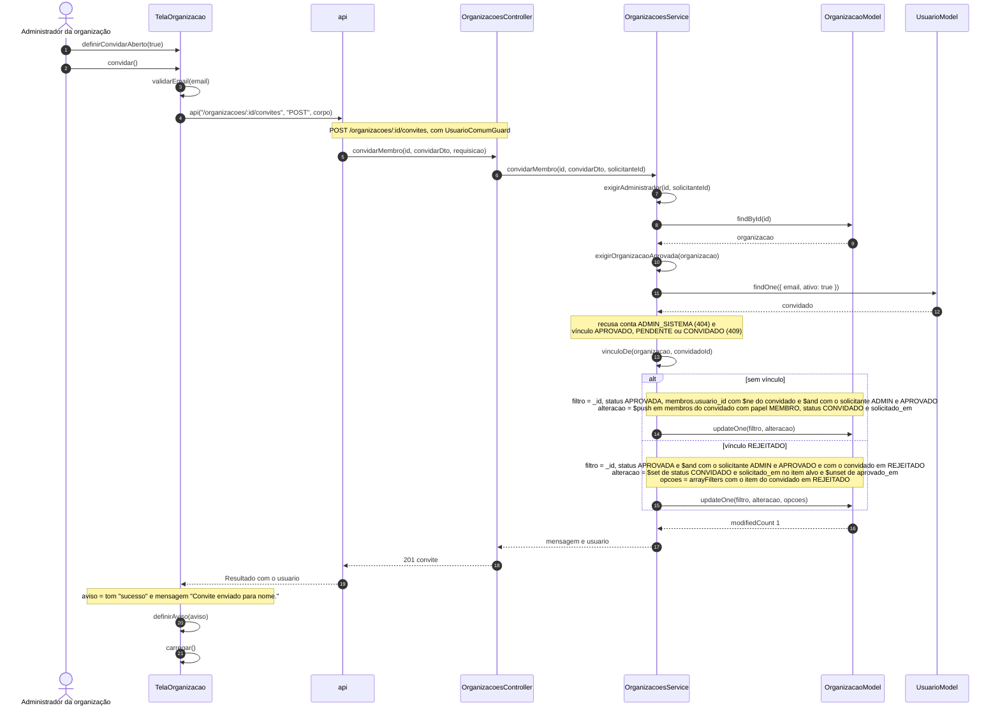
```mermaid
sequenceDiagram
    autonumber
    actor U as Administrador da organização
    participant T as TelaOrganizacao
    participant A as api
    participant C as OrganizacoesController
    participant S as OrganizacoesService
    participant M as OrganizacaoModel
    participant UM as UsuarioModel
    U->>T: definirConvidarAberto(true)
    U->>T: convidar()
    T->>T: validarEmail(email)
    T->>A: api("/organizacoes/:id/convites", "POST", corpo)
    Note over A,C: POST /organizacoes/:id/convites, com UsuarioComumGuard
    A->>C: convidarMembro(id, convidarDto, requisicao)
    C->>S: convidarMembro(id, convidarDto, solicitanteId)
    S->>S: exigirAdministrador(id, solicitanteId)
    S->>M: findById(id)
    M-->>S: organizacao
    S->>S: exigirOrganizacaoAprovada(organizacao)
    S->>UM: findOne({ email, ativo: true })
    UM-->>S: convidado
    Note over S: recusa conta ADMIN_SISTEMA (404) e<br/>vínculo APROVADO, PENDENTE ou CONVIDADO (409)
    S->>S: vinculoDe(organizacao, convidadoId)
    alt sem vínculo
        Note over S,M: filtro = _id, status APROVADA, membros.usuario_id com $ne do convidado e $and com o solicitante ADMIN e APROVADO<br/>alteracao = $push em membros do convidado com papel MEMBRO, status CONVIDADO e solicitado_em
        S->>M: updateOne(filtro, alteracao)
    else vínculo REJEITADO
        Note over S,M: filtro = _id, status APROVADA e $and com o solicitante ADMIN e APROVADO e com o convidado em REJEITADO<br/>alteracao = $set de status CONVIDADO e solicitado_em no item alvo e $unset de aprovado_em<br/>opcoes = arrayFilters com o item do convidado em REJEITADO
        S->>M: updateOne(filtro, alteracao, opcoes)
    end
    M-->>S: modifiedCount 1
    S-->>C: mensagem e usuario
    C-->>A: 201 convite
    A-->>T: Resultado com o usuario
    Note over T: aviso = tom "sucesso" e mensagem "Convite enviado para nome."
    T->>T: definirAviso(aviso)
    T->>T: carregar()
```

## SD-ORG-09 — Analisar solicitação de entrada

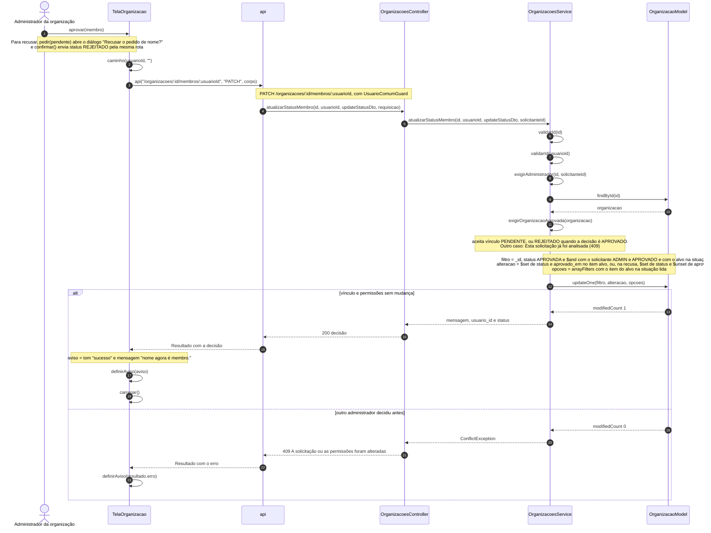
```mermaid
sequenceDiagram
    autonumber
    actor U as Administrador da organização
    participant T as TelaOrganizacao
    participant A as api
    participant C as OrganizacoesController
    participant S as OrganizacoesService
    participant M as OrganizacaoModel
    U->>T: aprovar(membro)
    Note over U,T: Para recusar, pedir(pendente) abre o diálogo "Recusar o pedido de nome?"<br/>e confirmar() envia status REJEITADO pela mesma rota
    T->>T: caminho(usuarioId, "")
    T->>A: api("/organizacoes/:id/membros/:usuarioId", "PATCH", corpo)
    Note over A,C: PATCH /organizacoes/:id/membros/:usuarioId, com UsuarioComumGuard
    A->>C: atualizarStatusMembro(id, usuarioId, updateStatusDto, requisicao)
    C->>S: atualizarStatusMembro(id, usuarioId, updateStatusDto, solicitanteId)
    S->>S: validarId(id)
    S->>S: validarId(usuarioId)
    S->>S: exigirAdministrador(id, solicitanteId)
    S->>M: findById(id)
    M-->>S: organizacao
    S->>S: exigirOrganizacaoAprovada(organizacao)
    Note over S: aceita vínculo PENDENTE, ou REJEITADO quando a decisão é APROVADO.<br/>Outro caso: Esta solicitação já foi analisada (409)
    Note over S,M: filtro = _id, status APROVADA e $and com o solicitante ADMIN e APROVADO e com o alvo na situação lida<br/>alteracao = $set de status e aprovado_em no item alvo, ou, na recusa, $set de status e $unset de aprovado_em<br/>opcoes = arrayFilters com o item do alvo na situação lida
    S->>M: updateOne(filtro, alteracao, opcoes)
    alt vínculo e permissões sem mudança
        M-->>S: modifiedCount 1
        S-->>C: mensagem, usuario_id e status
        C-->>A: 200 decisão
        A-->>T: Resultado com a decisão
        Note over T: aviso = tom "sucesso" e mensagem "nome agora é membro."
        T->>T: definirAviso(aviso)
        T->>T: carregar()
    else outro administrador decidiu antes
        M-->>S: modifiedCount 0
        S-->>C: ConflictException
        C-->>A: 409 A solicitação ou as permissões foram alteradas
        A-->>T: Resultado com o erro
        T->>T: definirAviso(resultado.erro)
    end
```

## SD-ORG-10 — Gerar novo código de acesso

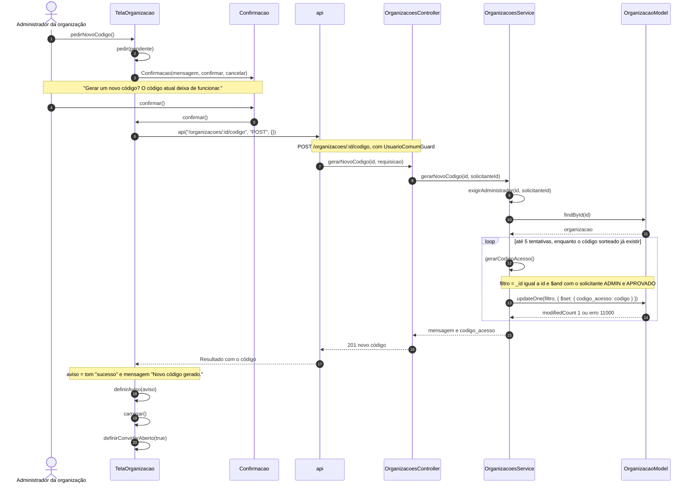
```mermaid
sequenceDiagram
    autonumber
    actor U as Administrador da organização
    participant T as TelaOrganizacao
    participant D as Confirmacao
    participant A as api
    participant C as OrganizacoesController
    participant S as OrganizacoesService
    participant M as OrganizacaoModel
    U->>T: pedirNovoCodigo()
    T->>T: pedir(pendente)
    T->>D: Confirmacao(mensagem, confirmar, cancelar)
    Note over U,D: "Gerar um novo código? O código atual deixa de funcionar."
    U->>D: confirmar()
    D->>T: confirmar()
    T->>A: api("/organizacoes/:id/codigo", "POST", {})
    Note over A,C: POST /organizacoes/:id/codigo, com UsuarioComumGuard
    A->>C: gerarNovoCodigo(id, requisicao)
    C->>S: gerarNovoCodigo(id, solicitanteId)
    S->>S: exigirAdministrador(id, solicitanteId)
    S->>M: findById(id)
    M-->>S: organizacao
    loop até 5 tentativas, enquanto o código sorteado já existir
        S->>S: gerarCodigoAcesso()
        Note over S,M: filtro = _id igual a id e $and com o solicitante ADMIN e APROVADO
        S->>M: updateOne(filtro, { $set: { codigo_acesso: codigo } })
        M-->>S: modifiedCount 1 ou erro 11000
    end
    S-->>C: mensagem e codigo_acesso
    C-->>A: 201 novo código
    A-->>T: Resultado com o código
    Note over T: aviso = tom "sucesso" e mensagem "Novo código gerado."
    T->>T: definirAviso(aviso)
    T->>T: carregar()
    T->>T: definirConvidarAberto(true)
```

## SD-ORG-11 — Responder convite

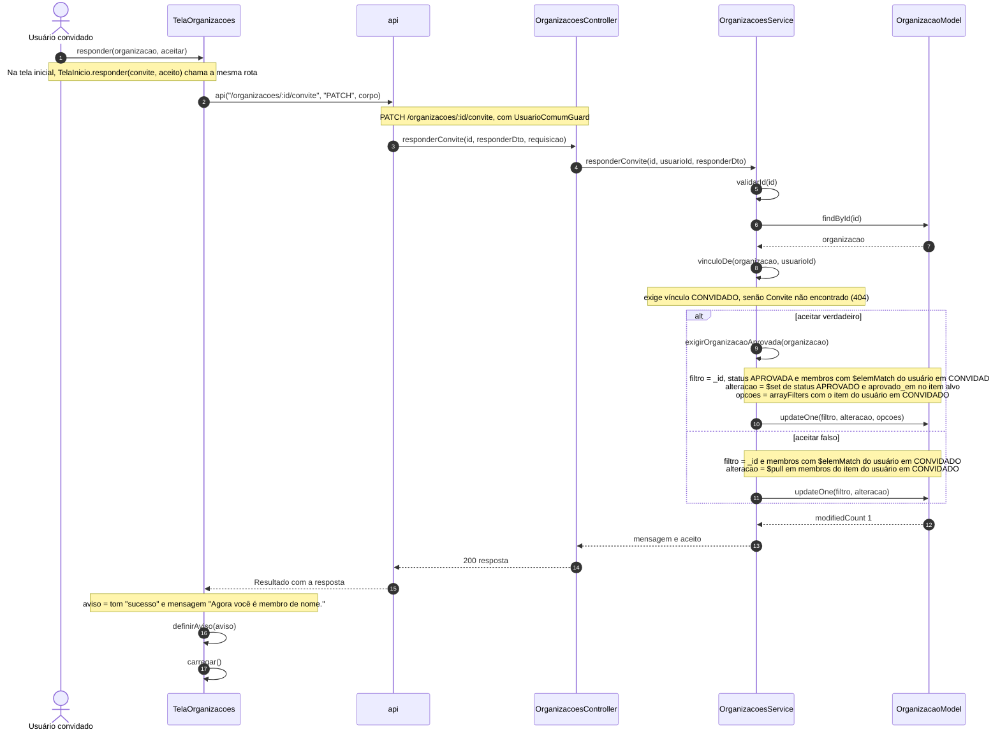
```mermaid
sequenceDiagram
    autonumber
    actor U as Usuário convidado
    participant T as TelaOrganizacoes
    participant A as api
    participant C as OrganizacoesController
    participant S as OrganizacoesService
    participant M as OrganizacaoModel
    U->>T: responder(organizacao, aceitar)
    Note over U,T: Na tela inicial, TelaInicio.responder(convite, aceito) chama a mesma rota
    T->>A: api("/organizacoes/:id/convite", "PATCH", corpo)
    Note over A,C: PATCH /organizacoes/:id/convite, com UsuarioComumGuard
    A->>C: responderConvite(id, responderDto, requisicao)
    C->>S: responderConvite(id, usuarioId, responderDto)
    S->>S: validarId(id)
    S->>M: findById(id)
    M-->>S: organizacao
    S->>S: vinculoDe(organizacao, usuarioId)
    Note over S: exige vínculo CONVIDADO, senão Convite não encontrado (404)
    alt aceitar verdadeiro
        S->>S: exigirOrganizacaoAprovada(organizacao)
        Note over S,M: filtro = _id, status APROVADA e membros com $elemMatch do usuário em CONVIDADO<br/>alteracao = $set de status APROVADO e aprovado_em no item alvo<br/>opcoes = arrayFilters com o item do usuário em CONVIDADO
        S->>M: updateOne(filtro, alteracao, opcoes)
    else aceitar falso
        Note over S,M: filtro = _id e membros com $elemMatch do usuário em CONVIDADO<br/>alteracao = $pull em membros do item do usuário em CONVIDADO
        S->>M: updateOne(filtro, alteracao)
    end
    M-->>S: modifiedCount 1
    S-->>C: mensagem e aceito
    C-->>A: 200 resposta
    A-->>T: Resultado com a resposta
    Note over T: aviso = tom "sucesso" e mensagem "Agora você é membro de nome."
    T->>T: definirAviso(aviso)
    T->>T: carregar()
```

## SD-ORG-12 — Alterar papel do membro

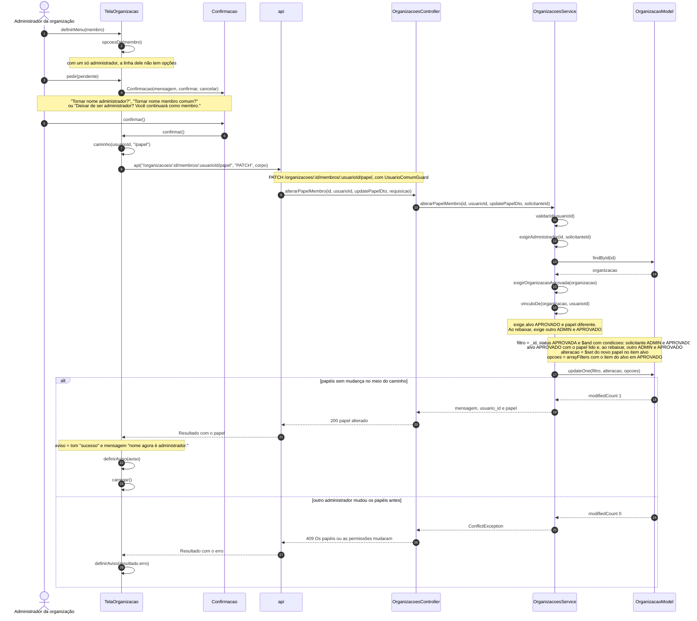
```mermaid
sequenceDiagram
    autonumber
    actor U as Administrador da organização
    participant T as TelaOrganizacao
    participant D as Confirmacao
    participant A as api
    participant C as OrganizacoesController
    participant S as OrganizacoesService
    participant M as OrganizacaoModel
    U->>T: definirMenu(membro)
    T->>T: opcoesDe(membro)
    Note over T: com um só administrador, a linha dele não tem opções
    U->>T: pedir(pendente)
    T->>D: Confirmacao(mensagem, confirmar, cancelar)
    Note over U,D: "Tornar nome administrador?", "Tornar nome membro comum?"<br/>ou "Deixar de ser administrador? Você continuará como membro."
    U->>D: confirmar()
    D->>T: confirmar()
    T->>T: caminho(usuarioId, "/papel")
    T->>A: api("/organizacoes/:id/membros/:usuarioId/papel", "PATCH", corpo)
    Note over A,C: PATCH /organizacoes/:id/membros/:usuarioId/papel, com UsuarioComumGuard
    A->>C: alterarPapelMembro(id, usuarioId, updatePapelDto, requisicao)
    C->>S: alterarPapelMembro(id, usuarioId, updatePapelDto, solicitanteId)
    S->>S: validarId(usuarioId)
    S->>S: exigirAdministrador(id, solicitanteId)
    S->>M: findById(id)
    M-->>S: organizacao
    S->>S: exigirOrganizacaoAprovada(organizacao)
    S->>S: vinculoDe(organizacao, usuarioId)
    Note over S: exige alvo APROVADO e papel diferente.<br/>Ao rebaixar, exige outro ADMIN e APROVADO
    Note over S,M: filtro = _id, status APROVADA e $and com condicoes: solicitante ADMIN e APROVADO,<br/>alvo APROVADO com o papel lido e, ao rebaixar, outro ADMIN e APROVADO<br/>alteracao = $set do novo papel no item alvo<br/>opcoes = arrayFilters com o item do alvo em APROVADO
    S->>M: updateOne(filtro, alteracao, opcoes)
    alt papéis sem mudança no meio do caminho
        M-->>S: modifiedCount 1
        S-->>C: mensagem, usuario_id e papel
        C-->>A: 200 papel alterado
        A-->>T: Resultado com o papel
        Note over T: aviso = tom "sucesso" e mensagem "nome agora é administrador."
        T->>T: definirAviso(aviso)
        T->>T: carregar()
    else outro administrador mudou os papéis antes
        M-->>S: modifiedCount 0
        S-->>C: ConflictException
        C-->>A: 409 Os papéis ou as permissões mudaram
        A-->>T: Resultado com o erro
        T->>T: definirAviso(resultado.erro)
    end
```

## SD-ORG-13 — Remover vínculo de membro

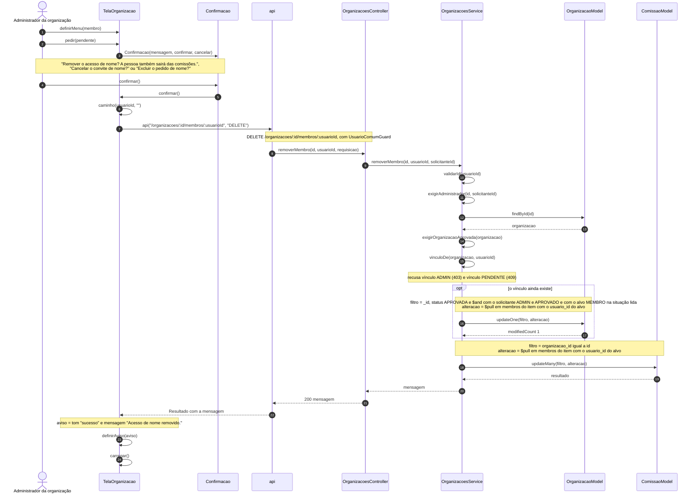
```mermaid
sequenceDiagram
    autonumber
    actor U as Administrador da organização
    participant T as TelaOrganizacao
    participant D as Confirmacao
    participant A as api
    participant C as OrganizacoesController
    participant S as OrganizacoesService
    participant M as OrganizacaoModel
    participant CM as ComissaoModel
    U->>T: definirMenu(membro)
    U->>T: pedir(pendente)
    T->>D: Confirmacao(mensagem, confirmar, cancelar)
    Note over U,D: "Remover o acesso de nome? A pessoa também sairá das comissões.",<br/>"Cancelar o convite de nome?" ou "Excluir o pedido de nome?"
    U->>D: confirmar()
    D->>T: confirmar()
    T->>T: caminho(usuarioId, "")
    T->>A: api("/organizacoes/:id/membros/:usuarioId", "DELETE")
    Note over A,C: DELETE /organizacoes/:id/membros/:usuarioId, com UsuarioComumGuard
    A->>C: removerMembro(id, usuarioId, requisicao)
    C->>S: removerMembro(id, usuarioId, solicitanteId)
    S->>S: validarId(usuarioId)
    S->>S: exigirAdministrador(id, solicitanteId)
    S->>M: findById(id)
    M-->>S: organizacao
    S->>S: exigirOrganizacaoAprovada(organizacao)
    S->>S: vinculoDe(organizacao, usuarioId)
    Note over S: recusa vínculo ADMIN (403) e vínculo PENDENTE (409)
    opt o vínculo ainda existe
        Note over S,M: filtro = _id, status APROVADA e $and com o solicitante ADMIN e APROVADO e com o alvo MEMBRO na situação lida<br/>alteracao = $pull em membros do item com o usuario_id do alvo
        S->>M: updateOne(filtro, alteracao)
        M-->>S: modifiedCount 1
    end
    Note over S,CM: filtro = organizacao_id igual a id<br/>alteracao = $pull em membros do item com o usuario_id do alvo
    S->>CM: updateMany(filtro, alteracao)
    CM-->>S: resultado
    S-->>C: mensagem
    C-->>A: 200 mensagem
    A-->>T: Resultado com a mensagem
    Note over T: aviso = tom "sucesso" e mensagem "Acesso de nome removido."
    T->>T: definirAviso(aviso)
    T->>T: carregar()
```

## SD-ORG-14 — Consultar membros da organização

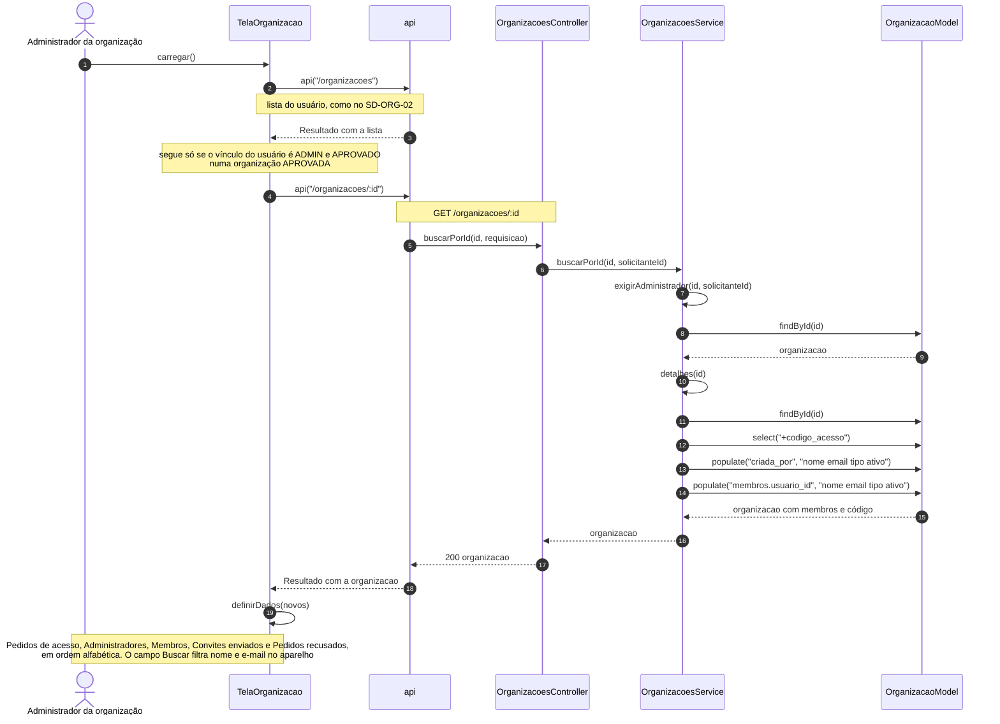
```mermaid
sequenceDiagram
    autonumber
    actor U as Administrador da organização
    participant T as TelaOrganizacao
    participant A as api
    participant C as OrganizacoesController
    participant S as OrganizacoesService
    participant M as OrganizacaoModel
    U->>T: carregar()
    T->>A: api("/organizacoes")
    Note over T,A: lista do usuário, como no SD-ORG-02
    A-->>T: Resultado com a lista
    Note over T: segue só se o vínculo do usuário é ADMIN e APROVADO<br/>numa organização APROVADA
    T->>A: api("/organizacoes/:id")
    Note over A,C: GET /organizacoes/:id
    A->>C: buscarPorId(id, requisicao)
    C->>S: buscarPorId(id, solicitanteId)
    S->>S: exigirAdministrador(id, solicitanteId)
    S->>M: findById(id)
    M-->>S: organizacao
    S->>S: detalhes(id)
    S->>M: findById(id)
    S->>M: select("+codigo_acesso")
    S->>M: populate("criada_por", "nome email tipo ativo")
    S->>M: populate("membros.usuario_id", "nome email tipo ativo")
    M-->>S: organizacao com membros e código
    S-->>C: organizacao
    C-->>A: 200 organizacao
    A-->>T: Resultado com a organizacao
    T->>T: definirDados(novos)
    Note over U,T: Pedidos de acesso, Administradores, Membros, Convites enviados e Pedidos recusados,<br/>em ordem alfabética. O campo Buscar filtra nome e e-mail no aparelho
```

## Rastreabilidade

SD-ORG-01 a SD-ORG-14 correspondem, na mesma ordem, a UC-ORG-01 a UC-ORG-14 e a RF-ORG-01 a RF-ORG-14.
