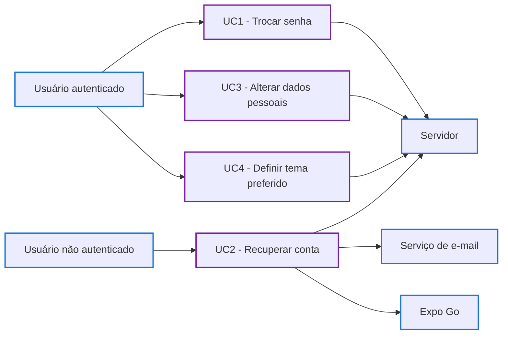

# Diagrama de Casos de Uso - Configurações de Usuário

## Casos de uso

- **UC1 - Trocar senha:** o usuário autenticado informa a senha atual e escolhe uma nova senha para os próximos acessos.
- **UC2 - Recuperar conta:** o usuário sem acesso à conta solicita um link temporário por e-mail e define uma nova senha no Expo Go.
- **UC3 - Alterar dados pessoais:** o usuário autenticado consulta e altera seu nome e seu e-mail.
- **UC4 - Definir tema preferido:** o usuário escolhe entre tema claro, escuro ou o tema do sistema; a escolha só é aplicada após o salvamento ser confirmado.

