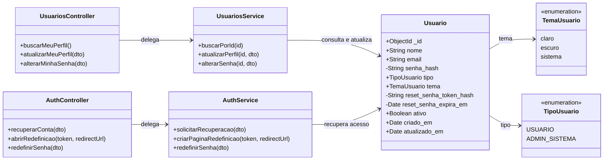

# Diagrama de Classes - Configurações de Usuário

## Explicação

- `Usuario` concentra os dados pessoais, o hash da senha, a preferência de tema e os dois campos temporários da recuperação.
- `UsuariosController` expõe as rotas autenticadas do perfil e da troca de senha; `JwtAuthGuard` identifica o usuário pelo token de acesso.
- `UsuariosService` contém as regras de e-mail único, comparação da senha atual e gravação dos novos valores.
- `AuthController` expõe as rotas públicas da recuperação e a página intermediária usada pelo navegador para abrir o Expo Go.
- `AuthService` gera o token, envia o e-mail, valida expiração e uso único e grava a nova senha.
- Senhas nunca são persistidas em texto: somente `senha_hash`, produzido pelo bcrypt.
- O token de recuperação original vai no link; o banco guarda somente `reset_senha_token_hash`, produzido por SHA-256.

---

# Dicionário de Dados das Classes

## Classe `Usuario`

| Campo | Tipo | Obrigatório | Visibilidade padrão | Descrição |
|---|---|---:|---|---|
| `_id` | ObjectId | Sim | Pública | Identificador criado pelo MongoDB. |
| `nome` | string | Sim | Pública | Nome da pessoa usuária. A interface exige ao menos 3 caracteres. |
| `email` | string | Sim | Pública | E-mail único, normalizado para minúsculas e sem espaços nas extremidades. |
| `senha_hash` | string | Sim | Oculta | Hash bcrypt usado na autenticação e na troca de senha. |
| `senhaHash` | string | Não | Oculta | Campo legado aceito apenas para compatibilidade com contas antigas. |
| `tipo` | enum | Sim | Pública | `USUARIO` ou `ADMIN_SISTEMA`. |
| `tema` | enum | Sim | Pública | `claro`, `escuro` ou `sistema`; padrão `sistema`. |
| `reset_senha_token_hash` | string | Não | Oculta | SHA-256 do token de recuperação ativo. |
| `reset_senha_expira_em` | Date | Não | Oculta | Data limite para usar o token de recuperação. |
| `ativo` | boolean | Sim | Pública | Controla se a conta pode autenticar e recuperar acesso. |
| `criado_em` | Date | Automático | Pública | Data de criação do documento. |
| `atualizado_em` | Date | Automático | Pública | Data da última alteração. |

## DTO `AtualizarPerfilDto`

| Campo | Tipo | Obrigatório | Regra |
|---|---|---:|---|
| `nome` | string | Não | Mínimo de 2 caracteres no backend; a interface exige 3. |
| `email` | string | Não | Deve ter formato de e-mail válido. |
| `tema` | enum | Não | Deve ser `claro`, `escuro` ou `sistema`. |

## DTO `AlterarSenhaDto`

| Campo | Tipo | Obrigatório | Regra |
|---|---|---:|---|
| `senha_atual` | string | Sim | Deve corresponder ao hash existente. |
| `nova_senha` | string | Sim | Mínimo de 8 caracteres e diferente da atual. |

## DTO `RecuperarContaDto`

| Campo | Tipo | Obrigatório | Regra |
|---|---|---:|---|
| `email` | string | Sim | Deve ter formato válido; é normalizado antes da busca. |
| `redirect_url` | string | Não | No Expo Go, deve usar `exp://` ou `exps://` e apontar exatamente para `/--/login/redefinir-senha`. |

## DTO `RedefinirSenhaDto`

| Campo | Tipo | Obrigatório | Regra |
|---|---|---:|---|
| `token` | string | Sim | Precisa corresponder a um hash ativo e não expirado. |
| `nova_senha` | string | Sim | Mínimo de 8 caracteres. |

