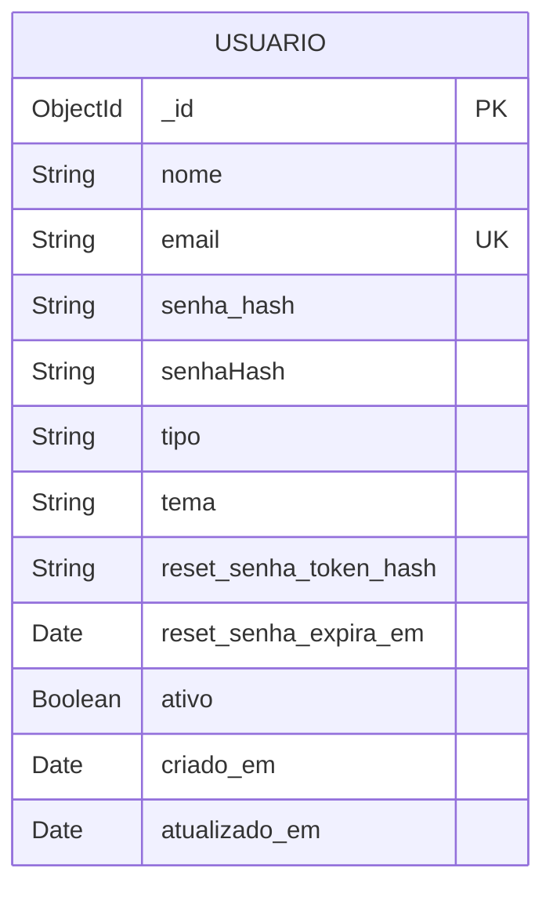

# Diagrama Relacional - Configurações de Usuário

O MongoDB armazena os dados em um único documento da coleção `usuarios`. O modelo abaixo representa essa estrutura de forma relacional para manter o padrão da documentação do projeto.

## Relacionamentos e decisões

- Configurações de usuário não criam uma nova coleção: todos os campos pertencem ao documento `USUARIO`.
- `email` possui restrição de unicidade e é normalizado antes de ser salvo.
- `tema` aceita somente os valores definidos em `TemaUsuario`.
- `senha_hash`, `senhaHash`, `reset_senha_token_hash` e `reset_senha_expira_em` não aparecem nas consultas comuns por usarem `select: false` no schema.
- Os campos `reset_senha_token_hash` e `reset_senha_expira_em` existem apenas enquanto há uma recuperação pendente e são apagados depois do uso.

