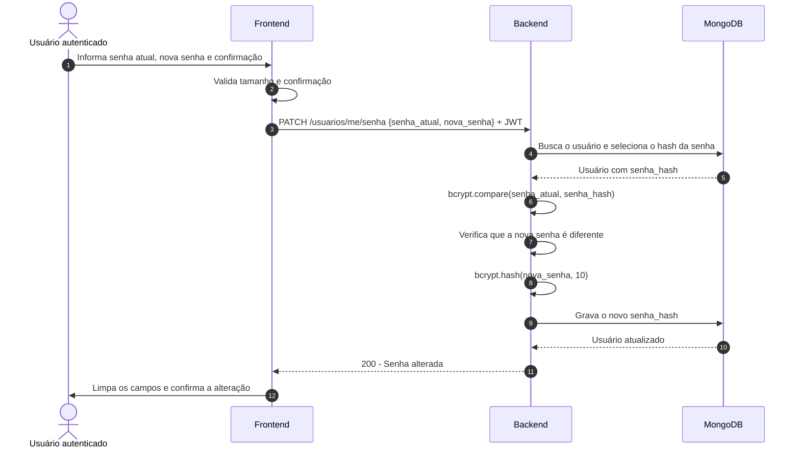
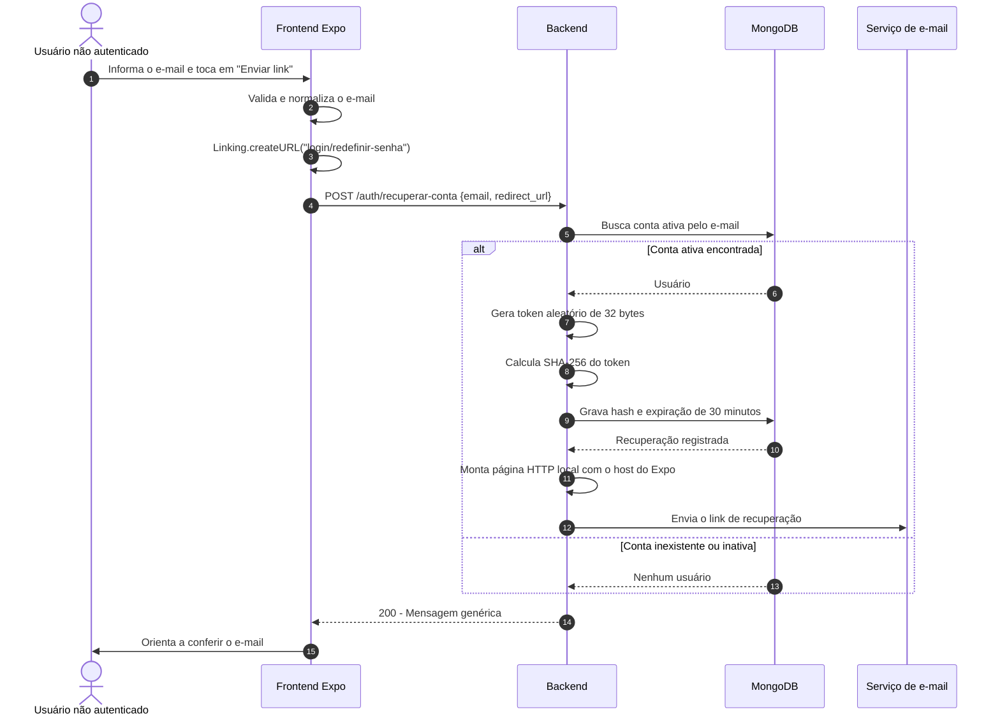
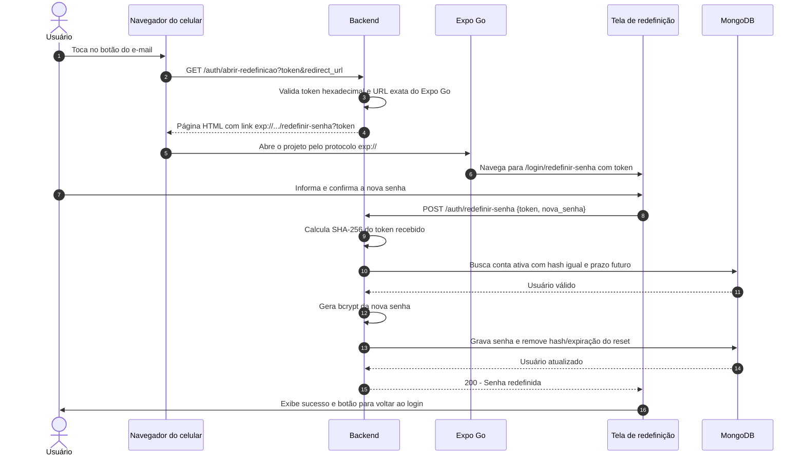
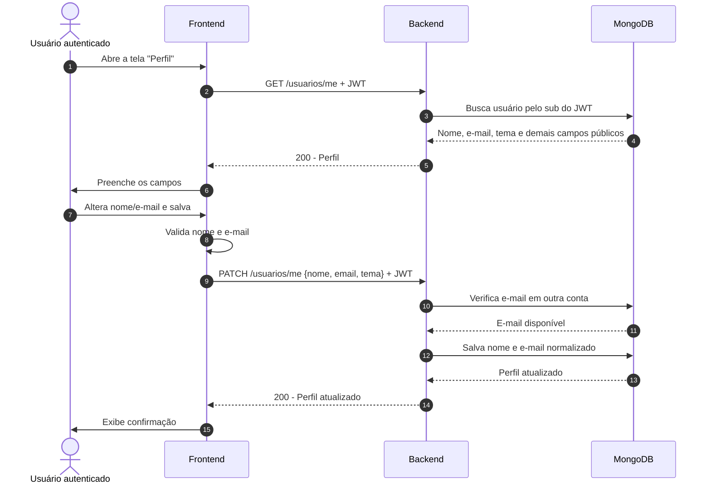
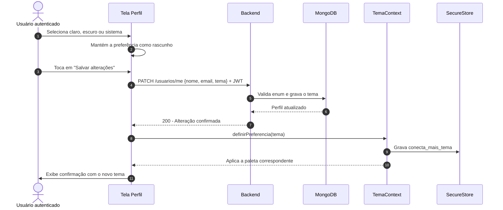

# Diagramas de Sequência - Configurações de Usuário

## 1. Trocar senha (RF-01)

### Exceções principais

- Senha atual incorreta: o backend recusa a operação.
- Nova senha igual à atual: o backend recusa a operação.
- Senha ou confirmação inválida: o frontend não envia a requisição.

---

## 2A. Solicitar recuperação de conta (RF-02)

### Regra de privacidade

O resultado mostrado é o mesmo para e-mail existente, inexistente ou inativo. Assim, a tela não confirma quais pessoas possuem conta.

---

## 2B. Abrir o link e redefinir a senha (RF-02)

### Exceções principais

- Token malformado: a página intermediária devolve erro.
- URL do Expo alterada: o backend recusa o redirecionamento.
- Token inexistente, já usado ou expirado: a redefinição é recusada.
- Expo ou backend desligado, ou celular fora da rede: o fluxo local não consegue abrir a tela.

---

## 3. Alterar dados pessoais (RF-03)

### Exceção principal

Se o e-mail já pertence a outra conta, o backend responde conflito e não salva nenhuma alteração.

---

## 4. Definir tema preferido (RF-04)

### Comportamento da opção `sistema`

O `TemaContext` consulta `useColorScheme()`. Se o aparelho estiver em modo escuro, usa a paleta escura; nos demais casos, usa a clara.

