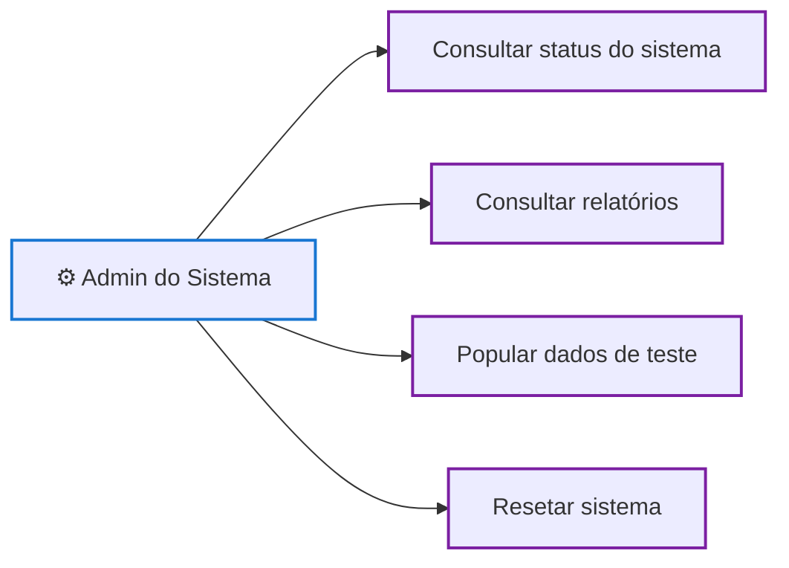

# Diagrama de Casos de Uso

**Observação:** não há caso de uso de "reinicialização de subsistemas" — a arquitetura (backend único, sem subsistemas isolados) não permite reiniciar um módulo de forma real. Decisão explicada no arquivo de requisitos funcionais.
