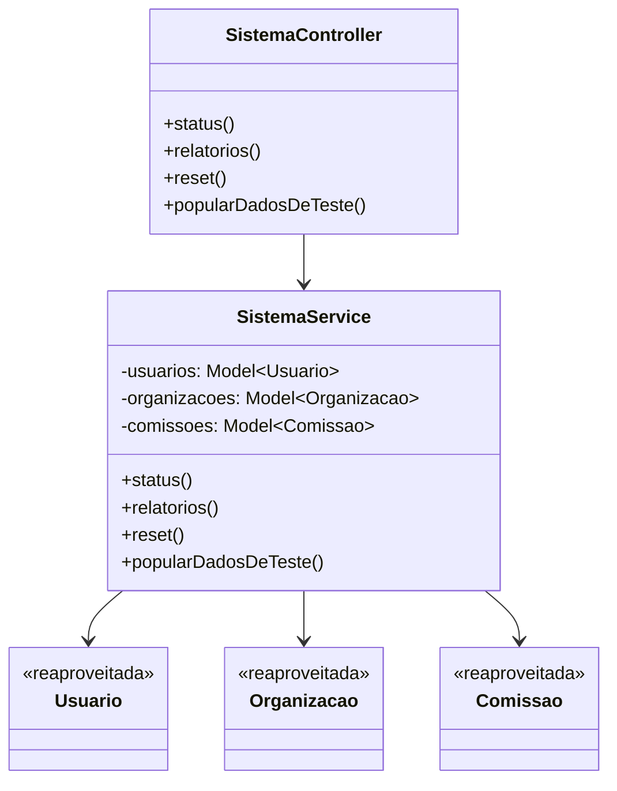

# Diagrama de Classes

```mermaid
classDiagram
    class SistemaController {
        +status()
        +relatorios()
        +reset()
        +popularDadosDeTeste()
    }

    class SistemaService {
        -usuarios: Model~Usuario~
        -organizacoes: Model~Organizacao~
        -comissoes: Model~Comissao~
        +status()
        +relatorios()
        +reset()
        +popularDadosDeTeste()
    }

    class Usuario {
        <<reaproveitada>>
    }
    class Organizacao {
        <<reaproveitada>>
    }
    class Comissao {
        <<reaproveitada>>
    }

    SistemaController --> SistemaService
    SistemaService --> Usuario
    SistemaService --> Organizacao
    SistemaService --> Comissao
```

O módulo não cria nenhuma classe/entidade nova de banco — reaproveita `Usuario`, `Organizacao` e `Comissao` já existentes no projeto.
