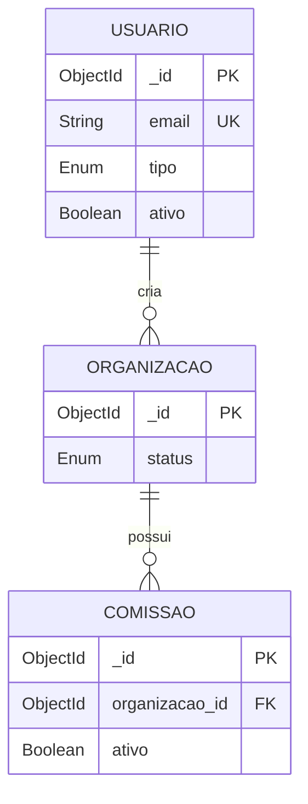

# Diagrama Relacional

Este incremento não cria tabelas novas — usa as mesmas entidades já modeladas no cadastro de usuário e comissões.

| Ação do módulo | Tabelas envolvidas | Operação |
|-----------------|----------------------|----------|
| Status / Relatórios | usuario, organizacao, comissao | `COUNT` |
| Popular dados de teste | usuario, organizacao, comissao | `INSERT` |
| Reset | usuario (exceto admin), organizacao, comissao | `DELETE` |
