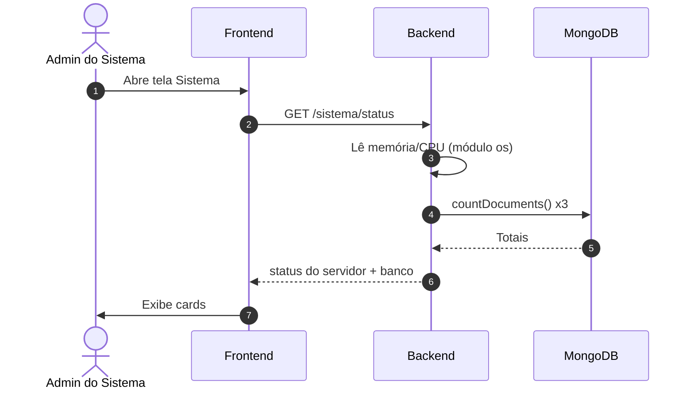
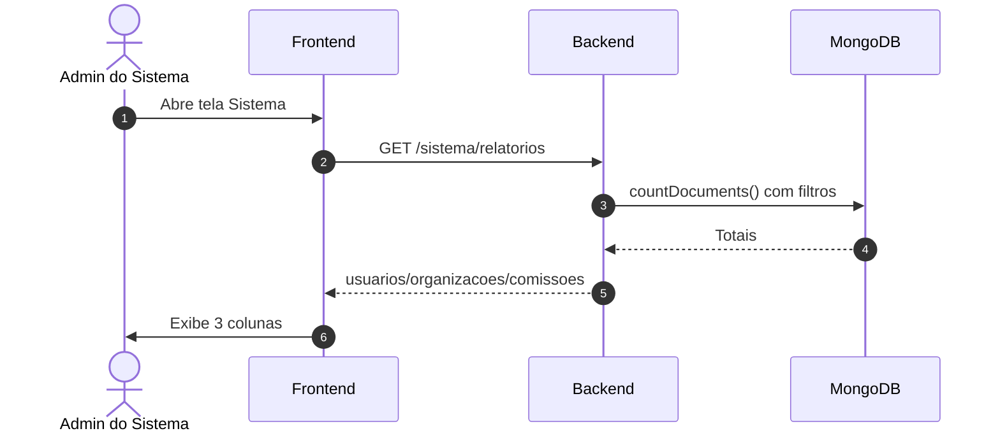
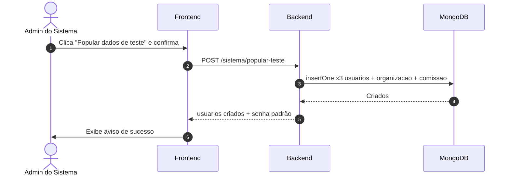
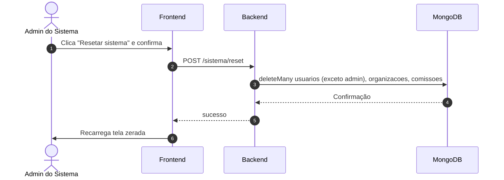

# Diagramas de Sequência

## 1. Status do sistema

```mermaid
sequenceDiagram
    autonumber
    actor Admin as Admin do Sistema
    participant Front as Frontend
    participant API as Backend
    participant DB as MongoDB

    Admin->>Front: Abre tela Sistema
    Front->>API: GET /sistema/status
    API->>API: Lê memória/CPU (módulo os)
    API->>DB: countDocuments() x3
    DB-->>API: Totais
    API-->>Front: status do servidor + banco
    Front->>Admin: Exibe cards
```

## 2. Relatórios

```mermaid
sequenceDiagram
    autonumber
    actor Admin as Admin do Sistema
    participant Front as Frontend
    participant API as Backend
    participant DB as MongoDB

    Admin->>Front: Abre tela Sistema
    Front->>API: GET /sistema/relatorios
    API->>DB: countDocuments() com filtros
    DB-->>API: Totais
    API-->>Front: usuarios/organizacoes/comissoes
    Front->>Admin: Exibe 3 colunas
```

## 3. Popular dados de teste

```mermaid
sequenceDiagram
    autonumber
    actor Admin as Admin do Sistema
    participant Front as Frontend
    participant API as Backend
    participant DB as MongoDB

    Admin->>Front: Clica "Popular dados de teste" e confirma
    Front->>API: POST /sistema/popular-teste
    API->>DB: insertOne x3 usuarios + organizacao + comissao
    DB-->>API: Criados
    API-->>Front: usuarios criados + senha padrão
    Front->>Admin: Exibe aviso de sucesso
```

## 4. Reset do sistema

```mermaid
sequenceDiagram
    autonumber
    actor Admin as Admin do Sistema
    participant Front as Frontend
    participant API as Backend
    participant DB as MongoDB

    Admin->>Front: Clica "Resetar sistema" e confirma
    Front->>API: POST /sistema/reset
    API->>DB: deleteMany usuarios (exceto admin), organizacoes, comissoes
    DB-->>API: Confirmação
    API-->>Front: sucesso
    Front->>Admin: Recarrega tela zerada
```
