# Diagramas de sequência — Reuniões

> Padrão da disciplina · Módulo REU · Revisado em 27/11/2026

## Resumo

Há um diagrama para cada requisito de [Requisitos funcionais](2%20-%20requisitos-funcionais-reunioes.md), com o mesmo número. As linhas de vida são classes e módulos que existem no código: as telas do aplicativo, o componente `Confirmacao`, o contexto `ToastProvider`, os módulos `api`, `anexos`, `pdf`, `pdfListaPresenca` e `autenticacaoLocal`, os controllers, os services, os models do Mongoose e as bibliotecas chamadas diretamente (`Router`, `Clipboard`, `File`, `Print`, `Sharing`, `GridFSBucket`, `GridFSBucketWriteStream`, `events`, `crypto`, `nodemailer` e `Transporter`). Todas estão no [diagrama de classes](3%20-%20diagrama-classes-reunioes.md), com os métodos chamados aqui. Quando o método é de um objeto guardado numa variável, como `copia.upload(url, opcoes)` ou `envio.end(dados)`, a mensagem vai para a linha de vida da classe desse objeto e a nota diz qual é a variável. Toda mensagem é a chamada de um método existente, com seus parâmetros, e as mensagens são numeradas na ordem em que acontecem. Os retornos voltam pela cadeia, na ordem inversa. Regras que não são métodos, como comparar horários, e o conteúdo dos filtros e das alterações enviados ao banco aparecem em notas; nas mensagens, eles são os parâmetros `filtro`, `alteracao` e `opcoes`.

Em todos os diagramas, a chamada do módulo `api` ao controller é uma requisição HTTP que passa antes por `ApiKeyGuard`, `JwtAuthGuard` e `UsuarioComumGuard`; a rota está indicada na nota. Para não repetir, os diagramas mostram `carregar(id, usuarioId)` do `ReunioesService` só com a leitura da reunião; antes dela, o método chama `validarId(id)` e `validarUsuario(usuarioId)`, que lê o usuário com `UsuarioModel.findById`. Da mesma forma, `carregar(id, usuarioId, presidente)` do `PresencasService` aparece completo só no SD-REU-17.

Para caber legível na largura da página, cada diagrama está dividido em partes, cada uma com no máximo cinco linhas de vida, em geral uma para o aplicativo, uma para a API e uma para o serviço e os dados. A linha de vida da fronteira aparece nas duas partes vizinhas, e a numeração das mensagens continua de uma parte para a outra: quando uma parte retoma depois de mensagens que estão em outra, uma nota diz em qual parte elas estão. Um bloco `alt`, `opt`, `loop` ou `par` que atravessa partes aparece em cada uma delas com a mesma condição.

## SD-REU-01 — Agendar reunião

### SD-REU-01 — parte 1 de 4: no aplicativo

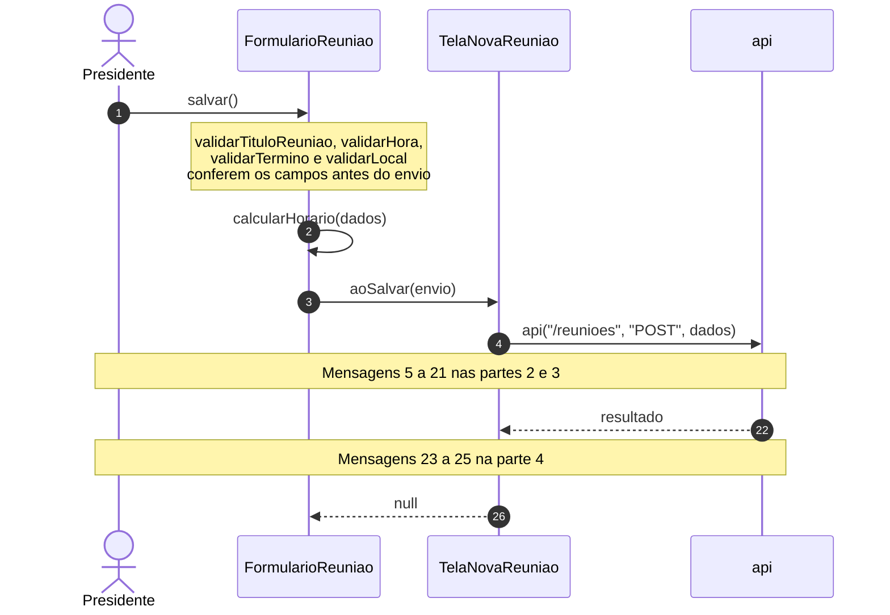
```mermaid
sequenceDiagram
    autonumber 1
    actor U as Presidente
    participant F as FormularioReuniao
    participant N as TelaNovaReuniao
    participant A as api
    U->>F: salvar()
    Note over F: validarTituloReuniao, validarHora,<br/>validarTermino e validarLocal<br/>conferem os campos antes do envio
    F->>F: calcularHorario(dados)
    F->>N: aoSalvar(envio)
    N->>A: api("/reunioes", "POST", dados)
    Note over U,A: Mensagens 5 a 21 nas partes 2 e 3
    autonumber 22
    A-->>N: resultado
    Note over U,A: Mensagens 23 a 25 na parte 4
    autonumber 26
    N-->>F: null
```

Figura 4 — Diagrama de sequência SD-REU-01 (Agendar reunião), parte 1 de 4: no aplicativo. Fonte: equipe Conecta+.

### SD-REU-01 — parte 2 de 4: na API

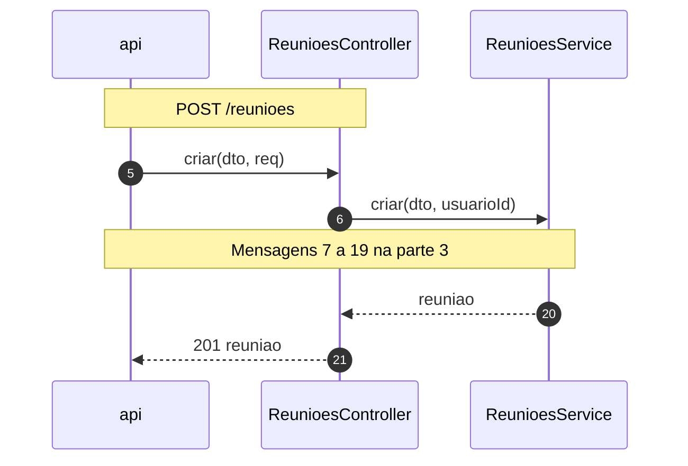
```mermaid
sequenceDiagram
    autonumber 5
    participant A as api
    participant C as ReunioesController
    participant S as ReunioesService
    Note over A,C: POST /reunioes
    A->>C: criar(dto, req)
    C->>S: criar(dto, usuarioId)
    Note over A,S: Mensagens 7 a 19 na parte 3
    autonumber 20
    S-->>C: reuniao
    C-->>A: 201 reuniao
```

Figura 4 — Diagrama de sequência SD-REU-01 (Agendar reunião), parte 2 de 4: na API. Fonte: equipe Conecta+.

### SD-REU-01 — parte 3 de 4: no serviço e nos dados

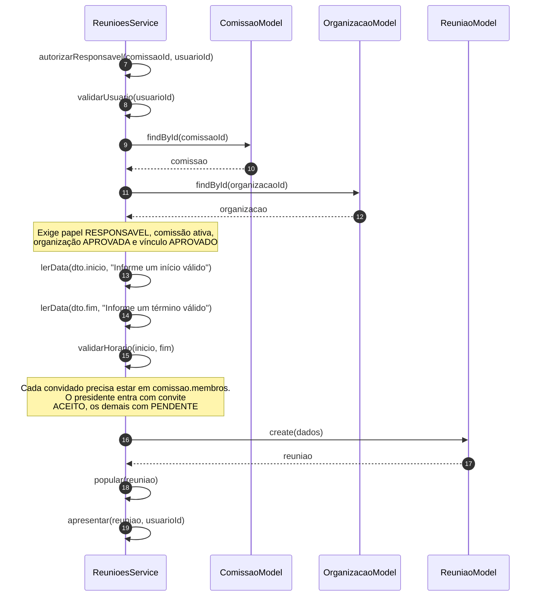
```mermaid
sequenceDiagram
    autonumber 7
    participant S as ReunioesService
    participant CM as ComissaoModel
    participant OM as OrganizacaoModel
    participant M as ReuniaoModel
    S->>S: autorizarResponsavel(comissaoId, usuarioId)
    S->>S: validarUsuario(usuarioId)
    S->>CM: findById(comissaoId)
    CM-->>S: comissao
    S->>OM: findById(organizacaoId)
    OM-->>S: organizacao
    Note over S: Exige papel RESPONSAVEL, comissão ativa,<br/>organização APROVADA e vínculo APROVADO
    S->>S: lerData(dto.inicio, "Informe um início válido")
    S->>S: lerData(dto.fim, "Informe um término válido")
    S->>S: validarHorario(inicio, fim)
    Note over S: Cada convidado precisa estar em comissao.membros.<br/>O presidente entra com convite<br/>ACEITO, os demais com PENDENTE
    S->>M: create(dados)
    M-->>S: reuniao
    S->>S: popular(reuniao)
    S->>S: apresentar(reuniao, usuarioId)
```

Figura 4 — Diagrama de sequência SD-REU-01 (Agendar reunião), parte 3 de 4: no serviço e nos dados. Fonte: equipe Conecta+.

### SD-REU-01 — parte 4 de 4: anexos e navegação

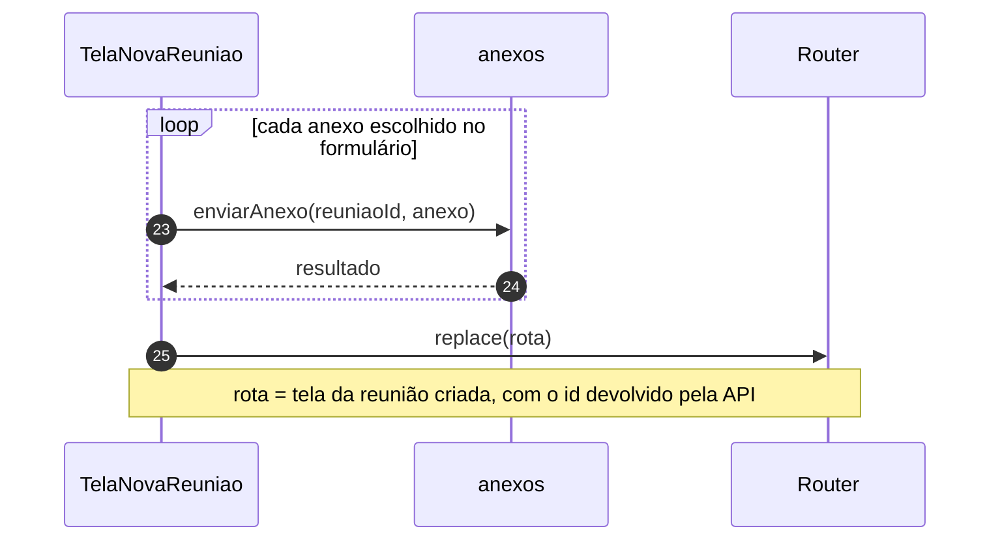
```mermaid
sequenceDiagram
    autonumber 23
    participant N as TelaNovaReuniao
    participant X as anexos
    participant R as Router
    loop cada anexo escolhido no formulário
        N->>X: enviarAnexo(reuniaoId, anexo)
        X-->>N: resultado
    end
    N->>R: replace(rota)
    Note over N,R: rota = tela da reunião criada, com o id devolvido pela API
```

Figura 4 — Diagrama de sequência SD-REU-01 (Agendar reunião), parte 4 de 4: anexos e navegação. Fonte: equipe Conecta+.

## SD-REU-02 — Consultar agenda

### SD-REU-02 — parte 1 de 3: no aplicativo

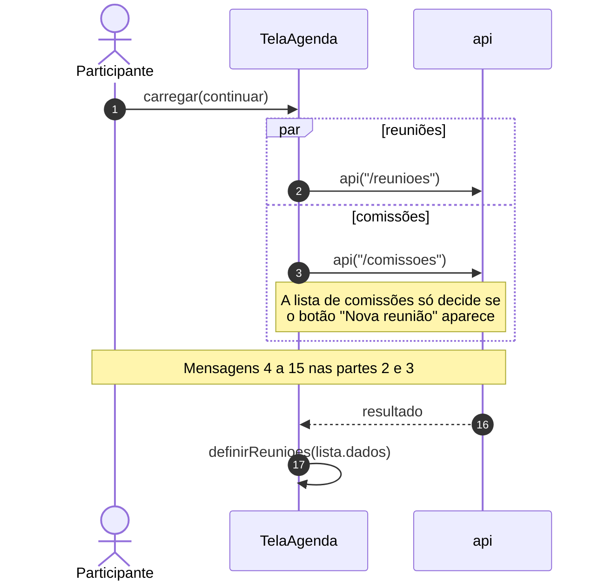
```mermaid
sequenceDiagram
    autonumber 1
    actor U as Participante
    participant T as TelaAgenda
    participant A as api
    U->>T: carregar(continuar)
    par reuniões
        T->>A: api("/reunioes")
    and comissões
        T->>A: api("/comissoes")
        Note over T,A: A lista de comissões só decide se<br/>o botão "Nova reunião" aparece
    end
    Note over U,A: Mensagens 4 a 15 nas partes 2 e 3
    autonumber 16
    A-->>T: resultado
    T->>T: definirReunioes(lista.dados)
```

Figura 5 — Diagrama de sequência SD-REU-02 (Consultar agenda), parte 1 de 3: no aplicativo. Fonte: equipe Conecta+.

### SD-REU-02 — parte 2 de 3: na API

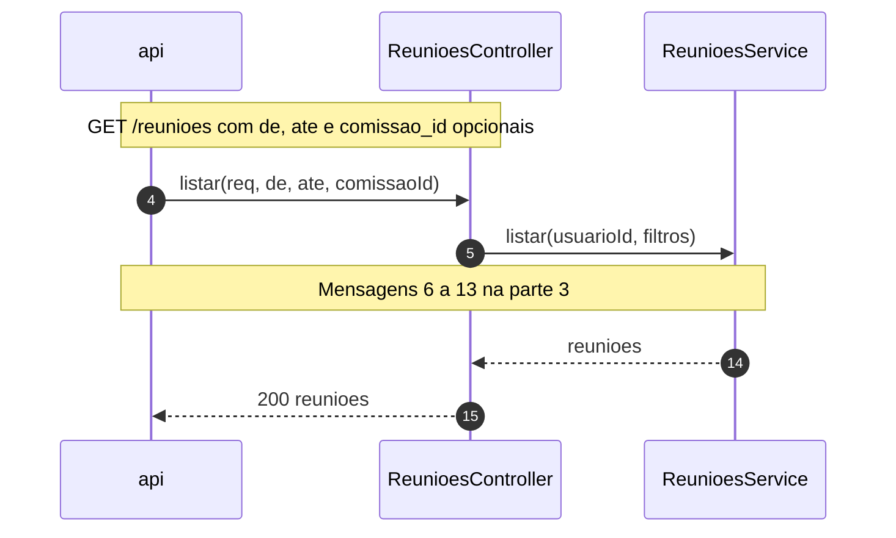
```mermaid
sequenceDiagram
    autonumber 4
    participant A as api
    participant C as ReunioesController
    participant S as ReunioesService
    Note over A,C: GET /reunioes com de, ate e comissao_id opcionais
    A->>C: listar(req, de, ate, comissaoId)
    C->>S: listar(usuarioId, filtros)
    Note over A,S: Mensagens 6 a 13 na parte 3
    autonumber 14
    S-->>C: reunioes
    C-->>A: 200 reunioes
```

Figura 5 — Diagrama de sequência SD-REU-02 (Consultar agenda), parte 2 de 3: na API. Fonte: equipe Conecta+.

### SD-REU-02 — parte 3 de 3: no serviço e nos dados

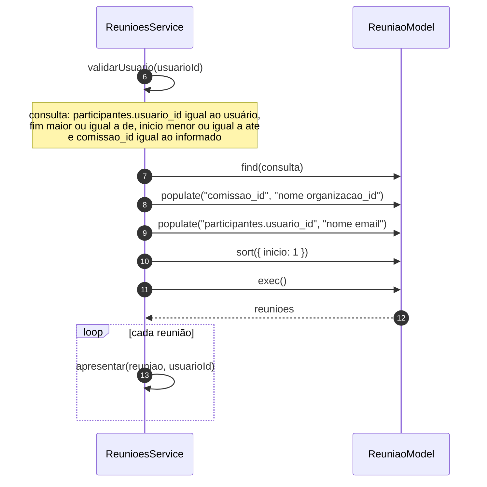
```mermaid
sequenceDiagram
    autonumber 6
    participant S as ReunioesService
    participant M as ReuniaoModel
    S->>S: validarUsuario(usuarioId)
    Note over S: consulta: participantes.usuario_id igual ao usuário,<br/>fim maior ou igual a de, inicio menor ou igual a ate<br/>e comissao_id igual ao informado
    S->>M: find(consulta)
    S->>M: populate("comissao_id", "nome organizacao_id")
    S->>M: populate("participantes.usuario_id", "nome email")
    S->>M: sort({ inicio: 1 })
    S->>M: exec()
    M-->>S: reunioes
    loop cada reunião
        S->>S: apresentar(reuniao, usuarioId)
    end
```

Figura 5 — Diagrama de sequência SD-REU-02 (Consultar agenda), parte 3 de 3: no serviço e nos dados. Fonte: equipe Conecta+.

## SD-REU-03 — Visualizar reunião

### SD-REU-03 — parte 1 de 2: no aplicativo

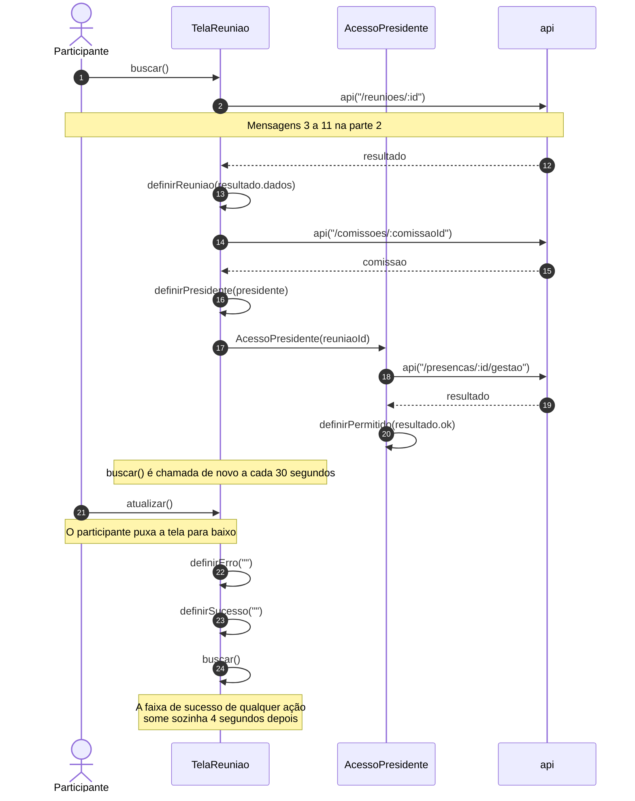
```mermaid
sequenceDiagram
    autonumber 1
    actor U as Participante
    participant T as TelaReuniao
    participant P as AcessoPresidente
    participant A as api
    U->>T: buscar()
    T->>A: api("/reunioes/:id")
    Note over U,A: Mensagens 3 a 11 na parte 2
    autonumber 12
    A-->>T: resultado
    T->>T: definirReuniao(resultado.dados)
    T->>A: api("/comissoes/:comissaoId")
    A-->>T: comissao
    T->>T: definirPresidente(presidente)
    T->>P: AcessoPresidente(reuniaoId)
    P->>A: api("/presencas/:id/gestao")
    A-->>P: resultado
    P->>P: definirPermitido(resultado.ok)
    Note over T: buscar() é chamada de novo a cada 30 segundos
    U->>T: atualizar()
    Note over U,T: O participante puxa a tela para baixo
    T->>T: definirErro("")
    T->>T: definirSucesso("")
    T->>T: buscar()
    Note over T: A faixa de sucesso de qualquer ação<br/>some sozinha 4 segundos depois
```

Figura 6 — Diagrama de sequência SD-REU-03 (Visualizar reunião), parte 1 de 2: no aplicativo. Fonte: equipe Conecta+.

### SD-REU-03 — parte 2 de 2: na API e nos dados

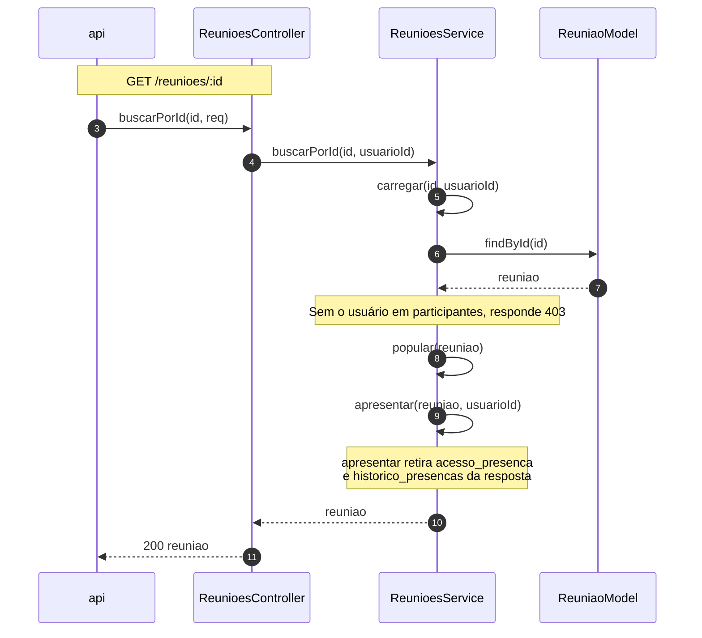
```mermaid
sequenceDiagram
    autonumber 3
    participant A as api
    participant C as ReunioesController
    participant S as ReunioesService
    participant M as ReuniaoModel
    Note over A,C: GET /reunioes/:id
    A->>C: buscarPorId(id, req)
    C->>S: buscarPorId(id, usuarioId)
    S->>S: carregar(id, usuarioId)
    S->>M: findById(id)
    M-->>S: reuniao
    Note over S: Sem o usuário em participantes, responde 403
    S->>S: popular(reuniao)
    S->>S: apresentar(reuniao, usuarioId)
    Note over S: apresentar retira acesso_presenca<br/>e historico_presencas da resposta
    S-->>C: reuniao
    C-->>A: 200 reuniao
```

Figura 6 — Diagrama de sequência SD-REU-03 (Visualizar reunião), parte 2 de 2: na API e nos dados. Fonte: equipe Conecta+.

## SD-REU-04 — Cancelar reunião

### SD-REU-04 — parte 1 de 3: confirmação no aplicativo

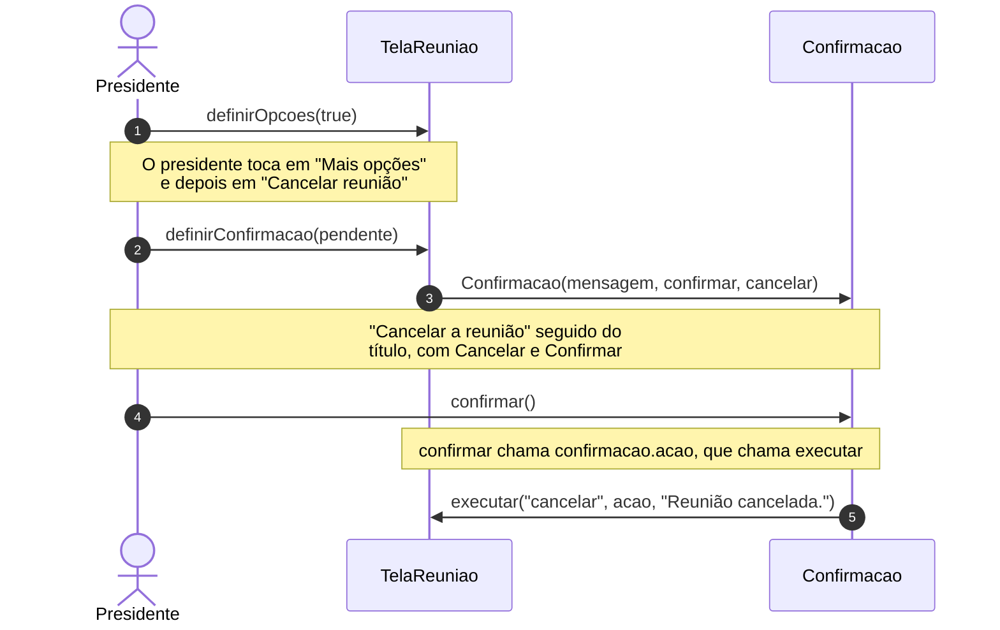
```mermaid
sequenceDiagram
    autonumber 1
    actor U as Presidente
    participant T as TelaReuniao
    participant K as Confirmacao
    U->>T: definirOpcoes(true)
    Note over U,T: O presidente toca em "Mais opções"<br/>e depois em "Cancelar reunião"
    U->>T: definirConfirmacao(pendente)
    T->>K: Confirmacao(mensagem, confirmar, cancelar)
    Note over U,K: "Cancelar a reunião" seguido do<br/>título, com Cancelar e Confirmar
    U->>K: confirmar()
    Note over K,T: confirmar chama confirmacao.acao, que chama executar
    K->>T: executar("cancelar", acao, "Reunião cancelada.")
```

Figura 7 — Diagrama de sequência SD-REU-04 (Cancelar reunião), parte 1 de 3: confirmação no aplicativo. Fonte: equipe Conecta+.

### SD-REU-04 — parte 2 de 3: envio à API

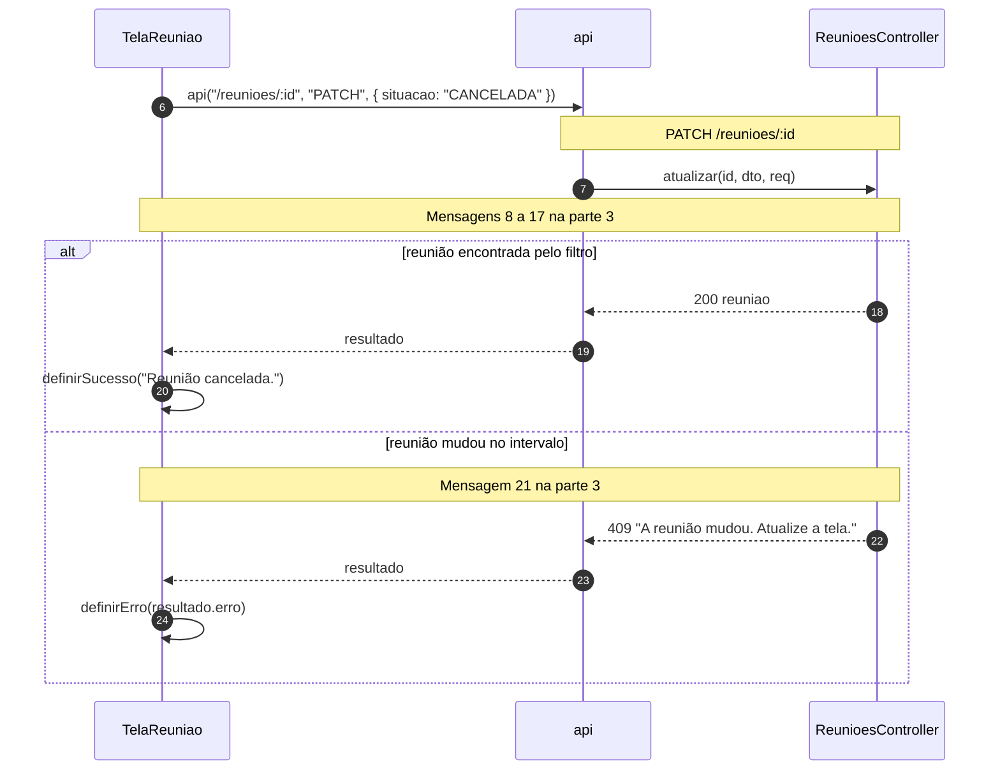
```mermaid
sequenceDiagram
    autonumber 6
    participant T as TelaReuniao
    participant A as api
    participant C as ReunioesController
    T->>A: api("/reunioes/:id", "PATCH", { situacao: "CANCELADA" })
    Note over A,C: PATCH /reunioes/:id
    A->>C: atualizar(id, dto, req)
    Note over T,C: Mensagens 8 a 17 na parte 3
    alt reunião encontrada pelo filtro
        autonumber 18
        C-->>A: 200 reuniao
        A-->>T: resultado
        T->>T: definirSucesso("Reunião cancelada.")
    else reunião mudou no intervalo
        Note over T,C: Mensagem 21 na parte 3
        autonumber 22
        C-->>A: 409 "A reunião mudou. Atualize a tela."
        A-->>T: resultado
        T->>T: definirErro(resultado.erro)
    end
```

Figura 7 — Diagrama de sequência SD-REU-04 (Cancelar reunião), parte 2 de 3: envio à API. Fonte: equipe Conecta+.

### SD-REU-04 — parte 3 de 3: no serviço e nos dados

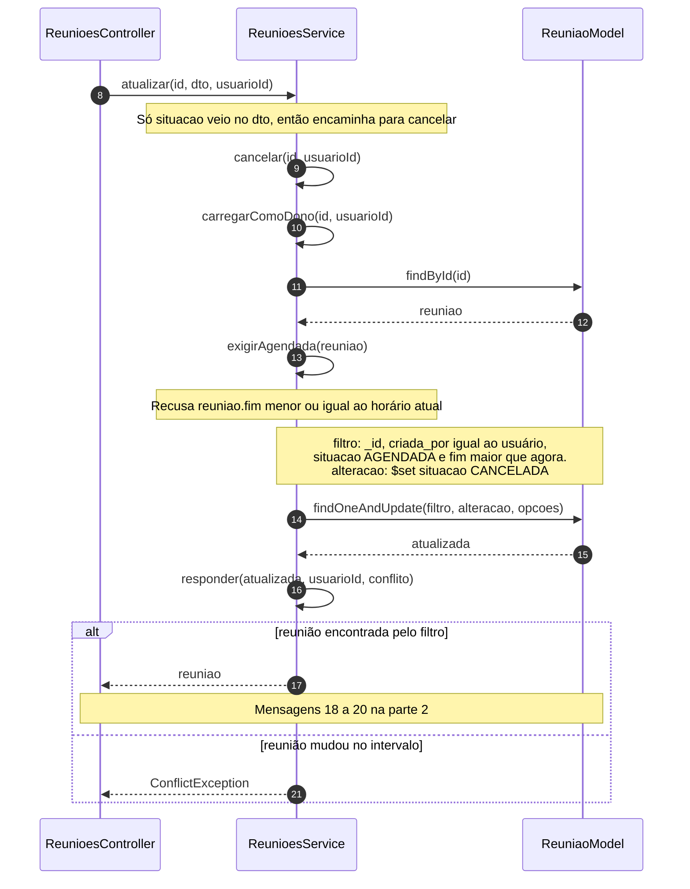
```mermaid
sequenceDiagram
    autonumber 8
    participant C as ReunioesController
    participant S as ReunioesService
    participant M as ReuniaoModel
    C->>S: atualizar(id, dto, usuarioId)
    Note over S: Só situacao veio no dto, então encaminha para cancelar
    S->>S: cancelar(id, usuarioId)
    S->>S: carregarComoDono(id, usuarioId)
    S->>M: findById(id)
    M-->>S: reuniao
    S->>S: exigirAgendada(reuniao)
    Note over S: Recusa reuniao.fim menor ou igual ao horário atual
    Note over S,M: filtro: _id, criada_por igual ao usuário,<br/>situacao AGENDADA e fim maior que agora.<br/>alteracao: $set situacao CANCELADA
    S->>M: findOneAndUpdate(filtro, alteracao, opcoes)
    M-->>S: atualizada
    S->>S: responder(atualizada, usuarioId, conflito)
    alt reunião encontrada pelo filtro
        S-->>C: reuniao
        Note over C,M: Mensagens 18 a 20 na parte 2
    else reunião mudou no intervalo
        autonumber 21
        S-->>C: ConflictException
    end
```

Figura 7 — Diagrama de sequência SD-REU-04 (Cancelar reunião), parte 3 de 3: no serviço e nos dados. Fonte: equipe Conecta+.

## SD-REU-05 — Responder convite

### SD-REU-05 — parte 1 de 4: resposta pela agenda

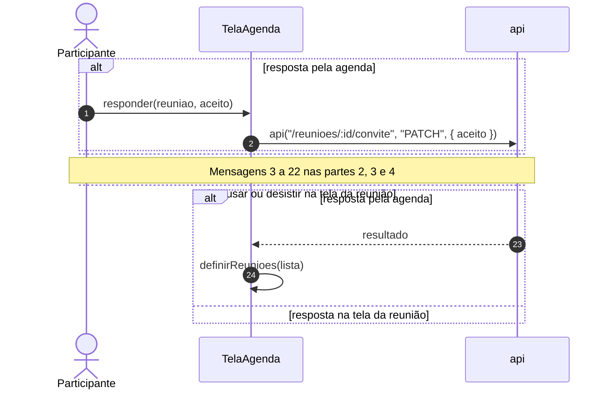
```mermaid
sequenceDiagram
    autonumber 1
    actor U as Participante
    participant G as TelaAgenda
    participant A as api
    alt resposta pela agenda
        U->>G: responder(reuniao, aceito)
        G->>A: api("/reunioes/:id/convite", "PATCH", { aceito })
    else aceitar na tela da reunião
    else recusar ou desistir na tela da reunião
    end
    Note over U,A: Mensagens 3 a 22 nas partes 2, 3 e 4
    alt resposta pela agenda
        autonumber 23
        A-->>G: resultado
        G->>G: definirReunioes(lista)
    else resposta na tela da reunião
    end
```

Figura 8 — Diagrama de sequência SD-REU-05 (Responder convite), parte 1 de 4: resposta pela agenda. Fonte: equipe Conecta+.

### SD-REU-05 — parte 2 de 4: resposta na tela da reunião

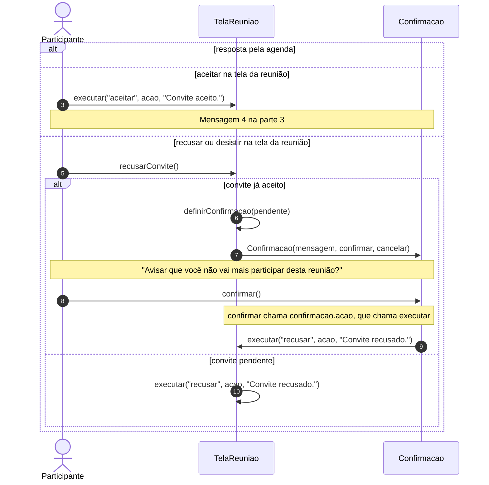
```mermaid
sequenceDiagram
    autonumber 3
    actor U as Participante
    participant T as TelaReuniao
    participant K as Confirmacao
    alt resposta pela agenda
    else aceitar na tela da reunião
        U->>T: executar("aceitar", acao, "Convite aceito.")
        Note over U,K: Mensagem 4 na parte 3
    else recusar ou desistir na tela da reunião
        autonumber 5
        U->>T: recusarConvite()
        alt convite já aceito
            T->>T: definirConfirmacao(pendente)
            T->>K: Confirmacao(mensagem, confirmar, cancelar)
            Note over U,K: "Avisar que você não vai mais participar desta reunião?"
            U->>K: confirmar()
            Note over K,T: confirmar chama confirmacao.acao, que chama executar
            K->>T: executar("recusar", acao, "Convite recusado.")
        else convite pendente
            T->>T: executar("recusar", acao, "Convite recusado.")
        end
    end
```

Figura 8 — Diagrama de sequência SD-REU-05 (Responder convite), parte 2 de 4: resposta na tela da reunião. Fonte: equipe Conecta+.

### SD-REU-05 — parte 3 de 4: envio à API

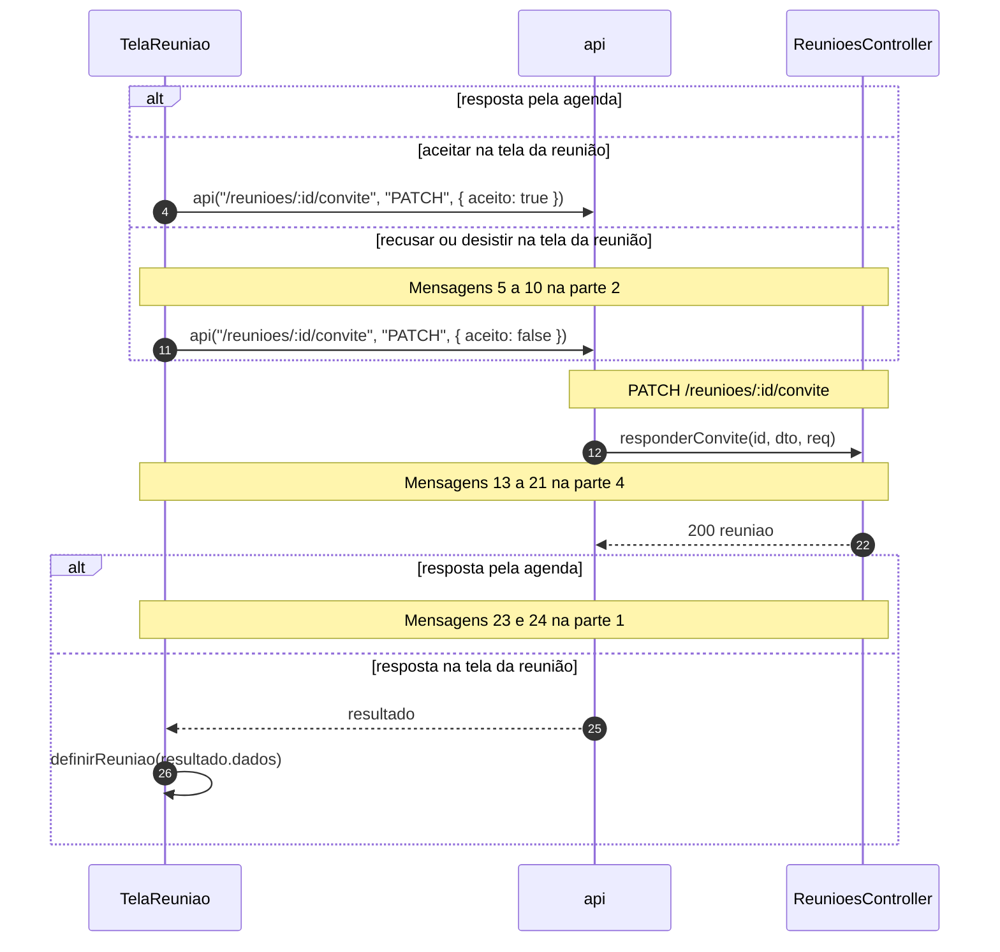
```mermaid
sequenceDiagram
    autonumber 4
    participant T as TelaReuniao
    participant A as api
    participant C as ReunioesController
    alt resposta pela agenda
    else aceitar na tela da reunião
        T->>A: api("/reunioes/:id/convite", "PATCH", { aceito: true })
    else recusar ou desistir na tela da reunião
        Note over T,C: Mensagens 5 a 10 na parte 2
        autonumber 11
        T->>A: api("/reunioes/:id/convite", "PATCH", { aceito: false })
    end
    Note over A,C: PATCH /reunioes/:id/convite
    A->>C: responderConvite(id, dto, req)
    Note over T,C: Mensagens 13 a 21 na parte 4
    autonumber 22
    C-->>A: 200 reuniao
    alt resposta pela agenda
        Note over T,C: Mensagens 23 e 24 na parte 1
    else resposta na tela da reunião
        autonumber 25
        A-->>T: resultado
        T->>T: definirReuniao(resultado.dados)
    end
```

Figura 8 — Diagrama de sequência SD-REU-05 (Responder convite), parte 3 de 4: envio à API. Fonte: equipe Conecta+.

### SD-REU-05 — parte 4 de 4: no serviço e nos dados

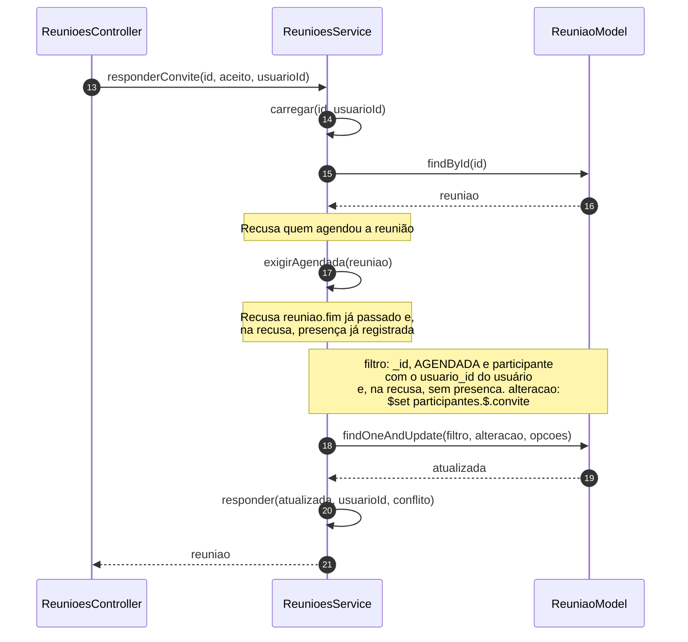
```mermaid
sequenceDiagram
    autonumber 13
    participant C as ReunioesController
    participant S as ReunioesService
    participant M as ReuniaoModel
    C->>S: responderConvite(id, aceito, usuarioId)
    S->>S: carregar(id, usuarioId)
    S->>M: findById(id)
    M-->>S: reuniao
    Note over S: Recusa quem agendou a reunião
    S->>S: exigirAgendada(reuniao)
    Note over S: Recusa reuniao.fim já passado e,<br/>na recusa, presença já registrada
    Note over S,M: filtro: _id, AGENDADA e participante<br/>com o usuario_id do usuário<br/>e, na recusa, sem presenca. alteracao:<br/>$set participantes.$.convite
    S->>M: findOneAndUpdate(filtro, alteracao, opcoes)
    M-->>S: atualizada
    S->>S: responder(atualizada, usuarioId, conflito)
    S-->>C: reuniao
```

Figura 8 — Diagrama de sequência SD-REU-05 (Responder convite), parte 4 de 4: no serviço e nos dados. Fonte: equipe Conecta+.

A tela inicial responde ao convite pela folha "Convites" com `responder(convite, aceito)`, que envia a mesma requisição da agenda.

## SD-REU-06 — Registrar entrada

### SD-REU-06 — parte 1 de 2: no aplicativo

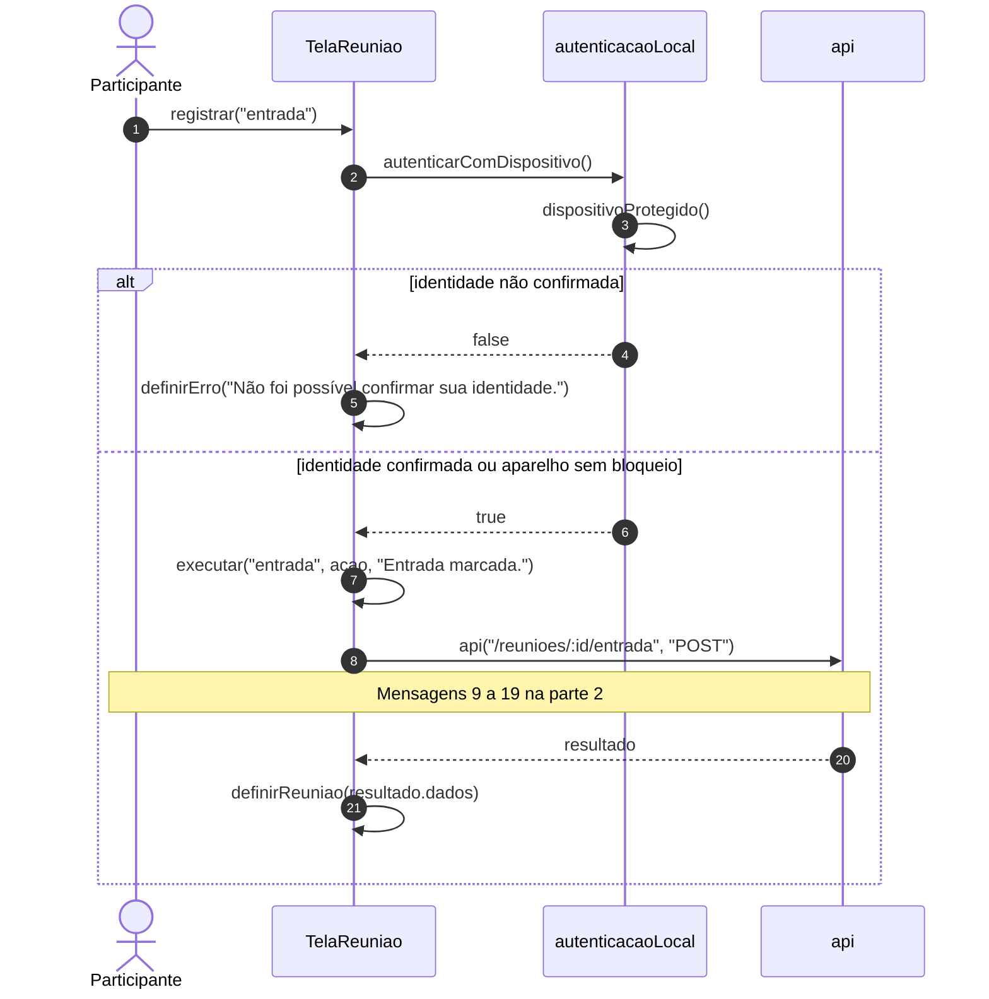
```mermaid
sequenceDiagram
    autonumber 1
    actor U as Participante
    participant T as TelaReuniao
    participant L as autenticacaoLocal
    participant A as api
    U->>T: registrar("entrada")
    T->>L: autenticarComDispositivo()
    L->>L: dispositivoProtegido()
    alt identidade não confirmada
        L-->>T: false
        T->>T: definirErro("Não foi possível confirmar sua identidade.")
    else identidade confirmada ou aparelho sem bloqueio
        L-->>T: true
        T->>T: executar("entrada", acao, "Entrada marcada.")
        T->>A: api("/reunioes/:id/entrada", "POST")
        Note over U,A: Mensagens 9 a 19 na parte 2
        autonumber 20
        A-->>T: resultado
        T->>T: definirReuniao(resultado.dados)
    end
```

Figura 9 — Diagrama de sequência SD-REU-06 (Registrar entrada), parte 1 de 2: no aplicativo. Fonte: equipe Conecta+.

### SD-REU-06 — parte 2 de 2: na API e nos dados

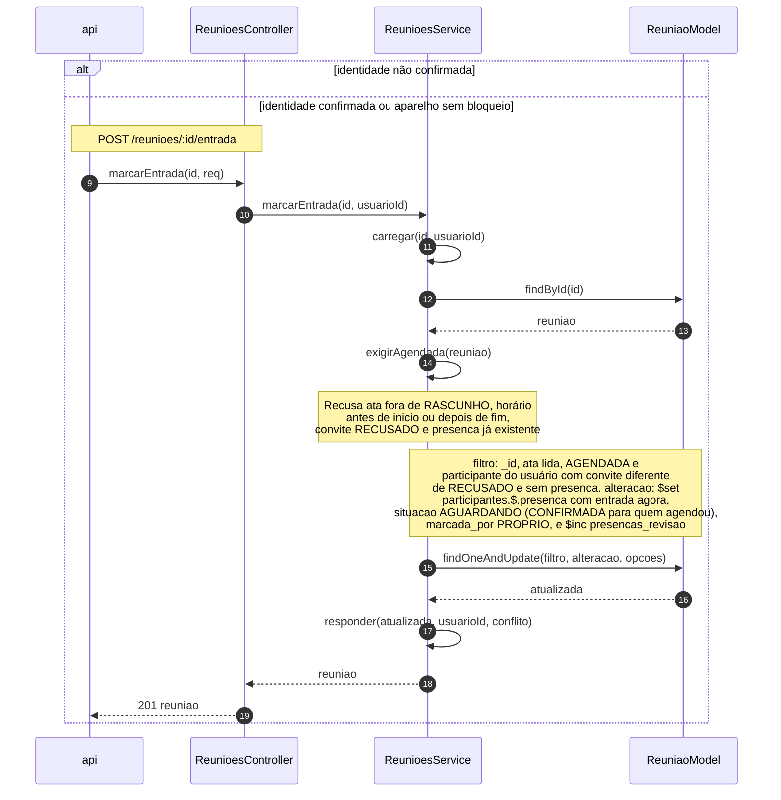
```mermaid
sequenceDiagram
    autonumber 9
    participant A as api
    participant C as ReunioesController
    participant S as ReunioesService
    participant M as ReuniaoModel
    alt identidade não confirmada
    else identidade confirmada ou aparelho sem bloqueio
        Note over A,C: POST /reunioes/:id/entrada
        A->>C: marcarEntrada(id, req)
        C->>S: marcarEntrada(id, usuarioId)
        S->>S: carregar(id, usuarioId)
        S->>M: findById(id)
        M-->>S: reuniao
        S->>S: exigirAgendada(reuniao)
        Note over S: Recusa ata fora de RASCUNHO, horário<br/>antes de inicio ou depois de fim,<br/>convite RECUSADO e presenca já existente
        Note over S,M: filtro: _id, ata lida, AGENDADA e<br/>participante do usuário com convite diferente<br/>de RECUSADO e sem presenca. alteracao: $set<br/>participantes.$.presenca com entrada agora,<br/>situacao AGUARDANDO (CONFIRMADA para quem agendou),<br/>marcada_por PROPRIO, e $inc presencas_revisao
        S->>M: findOneAndUpdate(filtro, alteracao, opcoes)
        M-->>S: atualizada
        S->>S: responder(atualizada, usuarioId, conflito)
        S-->>C: reuniao
        C-->>A: 201 reuniao
    end
```

Figura 9 — Diagrama de sequência SD-REU-06 (Registrar entrada), parte 2 de 2: na API e nos dados. Fonte: equipe Conecta+.

### SD-REU-06, entrada pela tela inicial — parte 1 de 2: no aplicativo

Entrada pelo botão "Marcar entrada" do cartão "Agora" da tela inicial, que também pede a identidade do aparelho antes de enviar a requisição:

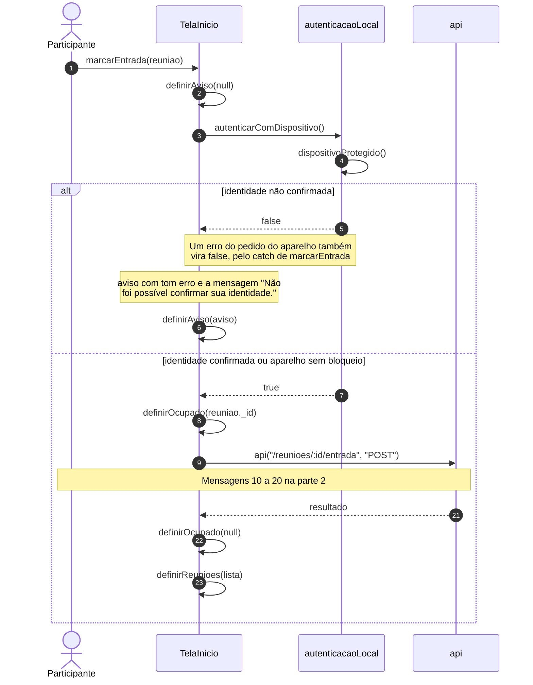
```mermaid
sequenceDiagram
    autonumber 1
    actor U as Participante
    participant I as TelaInicio
    participant L as autenticacaoLocal
    participant A as api
    U->>I: marcarEntrada(reuniao)
    I->>I: definirAviso(null)
    I->>L: autenticarComDispositivo()
    L->>L: dispositivoProtegido()
    alt identidade não confirmada
        L-->>I: false
        Note over I,L: Um erro do pedido do aparelho também<br/>vira false, pelo catch de marcarEntrada
        Note over I: aviso com tom erro e a mensagem "Não<br/>foi possível confirmar sua identidade."
        I->>I: definirAviso(aviso)
    else identidade confirmada ou aparelho sem bloqueio
        L-->>I: true
        I->>I: definirOcupado(reuniao._id)
        I->>A: api("/reunioes/:id/entrada", "POST")
        Note over U,A: Mensagens 10 a 20 na parte 2
        autonumber 21
        A-->>I: resultado
        I->>I: definirOcupado(null)
        I->>I: definirReunioes(lista)
    end
```

Figura 10 — Diagrama de sequência SD-REU-06, entrada pela tela inicial, parte 1 de 2: no aplicativo. Fonte: equipe Conecta+.

### SD-REU-06, entrada pela tela inicial — parte 2 de 2: na API e nos dados

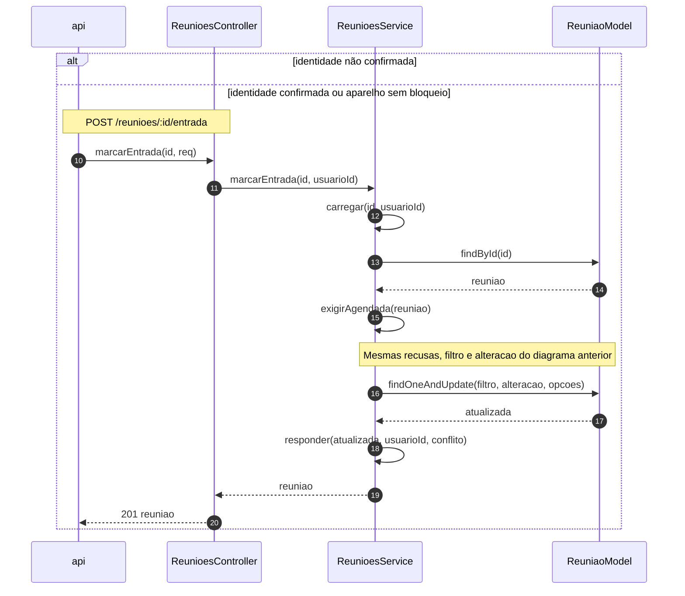
```mermaid
sequenceDiagram
    autonumber 10
    participant A as api
    participant C as ReunioesController
    participant S as ReunioesService
    participant M as ReuniaoModel
    alt identidade não confirmada
    else identidade confirmada ou aparelho sem bloqueio
        Note over A,C: POST /reunioes/:id/entrada
        A->>C: marcarEntrada(id, req)
        C->>S: marcarEntrada(id, usuarioId)
        S->>S: carregar(id, usuarioId)
        S->>M: findById(id)
        M-->>S: reuniao
        S->>S: exigirAgendada(reuniao)
        Note over S,M: Mesmas recusas, filtro e alteracao do diagrama anterior
        S->>M: findOneAndUpdate(filtro, alteracao, opcoes)
        M-->>S: atualizada
        S->>S: responder(atualizada, usuarioId, conflito)
        S-->>C: reuniao
        C-->>A: 201 reuniao
    end
```

Figura 10 — Diagrama de sequência SD-REU-06, entrada pela tela inicial, parte 2 de 2: na API e nos dados. Fonte: equipe Conecta+.

## SD-REU-07 — Registrar saída

### SD-REU-07 — parte 1 de 2: no aplicativo

```mermaid
sequenceDiagram
    autonumber 1
    actor U as Participante
    participant T as TelaReuniao
    participant L as autenticacaoLocal
    participant A as api
    U->>T: registrar("saida")
    T->>L: autenticarComDispositivo()
    L->>L: dispositivoProtegido()
    alt identidade não confirmada
        L-->>T: false
        T->>T: definirErro("Não foi possível confirmar sua identidade.")
    else identidade confirmada ou aparelho sem bloqueio
        L-->>T: true
        T->>T: executar("saida", acao, "Saída marcada.")
        T->>A: api("/reunioes/:id/saida", "POST")
        Note over U,A: Mensagens 9 a 19 na parte 2
        autonumber 20
        A-->>T: resultado
        T->>T: definirReuniao(resultado.dados)
    end
```

Figura 11 — Diagrama de sequência SD-REU-07 (Registrar saída), parte 1 de 2: no aplicativo. Fonte: equipe Conecta+.

### SD-REU-07 — parte 2 de 2: na API e nos dados

```mermaid
sequenceDiagram
    autonumber 9
    participant A as api
    participant C as ReunioesController
    participant S as ReunioesService
    participant M as ReuniaoModel
    alt identidade não confirmada
    else identidade confirmada ou aparelho sem bloqueio
        Note over A,C: POST /reunioes/:id/saida
        A->>C: marcarSaida(id, req)
        C->>S: marcarSaida(id, usuarioId)
        S->>S: carregar(id, usuarioId)
        S->>M: findById(id)
        M-->>S: reuniao
        S->>S: exigirAgendada(reuniao)
        Note over S: Recusa ata fora de RASCUNHO, presença<br/>ausente ou RECUSADA e saída já marcada.<br/>O horário gravado é o menor entre agora e reuniao.fim
        Note over S,M: filtro: _id, ata lida e participante do<br/>usuário sem presenca.saida e com situacao<br/>diferente de RECUSADA. alteracao: $set<br/>participantes.$.presenca.saida e $inc presencas_revisao
        S->>M: findOneAndUpdate(filtro, alteracao, opcoes)
        M-->>S: atualizada
        S->>S: responder(atualizada, usuarioId, conflito)
        S-->>C: reuniao
        C-->>A: 201 reuniao
    end
```

Figura 11 — Diagrama de sequência SD-REU-07 (Registrar saída), parte 2 de 2: na API e nos dados. Fonte: equipe Conecta+.

### SD-REU-07, saída automática

Saída automática, feita pelo servidor quando a pessoa não marca a saída:

```mermaid
sequenceDiagram
    autonumber
    participant S as ReunioesService
    participant M as ReuniaoModel
    S->>S: onApplicationBootstrap()
    S->>S: executarRotinas()
    Note over S: Repete a cada 60 segundos. Depois das saídas,<br/>executa aprovarAtasVencidas (SD-ATA-03)
    S->>S: registrarSaidasAutomaticas(agora)
    Note over S,M: filtro: AGENDADA, fim até agora, sem ata ou<br/>com ata em RASCUNHO e algum participante<br/>com presenca.entrada, sem presenca.saida<br/>e com situacao diferente de RECUSADA
    S->>M: find(filtro)
    S->>M: select("fim")
    S->>M: exec()
    M-->>S: reunioes
    loop cada reunião encontrada
        Note over S,M: filtro: _id, mesmo fim e mesma condição<br/>da ata. alteracao: $set saida igual a fim<br/>e saida_automatica true nos participantes<br/>do arrayFilters, e $inc presencas_revisao
        S->>M: updateOne(filtro, alteracao, { arrayFilters })
        M-->>S: resultado
    end
```

Figura 12 — Diagrama de sequência SD-REU-07, saída automática. Fonte: equipe Conecta+.

## SD-REU-08 — Confirmar, recusar ou desmarcar presença

### SD-REU-08 — parte 1 de 3: no aplicativo

```mermaid
sequenceDiagram
    autonumber 1
    actor U as Presidente
    participant T as TelaReuniao
    participant A as api
    U->>T: marcarPresenca(pessoa, situacao)
    T->>T: executar(chave, acao)
    T->>A: api("/reunioes/:id/presencas/:usuarioId", "PATCH", { situacao })
    Note over U,A: Mensagens 4 a 15 nas partes 2 e 3
    autonumber 16
    A-->>T: resultado
    T->>T: definirReuniao(resultado.dados)
```

Figura 13 — Diagrama de sequência SD-REU-08 (Confirmar, recusar ou desmarcar presença), parte 1 de 3: no aplicativo. Fonte: equipe Conecta+.

### SD-REU-08 — parte 2 de 3: na API

```mermaid
sequenceDiagram
    autonumber 4
    participant A as api
    participant C as ReunioesController
    participant S as ReunioesService
    Note over A,C: PATCH /reunioes/:id/presencas/:usuarioId
    A->>C: atualizarPresenca(id, usuarioId, dto, req)
    C->>S: atualizarPresenca(id, participanteId, situacao, usuarioId)
    Note over A,S: Mensagens 6 a 13 na parte 3
    autonumber 14
    S-->>C: reuniao
    C-->>A: 200 reuniao
```

Figura 13 — Diagrama de sequência SD-REU-08 (Confirmar, recusar ou desmarcar presença), parte 2 de 3: na API. Fonte: equipe Conecta+.

### SD-REU-08 — parte 3 de 3: no serviço e nos dados

```mermaid
sequenceDiagram
    autonumber 6
    participant S as ReunioesService
    participant M as ReuniaoModel
    S->>S: validarId(participanteId)
    S->>S: carregarComoDono(id, usuarioId)
    S->>M: findById(id)
    M-->>S: reuniao
    S->>S: exigirAgendada(reuniao)
    Note over S: Recusa ata fora de RASCUNHO, horário antes de inicio,<br/>pessoa fora de participantes e<br/>RECUSADA para quem não marcou entrada
    alt participante já tem presenca
        Note over S,M: alteracao: $set participantes.$.presenca.situacao<br/>e $inc presencas_revisao
    else participante sem presenca
        Note over S,M: alteracao: $set participantes.$.presenca<br/>com entrada igual a inicio,<br/>situacao CONFIRMADA e marcada_por<br/>RESPONSAVEL, e $inc presencas_revisao
    end
    Note over S,M: filtro: _id, ata lida, AGENDADA e participante<br/>com a mesma existência de presenca da leitura
    S->>M: findOneAndUpdate(filtro, alteracao, opcoes)
    M-->>S: atualizada
    S->>S: responder(atualizada, usuarioId, conflito)
```

Figura 13 — Diagrama de sequência SD-REU-08 (Confirmar, recusar ou desmarcar presença), parte 3 de 3: no serviço e nos dados. Fonte: equipe Conecta+.

### SD-REU-08, desmarcar presença — parte 1 de 4: confirmação e identidade

Desmarcar, pela pílula "Desmarcar presença" da seção "Presentes", quem já está com presença confirmada. A pílula só aparece para quem agendou, fora da linha dele mesmo, com a reunião iniciada, não cancelada e a ata inexistente ou em rascunho:

```mermaid
sequenceDiagram
    autonumber 1
    actor U as Presidente
    participant T as TelaReuniao
    participant K as Confirmacao
    participant L as autenticacaoLocal
    U->>T: desmarcarPresenca(pessoa)
    T->>T: definirConfirmacao(pendente)
    T->>K: Confirmacao(mensagem, rotuloConfirmar, perigo)
    Note over U,K: "Desmarcar a presença de" seguido do nome,<br/>com Cancelar e o botão vermelho Desmarcar
    U->>K: confirmar()
    Note over K,T: confirmar chama confirmacao.acao, que fecha<br/>o diálogo antes de pedir a identidade
    K->>T: definirConfirmacao(null)
    T->>L: autenticarComDispositivo()
    L->>L: dispositivoProtegido()
    alt identidade não confirmada
        L-->>T: false
        T->>T: definirSucesso("")
        T->>T: definirErro("Não foi possível confirmar sua identidade.")
    else identidade confirmada ou aparelho sem bloqueio
        L-->>T: true
        T->>T: executar(chave, acao, mensagem)
        Note over T: mensagem = "Presença de" seguido do nome e de "desmarcada."
    end
```

Figura 14 — Diagrama de sequência SD-REU-08, desmarcar presença, parte 1 de 4: confirmação e identidade. Fonte: equipe Conecta+.

### SD-REU-08, desmarcar presença — parte 2 de 4: envio à API

```mermaid
sequenceDiagram
    autonumber 13
    participant T as TelaReuniao
    participant A as api
    alt identidade não confirmada
    else identidade confirmada ou aparelho sem bloqueio
        T->>A: api("/reunioes/:id/presencas/:usuarioId", "PATCH", { situacao: "RECUSADA" })
        Note over T,A: Mensagens 14 a 25 nas partes 3 e 4
        autonumber 26
        A-->>T: resultado
        T->>T: definirReuniao(resultado.dados)
        T->>T: definirSucesso(mensagem)
        Note over T: A pessoa passa para Ausentes, com Marcar<br/>presente, e a faixa some 4 segundos depois
    end
```

Figura 14 — Diagrama de sequência SD-REU-08, desmarcar presença, parte 2 de 4: envio à API. Fonte: equipe Conecta+.

### SD-REU-08, desmarcar presença — parte 3 de 4: na API

```mermaid
sequenceDiagram
    autonumber 14
    participant A as api
    participant C as ReunioesController
    participant S as ReunioesService
    alt identidade não confirmada
    else identidade confirmada ou aparelho sem bloqueio
        Note over A,C: PATCH /reunioes/:id/presencas/:usuarioId
        A->>C: atualizarPresenca(id, usuarioId, dto, req)
        C->>S: atualizarPresenca(id, participanteId, situacao, usuarioId)
        Note over A,S: Mensagens 16 a 23 na parte 4
        autonumber 24
        S-->>C: reuniao
        C-->>A: 200 reuniao
    end
```

Figura 14 — Diagrama de sequência SD-REU-08, desmarcar presença, parte 3 de 4: na API. Fonte: equipe Conecta+.

### SD-REU-08, desmarcar presença — parte 4 de 4: no serviço e nos dados

```mermaid
sequenceDiagram
    autonumber 16
    participant S as ReunioesService
    participant M as ReuniaoModel
    alt identidade não confirmada
    else identidade confirmada ou aparelho sem bloqueio
        S->>S: validarId(participanteId)
        S->>S: carregarComoDono(id, usuarioId)
        S->>M: findById(id)
        M-->>S: reuniao
        S->>S: exigirAgendada(reuniao)
        Note over S: Mesmas recusas do diagrama anterior
        Note over S,M: filtro: _id, ata lida, AGENDADA e participante com presenca.<br/>alteracao: $set participantes.$.presenca.situacao<br/>RECUSADA e $inc presencas_revisao.<br/>entrada, saida e marcada_por não mudam
        S->>M: findOneAndUpdate(filtro, alteracao, opcoes)
        M-->>S: atualizada
        S->>S: responder(atualizada, usuarioId, conflito)
    end
```

Figura 14 — Diagrama de sequência SD-REU-08, desmarcar presença, parte 4 de 4: no serviço e nos dados. Fonte: equipe Conecta+.

## SD-REU-09 — Gerar lista de presença

### SD-REU-09 — parte 1 de 5: no aplicativo

```mermaid
sequenceDiagram
    autonumber 1
    actor U as Participante
    participant T as TelaRegistrosReuniao
    participant A as api
    U->>T: definirAba("presenca")
    T->>T: carregarLista()
    T->>A: api("/reunioes/:id/lista-presenca")
    Note over U,A: Mensagens 4 a 14 nas partes 2 e 3
    autonumber 15
    A-->>T: resultado
    T->>T: definirLista(resposta.dados)
```

Figura 15 — Diagrama de sequência SD-REU-09 (Gerar lista de presença), parte 1 de 5: no aplicativo. Fonte: equipe Conecta+.

### SD-REU-09 — parte 2 de 5: na API

```mermaid
sequenceDiagram
    autonumber 4
    participant A as api
    participant C as ReunioesController
    participant S as ReunioesService
    Note over A,C: GET /reunioes/:id/lista-presenca
    A->>C: gerarListaPresenca(id, req)
    C->>S: gerarListaPresenca(id, usuarioId)
    Note over A,S: Mensagens 6 a 12 na parte 3
    autonumber 13
    S-->>C: lista
    C-->>A: 200 lista
```

Figura 15 — Diagrama de sequência SD-REU-09 (Gerar lista de presença), parte 2 de 5: na API. Fonte: equipe Conecta+.

### SD-REU-09 — parte 3 de 5: no serviço e nos dados

```mermaid
sequenceDiagram
    autonumber 6
    participant S as ReunioesService
    participant M as ReuniaoModel
    participant UM as UsuarioModel
    S->>S: carregar(id, usuarioId)
    S->>M: findById(id)
    M-->>S: reuniao
    S->>UM: find({ _id: { $in: ids } })
    S->>UM: select("nome")
    S->>UM: exec()
    UM-->>S: pessoas
    Note over S: Para cada participante: situacao<br/>de presenca ou SEM_REGISTRO,<br/>minutos entre entrada e saida, arredondados para baixo
```

Figura 15 — Diagrama de sequência SD-REU-09 (Gerar lista de presença), parte 3 de 5: no serviço e nos dados. Fonte: equipe Conecta+.

### SD-REU-09 — parte 4 de 5: PDF no aplicativo

```mermaid
sequenceDiagram
    autonumber 17
    actor U as Participante
    participant T as TelaRegistrosReuniao
    participant P as pdfListaPresenca
    participant D as pdf
    U->>T: baixarLista()
    T->>T: definirGerandoPdf(true)
    T->>P: gerarPdfLista(reuniao, lista)
    P->>P: htmlDaLista(reuniao, lista)
    P->>D: entregarPdf(html, nome)
    alt Web
        D->>D: imprimirNaWeb(html)
    else Expo Go
    else Aplicativo instalado
    end
    Note over U,D: Mensagens 23 a 30 na parte 5
    alt PDF entregue
        autonumber 31
        D-->>P: concluído
        P-->>T: concluído
    else erro na geração ou no compartilhamento
        D-->>P: erro
        P-->>T: erro
        T->>T: definirErro("Não foi possível gerar o PDF da lista de presença.")
    end
    T->>T: definirGerandoPdf(false)
```

Figura 15 — Diagrama de sequência SD-REU-09 (Gerar lista de presença), parte 4 de 5: PDF no aplicativo. Fonte: equipe Conecta+.

### SD-REU-09 — parte 5 de 5: entrega do PDF

```mermaid
sequenceDiagram
    autonumber 23
    participant D as pdf
    participant H as Sharing
    participant I as Print
    alt Web
    else Expo Go
        D->>I: printAsync({ html, width: 595, height: 842 })
        I-->>D: concluído
    else Aplicativo instalado
        D->>H: isAvailableAsync()
        H-->>D: disponivel
        alt compartilhamento indisponível
            Note over D: lança "O compartilhamento de arquivos<br/>não está disponível neste aparelho."<br/>sem gerar o PDF
        else compartilhamento disponível
            D->>I: printToFileAsync({ html, width: 595, height: 842 })
            I-->>D: uri
            Note over D,I: O PDF fica no cache com o nome dado<br/>pelo Print e não é renomeado nem movido
            D->>H: shareAsync(uri, opcoes)
            Note over D,H: opcoes = mimeType application/pdf, UTI<br/>com.adobe.pdf e dialogTitle igual a nome
            H-->>D: concluído
        end
    end
```

Figura 15 — Diagrama de sequência SD-REU-09 (Gerar lista de presença), parte 5 de 5: entrega do PDF. Fonte: equipe Conecta+.

## SD-REU-13 — Editar reunião

### SD-REU-13 — parte 1 de 4: tela de edição

```mermaid
sequenceDiagram
    autonumber 1
    participant E as TelaEditarReuniao
    participant TP as ToastProvider
    participant R as Router
    participant A as api
    E->>A: api("/reunioes/:id")
    A-->>E: resultado
    Note over E,A: Mensagens 3 a 6 na parte 2
    autonumber 7
    E->>A: api("/reunioes/:id", "PATCH", campos)
    Note over E,A: Mensagens 8 a 23 nas partes 3 e 4
    alt reunião encontrada pelo filtro
        autonumber 24
        A-->>E: resultado
        Note over E,A: Mensagens 25 e 26 na parte 2
        autonumber 27
        E->>TP: mostrarToast("Reunião atualizada.", "sucesso")
        E->>R: canGoBack()
        R-->>E: podeVoltar
        alt podeVoltar verdadeiro
            E->>R: back()
        else sem tela anterior
            E->>R: replace(rota)
            Note over E,R: rota = tela da reunião editada
        end
    else reunião mudou durante a edição
        Note over E,A: Mensagens 32 e 33 na parte 3
        autonumber 34
        A-->>E: resultado
    end
```

Figura 16 — Diagrama de sequência SD-REU-13 (Editar reunião), parte 1 de 4: tela de edição. Fonte: equipe Conecta+.

### SD-REU-13 — parte 2 de 4: formulário

```mermaid
sequenceDiagram
    autonumber 3
    actor U as Presidente
    participant F as FormularioReuniao
    participant E as TelaEditarReuniao
    E->>F: FormularioReuniao(reuniao, aoSalvar, aoConcluir)
    U->>F: salvar()
    F->>F: calcularHorario(dados)
    F->>E: aoSalvar(envio)
    Note over U,E: Mensagens 7 a 24 nas partes 1, 3 e 4
    alt reunião encontrada pelo filtro
        autonumber 25
        E-->>F: null
        F->>E: aoConcluir()
    else reunião mudou durante a edição
    end
    Note over U,E: Mensagens 27 a 34 nas partes 1 e 3
    alt reunião encontrada pelo filtro
    else reunião mudou durante a edição
        autonumber 35
        E-->>F: resultado.erro
        F->>F: definirErro(problema)
    end
```

Figura 16 — Diagrama de sequência SD-REU-13 (Editar reunião), parte 2 de 4: formulário. Fonte: equipe Conecta+.

### SD-REU-13 — parte 3 de 4: na API

```mermaid
sequenceDiagram
    autonumber 8
    participant A as api
    participant C as ReunioesController
    participant S as ReunioesService
    Note over A,C: PATCH /reunioes/:id
    A->>C: atualizar(id, dto, req)
    C->>S: atualizar(id, dto, usuarioId)
    Note over A,S: Mensagens 10 a 21 na parte 4
    alt reunião encontrada pelo filtro
        autonumber 22
        S-->>C: reuniao
        C-->>A: 200 reuniao
        Note over A,S: Mensagens 24 a 31 nas partes 1 e 2
    else reunião mudou durante a edição
        autonumber 32
        S-->>C: ConflictException
        C-->>A: 409 "A reunião mudou. Atualize a tela."
    end
```

Figura 16 — Diagrama de sequência SD-REU-13 (Editar reunião), parte 3 de 4: na API. Fonte: equipe Conecta+.

### SD-REU-13 — parte 4 de 4: no serviço e nos dados

```mermaid
sequenceDiagram
    autonumber 10
    participant S as ReunioesService
    participant M as ReuniaoModel
    S->>S: editar(id, campos, usuarioId)
    S->>S: carregarComoDono(id, usuarioId)
    S->>M: findById(id)
    M-->>S: reuniao
    S->>S: exigirAgendada(reuniao)
    Note over S: Recusa reuniao.fim já passado
    opt dto com inicio e fim
        Note over S: Cada um só é lido quando veio no<br/>dto. O formulário não os envia<br/>quando a reunião já começou, e então valem os da reunião
        S->>S: lerData(dto.inicio, "Informe um início válido")
        S->>S: lerData(dto.fim, "Informe um término válido")
    end
    opt data, horário ou dia inteiro mudaram
        Note over S: Recusa se reuniao.inicio já passou
        S->>S: validarHorario(inicio, fim)
    end
    opt dto com convidados_ids
        S->>S: autorizarResponsavel(comissaoId, usuarioId)
        Note over S: Exige integrantes da comissão, retira quem saiu<br/>e acrescenta os novos com convite PENDENTE
    end
    Note over S,M: filtro: _id, AGENDADA, fim maior que<br/>agora e atualizado_em igual ao lido.<br/>alteracao: $set dos campos, de participantes<br/>e, se o horário mudou, de horario_alterado_em
    S->>M: findOneAndUpdate(filtro, alteracao, opcoes)
    M-->>S: atualizada
    S->>S: responder(atualizada, usuarioId, conflito)
```

Figura 16 — Diagrama de sequência SD-REU-13 (Editar reunião), parte 4 de 4: no serviço e nos dados. Fonte: equipe Conecta+.

## SD-REU-14 — Anexar arquivo à pauta

### SD-REU-14 — parte 1 de 5: na tela da reunião

```mermaid
sequenceDiagram
    autonumber 1
    actor U as Presidente
    participant T as TelaReuniao
    participant X as anexos
    U->>T: adicionarAnexos()
    T->>X: escolherArquivos()
    X-->>T: escolhidos
    T->>X: validarArquivos(escolhidos, anexos.length)
    X-->>T: null
    loop cada arquivo
        T->>X: enviarAnexo(reuniaoId, arquivo)
        Note over U,X: Mensagens 7 a 30 nas partes 2, 3, 4 e 5
        autonumber 31
        X-->>T: resultado
        T->>T: definirReuniao(resultado.dados)
    end
    T->>T: definirSucesso(mensagem)
```

Figura 17 — Diagrama de sequência SD-REU-14 (Anexar arquivo à pauta), parte 1 de 5: na tela da reunião. Fonte: equipe Conecta+.

### SD-REU-14 — parte 2 de 5: no módulo anexos

```mermaid
sequenceDiagram
    autonumber 7
    participant X as anexos
    participant A as api
    participant FS as File
    loop cada arquivo
        X->>A: acessoAutenticado(caminho)
        A-->>X: acesso
        Note over X,FS: Na web, enviarAnexo usa api(caminho, "POST", formulario).<br/>No aparelho, copia = File com o nome<br/>original numa pasta temporária do cache
        X->>FS: copy(copia)
        Note over X,FS: copy é chamado no File de arquivo.uri
        FS-->>X: concluído
        X->>FS: upload(acesso.url, opcoes)
        Note over X,FS: Mensagens 12 a 29 nas partes 3, 4 e 5
        autonumber 30
        FS-->>X: resposta
        Note over X: resultado = ok verdadeiro e a reunião lida de resposta.body
    end
```

Figura 17 — Diagrama de sequência SD-REU-14 (Anexar arquivo à pauta), parte 2 de 5: no módulo anexos. Fonte: equipe Conecta+.

### SD-REU-14 — parte 3 de 5: na API

```mermaid
sequenceDiagram
    autonumber 12
    participant FS as File
    participant C as ReunioesController
    participant S as ReunioesService
    loop cada arquivo
        Note over FS,C: POST /reunioes/:id/anexos,<br/>multipart, campo arquivo, até 10 MB
        FS->>C: adicionarAnexo(id, arquivo, req)
        C->>S: adicionarAnexo(id, arquivo, usuarioId)
        Note over FS,S: Mensagens 14 a 27 nas partes 4 e 5
        autonumber 28
        S-->>C: reuniao
        C-->>FS: 201 reuniao
    end
```

Figura 17 — Diagrama de sequência SD-REU-14 (Anexar arquivo à pauta), parte 3 de 5: na API. Fonte: equipe Conecta+.

### SD-REU-14 — parte 4 de 5: no serviço e nos dados

```mermaid
sequenceDiagram
    autonumber 14
    participant S as ReunioesService
    participant M as ReuniaoModel
    loop cada arquivo
        S->>S: carregarComoDono(id, usuarioId)
        S->>M: findById(id)
        M-->>S: reuniao
        S->>S: exigirAnexosAbertos(reuniao)
        Note over S: Exige arquivo, tipo em TIPOS_ANEXO e menos de 10 anexos.<br/>Converte o nome para utf8 e corta em 200 caracteres
        Note over S,M: Mensagens 18 a 23 na parte 5
        Note over S,M: filtro: _id, AGENDADA e décima<br/>posição de anexos inexistente.<br/>alteracao: $push do anexo com _id igual a envio.id
        autonumber 24
        S->>M: findOneAndUpdate(filtro, alteracao, opcoes)
        M-->>S: atualizada
        opt atualizada nula
            Note over S,M: Mensagem 26 na parte 5
        end
        autonumber 27
        S->>S: responder(atualizada, usuarioId, conflito)
    end
```

Figura 17 — Diagrama de sequência SD-REU-14 (Anexar arquivo à pauta), parte 4 de 5: no serviço e nos dados. Fonte: equipe Conecta+.

### SD-REU-14 — parte 5 de 5: arquivo no GridFS

```mermaid
sequenceDiagram
    autonumber 18
    participant S as ReunioesService
    participant G as GridFSBucket
    participant W as GridFSBucketWriteStream
    participant EV as events
    loop cada arquivo
        S->>S: arquivos()
        S->>G: openUploadStream(nome, { metadata })
        G-->>S: envio
        S->>W: end(arquivo.buffer)
        Note over S,W: end é chamado em envio
        S->>EV: once(envio, "finish")
        EV-->>S: concluído
        Note over S,EV: Mensagens 24 e 25 na parte 4
        opt atualizada nula
            autonumber 26
            S->>G: delete(envio.id)
        end
    end
```

Figura 17 — Diagrama de sequência SD-REU-14 (Anexar arquivo à pauta), parte 5 de 5: arquivo no GridFS. Fonte: equipe Conecta+.

## SD-REU-15 — Baixar anexo da pauta

### SD-REU-15 — parte 1 de 3: no aplicativo

```mermaid
sequenceDiagram
    autonumber 1
    actor U as Participante
    participant T as TelaReuniao
    participant X as anexos
    participant A as api
    U->>T: abrir(item)
    T->>X: abrirAnexo(reuniaoId, anexo)
    X->>A: acessoAutenticado(caminho)
    A-->>X: acesso
    Note over U,A: Mensagens 5 a 20 nas partes 2 e 3
    autonumber 21
    X-->>T: null
```

Figura 18 — Diagrama de sequência SD-REU-15 (Baixar anexo da pauta), parte 1 de 3: no aplicativo. Fonte: equipe Conecta+.

### SD-REU-15 — parte 2 de 3: download do arquivo

```mermaid
sequenceDiagram
    autonumber 5
    participant X as anexos
    participant FS as File
    participant C as ReunioesController
    X->>FS: downloadFileAsync(acesso.url, destino, { headers })
    Note over FS,C: GET /reunioes/:id/anexos/:anexoId.<br/>Na web, abrirAnexo baixa com fetch
    FS->>C: baixarAnexo(id, anexoId, req)
    Note over X,C: Mensagens 7 a 15 na parte 3
    autonumber 16
    C-->>FS: 200 StreamableFile
    FS-->>X: arquivo
    X->>FS: canPreview(arquivo, opcoes)
    FS-->>X: true
    X->>FS: preview(arquivo, opcoes)
```

Figura 18 — Diagrama de sequência SD-REU-15 (Baixar anexo da pauta), parte 2 de 3: download do arquivo. Fonte: equipe Conecta+.

### SD-REU-15 — parte 3 de 3: no serviço e nos dados

```mermaid
sequenceDiagram
    autonumber 7
    participant C as ReunioesController
    participant S as ReunioesService
    participant M as ReuniaoModel
    participant G as GridFSBucket
    C->>S: abrirAnexo(id, anexoId, usuarioId)
    S->>S: carregar(id, usuarioId)
    S->>M: findById(id)
    M-->>S: reuniao
    S->>S: buscarAnexo(reuniao, anexoId)
    S->>S: arquivos()
    S->>G: openDownloadStream(anexo._id)
    G-->>S: conteudo
    S-->>C: anexo, conteudo
```

Figura 18 — Diagrama de sequência SD-REU-15 (Baixar anexo da pauta), parte 3 de 3: no serviço e nos dados. Fonte: equipe Conecta+.

## SD-REU-16 — Remover anexo da pauta

### SD-REU-16 — parte 1 de 3: no aplicativo

```mermaid
sequenceDiagram
    autonumber 1
    actor U as Presidente
    participant T as TelaReuniao
    participant K as Confirmacao
    participant X as anexos
    U->>T: confirmarRemocao(item)
    T->>T: definirConfirmacao(pendente)
    T->>K: Confirmacao(mensagem, confirmar, cancelar)
    Note over U,K: "Remover o anexo" seguido do nome do arquivo
    U->>K: confirmar()
    Note over K,T: confirmar chama confirmacao.acao, que chama executar
    K->>T: executar("anexo", acao, "Anexo removido.")
    T->>X: removerAnexo(reuniaoId, anexoId)
    Note over U,X: Mensagens 7 a 22 nas partes 2 e 3
    autonumber 23
    X-->>T: resultado
    T->>T: definirSucesso("Anexo removido.")
```

Figura 19 — Diagrama de sequência SD-REU-16 (Remover anexo da pauta), parte 1 de 3: no aplicativo. Fonte: equipe Conecta+.

### SD-REU-16 — parte 2 de 3: na API

```mermaid
sequenceDiagram
    autonumber 7
    participant X as anexos
    participant A as api
    participant C as ReunioesController
    X->>A: api("/reunioes/:id/anexos/:anexoId", "DELETE")
    Note over A,C: DELETE /reunioes/:id/anexos/:anexoId
    A->>C: removerAnexo(id, anexoId, req)
    Note over X,C: Mensagens 9 a 20 na parte 3
    autonumber 21
    C-->>A: 200 reuniao
    A-->>X: resultado
```

Figura 19 — Diagrama de sequência SD-REU-16 (Remover anexo da pauta), parte 2 de 3: na API. Fonte: equipe Conecta+.

### SD-REU-16 — parte 3 de 3: no serviço e nos dados

```mermaid
sequenceDiagram
    autonumber 9
    participant C as ReunioesController
    participant S as ReunioesService
    participant M as ReuniaoModel
    participant G as GridFSBucket
    C->>S: removerAnexo(id, anexoId, usuarioId)
    S->>S: carregarComoDono(id, usuarioId)
    S->>M: findById(id)
    M-->>S: reuniao
    S->>S: exigirAnexosAbertos(reuniao)
    S->>S: buscarAnexo(reuniao, anexoId)
    Note over S,M: filtro: _id, AGENDADA e anexos._id igual<br/>ao do anexo. alteracao: $pull do anexo
    S->>M: findOneAndUpdate(filtro, alteracao, opcoes)
    M-->>S: atualizada
    opt atualizada encontrada
        S->>S: arquivos()
        S->>G: delete(anexo._id)
    end
    S->>S: responder(atualizada, usuarioId, conflito)
    S-->>C: reuniao
```

Figura 19 — Diagrama de sequência SD-REU-16 (Remover anexo da pauta), parte 3 de 3: no serviço e nos dados. Fonte: equipe Conecta+.

## SD-REU-17 — Gerar link de presença

### SD-REU-17 — parte 1 de 4: no aplicativo

```mermaid
sequenceDiagram
    autonumber 1
    actor U as Presidente
    participant T as TelaGestaoPresenca
    participant A as api
    opt já há link ativo
        U->>T: definirConfirmacao("GERAR")
        Note over U,T: O presidente confirma "Substituir link?"
    end
    U->>T: agir(gerar)
    T->>T: gerar()
    T->>A: api("/presencas/:id/link", "POST")
    Note over U,A: Mensagens 5 a 26 nas partes 2, 3 e 4
    autonumber 27
    A-->>T: resultado
    T->>T: definirLink(resultado.dados)
    T->>T: definirSucesso("Link gerado. Ele ficará válido durante o horário da reunião.")
```

Figura 20 — Diagrama de sequência SD-REU-17 (Gerar link de presença), parte 1 de 4: no aplicativo. Fonte: equipe Conecta+.

### SD-REU-17 — parte 2 de 4: na API

```mermaid
sequenceDiagram
    autonumber 5
    participant A as api
    participant C as PresencasController
    participant S as PresencasService
    Note over A,C: POST /presencas/:id/link
    A->>C: gerar(id, req)
    C->>S: gerar(id, usuarioId)
    Note over A,S: Mensagens 7 a 24 nas partes 3 e 4
    autonumber 25
    S-->>C: { codigo, url, valido_de, expira_em }
    C-->>A: 201 link
```

Figura 20 — Diagrama de sequência SD-REU-17 (Gerar link de presença), parte 2 de 4: na API. Fonte: equipe Conecta+.

### SD-REU-17 — parte 3 de 4: no serviço e nos dados

```mermaid
sequenceDiagram
    autonumber 7
    participant S as PresencasService
    participant M as ReuniaoModel
    participant N as NotificacoesService
    S->>S: carregar(id, usuarioId, true)
    S->>M: findById(id)
    S->>M: select("+acesso_presenca")
    M-->>S: reuniao
    Note over S,N: Mensagens 11 a 20 na parte 4
    Note over S,M: filtro: _id, AGENDADA, mesmos inicio e fim e mesma ata.<br/>alteracao: $set acesso_presenca com hash,<br/>inicio, fim, responsavel_id e criado_em
    autonumber 21
    S->>M: findOneAndUpdate(filtro, alteracao, opcoes)
    M-->>S: atualizado
    S->>N: invalidarPresenca(id)
    N-->>S: concluído
```

Figura 20 — Diagrama de sequência SD-REU-17 (Gerar link de presença), parte 3 de 4: no serviço e nos dados. Fonte: equipe Conecta+.

### SD-REU-17 — parte 4 de 4: comissão, organização e código

```mermaid
sequenceDiagram
    autonumber 11
    participant S as PresencasService
    participant CM as ComissaoModel
    participant OM as OrganizacaoModel
    participant CR as crypto
    S->>CM: findById(comissaoId)
    CM-->>S: comissao
    S->>OM: findById(organizacaoId)
    OM-->>S: organizacao
    Note over S: Exige comissão ativa, o usuário com papel RESPONSAVEL,<br/>organização APROVADA e vínculo APROVADO
    S->>S: editavel(reuniao)
    Note over S: Recusa horário atual maior ou igual a fim
    S->>CR: randomBytes(32)
    CR-->>S: bytes
    Note over S: codigo = bytes em hexadecimal, com 64 caracteres
    S->>S: url(id, codigo)
    S->>S: filtro(reuniao)
    S->>S: hash(codigo)
```

Figura 20 — Diagrama de sequência SD-REU-17 (Gerar link de presença), parte 4 de 4: comissão, organização e código. Fonte: equipe Conecta+.

## SD-REU-18 — Revogar link de presença

### SD-REU-18 — parte 1 de 3: no aplicativo

```mermaid
sequenceDiagram
    autonumber 1
    actor U as Presidente
    participant T as TelaGestaoPresenca
    participant A as api
    U->>T: definirConfirmacao("REVOGAR")
    Note over U,T: O presidente confirma "Revogar link?"
    U->>T: agir(revogar)
    T->>T: revogar()
    T->>A: api("/presencas/:id/link", "DELETE")
    Note over U,A: Mensagens 5 a 15 nas partes 2 e 3
    autonumber 16
    A-->>T: resultado
    T->>T: definirLink(null)
    T->>T: definirSucesso("O link anterior não pode mais registrar presenças.")
```

Figura 21 — Diagrama de sequência SD-REU-18 (Revogar link de presença), parte 1 de 3: no aplicativo. Fonte: equipe Conecta+.

### SD-REU-18 — parte 2 de 3: na API

```mermaid
sequenceDiagram
    autonumber 5
    participant A as api
    participant C as PresencasController
    participant S as PresencasService
    Note over A,C: DELETE /presencas/:id/link
    A->>C: revogar(id, req)
    C->>S: revogar(id, usuarioId)
    Note over A,S: Mensagens 7 a 13 na parte 3
    autonumber 14
    S-->>C: { mensagem: "Link revogado" }
    C-->>A: 200 mensagem
```

Figura 21 — Diagrama de sequência SD-REU-18 (Revogar link de presença), parte 2 de 3: na API. Fonte: equipe Conecta+.

### SD-REU-18 — parte 3 de 3: no serviço e nos dados

```mermaid
sequenceDiagram
    autonumber 7
    participant S as PresencasService
    participant M as ReuniaoModel
    participant N as NotificacoesService
    S->>S: carregar(id, usuarioId, true)
    S->>M: findById(id)
    M-->>S: reuniao
    S->>M: updateOne({ _id: id }, { $unset: { acesso_presenca: 1 } })
    M-->>S: resultado
    S->>N: invalidarPresenca(id)
    N-->>S: concluído
```

Figura 21 — Diagrama de sequência SD-REU-18 (Revogar link de presença), parte 3 de 3: no serviço e nos dados. Fonte: equipe Conecta+.

## SD-REU-19 — Enviar link de presença

### SD-REU-19 — parte 1 de 5: no aplicativo

```mermaid
sequenceDiagram
    autonumber 1
    actor U as Presidente
    participant T as TelaGestaoPresenca
    participant K as Clipboard
    participant A as api
    alt copiar o link
        U->>T: agir(acao)
        T->>K: setStringAsync(link.url)
        K-->>T: concluído
        T->>T: definirSucesso("Link copiado.")
    else notificar no aplicativo ou enviar e-mail
        U->>T: agir(acao)
        T->>T: enviar(canal)
        T->>A: api("/presencas/:id/enviar", "POST", { canal, codigo })
        Note over U,A: Mensagens 8 a 27 nas partes 2, 3, 4 e 5
        autonumber 28
        A-->>T: resultado
        T->>T: definirSucesso(resultado.dados.mensagem)
    end
```

Figura 22 — Diagrama de sequência SD-REU-19 (Enviar link de presença), parte 1 de 5: no aplicativo. Fonte: equipe Conecta+.

### SD-REU-19 — parte 2 de 5: na API

```mermaid
sequenceDiagram
    autonumber 8
    participant A as api
    participant C as PresencasController
    participant S as PresencasService
    alt copiar o link
    else notificar no aplicativo ou enviar e-mail
        Note over A,C: POST /presencas/:id/enviar
        A->>C: enviar(id, dto, req)
        C->>S: enviar(id, dto, usuarioId)
        Note over A,S: Mensagens 10 a 25 nas partes 3, 4 e 5
        autonumber 26
        S-->>C: { mensagem }
        C-->>A: 201 mensagem
    end
```

Figura 22 — Diagrama de sequência SD-REU-19 (Enviar link de presença), parte 2 de 5: na API. Fonte: equipe Conecta+.

### SD-REU-19 — parte 3 de 5: convidados no serviço

```mermaid
sequenceDiagram
    autonumber 10
    participant S as PresencasService
    participant UM as UsuarioModel
    alt copiar o link
    else notificar no aplicativo ou enviar e-mail
        S->>S: carregar(id, usuarioId, true)
        S->>S: validarLink(reuniao, comissao, codigo)
        S->>S: url(id, codigo)
        Note over S: ids: participantes diferentes do presidente<br/>e com convite diferente de RECUSADO
        S->>UM: find({ _id: { $in: ids }, ativo: true })
        S->>UM: select("email")
        S->>UM: exec()
        UM-->>S: convidados
    end
```

Figura 22 — Diagrama de sequência SD-REU-19 (Enviar link de presença), parte 3 de 5: convidados no serviço. Fonte: equipe Conecta+.

### SD-REU-19 — parte 4 de 5: avisos no aplicativo

```mermaid
sequenceDiagram
    autonumber 17
    participant S as PresencasService
    participant N as NotificacoesService
    participant NM as NotificacaoModel
    alt copiar o link
    else notificar no aplicativo ou enviar e-mail
        alt canal APP
            loop cada convidado
                S->>N: criar(usuarioId, dados)
                N->>NM: updateOne({ usuario_id, chave }, { $setOnInsert: dados }, { upsert: true })
                NM-->>N: resultado
                N-->>S: concluído
            end
        else canal EMAIL
        end
    end
```

Figura 22 — Diagrama de sequência SD-REU-19 (Enviar link de presença), parte 4 de 5: avisos no aplicativo. Fonte: equipe Conecta+.

### SD-REU-19 — parte 5 de 5: envio de e-mail

```mermaid
sequenceDiagram
    autonumber 21
    participant S as PresencasService
    participant E as nodemailer
    participant TR as Transporter
    alt copiar o link
    else notificar no aplicativo ou enviar e-mail
        alt canal APP
        else canal EMAIL
            Note over S: Sem MAIL_HOST, MAIL_USER ou MAIL_PASS, responde 503
            S->>E: createTransport(opcoes)
            E-->>S: smtp
            Note over S,TR: smtp é o Transporter devolvido por createTransport
            loop cada convidado
                S->>TR: sendMail(mensagem)
                alt e-mail aceito pelo servidor SMTP
                    TR-->>S: info
                    Note over S: soma 1 em enviados
                else falha no envio
                    TR-->>S: erro
                    Note over S: o catch ignora o erro, sem expor<br/>o endereço nem o detalhe do SMTP
                end
            end
        end
    end
```

Figura 22 — Diagrama de sequência SD-REU-19 (Enviar link de presença), parte 5 de 5: envio de e-mail. Fonte: equipe Conecta+.

### SD-REU-19, consulta e leitura dos avisos — parte 1 de 4: no aplicativo

Consulta e leitura dos avisos pelo convidado, na tela "Notificações". A consulta também cria os avisos de convite, horário, cancelamento e ata das reuniões do usuário:

```mermaid
sequenceDiagram
    autonumber 1
    actor U as Participante
    participant T as TelaNotificacoes
    participant A as api
    participant R as Router
    U->>T: carregar(ativa)
    T->>A: api("/notificacoes")
    Note over U,R: Mensagens 3 a 21 nas partes 2, 3 e 4
    autonumber 22
    A-->>T: resultado
    T->>T: definirItens(r.dados.itens)
    U->>T: abrir(item)
    T->>A: api("/notificacoes/:id/lida", "PATCH")
    Note over U,R: Mensagens 26 a 33 nas partes 2 e 4
    autonumber 34
    A-->>T: resultado
    Note over T: Só abre destinos que começam com /presenca? ou /reunioes/
    T->>R: push(item.destino)
```

Figura 23 — Diagrama de sequência SD-REU-19, consulta e leitura dos avisos, parte 1 de 4: no aplicativo. Fonte: equipe Conecta+.

### SD-REU-19, consulta e leitura dos avisos — parte 2 de 4: na API

```mermaid
sequenceDiagram
    autonumber 3
    participant A as api
    participant C as NotificacoesController
    participant N as NotificacoesService
    Note over A,C: GET /notificacoes. O sino do cabeçalho<br/>das abas faz a mesma chamada<br/>ao ser exibido e a cada 30 segundos, para mostrar nao_lidas
    A->>C: listar(req)
    C->>N: listar(usuarioId)
    Note over A,N: Mensagens 5 a 19 nas partes 3 e 4
    autonumber 20
    N-->>C: { itens, nao_lidas }
    C-->>A: 200 notificacoes
    Note over A,N: Mensagens 22 a 25 na parte 1
    Note over A,C: PATCH /notificacoes/:id/lida
    autonumber 26
    A->>C: ler(id, req)
    C->>N: ler(id, usuarioId)
    Note over A,N: Mensagens 28 a 31 na parte 4
    autonumber 32
    N-->>C: { mensagem: "Notificação marcada como lida" }
    C-->>A: 200 mensagem
```

Figura 23 — Diagrama de sequência SD-REU-19, consulta e leitura dos avisos, parte 2 de 4: na API. Fonte: equipe Conecta+.

### SD-REU-19, consulta e leitura dos avisos — parte 3 de 4: reuniões do usuário

```mermaid
sequenceDiagram
    autonumber 5
    participant N as NotificacoesService
    participant M as ReuniaoModel
    Note over N,M: filtro: participantes.usuario_id igual ao usuário
    N->>M: find(filtro)
    N->>M: select("titulo participantes inicio fim situacao horario_alterado_em ata")
    N->>M: lean()
    N->>M: exec()
    M-->>N: reunioes
```

Figura 23 — Diagrama de sequência SD-REU-19, consulta e leitura dos avisos, parte 3 de 4: reuniões do usuário. Fonte: equipe Conecta+.

### SD-REU-19, consulta e leitura dos avisos — parte 4 de 4: avisos guardados

```mermaid
sequenceDiagram
    autonumber 10
    participant N as NotificacoesService
    participant NM as NotificacaoModel
    loop cada reunião e cada aviso que se aplica a ela
        Note over N: CANCELAMENTO na reunião cancelada, e nenhum<br/>outro dela. Senão, CONVITE com convite PENDENTE<br/>antes do fim, HORARIO com horario_alterado_em<br/>e ATA para o aprovador que ainda não avaliou
        N->>N: criar(usuarioId, dados)
        N->>NM: updateOne({ usuario_id, chave }, { $setOnInsert: dados }, { upsert: true })
        NM-->>N: resultado
    end
    Note over N,NM: filtro: usuario_id do usuário e expira_em ausente ou futuro
    N->>NM: find(filtro)
    N->>NM: select("titulo mensagem destino tipo lida_em criada_em")
    N->>NM: sort({ criada_em: -1, _id: -1 })
    N->>NM: limit(100)
    N->>NM: lean()
    N->>NM: exec()
    NM-->>N: itens
    Note over N,NM: Mensagens 20 a 27 nas partes 1 e 2
    autonumber 28
    N->>NM: findOne({ _id: id, usuario_id })
    NM-->>N: notificacao
    Note over N: Sem aviso do próprio usuário, responde<br/>404 "Notificação não encontrada"
    opt lida_em vazio
        N->>NM: updateOne(filtro, { $set: { lida_em } })
        NM-->>N: resultado
    end
```

Figura 23 — Diagrama de sequência SD-REU-19, consulta e leitura dos avisos, parte 4 de 4: avisos guardados. Fonte: equipe Conecta+.

## SD-REU-20 — Registrar presença pelo link

### SD-REU-20 — parte 1 de 4: no aplicativo

```mermaid
sequenceDiagram
    autonumber 1
    actor U as Participante
    participant P as TelaPresencaLink
    participant R as retornoPresenca
    participant A as api
    opt aberto sem sessão
        P->>R: guardarRetornoPresenca(id, codigo)
        Note over U,P: A tela mostra o login. Depois dele, o layout chama<br/>consumirRetornoPresenca e volta a<br/>/presenca com o mesmo id e código
    end
    U->>P: carregar(ativa)
    P->>A: api("/presencas/:id/acesso?codigo=...")
    Note over U,A: Mensagens 4 a 13 nas partes 2 e 3
    autonumber 14
    A-->>P: resultado
    P->>P: definirDados(resultado.dados)
    U->>P: registrar(acao)
```

Figura 24 — Diagrama de sequência SD-REU-20 (Registrar presença pelo link), parte 1 de 4: no aplicativo. Fonte: equipe Conecta+.

### SD-REU-20 — parte 2 de 4: na API

```mermaid
sequenceDiagram
    autonumber 4
    participant A as api
    participant C as PresencasController
    participant S as PresencasService
    Note over A,C: GET /presencas/:id/acesso
    A->>C: consultar(id, dto, req)
    C->>S: consultar(id, codigo, usuarioId)
    Note over A,S: Mensagens 6 a 11 na parte 3
    autonumber 12
    S-->>C: { titulo, comissao, inicio, fim, convite, presenca }
    C-->>A: 200 dados
    Note over A,S: Mensagens 14 a 21 nas partes 1 e 4
    alt identidade não confirmada
    else identidade confirmada ou aparelho sem bloqueio
        Note over A,C: POST /presencas/:id/acesso
        autonumber 22
        A->>C: registrar(id, dto, req)
        C->>S: registrar(id, dto, usuarioId)
        Note over A,S: Mensagens 24 a 31 na parte 3
        autonumber 32
        S-->>C: { mensagem }
        C-->>A: 201 mensagem
    end
```

Figura 24 — Diagrama de sequência SD-REU-20 (Registrar presença pelo link), parte 2 de 4: na API. Fonte: equipe Conecta+.

### SD-REU-20 — parte 3 de 4: no serviço e nos dados

```mermaid
sequenceDiagram
    autonumber 6
    participant S as PresencasService
    participant M as ReuniaoModel
    S->>S: carregar(id, usuarioId, false)
    S->>M: findById(id)
    M-->>S: reuniao
    S->>S: validarLink(reuniao, comissao, codigo)
    S->>S: hash(codigo)
    Note over S: Exige hash igual, responsavel_id igual ao responsável atual,<br/>inicio e fim iguais aos do link e horário atual antes de fim
    S->>S: editavel(reuniao)
    Note over S,M: Mensagens 12 a 23 nas partes 1, 2 e 4
    alt identidade não confirmada
    else identidade confirmada ou aparelho sem bloqueio
        autonumber 24
        S->>S: carregar(id, usuarioId, false)
        S->>M: findById(id)
        M-->>S: reuniao
        S->>S: validarLink(reuniao, comissao, codigo)
        Note over S: Recusa antes de inicio, convite<br/>diferente de ACEITO, entrada repetida<br/>e saída sem entrada CONFIRMADA ou já marcada
        S->>S: filtro(reuniao)
        S->>S: hash(dto.codigo)
        Note over S,M: filtro: reunião no estado lido, mesmo<br/>hash, horário do banco entre inicio e fim<br/>e participante no estado lido. alteracao: $set<br/>da presença CONFIRMADA com marcada_por LINK<br/>ou da saída, e $inc presencas_revisao
        S->>M: findOneAndUpdate(filtro, alteracao, opcoes)
        M-->>S: atualizado
    end
```

Figura 24 — Diagrama de sequência SD-REU-20 (Registrar presença pelo link), parte 3 de 4: no serviço e nos dados. Fonte: equipe Conecta+.

### SD-REU-20 — parte 4 de 4: identidade e registro

```mermaid
sequenceDiagram
    autonumber 17
    participant P as TelaPresencaLink
    participant L as autenticacaoLocal
    participant A as api
    P->>L: autenticarComDispositivo()
    alt identidade não confirmada
        L-->>P: false
        P->>P: definirErro("Confirmação cancelada. Nenhum registro foi enviado.")
    else identidade confirmada ou aparelho sem bloqueio
        L-->>P: true
        P->>A: api("/presencas/:id/acesso", "POST", { codigo, acao })
        Note over P,A: Mensagens 22 a 33 nas partes 2 e 3
        autonumber 34
        A-->>P: resultado
        P->>P: definirSucesso(resultado.dados.mensagem)
        P->>P: carregar()
    end
```

Figura 24 — Diagrama de sequência SD-REU-20 (Registrar presença pelo link), parte 4 de 4: identidade e registro. Fonte: equipe Conecta+.

## SD-REU-21 — Corrigir horários de presença

### SD-REU-21 — parte 1 de 3: no aplicativo

```mermaid
sequenceDiagram
    autonumber 1
    actor U as Presidente
    participant T as TelaGestaoPresenca
    participant L as autenticacaoLocal
    participant A as api
    U->>T: definirAlvo(participante)
    U->>T: agir(corrigir)
    T->>T: corrigir()
    Note over T: Exige motivo com ao menos 5 caracteres
    T->>L: autenticarComDispositivo()
    L-->>T: true
    T->>A: api("/presencas/:id/horarios/:usuarioId", "PATCH", { entrada, saida, motivo, revisao })
    Note over U,A: Mensagens 7 a 17 nas partes 2 e 3
    autonumber 18
    A-->>T: resultado
    T->>T: definirSucesso(resultado.dados.mensagem)
    T->>T: definirAlvo(null)
    T->>T: carregar()
```

Figura 25 — Diagrama de sequência SD-REU-21 (Corrigir horários de presença), parte 1 de 3: no aplicativo. Fonte: equipe Conecta+.

### SD-REU-21 — parte 2 de 3: na API

```mermaid
sequenceDiagram
    autonumber 7
    participant A as api
    participant C as PresencasController
    participant S as PresencasService
    Note over A,C: PATCH /presencas/:id/horarios/:usuarioId
    A->>C: corrigir(id, alvo, dto, req)
    C->>S: corrigir(id, alvoId, dto, usuarioId)
    Note over A,S: Mensagens 9 a 15 na parte 3
    autonumber 16
    S-->>C: { mensagem }
    C-->>A: 200 mensagem
```

Figura 25 — Diagrama de sequência SD-REU-21 (Corrigir horários de presença), parte 2 de 3: na API. Fonte: equipe Conecta+.

### SD-REU-21 — parte 3 de 3: no serviço e nos dados

```mermaid
sequenceDiagram
    autonumber 9
    participant S as PresencasService
    participant M as ReuniaoModel
    S->>S: carregar(id, usuarioId, true)
    S->>M: findById(id)
    M-->>S: reuniao
    S->>S: editavel(reuniao)
    Note over S: Recusa revisao diferente de presencas_revisao<br/>(409), participante inexistente (404)<br/>e horários fora da reunião, no futuro<br/>ou com saída antes da entrada (400)
    S->>S: filtro(reuniao)
    Note over S,M: filtro: reunião no estado lido, mesma<br/>presencas_revisao e participante com a presença lida.<br/>alteracao: $set da presença corrigida, $inc<br/>presencas_revisao e $push em historico_presencas
    S->>M: findOneAndUpdate(filtro, alteracao, opcoes)
    M-->>S: atualizado
```

Figura 25 — Diagrama de sequência SD-REU-21 (Corrigir horários de presença), parte 3 de 3: no serviço e nos dados. Fonte: equipe Conecta+.

## SD-REU-22 — Consultar gestão e histórico de presença

### SD-REU-22 — parte 1 de 3: no aplicativo

```mermaid
sequenceDiagram
    autonumber 1
    actor U as Presidente
    participant P as AcessoPresidente
    participant R as Router
    participant T as TelaGestaoPresenca
    participant A as api
    P->>A: api("/presencas/:id/gestao")
    A-->>P: resultado
    P->>P: definirPermitido(resultado.ok)
    Note over U,P: Com permitido verdadeiro, o presidente<br/>toca em "Link e gestão de presença"
    P->>R: push(rota)
    Note over P,R: rota = /reunioes/acesso com o id da reunião
    R->>T: TelaGestaoPresenca()
    T->>T: carregar(continuar)
    T->>A: api("/presencas/:id/gestao")
    Note over U,A: Mensagens 8 a 14 nas partes 2 e 3
    autonumber 15
    A-->>T: resultado
    par dados da reunião
        T->>A: api("/reunioes/:id")
    and histórico
        T->>A: api("/presencas/:id/historico")
    end
    Note over U,A: Mensagens 18 a 25 nas partes 2 e 3
    autonumber 26
    A-->>T: resultado
    T->>T: definirHistorico(h.dados)
```

Figura 26 — Diagrama de sequência SD-REU-22 (Consultar gestão e histórico de presença), parte 1 de 3: no aplicativo. Fonte: equipe Conecta+.

### SD-REU-22 — parte 2 de 3: na API

```mermaid
sequenceDiagram
    autonumber 8
    participant A as api
    participant C as PresencasController
    participant S as PresencasService
    Note over A,C: GET /presencas/:id/gestao
    A->>C: gestao(id, req)
    C->>S: gestao(id, usuarioId)
    Note over A,S: Mensagens 10 a 12 na parte 3
    autonumber 13
    S-->>C: { autorizado, link_ativo, inicio, fim, participantes, revisao }
    C-->>A: 200 gestao
    Note over A,S: Mensagens 15 a 17 na parte 1
    Note over A,C: GET /presencas/:id/historico
    autonumber 18
    A->>C: historico(id, req)
    C->>S: historico(id, usuarioId)
    Note over A,S: Mensagens 20 a 23 na parte 3
    autonumber 24
    S-->>C: historico_presencas
    C-->>A: 200 lista
```

Figura 26 — Diagrama de sequência SD-REU-22 (Consultar gestão e histórico de presença), parte 2 de 3: na API. Fonte: equipe Conecta+.

### SD-REU-22 — parte 3 de 3: no serviço e nos dados

```mermaid
sequenceDiagram
    autonumber 10
    participant S as PresencasService
    participant M as ReuniaoModel
    S->>S: carregar(id, usuarioId, true)
    S->>M: findById(id)
    M-->>S: reuniao
    Note over S: link_ativo: link gerado pelo próprio<br/>usuário, mesmos inicio e fim,<br/>antes do término, AGENDADA e ata inexistente ou em RASCUNHO
    Note over S,M: Mensagens 13 a 19 nas partes 1 e 2
    autonumber 20
    S->>S: carregar(id, usuarioId, true)
    S->>M: findById(id)
    S->>M: select("+historico_presencas")
    M-->>S: reuniao
```

Figura 26 — Diagrama de sequência SD-REU-22 (Consultar gestão e histórico de presença), parte 3 de 3: no serviço e nos dados. Fonte: equipe Conecta+.

## Rastreabilidade

SD-REU-01 a SD-REU-09 e SD-REU-13 a SD-REU-22 correspondem, com o mesmo número, a UC-REU e RF-REU. Os diagramas da ata estão em [SD-ATA-01 a SD-ATA-08](../../4%20-%20Incremento%203/atas/6%20-%20diagramas-sequencia-atas.md) e os das votações em [SD-VOT-01 a SD-VOT-04](../../4%20-%20Incremento%203/votacao/6%20-%20diagramas-sequencia-votacao.md).
