# Diagramas de sequência — Reuniões

> Padrão da disciplina · Módulo REU · Revisado em 26/11/2026

## Resumo

Há um diagrama para cada requisito de [Requisitos funcionais](2%20-%20requisitos-funcionais-reunioes.md), com o mesmo número. As linhas de vida são classes e módulos que existem no código: as telas do aplicativo, os módulos `api`, `anexos`, `pdf`, `pdfListaPresenca` e `autenticacaoLocal`, os controllers, os services e os models do Mongoose. Toda mensagem é a chamada de um método existente, com seus parâmetros, e as mensagens são numeradas na ordem em que acontecem. Os retornos voltam pela cadeia, na ordem inversa. Regras que não são métodos, como comparar horários, e o conteúdo dos filtros e das alterações enviados ao banco aparecem em notas; nas mensagens, eles são os parâmetros `filtro`, `alteracao` e `opcoes`.

Em todos os diagramas, a chamada do módulo `api` ao controller é uma requisição HTTP que passa antes por `ApiKeyGuard`, `JwtAuthGuard` e `UsuarioComumGuard`; a rota está indicada na nota. Para não repetir, os diagramas mostram `carregar(id, usuarioId)` do `ReunioesService` só com a leitura da reunião; antes dela, o método chama `validarId(id)` e `validarUsuario(usuarioId)`, que lê o usuário com `UsuarioModel.findById`. Da mesma forma, `carregar(id, usuarioId, presidente)` do `PresencasService` aparece completo só no SD-REU-17.

## SD-REU-01 — Agendar reunião

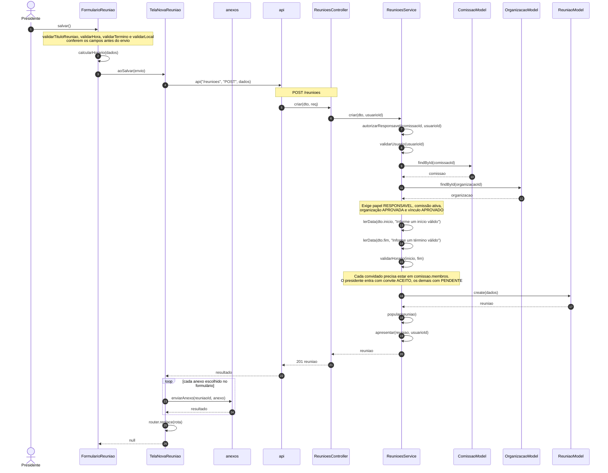
```mermaid
sequenceDiagram
    autonumber
    actor U as Presidente
    participant F as FormularioReuniao
    participant N as TelaNovaReuniao
    participant X as anexos
    participant A as api
    participant C as ReunioesController
    participant S as ReunioesService
    participant CM as ComissaoModel
    participant OM as OrganizacaoModel
    participant M as ReuniaoModel
    U->>F: salvar()
    Note over F: validarTituloReuniao, validarHora, validarTermino e validarLocal<br/>conferem os campos antes do envio
    F->>F: calcularHorario(dados)
    F->>N: aoSalvar(envio)
    N->>A: api("/reunioes", "POST", dados)
    Note over A,C: POST /reunioes
    A->>C: criar(dto, req)
    C->>S: criar(dto, usuarioId)
    S->>S: autorizarResponsavel(comissaoId, usuarioId)
    S->>S: validarUsuario(usuarioId)
    S->>CM: findById(comissaoId)
    CM-->>S: comissao
    S->>OM: findById(organizacaoId)
    OM-->>S: organizacao
    Note over S: Exige papel RESPONSAVEL, comissão ativa,<br/>organização APROVADA e vínculo APROVADO
    S->>S: lerData(dto.inicio, "Informe um início válido")
    S->>S: lerData(dto.fim, "Informe um término válido")
    S->>S: validarHorario(inicio, fim)
    Note over S: Cada convidado precisa estar em comissao.membros.<br/>O presidente entra com convite ACEITO, os demais com PENDENTE
    S->>M: create(dados)
    M-->>S: reuniao
    S->>S: popular(reuniao)
    S->>S: apresentar(reuniao, usuarioId)
    S-->>C: reuniao
    C-->>A: 201 reuniao
    A-->>N: resultado
    loop cada anexo escolhido no formulário
        N->>X: enviarAnexo(reuniaoId, anexo)
        X-->>N: resultado
    end
    N->>N: router.replace(rota)
    N-->>F: null
```

## SD-REU-02 — Consultar agenda

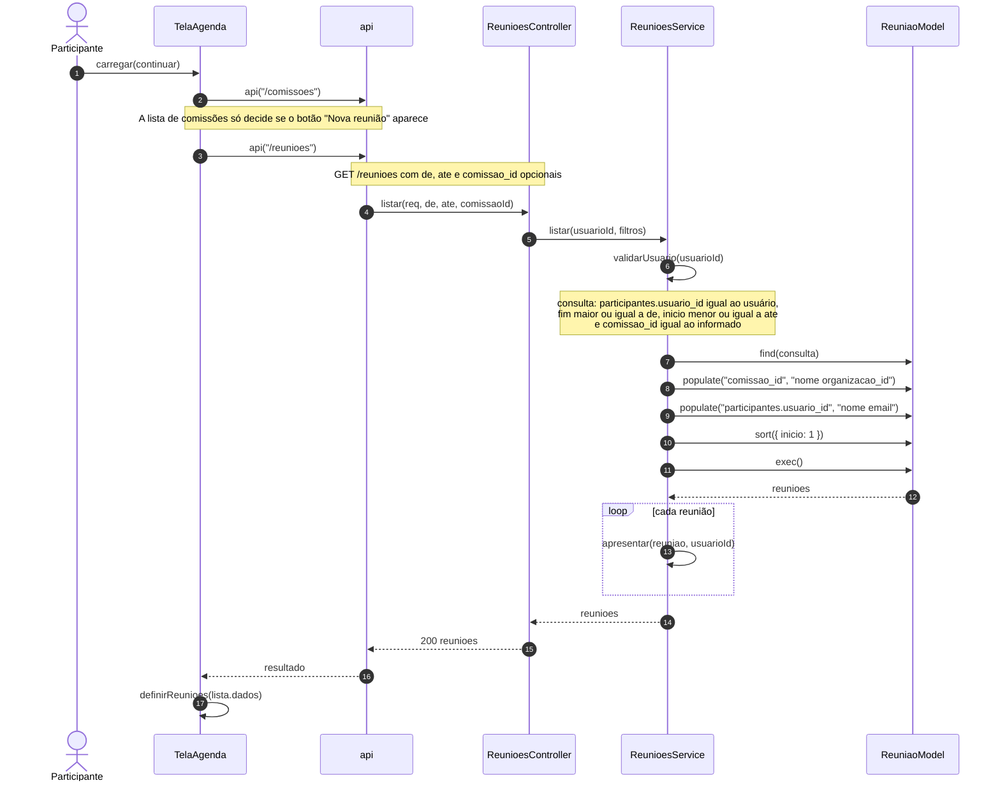
```mermaid
sequenceDiagram
    autonumber
    actor U as Participante
    participant T as TelaAgenda
    participant A as api
    participant C as ReunioesController
    participant S as ReunioesService
    participant M as ReuniaoModel
    U->>T: carregar(continuar)
    T->>A: api("/comissoes")
    Note over T,A: A lista de comissões só decide se o botão "Nova reunião" aparece
    T->>A: api("/reunioes")
    Note over A,C: GET /reunioes com de, ate e comissao_id opcionais
    A->>C: listar(req, de, ate, comissaoId)
    C->>S: listar(usuarioId, filtros)
    S->>S: validarUsuario(usuarioId)
    Note over S: consulta: participantes.usuario_id igual ao usuário,<br/>fim maior ou igual a de, inicio menor ou igual a ate<br/>e comissao_id igual ao informado
    S->>M: find(consulta)
    S->>M: populate("comissao_id", "nome organizacao_id")
    S->>M: populate("participantes.usuario_id", "nome email")
    S->>M: sort({ inicio: 1 })
    S->>M: exec()
    M-->>S: reunioes
    loop cada reunião
        S->>S: apresentar(reuniao, usuarioId)
    end
    S-->>C: reunioes
    C-->>A: 200 reunioes
    A-->>T: resultado
    T->>T: definirReunioes(lista.dados)
```

## SD-REU-03 — Visualizar reunião

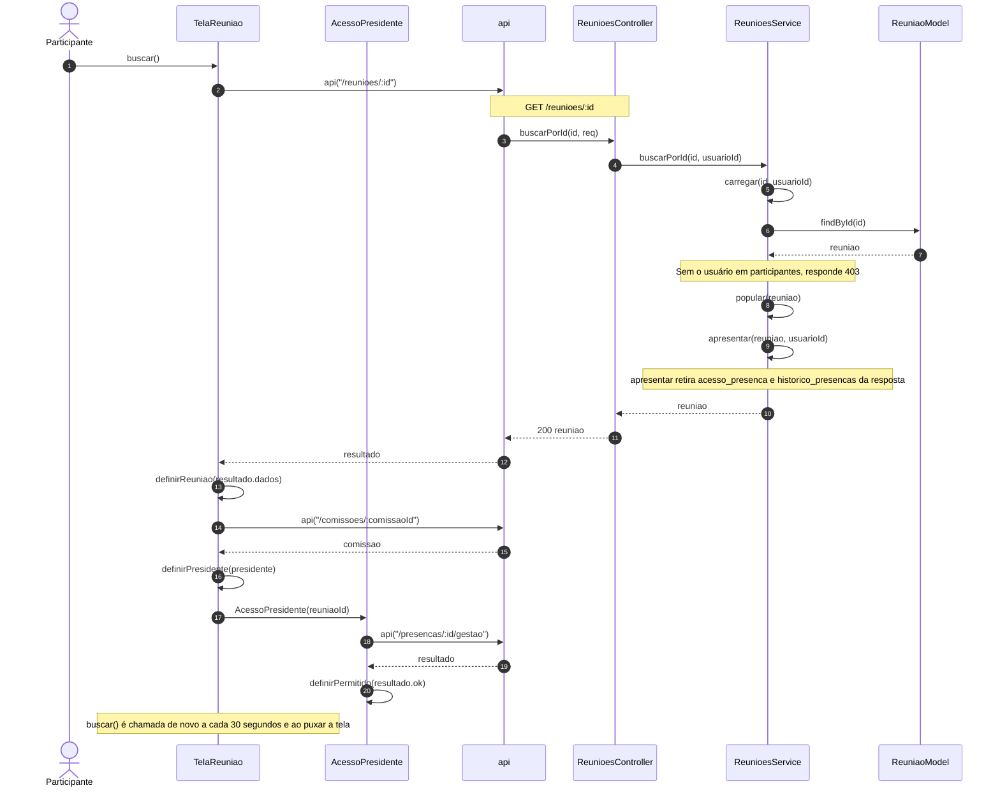
```mermaid
sequenceDiagram
    autonumber
    actor U as Participante
    participant T as TelaReuniao
    participant P as AcessoPresidente
    participant A as api
    participant C as ReunioesController
    participant S as ReunioesService
    participant M as ReuniaoModel
    U->>T: buscar()
    T->>A: api("/reunioes/:id")
    Note over A,C: GET /reunioes/:id
    A->>C: buscarPorId(id, req)
    C->>S: buscarPorId(id, usuarioId)
    S->>S: carregar(id, usuarioId)
    S->>M: findById(id)
    M-->>S: reuniao
    Note over S: Sem o usuário em participantes, responde 403
    S->>S: popular(reuniao)
    S->>S: apresentar(reuniao, usuarioId)
    Note over S: apresentar retira acesso_presenca e historico_presencas da resposta
    S-->>C: reuniao
    C-->>A: 200 reuniao
    A-->>T: resultado
    T->>T: definirReuniao(resultado.dados)
    T->>A: api("/comissoes/:comissaoId")
    A-->>T: comissao
    T->>T: definirPresidente(presidente)
    T->>P: AcessoPresidente(reuniaoId)
    P->>A: api("/presencas/:id/gestao")
    A-->>P: resultado
    P->>P: definirPermitido(resultado.ok)
    Note over T: buscar() é chamada de novo a cada 30 segundos e ao puxar a tela
```

## SD-REU-04 — Cancelar reunião

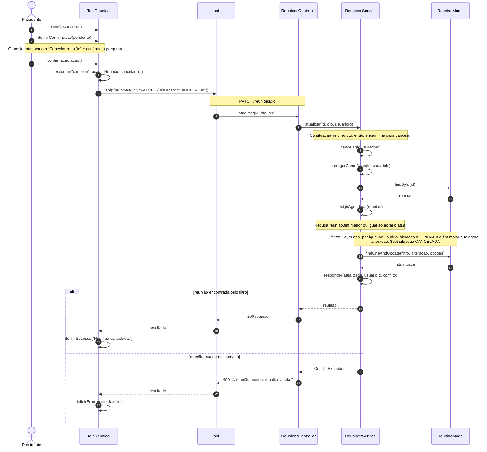
```mermaid
sequenceDiagram
    autonumber
    actor U as Presidente
    participant T as TelaReuniao
    participant A as api
    participant C as ReunioesController
    participant S as ReunioesService
    participant M as ReuniaoModel
    U->>T: definirOpcoes(true)
    U->>T: definirConfirmacao(pendente)
    Note over U,T: O presidente toca em "Cancelar reunião" e confirma a pergunta
    U->>T: confirmacao.acao()
    T->>T: executar("cancelar", acao, "Reunião cancelada.")
    T->>A: api("/reunioes/:id", "PATCH", { situacao: "CANCELADA" })
    Note over A,C: PATCH /reunioes/:id
    A->>C: atualizar(id, dto, req)
    C->>S: atualizar(id, dto, usuarioId)
    Note over S: Só situacao veio no dto, então encaminha para cancelar
    S->>S: cancelar(id, usuarioId)
    S->>S: carregarComoDono(id, usuarioId)
    S->>M: findById(id)
    M-->>S: reuniao
    S->>S: exigirAgendada(reuniao)
    Note over S: Recusa reuniao.fim menor ou igual ao horário atual
    Note over S,M: filtro: _id, criada_por igual ao usuário, situacao AGENDADA e fim maior que agora.<br/>alteracao: $set situacao CANCELADA
    S->>M: findOneAndUpdate(filtro, alteracao, opcoes)
    M-->>S: atualizada
    S->>S: responder(atualizada, usuarioId, conflito)
    alt reunião encontrada pelo filtro
        S-->>C: reuniao
        C-->>A: 200 reuniao
        A-->>T: resultado
        T->>T: definirSucesso("Reunião cancelada.")
    else reunião mudou no intervalo
        S-->>C: ConflictException
        C-->>A: 409 "A reunião mudou. Atualize a tela."
        A-->>T: resultado
        T->>T: definirErro(resultado.erro)
    end
```

## SD-REU-05 — Responder convite

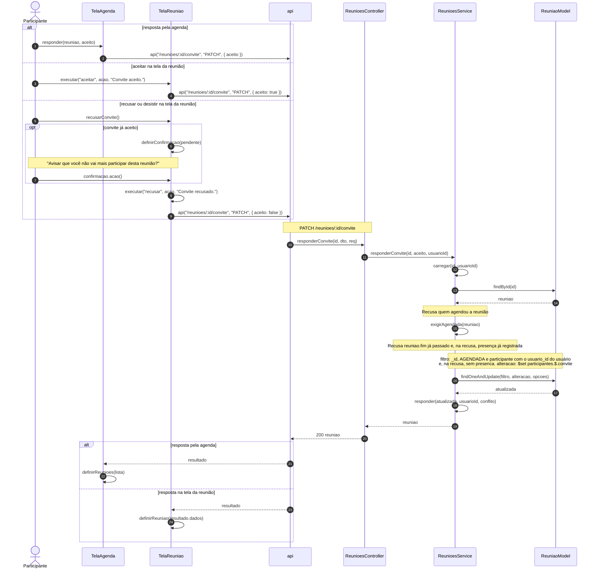
```mermaid
sequenceDiagram
    autonumber
    actor U as Participante
    participant G as TelaAgenda
    participant T as TelaReuniao
    participant A as api
    participant C as ReunioesController
    participant S as ReunioesService
    participant M as ReuniaoModel
    alt resposta pela agenda
        U->>G: responder(reuniao, aceito)
        G->>A: api("/reunioes/:id/convite", "PATCH", { aceito })
    else aceitar na tela da reunião
        U->>T: executar("aceitar", acao, "Convite aceito.")
        T->>A: api("/reunioes/:id/convite", "PATCH", { aceito: true })
    else recusar ou desistir na tela da reunião
        U->>T: recusarConvite()
        opt convite já aceito
            T->>T: definirConfirmacao(pendente)
            Note over U,T: "Avisar que você não vai mais participar desta reunião?"
            U->>T: confirmacao.acao()
        end
        T->>T: executar("recusar", acao, "Convite recusado.")
        T->>A: api("/reunioes/:id/convite", "PATCH", { aceito: false })
    end
    Note over A,C: PATCH /reunioes/:id/convite
    A->>C: responderConvite(id, dto, req)
    C->>S: responderConvite(id, aceito, usuarioId)
    S->>S: carregar(id, usuarioId)
    S->>M: findById(id)
    M-->>S: reuniao
    Note over S: Recusa quem agendou a reunião
    S->>S: exigirAgendada(reuniao)
    Note over S: Recusa reuniao.fim já passado e, na recusa, presença já registrada
    Note over S,M: filtro: _id, AGENDADA e participante com o usuario_id do usuário<br/>e, na recusa, sem presenca. alteracao: $set participantes.$.convite
    S->>M: findOneAndUpdate(filtro, alteracao, opcoes)
    M-->>S: atualizada
    S->>S: responder(atualizada, usuarioId, conflito)
    S-->>C: reuniao
    C-->>A: 200 reuniao
    alt resposta pela agenda
        A-->>G: resultado
        G->>G: definirReunioes(lista)
    else resposta na tela da reunião
        A-->>T: resultado
        T->>T: definirReuniao(resultado.dados)
    end
```

A tela inicial responde ao convite pela folha "Convites" com `responder(convite, aceito)`, que envia a mesma requisição da agenda.

## SD-REU-06 — Registrar entrada

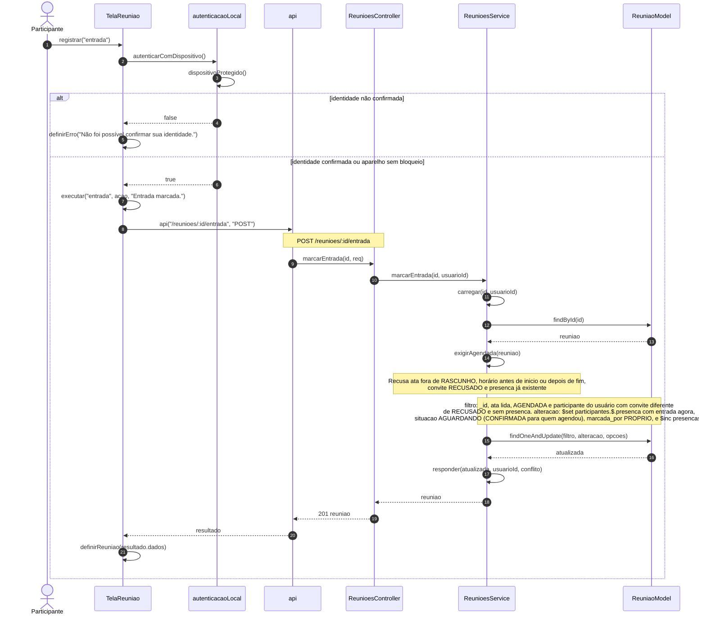
```mermaid
sequenceDiagram
    autonumber
    actor U as Participante
    participant T as TelaReuniao
    participant L as autenticacaoLocal
    participant A as api
    participant C as ReunioesController
    participant S as ReunioesService
    participant M as ReuniaoModel
    U->>T: registrar("entrada")
    T->>L: autenticarComDispositivo()
    L->>L: dispositivoProtegido()
    alt identidade não confirmada
        L-->>T: false
        T->>T: definirErro("Não foi possível confirmar sua identidade.")
    else identidade confirmada ou aparelho sem bloqueio
        L-->>T: true
        T->>T: executar("entrada", acao, "Entrada marcada.")
        T->>A: api("/reunioes/:id/entrada", "POST")
        Note over A,C: POST /reunioes/:id/entrada
        A->>C: marcarEntrada(id, req)
        C->>S: marcarEntrada(id, usuarioId)
        S->>S: carregar(id, usuarioId)
        S->>M: findById(id)
        M-->>S: reuniao
        S->>S: exigirAgendada(reuniao)
        Note over S: Recusa ata fora de RASCUNHO, horário antes de inicio ou depois de fim,<br/>convite RECUSADO e presenca já existente
        Note over S,M: filtro: _id, ata lida, AGENDADA e participante do usuário com convite diferente<br/>de RECUSADO e sem presenca. alteracao: $set participantes.$.presenca com entrada agora,<br/>situacao AGUARDANDO (CONFIRMADA para quem agendou), marcada_por PROPRIO, e $inc presencas_revisao
        S->>M: findOneAndUpdate(filtro, alteracao, opcoes)
        M-->>S: atualizada
        S->>S: responder(atualizada, usuarioId, conflito)
        S-->>C: reuniao
        C-->>A: 201 reuniao
        A-->>T: resultado
        T->>T: definirReuniao(resultado.dados)
    end
```

No cartão "Agora" da tela inicial, `marcarEntrada(reuniao)` envia a mesma requisição `POST /reunioes/:id/entrada` sem chamar `autenticarComDispositivo`.

## SD-REU-07 — Registrar saída

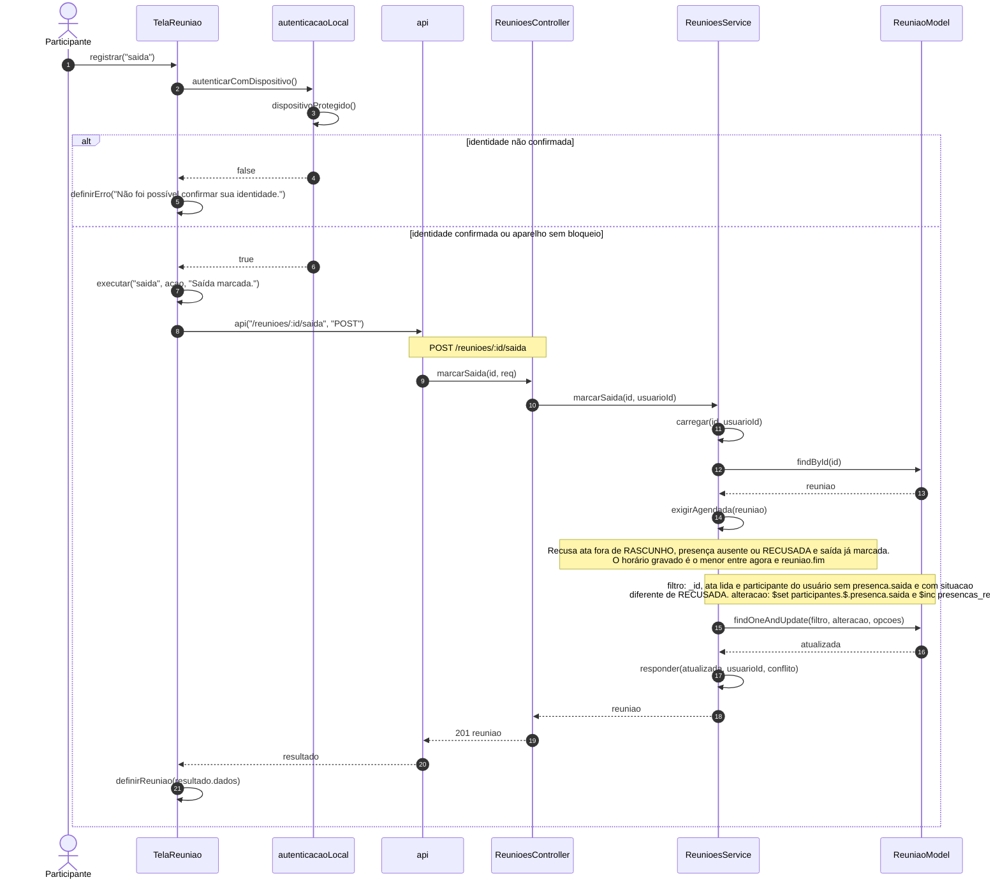
```mermaid
sequenceDiagram
    autonumber
    actor U as Participante
    participant T as TelaReuniao
    participant L as autenticacaoLocal
    participant A as api
    participant C as ReunioesController
    participant S as ReunioesService
    participant M as ReuniaoModel
    U->>T: registrar("saida")
    T->>L: autenticarComDispositivo()
    L->>L: dispositivoProtegido()
    alt identidade não confirmada
        L-->>T: false
        T->>T: definirErro("Não foi possível confirmar sua identidade.")
    else identidade confirmada ou aparelho sem bloqueio
        L-->>T: true
        T->>T: executar("saida", acao, "Saída marcada.")
        T->>A: api("/reunioes/:id/saida", "POST")
        Note over A,C: POST /reunioes/:id/saida
        A->>C: marcarSaida(id, req)
        C->>S: marcarSaida(id, usuarioId)
        S->>S: carregar(id, usuarioId)
        S->>M: findById(id)
        M-->>S: reuniao
        S->>S: exigirAgendada(reuniao)
        Note over S: Recusa ata fora de RASCUNHO, presença ausente ou RECUSADA e saída já marcada.<br/>O horário gravado é o menor entre agora e reuniao.fim
        Note over S,M: filtro: _id, ata lida e participante do usuário sem presenca.saida e com situacao<br/>diferente de RECUSADA. alteracao: $set participantes.$.presenca.saida e $inc presencas_revisao
        S->>M: findOneAndUpdate(filtro, alteracao, opcoes)
        M-->>S: atualizada
        S->>S: responder(atualizada, usuarioId, conflito)
        S-->>C: reuniao
        C-->>A: 201 reuniao
        A-->>T: resultado
        T->>T: definirReuniao(resultado.dados)
    end
```

Saída automática, feita pelo servidor quando a pessoa não marca a saída:

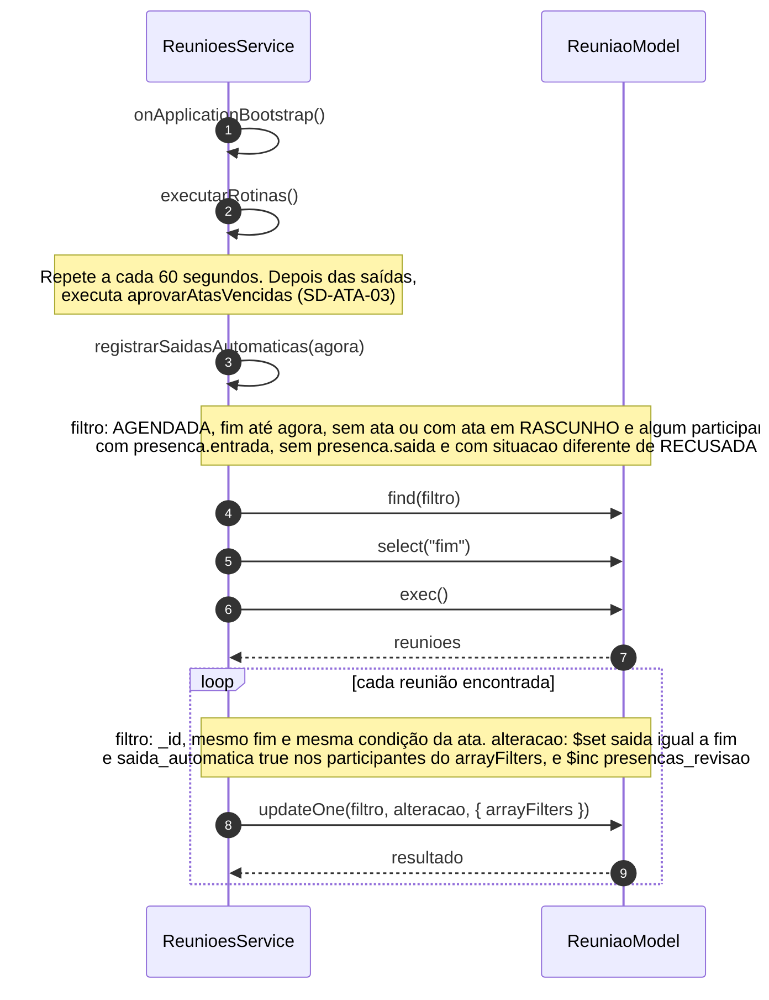
```mermaid
sequenceDiagram
    autonumber
    participant S as ReunioesService
    participant M as ReuniaoModel
    S->>S: onApplicationBootstrap()
    S->>S: executarRotinas()
    Note over S: Repete a cada 60 segundos. Depois das saídas,<br/>executa aprovarAtasVencidas (SD-ATA-03)
    S->>S: registrarSaidasAutomaticas(agora)
    Note over S,M: filtro: AGENDADA, fim até agora, sem ata ou com ata em RASCUNHO e algum participante<br/>com presenca.entrada, sem presenca.saida e com situacao diferente de RECUSADA
    S->>M: find(filtro)
    S->>M: select("fim")
    S->>M: exec()
    M-->>S: reunioes
    loop cada reunião encontrada
        Note over S,M: filtro: _id, mesmo fim e mesma condição da ata. alteracao: $set saida igual a fim<br/>e saida_automatica true nos participantes do arrayFilters, e $inc presencas_revisao
        S->>M: updateOne(filtro, alteracao, { arrayFilters })
        M-->>S: resultado
    end
```

## SD-REU-08 — Confirmar ou recusar presença

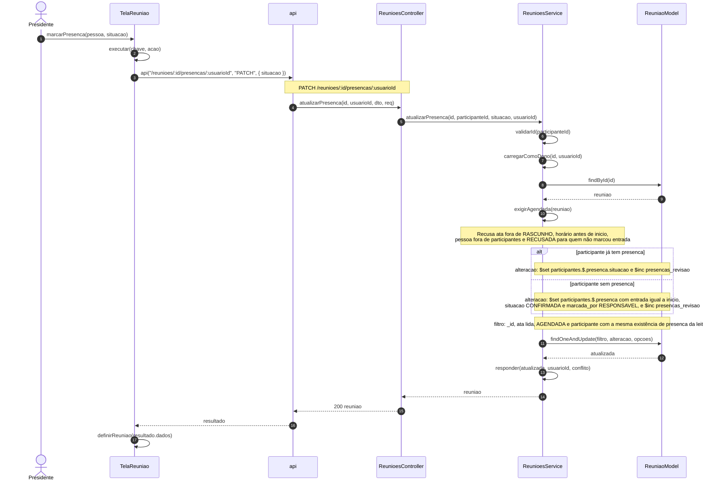
```mermaid
sequenceDiagram
    autonumber
    actor U as Presidente
    participant T as TelaReuniao
    participant A as api
    participant C as ReunioesController
    participant S as ReunioesService
    participant M as ReuniaoModel
    U->>T: marcarPresenca(pessoa, situacao)
    T->>T: executar(chave, acao)
    T->>A: api("/reunioes/:id/presencas/:usuarioId", "PATCH", { situacao })
    Note over A,C: PATCH /reunioes/:id/presencas/:usuarioId
    A->>C: atualizarPresenca(id, usuarioId, dto, req)
    C->>S: atualizarPresenca(id, participanteId, situacao, usuarioId)
    S->>S: validarId(participanteId)
    S->>S: carregarComoDono(id, usuarioId)
    S->>M: findById(id)
    M-->>S: reuniao
    S->>S: exigirAgendada(reuniao)
    Note over S: Recusa ata fora de RASCUNHO, horário antes de inicio,<br/>pessoa fora de participantes e RECUSADA para quem não marcou entrada
    alt participante já tem presenca
        Note over S,M: alteracao: $set participantes.$.presenca.situacao e $inc presencas_revisao
    else participante sem presenca
        Note over S,M: alteracao: $set participantes.$.presenca com entrada igual a inicio,<br/>situacao CONFIRMADA e marcada_por RESPONSAVEL, e $inc presencas_revisao
    end
    Note over S,M: filtro: _id, ata lida, AGENDADA e participante com a mesma existência de presenca da leitura
    S->>M: findOneAndUpdate(filtro, alteracao, opcoes)
    M-->>S: atualizada
    S->>S: responder(atualizada, usuarioId, conflito)
    S-->>C: reuniao
    C-->>A: 200 reuniao
    A-->>T: resultado
    T->>T: definirReuniao(resultado.dados)
```

## SD-REU-09 — Gerar lista de presença

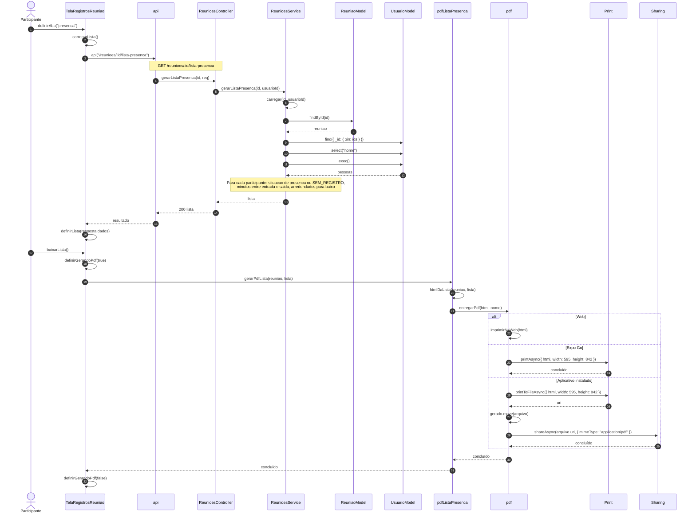
```mermaid
sequenceDiagram
    autonumber
    actor U as Participante
    participant T as TelaRegistrosReuniao
    participant A as api
    participant C as ReunioesController
    participant S as ReunioesService
    participant M as ReuniaoModel
    participant UM as UsuarioModel
    participant P as pdfListaPresenca
    participant D as pdf
    participant I as Print
    participant H as Sharing
    U->>T: definirAba("presenca")
    T->>T: carregarLista()
    T->>A: api("/reunioes/:id/lista-presenca")
    Note over A,C: GET /reunioes/:id/lista-presenca
    A->>C: gerarListaPresenca(id, req)
    C->>S: gerarListaPresenca(id, usuarioId)
    S->>S: carregar(id, usuarioId)
    S->>M: findById(id)
    M-->>S: reuniao
    S->>UM: find({ _id: { $in: ids } })
    S->>UM: select("nome")
    S->>UM: exec()
    UM-->>S: pessoas
    Note over S: Para cada participante: situacao de presenca ou SEM_REGISTRO,<br/>minutos entre entrada e saida, arredondados para baixo
    S-->>C: lista
    C-->>A: 200 lista
    A-->>T: resultado
    T->>T: definirLista(resposta.dados)
    U->>T: baixarLista()
    T->>T: definirGerandoPdf(true)
    T->>P: gerarPdfLista(reuniao, lista)
    P->>P: htmlDaLista(reuniao, lista)
    P->>D: entregarPdf(html, nome)
    alt Web
        D->>D: imprimirNaWeb(html)
    else Expo Go
        D->>I: printAsync({ html, width: 595, height: 842 })
        I-->>D: concluído
    else Aplicativo instalado
        D->>I: printToFileAsync({ html, width: 595, height: 842 })
        I-->>D: uri
        D->>D: gerado.move(arquivo)
        D->>H: shareAsync(arquivo.uri, { mimeType: "application/pdf" })
        H-->>D: concluído
    end
    D-->>P: concluído
    P-->>T: concluído
    T->>T: definirGerandoPdf(false)
```

## SD-REU-13 — Editar reunião

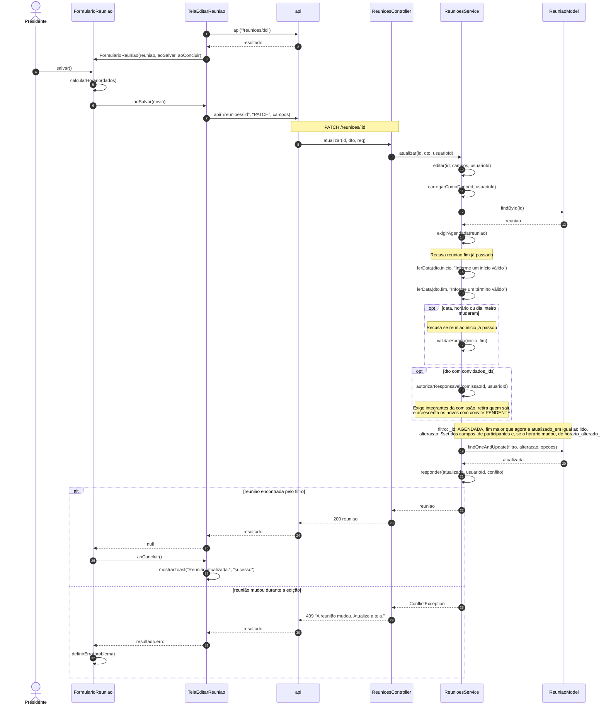
```mermaid
sequenceDiagram
    autonumber
    actor U as Presidente
    participant F as FormularioReuniao
    participant E as TelaEditarReuniao
    participant A as api
    participant C as ReunioesController
    participant S as ReunioesService
    participant M as ReuniaoModel
    E->>A: api("/reunioes/:id")
    A-->>E: resultado
    E->>F: FormularioReuniao(reuniao, aoSalvar, aoConcluir)
    U->>F: salvar()
    F->>F: calcularHorario(dados)
    F->>E: aoSalvar(envio)
    E->>A: api("/reunioes/:id", "PATCH", campos)
    Note over A,C: PATCH /reunioes/:id
    A->>C: atualizar(id, dto, req)
    C->>S: atualizar(id, dto, usuarioId)
    S->>S: editar(id, campos, usuarioId)
    S->>S: carregarComoDono(id, usuarioId)
    S->>M: findById(id)
    M-->>S: reuniao
    S->>S: exigirAgendada(reuniao)
    Note over S: Recusa reuniao.fim já passado
    S->>S: lerData(dto.inicio, "Informe um início válido")
    S->>S: lerData(dto.fim, "Informe um término válido")
    opt data, horário ou dia inteiro mudaram
        Note over S: Recusa se reuniao.inicio já passou
        S->>S: validarHorario(inicio, fim)
    end
    opt dto com convidados_ids
        S->>S: autorizarResponsavel(comissaoId, usuarioId)
        Note over S: Exige integrantes da comissão, retira quem saiu<br/>e acrescenta os novos com convite PENDENTE
    end
    Note over S,M: filtro: _id, AGENDADA, fim maior que agora e atualizado_em igual ao lido.<br/>alteracao: $set dos campos, de participantes e, se o horário mudou, de horario_alterado_em
    S->>M: findOneAndUpdate(filtro, alteracao, opcoes)
    M-->>S: atualizada
    S->>S: responder(atualizada, usuarioId, conflito)
    alt reunião encontrada pelo filtro
        S-->>C: reuniao
        C-->>A: 200 reuniao
        A-->>E: resultado
        E-->>F: null
        F->>E: aoConcluir()
        E->>E: mostrarToast("Reunião atualizada.", "sucesso")
    else reunião mudou durante a edição
        S-->>C: ConflictException
        C-->>A: 409 "A reunião mudou. Atualize a tela."
        A-->>E: resultado
        E-->>F: resultado.erro
        F->>F: definirErro(problema)
    end
```

## SD-REU-14 — Anexar arquivo à pauta

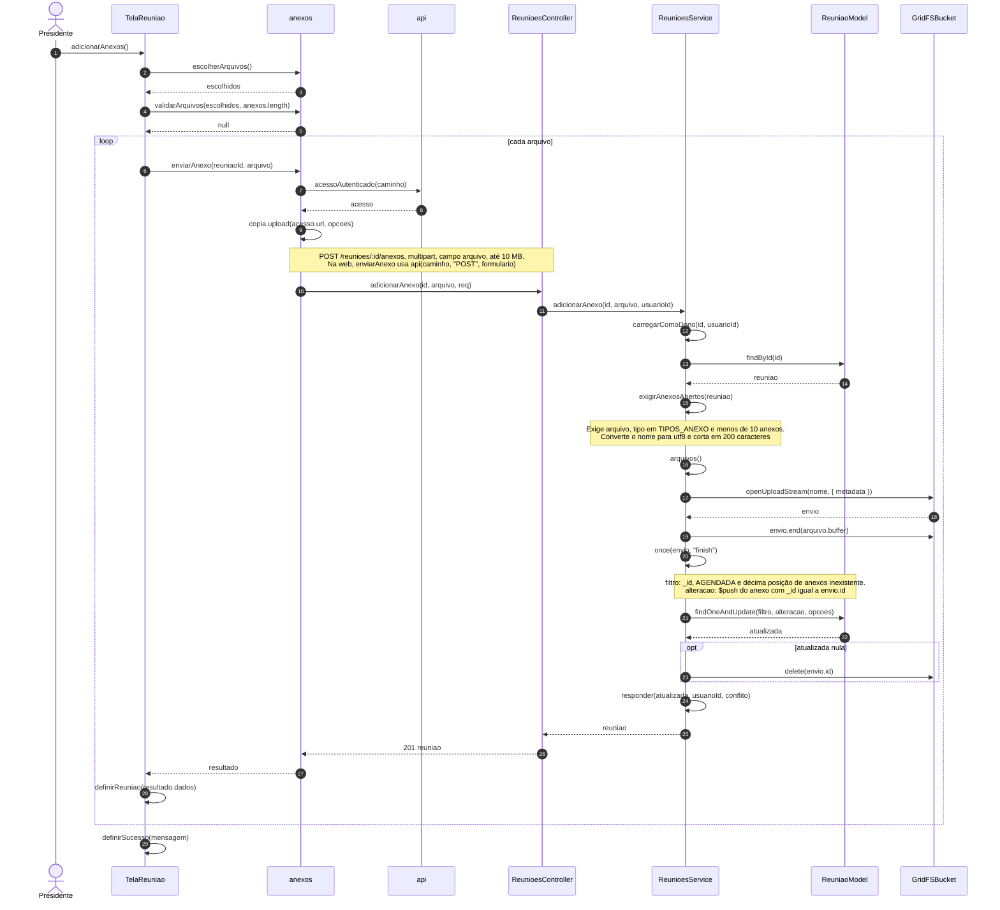
```mermaid
sequenceDiagram
    autonumber
    actor U as Presidente
    participant T as TelaReuniao
    participant X as anexos
    participant A as api
    participant C as ReunioesController
    participant S as ReunioesService
    participant M as ReuniaoModel
    participant G as GridFSBucket
    U->>T: adicionarAnexos()
    T->>X: escolherArquivos()
    X-->>T: escolhidos
    T->>X: validarArquivos(escolhidos, anexos.length)
    X-->>T: null
    loop cada arquivo
        T->>X: enviarAnexo(reuniaoId, arquivo)
        X->>A: acessoAutenticado(caminho)
        A-->>X: acesso
        X->>X: copia.upload(acesso.url, opcoes)
        Note over X,C: POST /reunioes/:id/anexos, multipart, campo arquivo, até 10 MB.<br/>Na web, enviarAnexo usa api(caminho, "POST", formulario)
        X->>C: adicionarAnexo(id, arquivo, req)
        C->>S: adicionarAnexo(id, arquivo, usuarioId)
        S->>S: carregarComoDono(id, usuarioId)
        S->>M: findById(id)
        M-->>S: reuniao
        S->>S: exigirAnexosAbertos(reuniao)
        Note over S: Exige arquivo, tipo em TIPOS_ANEXO e menos de 10 anexos.<br/>Converte o nome para utf8 e corta em 200 caracteres
        S->>S: arquivos()
        S->>G: openUploadStream(nome, { metadata })
        G-->>S: envio
        S->>G: envio.end(arquivo.buffer)
        S->>S: once(envio, "finish")
        Note over S,M: filtro: _id, AGENDADA e décima posição de anexos inexistente.<br/>alteracao: $push do anexo com _id igual a envio.id
        S->>M: findOneAndUpdate(filtro, alteracao, opcoes)
        M-->>S: atualizada
        opt atualizada nula
            S->>G: delete(envio.id)
        end
        S->>S: responder(atualizada, usuarioId, conflito)
        S-->>C: reuniao
        C-->>X: 201 reuniao
        X-->>T: resultado
        T->>T: definirReuniao(resultado.dados)
    end
    T->>T: definirSucesso(mensagem)
```

## SD-REU-15 — Baixar anexo da pauta

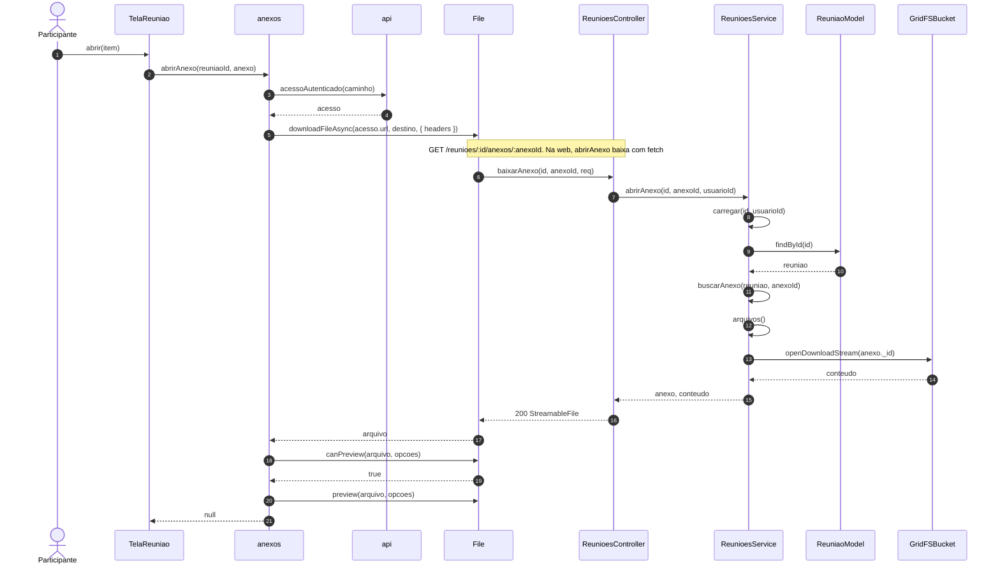
```mermaid
sequenceDiagram
    autonumber
    actor U as Participante
    participant T as TelaReuniao
    participant X as anexos
    participant A as api
    participant FS as File
    participant C as ReunioesController
    participant S as ReunioesService
    participant M as ReuniaoModel
    participant G as GridFSBucket
    U->>T: abrir(item)
    T->>X: abrirAnexo(reuniaoId, anexo)
    X->>A: acessoAutenticado(caminho)
    A-->>X: acesso
    X->>FS: downloadFileAsync(acesso.url, destino, { headers })
    Note over FS,C: GET /reunioes/:id/anexos/:anexoId. Na web, abrirAnexo baixa com fetch
    FS->>C: baixarAnexo(id, anexoId, req)
    C->>S: abrirAnexo(id, anexoId, usuarioId)
    S->>S: carregar(id, usuarioId)
    S->>M: findById(id)
    M-->>S: reuniao
    S->>S: buscarAnexo(reuniao, anexoId)
    S->>S: arquivos()
    S->>G: openDownloadStream(anexo._id)
    G-->>S: conteudo
    S-->>C: anexo, conteudo
    C-->>FS: 200 StreamableFile
    FS-->>X: arquivo
    X->>FS: canPreview(arquivo, opcoes)
    FS-->>X: true
    X->>FS: preview(arquivo, opcoes)
    X-->>T: null
```

## SD-REU-16 — Remover anexo da pauta

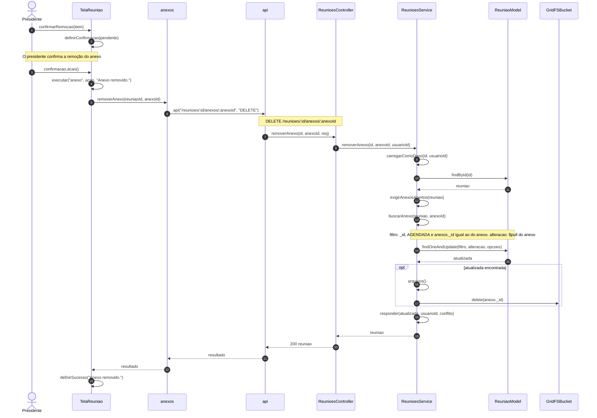
```mermaid
sequenceDiagram
    autonumber
    actor U as Presidente
    participant T as TelaReuniao
    participant X as anexos
    participant A as api
    participant C as ReunioesController
    participant S as ReunioesService
    participant M as ReuniaoModel
    participant G as GridFSBucket
    U->>T: confirmarRemocao(item)
    T->>T: definirConfirmacao(pendente)
    Note over U,T: O presidente confirma a remoção do anexo
    U->>T: confirmacao.acao()
    T->>T: executar("anexo", acao, "Anexo removido.")
    T->>X: removerAnexo(reuniaoId, anexoId)
    X->>A: api("/reunioes/:id/anexos/:anexoId", "DELETE")
    Note over A,C: DELETE /reunioes/:id/anexos/:anexoId
    A->>C: removerAnexo(id, anexoId, req)
    C->>S: removerAnexo(id, anexoId, usuarioId)
    S->>S: carregarComoDono(id, usuarioId)
    S->>M: findById(id)
    M-->>S: reuniao
    S->>S: exigirAnexosAbertos(reuniao)
    S->>S: buscarAnexo(reuniao, anexoId)
    Note over S,M: filtro: _id, AGENDADA e anexos._id igual ao do anexo. alteracao: $pull do anexo
    S->>M: findOneAndUpdate(filtro, alteracao, opcoes)
    M-->>S: atualizada
    opt atualizada encontrada
        S->>S: arquivos()
        S->>G: delete(anexo._id)
    end
    S->>S: responder(atualizada, usuarioId, conflito)
    S-->>C: reuniao
    C-->>A: 200 reuniao
    A-->>X: resultado
    X-->>T: resultado
    T->>T: definirSucesso("Anexo removido.")
```

## SD-REU-17 — Gerar link de presença

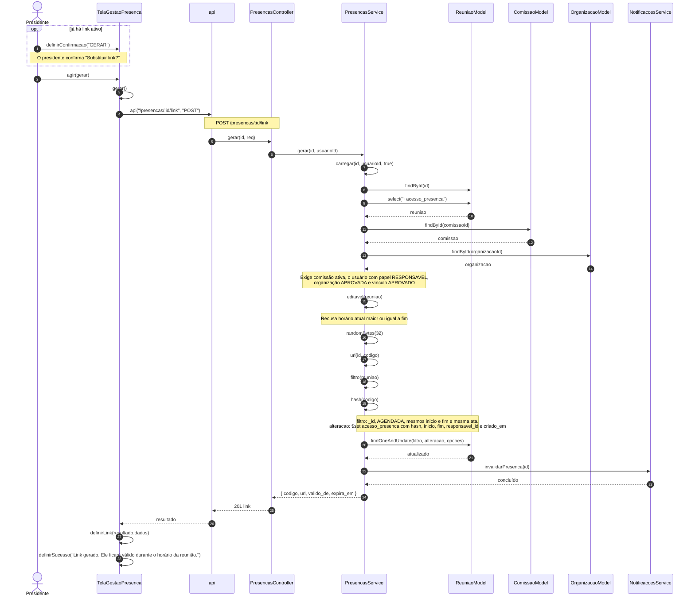
```mermaid
sequenceDiagram
    autonumber
    actor U as Presidente
    participant T as TelaGestaoPresenca
    participant A as api
    participant C as PresencasController
    participant S as PresencasService
    participant M as ReuniaoModel
    participant CM as ComissaoModel
    participant OM as OrganizacaoModel
    participant N as NotificacoesService
    opt já há link ativo
        U->>T: definirConfirmacao("GERAR")
        Note over U,T: O presidente confirma "Substituir link?"
    end
    U->>T: agir(gerar)
    T->>T: gerar()
    T->>A: api("/presencas/:id/link", "POST")
    Note over A,C: POST /presencas/:id/link
    A->>C: gerar(id, req)
    C->>S: gerar(id, usuarioId)
    S->>S: carregar(id, usuarioId, true)
    S->>M: findById(id)
    S->>M: select("+acesso_presenca")
    M-->>S: reuniao
    S->>CM: findById(comissaoId)
    CM-->>S: comissao
    S->>OM: findById(organizacaoId)
    OM-->>S: organizacao
    Note over S: Exige comissão ativa, o usuário com papel RESPONSAVEL,<br/>organização APROVADA e vínculo APROVADO
    S->>S: editavel(reuniao)
    Note over S: Recusa horário atual maior ou igual a fim
    S->>S: randomBytes(32)
    S->>S: url(id, codigo)
    S->>S: filtro(reuniao)
    S->>S: hash(codigo)
    Note over S,M: filtro: _id, AGENDADA, mesmos inicio e fim e mesma ata.<br/>alteracao: $set acesso_presenca com hash, inicio, fim, responsavel_id e criado_em
    S->>M: findOneAndUpdate(filtro, alteracao, opcoes)
    M-->>S: atualizado
    S->>N: invalidarPresenca(id)
    N-->>S: concluído
    S-->>C: { codigo, url, valido_de, expira_em }
    C-->>A: 201 link
    A-->>T: resultado
    T->>T: definirLink(resultado.dados)
    T->>T: definirSucesso("Link gerado. Ele ficará válido durante o horário da reunião.")
```

## SD-REU-18 — Revogar link de presença

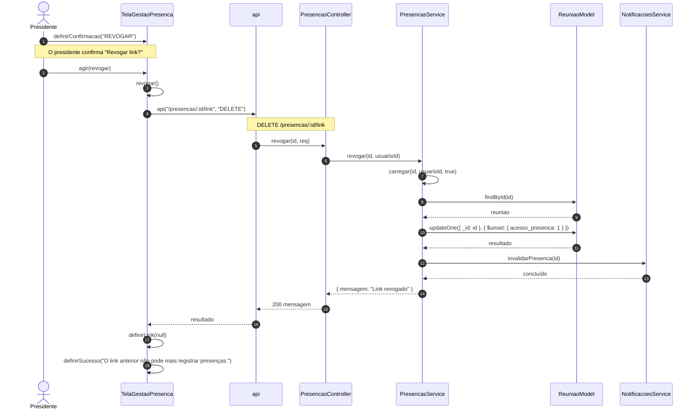
```mermaid
sequenceDiagram
    autonumber
    actor U as Presidente
    participant T as TelaGestaoPresenca
    participant A as api
    participant C as PresencasController
    participant S as PresencasService
    participant M as ReuniaoModel
    participant N as NotificacoesService
    U->>T: definirConfirmacao("REVOGAR")
    Note over U,T: O presidente confirma "Revogar link?"
    U->>T: agir(revogar)
    T->>T: revogar()
    T->>A: api("/presencas/:id/link", "DELETE")
    Note over A,C: DELETE /presencas/:id/link
    A->>C: revogar(id, req)
    C->>S: revogar(id, usuarioId)
    S->>S: carregar(id, usuarioId, true)
    S->>M: findById(id)
    M-->>S: reuniao
    S->>M: updateOne({ _id: id }, { $unset: { acesso_presenca: 1 } })
    M-->>S: resultado
    S->>N: invalidarPresenca(id)
    N-->>S: concluído
    S-->>C: { mensagem: "Link revogado" }
    C-->>A: 200 mensagem
    A-->>T: resultado
    T->>T: definirLink(null)
    T->>T: definirSucesso("O link anterior não pode mais registrar presenças.")
```

## SD-REU-19 — Enviar link de presença

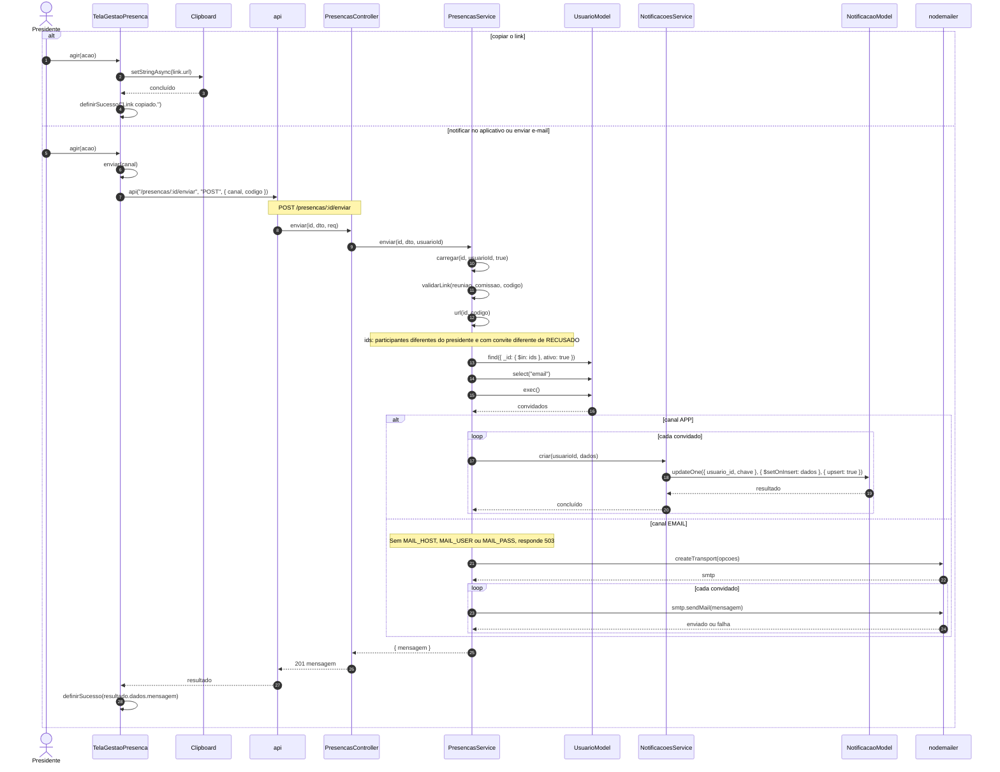
```mermaid
sequenceDiagram
    autonumber
    actor U as Presidente
    participant T as TelaGestaoPresenca
    participant K as Clipboard
    participant A as api
    participant C as PresencasController
    participant S as PresencasService
    participant UM as UsuarioModel
    participant N as NotificacoesService
    participant NM as NotificacaoModel
    participant E as nodemailer
    alt copiar o link
        U->>T: agir(acao)
        T->>K: setStringAsync(link.url)
        K-->>T: concluído
        T->>T: definirSucesso("Link copiado.")
    else notificar no aplicativo ou enviar e-mail
        U->>T: agir(acao)
        T->>T: enviar(canal)
        T->>A: api("/presencas/:id/enviar", "POST", { canal, codigo })
        Note over A,C: POST /presencas/:id/enviar
        A->>C: enviar(id, dto, req)
        C->>S: enviar(id, dto, usuarioId)
        S->>S: carregar(id, usuarioId, true)
        S->>S: validarLink(reuniao, comissao, codigo)
        S->>S: url(id, codigo)
        Note over S: ids: participantes diferentes do presidente e com convite diferente de RECUSADO
        S->>UM: find({ _id: { $in: ids }, ativo: true })
        S->>UM: select("email")
        S->>UM: exec()
        UM-->>S: convidados
        alt canal APP
            loop cada convidado
                S->>N: criar(usuarioId, dados)
                N->>NM: updateOne({ usuario_id, chave }, { $setOnInsert: dados }, { upsert: true })
                NM-->>N: resultado
                N-->>S: concluído
            end
        else canal EMAIL
            Note over S: Sem MAIL_HOST, MAIL_USER ou MAIL_PASS, responde 503
            S->>E: createTransport(opcoes)
            E-->>S: smtp
            loop cada convidado
                S->>E: smtp.sendMail(mensagem)
                E-->>S: enviado ou falha
            end
        end
        S-->>C: { mensagem }
        C-->>A: 201 mensagem
        A-->>T: resultado
        T->>T: definirSucesso(resultado.dados.mensagem)
    end
```

## SD-REU-20 — Registrar presença pelo link

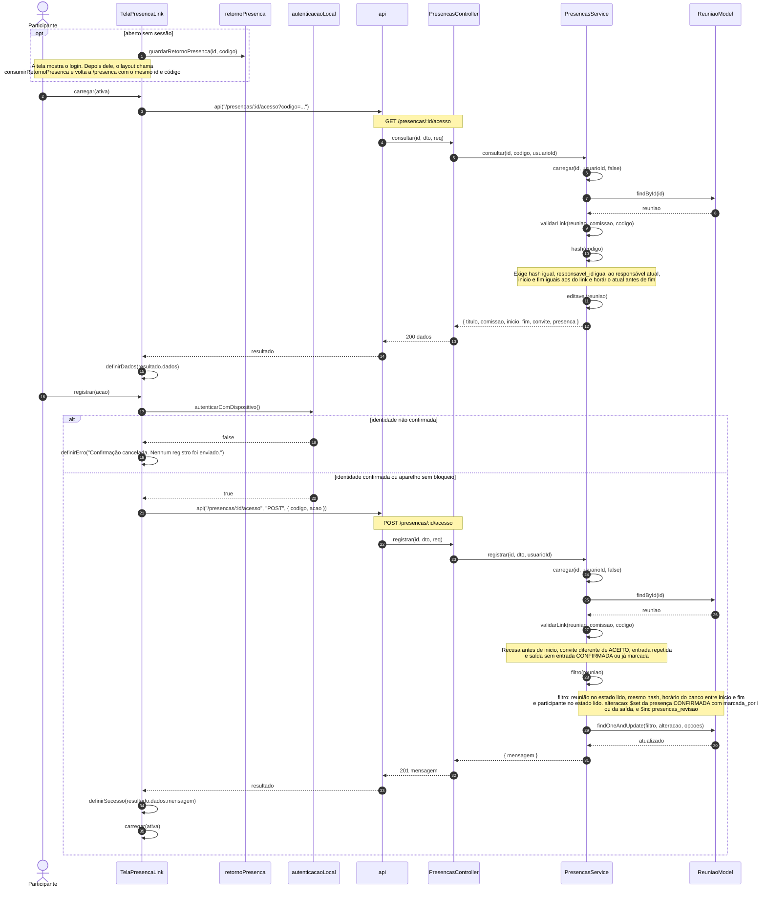
```mermaid
sequenceDiagram
    autonumber
    actor U as Participante
    participant P as TelaPresencaLink
    participant R as retornoPresenca
    participant L as autenticacaoLocal
    participant A as api
    participant C as PresencasController
    participant S as PresencasService
    participant M as ReuniaoModel
    opt aberto sem sessão
        P->>R: guardarRetornoPresenca(id, codigo)
        Note over U,P: A tela mostra o login. Depois dele, o layout chama<br/>consumirRetornoPresenca e volta a /presenca com o mesmo id e código
    end
    U->>P: carregar(ativa)
    P->>A: api("/presencas/:id/acesso?codigo=...")
    Note over A,C: GET /presencas/:id/acesso
    A->>C: consultar(id, dto, req)
    C->>S: consultar(id, codigo, usuarioId)
    S->>S: carregar(id, usuarioId, false)
    S->>M: findById(id)
    M-->>S: reuniao
    S->>S: validarLink(reuniao, comissao, codigo)
    S->>S: hash(codigo)
    Note over S: Exige hash igual, responsavel_id igual ao responsável atual,<br/>inicio e fim iguais aos do link e horário atual antes de fim
    S->>S: editavel(reuniao)
    S-->>C: { titulo, comissao, inicio, fim, convite, presenca }
    C-->>A: 200 dados
    A-->>P: resultado
    P->>P: definirDados(resultado.dados)
    U->>P: registrar(acao)
    P->>L: autenticarComDispositivo()
    alt identidade não confirmada
        L-->>P: false
        P->>P: definirErro("Confirmação cancelada. Nenhum registro foi enviado.")
    else identidade confirmada ou aparelho sem bloqueio
        L-->>P: true
        P->>A: api("/presencas/:id/acesso", "POST", { codigo, acao })
        Note over A,C: POST /presencas/:id/acesso
        A->>C: registrar(id, dto, req)
        C->>S: registrar(id, dto, usuarioId)
        S->>S: carregar(id, usuarioId, false)
        S->>M: findById(id)
        M-->>S: reuniao
        S->>S: validarLink(reuniao, comissao, codigo)
        Note over S: Recusa antes de inicio, convite diferente de ACEITO, entrada repetida<br/>e saída sem entrada CONFIRMADA ou já marcada
        S->>S: filtro(reuniao)
        Note over S,M: filtro: reunião no estado lido, mesmo hash, horário do banco entre inicio e fim<br/>e participante no estado lido. alteracao: $set da presença CONFIRMADA com marcada_por LINK<br/>ou da saída, e $inc presencas_revisao
        S->>M: findOneAndUpdate(filtro, alteracao, opcoes)
        M-->>S: atualizado
        S-->>C: { mensagem }
        C-->>A: 201 mensagem
        A-->>P: resultado
        P->>P: definirSucesso(resultado.dados.mensagem)
        P->>P: carregar(ativa)
    end
```

## SD-REU-21 — Corrigir horários de presença

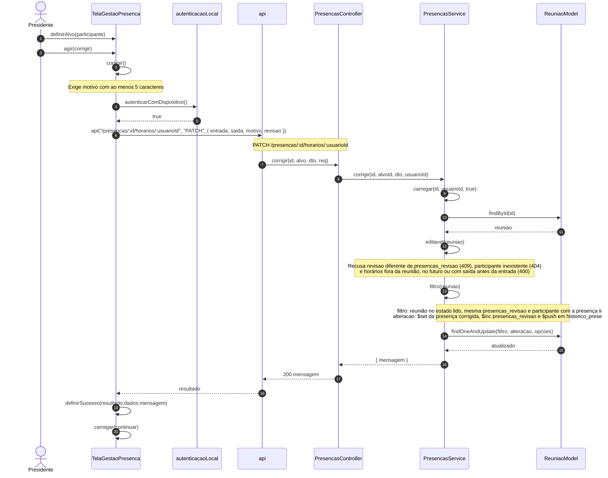
```mermaid
sequenceDiagram
    autonumber
    actor U as Presidente
    participant T as TelaGestaoPresenca
    participant L as autenticacaoLocal
    participant A as api
    participant C as PresencasController
    participant S as PresencasService
    participant M as ReuniaoModel
    U->>T: definirAlvo(participante)
    U->>T: agir(corrigir)
    T->>T: corrigir()
    Note over T: Exige motivo com ao menos 5 caracteres
    T->>L: autenticarComDispositivo()
    L-->>T: true
    T->>A: api("/presencas/:id/horarios/:usuarioId", "PATCH", { entrada, saida, motivo, revisao })
    Note over A,C: PATCH /presencas/:id/horarios/:usuarioId
    A->>C: corrigir(id, alvo, dto, req)
    C->>S: corrigir(id, alvoId, dto, usuarioId)
    S->>S: carregar(id, usuarioId, true)
    S->>M: findById(id)
    M-->>S: reuniao
    S->>S: editavel(reuniao)
    Note over S: Recusa revisao diferente de presencas_revisao (409), participante inexistente (404)<br/>e horários fora da reunião, no futuro ou com saída antes da entrada (400)
    S->>S: filtro(reuniao)
    Note over S,M: filtro: reunião no estado lido, mesma presencas_revisao e participante com a presença lida.<br/>alteracao: $set da presença corrigida, $inc presencas_revisao e $push em historico_presencas
    S->>M: findOneAndUpdate(filtro, alteracao, opcoes)
    M-->>S: atualizado
    S-->>C: { mensagem }
    C-->>A: 200 mensagem
    A-->>T: resultado
    T->>T: definirSucesso(resultado.dados.mensagem)
    T->>T: carregar(continuar)
```

## SD-REU-22 — Consultar gestão e histórico de presença

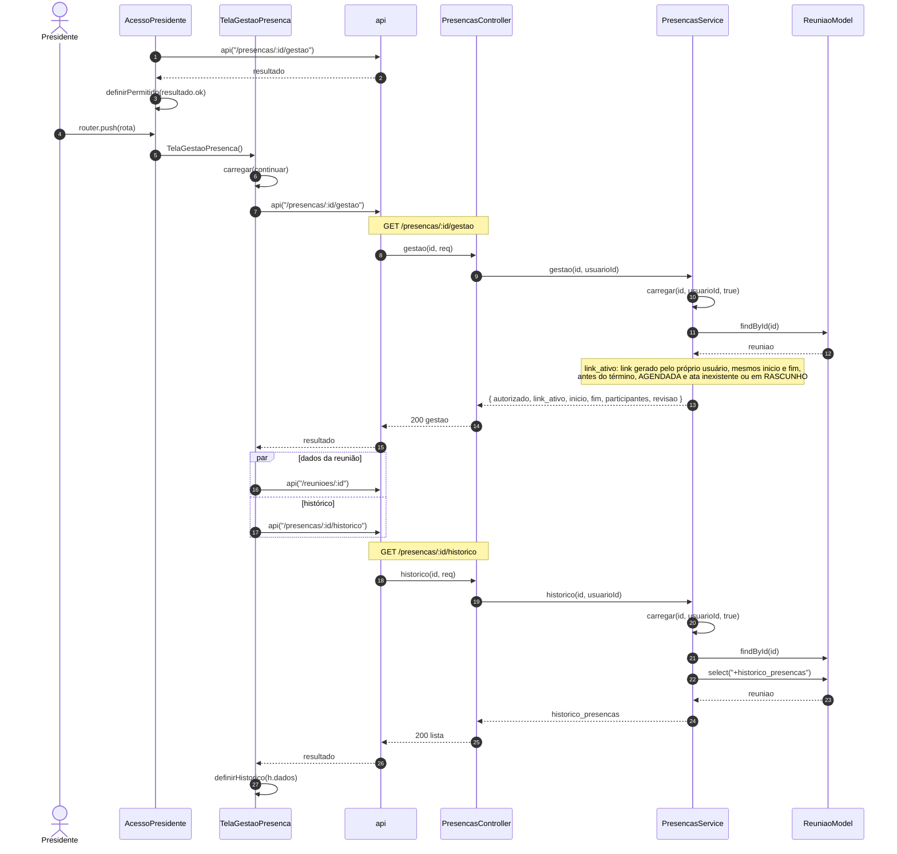
```mermaid
sequenceDiagram
    autonumber
    actor U as Presidente
    participant P as AcessoPresidente
    participant T as TelaGestaoPresenca
    participant A as api
    participant C as PresencasController
    participant S as PresencasService
    participant M as ReuniaoModel
    P->>A: api("/presencas/:id/gestao")
    A-->>P: resultado
    P->>P: definirPermitido(resultado.ok)
    U->>P: router.push(rota)
    P->>T: TelaGestaoPresenca()
    T->>T: carregar(continuar)
    T->>A: api("/presencas/:id/gestao")
    Note over A,C: GET /presencas/:id/gestao
    A->>C: gestao(id, req)
    C->>S: gestao(id, usuarioId)
    S->>S: carregar(id, usuarioId, true)
    S->>M: findById(id)
    M-->>S: reuniao
    Note over S: link_ativo: link gerado pelo próprio usuário, mesmos inicio e fim,<br/>antes do término, AGENDADA e ata inexistente ou em RASCUNHO
    S-->>C: { autorizado, link_ativo, inicio, fim, participantes, revisao }
    C-->>A: 200 gestao
    A-->>T: resultado
    par dados da reunião
        T->>A: api("/reunioes/:id")
    and histórico
        T->>A: api("/presencas/:id/historico")
    end
    Note over A,C: GET /presencas/:id/historico
    A->>C: historico(id, req)
    C->>S: historico(id, usuarioId)
    S->>S: carregar(id, usuarioId, true)
    S->>M: findById(id)
    S->>M: select("+historico_presencas")
    M-->>S: reuniao
    S-->>C: historico_presencas
    C-->>A: 200 lista
    A-->>T: resultado
    T->>T: definirHistorico(h.dados)
```

## Rastreabilidade

SD-REU-01 a SD-REU-09 e SD-REU-13 a SD-REU-22 correspondem, com o mesmo número, a UC-REU e RF-REU. Os diagramas da ata estão em [SD-ATA-01 a SD-ATA-08](../../4%20-%20Incremento3/atas/6%20-%20diagramas-sequencia-atas.md) e os das votações em [SD-VOT-01 a SD-VOT-04](../../4%20-%20Incremento3/votacao/6%20-%20diagramas-sequencia-votacao.md).
