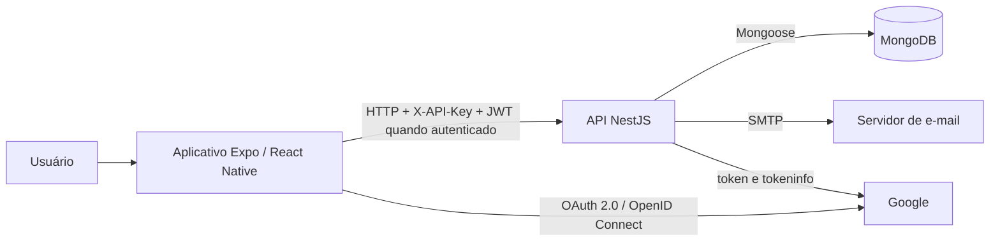

# Arquitetura e tecnologias

## 1. Arquitetura

```mermaid
flowchart LR
    U[Usuário] --> APP[Aplicativo Expo / React Native]
    APP -->|HTTP + X-API-Key + JWT quando autenticado| API[API NestJS]
    API -->|Mongoose| DB[(MongoDB)]
    API -->|SMTP| MAIL[Servidor de e-mail]
    APP -->|OAuth 2.0 / OpenID Connect| GOOGLE[Google]
    API -->|token e tokeninfo| GOOGLE
```

O frontend é uma aplicação React Native com Expo Router. O backend é uma API REST NestJS. O MongoDB persiste `usuarios`, `organizacoes`, `comissoes`, `reunioes` e `contadores`; vínculos, participantes, presenças, atas e avaliações das atas são subdocumentos embutidos. Os arquivos anexados às pautas ficam no GridFS, nas coleções `anexos.files` e `anexos.chunks`. A coleção `contadores` guarda a numeração das atas por comissão e ano.

## 2. Camadas do frontend

| Camada      | Responsabilidade                      | Exemplos                                                         |
| ----------- | ------------------------------------- | ---------------------------------------------------------------- |
| Rotas/telas | interação, formulários e navegação    | `src/app/login`, `src/app/(abas)`, `src/app/reunioes`            |
| Componentes | elementos reutilizáveis e responsivos | `CampoTexto`, `Confirmacao`, `TelaComCabecalho`, `FolhaInferior` |
| Contextos   | sessão, tema e mensagens              | `SessaoContext`, `TemaContext`, `ToastContext`                   |
| Serviços    | HTTP, OAuth, autenticação local, anexos e PDF | `api.ts`, `google.ts`, `autenticacao-local.ts`, `anexos.ts`, `pdfAta.ts` |
| Utilitários | validações e regras de apresentação   | `validacao.ts`, `reunioes.ts`, `sugestoes-horario.ts`, `diferenca.ts` |

Os formulários usam `react-hook-form`; a tela principal usa `react-native-keyboard-controller` para evitar que o teclado cubra campos no Android. Em formulários de mais de um campo, `returnKeyType` com `setFocus` leva a tecla de avanço ao campo seguinte e a última tecla envia o formulário. Telas com dados mutáveis usam `useFocusEffect` para recarregar ao receber foco.

## 3. Camadas do backend

| Camada         | Responsabilidade                                                           |
| -------------- | -------------------------------------------------------------------------- |
| Controllers    | mapear rotas, DTOs, parâmetros e guards                                    |
| DTOs           | validar e transformar entradas com `class-validator` e `class-transformer` |
| Services       | aplicar regras de negócio e coordenar persistência                         |
| Schemas/Models | definir documentos e operações Mongoose                                    |
| Guards         | validar chave da API, JWT, tipo de usuário e vínculo                       |

O `ValidationPipe` global usa `whitelist: true` e `transform: true`: propriedades sem decoradores são removidas e valores compatíveis podem ser transformados antes do controller.

## 4. Proteção das requisições

1. `ApiKeyGuard` global exige `X-API-Key` em todas as requisições, exceto `OPTIONS` e os dois callbacks GET do Google.
2. Rotas privadas aplicam `JwtAuthGuard`, que valida o Bearer JWT, o `sub`, a existência e o estado ativo da conta.
3. `AdminSistemaGuard` e `UsuarioComumGuard` restringem o tipo de conta.
4. Os services validam autorização de domínio, como ser administrador aprovado da organização ou responsável da comissão.

O JWT expira em **1 hora**. No aplicativo nativo ele é salvo por `expo-secure-store`; na web, por `localStorage`. A sessão é revalidada ao abrir o aplicativo, ao voltar ao primeiro plano e a cada 30 segundos.

> Limite conhecido: `EXPO_PUBLIC_API_ACCESS_TOKEN` é incorporado ao aplicativo e não deve ser tratado como credencial secreta. Ele bloqueia clientes sem a chave configurada, mas não substitui JWT, autorização por papel nem TLS.

## 5. Bibliotecas do frontend

Versões resolvidas pelo `package-lock.json` da branch `homolog` em 09/11/2026, após a migração para o Expo SDK 58 (commit `9cb23ad`) e a inclusão das bibliotecas dos Incrementos 2 e 3:

| Biblioteca                       |  Versão | Uso no projeto                                                     |
| -------------------------------- | ------: | ------------------------------------------------------------------ |
| Expo                             | 58.0.23 | runtime, bundler e ferramentas do aplicativo                       |
| React                            |  19.3.0 | componentes e estado                                               |
| React Native                     |  0.88.1 | interface nativa Android/iOS                                       |
| Expo Router                      | 58.0.30 | rotas por arquivos e proteção de telas                             |
| React Hook Form                  |  7.90.0 | estado, validação e envio dos formulários                          |
| React Native Keyboard Controller |  1.22.7 | ajuste da tela ao teclado, principalmente Android                  |
| Expo Secure Store                |  58.0.2 | JWT e preferência de tema no dispositivo                           |
| Expo Local Authentication        |  58.0.2 | biometria, Face ID ou PIN ao aprovar a ata e em ações de conta     |
| Expo Print                       |  58.0.8 | geração do PDF da ata aprovada                                     |
| DateTimePicker da comunidade     |   9.2.1 | seletor de hora nativo do Android e do iOS                          |
| Expo Sharing                     | 58.0.22 | entrega do PDF ao menu de compartilhamento do aparelho             |
| Expo Document Picker             |  58.0.4 | escolha dos arquivos anexados à pauta                              |
| Expo File System                 | 58.0.13 | envio, download e abertura dos anexos                              |
| Expo Auth Session                | 58.0.17 | fluxo OAuth no navegador                                           |
| Google Sign-In                   |  16.1.5 | login Google nativo                                                |
| Expo Linking                     | 58.0.16 | deep links e callbacks                                             |
| Expo Constants                   | 58.0.15 | configuração Expo e descoberta do host local                       |
| Expo Clipboard                   |  58.0.4 | cópia do código de acesso da organização                           |
| Expo Linear Gradient             |  58.0.3 | fundos visuais                                                     |
| Expo Font                        | 58.0.11 | carregamento das fontes                                            |
| Expo Build Properties            | 58.0.12 | ajustes da compilação nativa Android                               |
| Expo Dev Client                  | 58.0.18 | execução de versões de desenvolvimento                             |
| Poppins para Expo                |   0.4.1 | família tipográfica                                                |
| Ionicons para React Native       |  14.0.0 | ícones                                                             |
| Gesture Handler                  |   3.3.0 | gestos nativos                                                     |
| Reanimated                       |   4.7.1 | animações nativas                                                  |
| React Native Worklets            |  0.13.0 | execução das animações na thread de UI, exigida pelo Reanimated 4  |
| Safe Area Context                | 5.11.1  | respeito às áreas seguras do aparelho                              |
| React Native Screens             |  4.30.1 | telas nativas usadas pela navegação                                |
| React Native Web                 |  0.21.4 | execução no navegador                                              |
| TypeScript                       |   6.0.3 | tipagem e verificação estática                                     |
| ESLint                           |  9.39.5 | análise de estilo e problemas de código                            |

## 6. Bibliotecas do backend

Versões resolvidas pelo `package-lock.json` do commit `6f2ffc4`:

| Biblioteca              |  Versão | Uso no projeto                                |
| ----------------------- | ------: | --------------------------------------------- |
| NestJS Common/Core      |  12.0.1 | framework e injeção de dependências           |
| NestJS Platform Express |  12.0.1 | servidor HTTP Express                         |
| NestJS Config           |  12.0.0 | variáveis de ambiente                         |
| NestJS JWT              |  12.0.1 | assinatura e validação do JWT                 |
| NestJS Mongoose         |  12.0.0 | integração com MongoDB                        |
| Mongoose                |   9.9.5 | schemas, consultas e persistência             |
| bcrypt                  |   6.0.0 | hash e comparação de senhas, custo 10         |
| class-validator         |  0.15.1 | validação declarativa dos DTOs                |
| class-transformer       |   0.5.1 | transformação de entradas                     |
| Nodemailer              | 10.0.10 | envio de códigos de confirmação e recuperação |
| RxJS                    |   7.8.2 | infraestrutura reativa usada pelo NestJS      |
| Vitest                  |  4.1.11 | testes automatizados                          |
| Supertest               |   7.2.2 | testes HTTP                                   |
| Oxlint                  |  1.82.0 | análise estática                              |
| Prettier                |   3.9.6 | formatação                                    |
| TypeScript              |   6.0.3 | compilação e tipagem                          |

O backend usa também os módulos nativos `node:crypto` para códigos, tokens e comparação temporal segura, `node:os` para métricas do servidor, `node:events` para esperar o fim da gravação dos anexos no GridFS e `fetch` do Node para endpoints OAuth do Google. Os anexos são lidos e gravados pelo `GridFSBucket` do driver MongoDB, exposto pelo Mongoose, e recebidos pelo `FileInterceptor` do `@nestjs/platform-express`.

## 7. Variáveis de ambiente

| Aplicação | Variável                              | Finalidade                                | Sensível?                                |
| --------- | ------------------------------------- | ----------------------------------------- | ---------------------------------------- |
| Frontend  | `EXPO_PUBLIC_API_URL`                 | endereço base da API                      | Não                                      |
| Frontend  | `EXPO_PUBLIC_API_ACCESS_TOKEN`        | valor enviado em `X-API-Key`              | Público no bundle; não usar como segredo |
| Frontend  | `EXPO_PUBLIC_GOOGLE_*`                | IDs e URIs públicas do OAuth              | Não são segredos                         |
| Backend   | `MONGODB_URI`                         | conexão MongoDB                           | Sim quando contém credenciais            |
| Backend   | `JWT_SECRET`                          | assinatura dos JWTs                       | Sim                                      |
| Backend   | `API_ACCESS_TOKEN`                    | valor esperado pelo `ApiKeyGuard`         | Sim no servidor                          |
| Backend   | `ROOT_USER_*`                         | administrador inicial                     | Sim para a senha                         |
| Backend   | `MAIL_*`                              | conexão SMTP e remetente                  | Sim para usuário/senha                   |
| Backend   | `GOOGLE_CLIENT_ID` e IDs móveis       | clientes OAuth permitidos                 | Não são segredo                          |
| Backend   | `GOOGLE_CLIENT_SECRET`                | segredo OAuth web                         | Sim                                      |
| Backend   | `FRONTEND_URL`                        | origem/callback web autorizado            | Não                                      |
| Backend   | `TEST_USER_*` e `TEST_USERS_PASSWORD` | massa criada por `/sistema/popular-teste` | Senha é sensível                         |

## 8. Verificação da base

Em 09/11/2026, com Node.js 24.19.0 e npm 11.17.0, na branch `homolog` com as alterações do Incremento 3:

- backend: `npm test` com **14 arquivos e 204 testes aprovados**; `npm run build` concluído; `npm run lint` sem diagnóstico;
- frontend: `npx tsc --noEmit` sem erro e `npx eslint src` sem diagnóstico, com o arquivo de typed routes do Expo já regenerado;
- aplicativo: APK de release gerado para `x86_64` e executado nos emuladores Android 16 e Android 7.0, com o fluxo das atas conferido tela a tela.

Em 10/11/2026, com o seletor de hora nativo já incluído, um novo APK de release foi gerado e o formulário de reunião foi percorrido nos emuladores Android 16 e Android 7.0: escolha de início e término pelo relógio do sistema, "Dia inteiro", aviso de término anterior ao início e agendamento completo. No mesmo dia, com os dois emuladores bloqueados por PIN, foram conferidos a desistência do convite já aceito e o pedido de identidade antes de marcar entrada e saída.

Ainda em 10/11/2026, com um servidor SMTP local capturando as mensagens, foram percorridas no Android 16 as funções de entrada: criar conta e confirmar por código, recusa de código inválido, alterar senha, trocar e-mail, recuperar conta e recusa da senha antiga depois da redefinição. O botão "Continuar com Google" abre o fluxo da Google, que exige uma conta real e não foi concluído. O encadeamento do teclado da tela Alterar senha foi corrigido e reconferido (CT-CFG-07).

Em 23/10/2026, na entrega do Incremento 2, a base era Node.js 24.11.0 e npm 11.6.1, com 13 arquivos e 182 testes aprovados.

Nenhum resultado de desempenho foi medido nestas revisões. Metas de tempo presentes nos RNFs são critérios de aceitação, não evidência de medição. O aplicativo não foi executado em aparelho iOS, por falta de equipamento.
